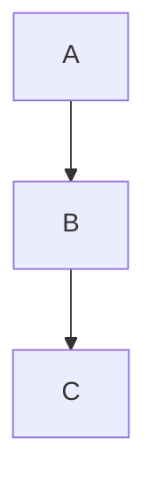
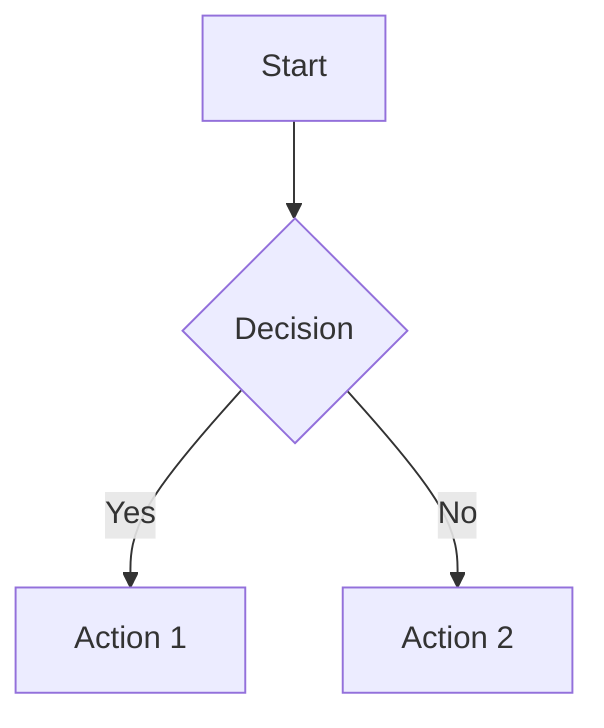
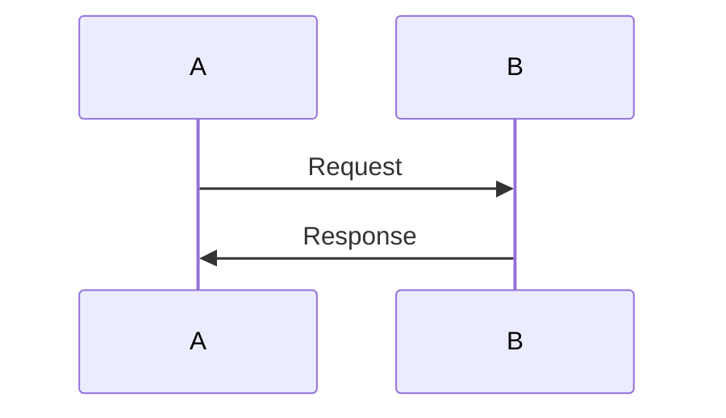
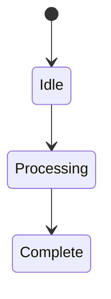
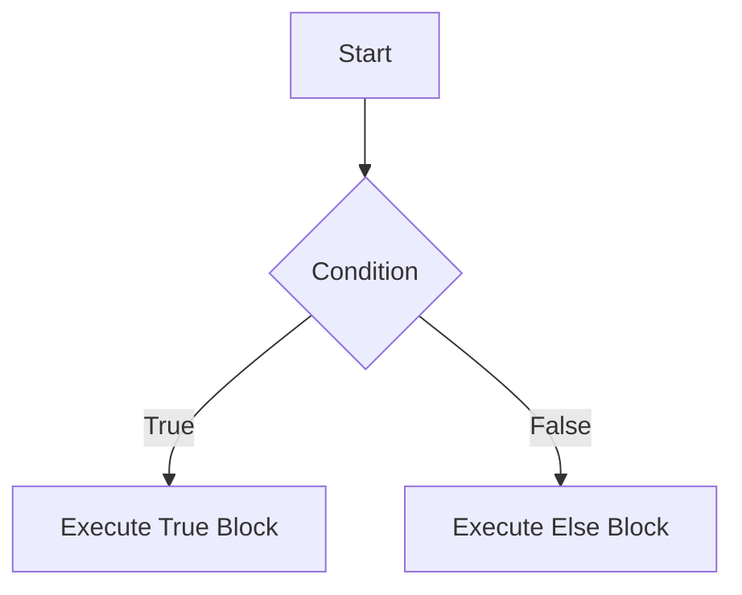

# AI Prompt for Lecture Summary Generation

Use this prompt with any AI (ChatGPT, Claude, Gemini) to convert lectures into course summaries compatible with Blue Bits Summary Vault website.

---

## 🎯 Quick Start

Copy and paste this prompt, then fill in the brackets:

```
Create a course summary for [COURSE NAME] following the Blue Bits format.
Use Arabic headings with English in parentheses.
Include LaTeX formulas ($...$ inline, $$...$$ display).
Add one Mermaid diagram per major topic.
Use tables for comparisons.
Include "الأخطاء الشائعة" section for common mistakes.
Structure: Each ## heading becomes one card in masonry grid.
```

---

## 📋 Detailed Prompt Template

```
# Course Summary: [COURSE NAME ARABIC] · [COURSE NAME ENGLISH]

## Course Info:
- **University Year:** [1/2/3/4/5]
- **Semester:** [1 or 2]
- **Format:** Bilingual Arabic/English

## Structure (Each ## = One Card):

### 1. Core Definitions Section
## 📐 التعاريف الأساسية · Core Definitions
- Use bullet points with Arabic term (English term in parentheses)
- Example: **المتغير (Variable)**: definition here

### 2. Main Topics (repeat for each topic)
## 🧮 [Topic Name Arabic] · [Topic Name English]
- Content for this topic
- $formulas here$
- Tables if needed

### 3. Process/Flow Diagrams
## 🔁 [Process Name]


### 4. Common Mistakes
## ⚠️ الأخطاء الشائعة · Common Pitfalls
1. Mistake 1
2. Mistake 2

### 5. Summary
## 📝 ملخص · Summary
- Key takeaways

---

## ✨ LaTeX Formula Examples:

| Type | Syntax | Example |
|------|--------|---------|
| Inline | `$...$` | $x^2 + y^2 = z^2$ |
| Display | `$$...$$` | $$\int_0^1 x^2 dx$$ |
| Fractions | `\frac{a}{b}` | $\frac{a}{b}$ |
| Greek | `\alpha, \beta` | $\alpha, \beta$ |
| Sum | `\sum_{i=1}^n` | $\sum_{i=1}^{n} i$ |
| Matrix | `\begin{pmatrix}` | $\begin{pmatrix} a & b \end{pmatrix}$ |

---

## 📊 Mermaid Diagram Types:

**Flowchart:**


**Sequence:**


**State Diagram:**


---

## ✅ Required Elements:

1. ✅ Arabic headings with English in parentheses
2. ✅ Each ## heading = one card in masonry layout
3. ✅ LaTeX for all mathematical formulas
4. ✅ At least one Mermaid diagram per major section
5. ✅ Tables for comparisons/classification
6. ✅ Code blocks when showing programming
7. ✅ "الأخطاء الشائعة" section with 3-5 mistakes
8. ✅ "ملخص" summary section at the end
9. ✅ "المراجع" references

---

## 💡 Pro Tips:

- **For best results**, provide the AI with a sample output (like the example below)
- **Always specify** "use LaTeX for formulas" - otherwise AI might use Unicode math
- **Request Mermaid explicitly** - AI won't add diagrams unless asked
- **Say "bilingual"** - ensures Arabic/English mixture

---

## 📝 Example Output:

```markdown
# برمجة 1 · Programming 1

## 📐 التعاريف الأساسية · Core Definitions

- **المتغير (Variable)**: موقع في الذاكرة يخزن قيمة، له اسم ونوع وقيمة
- **نوع البيانات (Data Type)**: تصنيف يحدد نوع القيم التي يمكن للمتغير تخزينها
- **المعامل (Operator)**: رمز يقوم بعملية على المعاملات

## 🧮 الأنواع والبيانات · Data Types

### الأنواع الأساسية · Primitive Types

| النوع | الحجم | الوصف | النطاق |
|---|---|---|---|
| `int` | 4 bytes | عدد صحيح | $-2^{31}$ إلى $2^{31}-1$ |
| `float` | 4 bytes | عدد عشري | $\pm3.4 \times 10^{\pm38}$ |

### تعريف المتغيرات

$$type\_name variable\_name = initial\_value;$$

```cpp
int age = 20;
float gpa = 3.75;
```

## 🔁 التحكم في التدفق · Control Flow



## ⚠️ الأخطاء الشائعة · Common Pitfalls

1. نسيان فاصلة منقوطة في نهاية التعليمة
2. الخلط بين `=` (إassignment) و `==` (مقارنة)
3. عدم تحديد نوع المتغير قبل استخدامه

## 📝 ملخص · Summary

- المتغيرات والأنواع أساسات البرمجة
- هياكل التحكم تحدد مسار التنفيذ
- فهم الأخطاء الشائعة يمنع المشاكل

---

**المراجع**: محاضرات برمجة 1، جامعة Aleppo
```

---

*For Blue Bits Summary Vault - University Course Summaries*