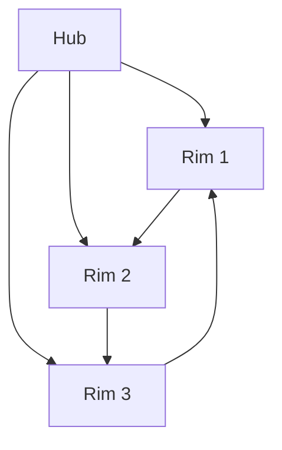

PRD
===

1. Document Control

-------------------

* **Project Name:** Blue Bits Summary Vault

* **Version:** 1.0

* **Owner:** Crist Yaghjian

* **Stakeholders:** Blue Bits, all univeristy classmates.

* **Last Updated:** 14 -4 -2026

* **Status:** Draft
2. Product Overview

-------------------

* **Problem Statement:** we have a lot of exams, before each exam we see a lot of handwritten low quality hard to read cheatsheets and summeries for the exam.

* **Product Summary:** this is a scable lightweigh simple website that collects all the summeries in a very user friendly way, and even a unified way to add new notes and summeries generated and processed with ai, the over all philosophy of the website to be each information as a card.

* **Target Users:** all university students that are preparing for exams

* **Primary Use Case:** to learn, revise, the core eqauations and notes of the lectures in a very clean and very easy way.

* **Why Now:** we are in the begining of the new semester so we need to build the website 

* **Expected Outcome:** a clean website with highly orginzed sections 5 years, each 2 semester , and each semester approx 7 courses, each course has topics and crads in them
3. Goals

--------

* **Business Goals:** volumteering project with no buiness project

* **User Goals:** to make learning and reivsing as easy as possible for student

* **Technical Goals:** adding new content, wrttien by ai or manully as easy as possible

* **Success Metrics:** to make the flow as easy as possible and very userful for students
4. Non-Goals  to have a backend and complex system but rather super practical flow

------------

5. Scope

--------

In Scope: the system from prompt to generation to publishing
--------

Out of Scope full comlex platform
------------

6. Users and Personas

---------------------

Persona 1
---------

* **Name:** the nerd

* **Role:** to add summeries as admins

* **Needs:** to generate or write the summeries in the required format and publish

* **Pain Points:** using git and sometimes manual editing to polish the output and make sure of the info

* **Frequency of Use:** before any exam, before a week at least, or when edit

Persona 2
---------

* **Name:** the sutdent

* **Role:** view

* **Needs:** to just learn and revise

* **Pain Points:** no pain points

* **Frequency of Use:** before the exam a day or and the begining of studing
7. User Stories

---------------

* As a **nerd**, I want **to publish my summeries**, so that **so others can access it easly**.

* As a **student**, I want **access the info**, so that **i can learn and revise**.
8. Product Requirements

-----------------------

Core Features
-------------

Functional Requirements the nerd can add summeries wrtten by hand or generated and pushed to github via commit so the webste can turn that format into clean looking output
-----------------------

Edge Cases some mathematical symbols and eng arabic bilnual lines and some complex diagrams and figures
----------

Acceptance Criteria if it is bug free output and high quality content and easy to publish and view
-------------------

10. UX Notes

------------

* **Key Screens:** main page with 5 years and 2 semesters for each one, each semester has 7 courses and then course by course

* **Navigation Structure:** home/yearXSemesterY/coursenameZ

* **Content Guidelines:** to be strict format that the webiste can fetch and traslate to output that can cover graphs, text , equations, ....
13. Non-Functional Requirements

-------------------------------

* **Performance:** very lighwiegth

* **Scalability:** add new content as easy as possible and 

* **Maintainability:** add new component that can be fetched

* **Browser/Device Support:** brower for laptop (horizontal), mobile phones (vertical)

AI Purpose
----------

* **What the AI should do:**

* there is no direct inegeration between platform and ai but the system to shoudl include very deteailed prompts to extract the summery in the format that can be converted 

Inputs
------

Outputs
-------

Behavior Rules
--------------

Guardrails
----------

* **Must not hallucinate:** Yes

* **Must ask clarifying questions when:** something not clear in the lectures

Evaluation must be written
----------

* **Quality checks:**

* **Test prompts:**

* **Failure cases:**
23. Rollout Plan

----------------

* **Beta users**

* **Feature flags**

* **Rollback plan**

* **Monitoring**
24. Post-Launch

---------------

* **Feedback loop:** via perosnal asking
  
  
  
  

### all course names for the entire university


### السنة الأولى:

الفصل الأول:

* مبادئ عمل الحاسوب
* تحليل 1
* فيزياء 1
* رياضيات متقطعة
* لغة 1
* برمجة 1

الفصل الثاني:

* الجبر الخطي
* التحليل 2
* الدارات الكهربائية
* فيزياء 2
* لغة 2
* اللغة العربية
* برمجة 2

---

### السنة الثانية:

الفصل الأول:

* التحليل 3
* التحليل العددي 1
* لغة 3
* برمجة 3
* الكترونيات
* احتمالات
* برمجة رياضية

الفصل الثاني:

* تحليل عددي 2
* مهارات التواصل
* خوارزميات 1
* تحليل 4
* إحصاء
* دارات منطقية
* لغة 4

---

### السنة الثالثة:

الفصل الأول:

* رسوميات حاسوبية
* خوارزميات 2
* نظرية المخططات
* معالج مصغر
* معالجة الإشارة
* نظرية المعلومات
* قواعد المعطيات 1

الفصل الثاني:

* مبادئ الذكاء الاصطناعي
* خوارزميات 3
* اتصالات تشابهية ورقمية
* بنية وتنظيم الحاسب 1
* شبكات حاسوبية
* لغات صورية
* هندسة البرمجيات 1

---

### السنة الرابعة:

الفصل الأول:

* نظرية الأرتال
* نظم تشغيل 1
* تصميم المترجمات
* قواعد المعطيات 2
* بنية وتنظيم الحواسيب 2
* شبكات متقدمة
* نظم وسائط متعددة
* برمجة منطقية
* بحوث عمليات

الفصل الثاني:

* تسويق وإدارة مشاريع
* شبكات عصبونية ومنطق الترجيح
* نظم تشغيل 2
* روبوتية
* أمن المعلومات
* هندسة البرمجيات 2
* نظم رقمية مبرمجة
* برمجة تفرعية
* تطبيقات الانترنت

---

### السنة الخامسة:

الفصل الأول:

* أمن الشبكات
* هندسة البرمجيات 3
* تحكم منطقي مبرمج plc
* نظم خبيرة
* رؤية حاسوبية
* نمذجة ومحاكاة
* جودة ووثوقية
* نظم موزعة

الفصل الثاني:

* معالجة لغات طبيعية
* تنقيب المعطيات
* إدارة نظم إنتاجية
* نظم الزمن الحقيقي
* الشبكات اللاسلكية
* إدارة الشبكات
* قواعد معطيات موزعة
  
  

### Zero-Build, GitHub Pages Friendly)

| Layer             | Tool/Approach                                      | Why                                                                             |
| ----------------- | -------------------------------------------------- | ------------------------------------------------------------------------------- |
| **Data**          | `courses.json` + per-course `.md` files            | Separates metadata from content. Easy to edit, AI-friendly, version-controlled. |
| **Renderer**      | Vanilla JS + `marked.js` (or `remark`)             | No build step. Fetches JSON → renders cards → parses MD → injects into DOM.     |
| **Hosting**       | GitHub Pages (`gh-pages` branch or `/docs`)        | Free, supports static JSON/MD/HTML/JS natively.                                 |
| **Search/Filter** | `fuse.js` (lightweight fuzzy search) or vanilla JS | Runs client-side. No backend needed.                                            |
| **Styling**       | CSS Grid/Flex + CSS Variables + RTL support        | Responsive, themeable, Arabic-friendly.                                         |


Both **LaTeX** and **Mermaid** work perfectly in a static GitHub Pages site using client-side rendering. You can keep your JSON minimal, and let the Markdown file handle all content, equations, and diagrams.

Here’s the exact setup:

---

### 📦 1. Simplified `courses.json`

```json
[
  {
    "id": "graph-theory",
    "year": 3,
    "semester": 1,
    "title_ar": "نظرية المخططات",
    "title_en": "Graph Theory",
    "status": "reviewed",
    "summary_md": "courses/graph-theory.md"
  }
]
```

✅ Clean, flat, and easy for AI/humans to maintain.

---

### 📝 2. Markdown File Format (LaTeX + Mermaid Ready)

Your `.md` files can mix text, tables, LaTeX, and Mermaid natively:

```markdown
# نظرية المخططات · Graph Theory

## 📐 التعاريف الأساسية
- المخطط `G(V,E)` حيث `V` رؤوس و `E` حواف
- درجة الرأس: `$\deg(v) = |E(v)|$`
- مصافحة الأيدي: `$\sum_{v \in V} \deg(v) = 2|E|$`

## 🌲 خوارزمية بريم (MST)
$$
\text{Pick } e \in \delta(T) \text{ s.t. } w(e) = \min_{f \in \delta(T)} w(f)
$$

## 🗺 مخطط العجلة `Wₙ`


## 📊 جدول مرجعي

| المخطط | `n` | `m` | مستوي؟            |
| ------ | --- | --- | ----------------- |
| `K₅`   | 5   | 10  | ❌ `$10 > 3(5)-6$` |
| `K₃,₃` | 6   | 9   | ❌ `$9 > 2(6)-4$`  |

```

---
### 🛠️ 3. Complete Rendering Pipeline (Zero Build)
Add these to your `<head>`:
```html
<!-- Markdown Parser -->
<script src="https://cdn.jsdelivr.net/npm/marked/marked.min.js"></script>
<!-- LaTeX (KaTeX) -->
<link rel="stylesheet" href="https://cdn.jsdelivr.net/npm/katex@0.16.9/dist/katex.min.css">
<script src="https://cdn.jsdelivr.net/npm/katex@0.16.9/dist/katex.min.js"></script>
<script src="https://cdn.jsdelivr.net/npm/katex@0.16.9/dist/contrib/auto-render.min.js"></script>
<!-- Mermaid Diagrams -->
<script src="https://cdn.jsdelivr.net/npm/mermaid@10/dist/mermaid.min.js"></script>
```

Then in your `app.js`:

```js
// Initialize Mermaid once
mermaid.initialize({ startOnLoad: false, theme: 'default' });

async function renderCourse(mdPath, containerId) {
  const res = await fetch(mdPath);
  const md = await res.text();

  // 1️⃣ Parse Markdown → HTML
  const html = marked.parse(md);
  const container = document.getElementById(containerId);
  container.innerHTML = html;

  // 2️⃣ Render LaTeX (KaTeX auto-render)
  renderMathInElement(container, {
    delimiters: [
      {left: '$$', right: '$$', display: true},
      {left: '$', right: '$', display: false}
    ],
    throwOnError: false
  });

  // 3️⃣ Render Mermaid diagrams
  await mermaid.run({ nodes: container.querySelectorAll('.language-mermaid') });
}

// Usage example:
// renderCourse('courses/graph-theory.md', 'summary-content');
```

✅ **Order matters**: Markdown → KaTeX → Mermaid. This prevents parser conflicts.

---

### 🤖 4. AI Prompt for Auto-Generating `.md` Files

```
أنت خبير في تلخيص المواد الجامعية. أنشئ ملف Markdown للمقرر التالي وفق الهيكل التالي:
- استخدم `$...$` للمعادلات المضمنة، و`$$...$$` للمعادلات المنفصلة
- استخدم ```mermaid ... ``` للرسوم البيانية (flowchart, graph, sequenceDiagram)
- استخدم جداول Markdown للجداول المرجعية
- لغة: عربية أكاديمية واضحة مع مصطلحات إنجليزية بين قوسين عند اللزوم
- لا تكتب مقدمة أو خاتمة، فقط المحتوى التقني المنظم بعناوين فرعية
المقرر: [اسم المقرر]
المنهج: [نقاط أو ملاحظات]
```

---

### ⚠️ Important Notes & Best Practices

| Issue                    | Solution                                                                                              |
| ------------------------ | ----------------------------------------------------------------------------------------------------- |
| **Mermaid slow on load** | Use `mermaid.run({ nodes: [...] })` instead of `startOnLoad: true`. It only renders visible diagrams. |
| **KaTeX vs MathJax**     | KaTeX is faster & lighter. Perfect for cheat-sheets. MathJax is heavier but supports more edge cases. |
| **Arabic RTL + Mermaid** | Mermaid SVGs are LTR by default. Wrap them: `.mermaid { direction: ltr; }` if needed.                 |
| **Security**             | For production, add `DOMPurify` before `innerHTML`: `container.innerHTML = DOMPurify.sanitize(html);` |
| **Caching**              | Append `?v=1.2` to `summary_md` paths when updating so browsers fetch fresh MD.                       |

---

### 🚀 Next Steps

1. Create `data/courses.json` with the simplified structure.
2. Drop the CDN links in `index.html`.
3. Paste the `renderCourse()` function into `app.js`.
4. Add one `.md` file with LaTeX + Mermaid to test.
5. Push to GitHub → Pages auto-deploys.
   
   

## Prompt version 1.0

```text
You are an expert academic summarizer and curriculum designer. Extract, organize, and format ALL key information from the provided course material into a precise, bilingual (Arabic/English), Markdown-based cheat sheet optimized for static web rendering. Follow these rules STRICTLY:

OUTPUT FORMAT:
- Use ONLY Markdown. No introductory text, no explanations, no conversational filler.
- Bilingual pattern: Primary Arabic with English terms in parentheses or after a slash. Headers: `# العنوان العربي · English Title`
- Math: Inline `$...$`, Display `$$...$$`. Never use `\[ \]` or `\( \)`.
- Diagrams: Use ````mermaid` blocks for flowcharts, graphs, or sequences. Keep them minimal and functional.
- Tables: Standard Markdown. Align text right for Arabic. Include all relevant parameters.
- Structure must follow this EXACT template:

# [العربي] · [English]

## 📐 التعاريف الأساسية · Core Definitions
- [المفهوم بالعربي] ([English]): [التعريف/الصيغة/الشرط]
- ...

## 🧮 النظريات والصيغ · Theorems & Formulas
- [اسم النظرية عربي/إنجليزي]: 
  $$[الصيغة أو التعبير الرياضي]$$
  [شرح موجز للشرط أو النتيجة أو البرهان]
- ...

## 🔁 الخوارزميات والعمليات · Algorithms & Processes
1. [الخطوة 1 عربي] ([English])
2. [الخطوة 2] ...
```mermaid
[مخطط انسيابي أو بياني يوضح التسلسل]
```

- التعقيد/الشروط: [Complexity/Constraints]

## 🌲 الخصائص والثوابت · Properties & Invariants

- [الخاصية 1]: [الشرح + الصيغة إن وجدت]
- [الخاصية 2]: ...
- المتراجحات الأساسية: `$[formula]$`

## 📝 أمثلة محلولة · Worked Examples

- [المثال 1]: [المعطيات → الحل → النتيجة]
- [المثال 2]: ...
  
```mermaid
[رسم توضيحي للمثال إن ينطبق]
```

## 📊 جدول مرجعي شامل · Master Reference Table

| المخطط/الحالة | |V| | |E| | الدرجة | χ | مستوي؟ | ثنائي القسم؟ | مطابقة تامة؟ | τ(G) |
|---|---|---|---|---|---|---|---|---|
| [عنصر 1] | ... | ... | ... | ... | ... | ... | ... | ... |
| ... | ... | ... | ... | ... | ... | ... | ... | ... |

## ⚠️ أخطاء شائعة وملاحظات · Common Pitfalls & Notes

- [ملاحظة 1]: [التوضيح]
- [ملاحظة 2]: ...
- 💡 شرط لازم vs شرط لازم وكافٍ: [توضيح دقيق]

SYNTAX & RENDERING RULES:

- ALWAYS use `$...$` for inline math and `$$...$$` for block math.
- Mermaid blocks MUST start with ````mermaid` and end with ```` on new lines.
- Tables MUST have a header row, separator row, and consistent columns.
- Use concise academic Arabic. Keep English terms in parentheses for quick reference.
- Do NOT include markdown code fences around the entire output. Output raw Markdown only.
- Verify all formulas, indices, and mathematical notations against standard conventions.
- If any section lacks data from the source, omit it. Do NOT hallucinate.

PROCESS:

1. Scan input for definitions, formulas, theorems, algorithms, examples, tables, and edge cases.
2. Map each to the template above.
3. Apply bilingual formatting and math/diagram syntax.
4. Output ONLY the final Markdown.

Begin generation now.

```


## possible doc for the project

## 🎯 Overview

A **zero-build, static, bilingual (AR/EN)** cheat-sheet website for university courses, hosted on GitHub Pages. Content is dynamically fetched from a lightweight JSON index and per-course Markdown files. Supports LaTeX, Mermaid diagrams, responsive card layouts, search/filter, progress tracking, and dark mode.

---

## 📁 Repository Structure

```

your-repo/
├── index.html          # Main entry point
├── style.css           # RTL-optimized responsive styles
├── app.js              # Core rendering, filtering, modal, localStorage
├── data/
│   └── courses.json    # Flat index of all courses
├── courses/
│   ├── graph-theory.md
│   ├── programming-1.md
│   └── ...             # Per-course Markdown files
└── test.html           # Standalone local tester (dev only)

```

---

## 📦 Data Format

### `data/courses.json`

Flat, human/AI-friendly structure. No nested arrays.

```json
[
  {
    "id": "graph-theory",
    "year": 3,
    "semester": 1,
    "title_ar": "نظرية المخططات",
    "title_en": "Graph Theory",
    "status": "reviewed",
    "summary_md": "courses/graph-theory.md"
  }
]
```

- `id`: URL-safe slug, used for `localStorage` tracking & modal routing
- `status`: `"none" | "planned" | "reviewed" | "flagged"` (overriden by `localStorage`)
- `summary_md`: Relative path to the Markdown file

---

## 📝 Markdown & Custom Syntax

### Core Syntax Rules

| Feature      | Syntax                                               |
| ------------ | ---------------------------------------------------- |
| Inline Math  | `$\sum x = y$`                                       |
| Display Math | `$$\int f(x)dx$$`                                    |
| Diagrams     | ````mermaid \n graph TD \n A --> B \n ````           |
| Tables       | Standard Markdown                                    |
| Cards        | `[card icon="📐" title="عنوان"]...content...[/card]` |

### Card Example

```markdown
[card icon="🌲" title="خوارزميات MST"]
1. رتب الحواف تصاعدياً
2. اختر الحافة الأصغر وزناً
3. أضف إذا لم تُشكّل حلقة
$$\text{Complexity: } O(E \log E)$$
[/card]
```

✅ Cards automatically become responsive grid items. Inner content supports full Markdown, LaTeX, and Mermaid.

---

## ⚙️ Rendering Pipeline (Execution Order)

Strict order prevents parser conflicts and DOM race conditions:

1. **Fetch JSON** → build course grid
2. **Open Course** → fetch `.md`
3. **Preprocess Cards** → replace `[card...]` with `%%CARD_ID%%`
4. **Parse Markdown** → `marked.parse()` → sanitize with `DOMPurify`
5. **Inject Cards** → replace `%%CARD_ID%%` with `.summary-card` divs + re-parse inner Markdown
6. **Render LaTeX** → `renderMathInElement()` (KaTeX)
7. **Render Diagrams** → async `mermaid.render()` + safe `replaceChild()` injection
8. **Attach Events** → status buttons, modal close, theme toggle

> 🔑 *Why this order?* Mermaid/KaTeX fail if run on raw text or before DOM nodes exist. The pipeline guarantees clean, isolated rendering.

---

## 🎨 UI/UX Features

| Feature              | Implementation                                                |
| -------------------- | ------------------------------------------------------------- |
| Responsive Grid      | `grid-template-columns: repeat(auto-fit, minmax(280px, 1fr))` |
| Modal Preview        | Scrollable overlay, dynamic title & content                   |
| Progress Tracking    | `localStorage` maps `courseId → status`                       |
| Search/Filter        | Real-time by title (AR/EN), year, status                      |
| Dark/Light Mode      | CSS variables + `localStorage` theme flag                     |
| RTL Support          | `dir="rtl"`, Arabic font stack, table/text alignment          |
| Hover Effects        | Lift + shadow transition on cards                             |
| Loading/Empty States | Skeleton text, fallback messages                              |

---

## 🤖 AI Generation Workflow

### Prompt Template (Strict Output)

```
أنت خبير في تلخيص المواد الجامعية. أنشئ ملف Markdown للمقرر التالي وفق الهيكل التالي:
- استخدم الصيغة: [card icon="📐" title="عنوان"]...محتوى...[/card]
- المعادلات: $...$ للمضمنة، $$...$$ للمنفصلة
- الرسوم: ```mermaid ... ```
- لغة: عربية أكاديمية مع مصطلحات إنجليزية بين قوسين
- لا تكتب مقدمة/خاتمة، فقط المحتوى التقني المنظم
المقرر: [اسم]
المنهج/النقاط: [نص أو ملفات مرفقة]
```

✅ Output is ready to paste directly into `courses/*.md` or the `test.html` editor.

---

## 🧪 Local Testing

- Open `test.html` in any browser (no server needed)
- Left panel: paste Markdown
- Right panel: live preview with cards, LaTeX, Mermaid
- Auto-renders on input (debounced 600ms)
- Includes sample Graph Theory content
- Mermaid null-error fixed via async `replaceChild()`

---

## 🚀 Deployment Steps

1. Create GitHub repo → enable **Pages → Deploy from `main`/`master` → `/`**
2. Commit `index.html`, `style.css`, `app.js`, `data/courses.json`, `courses/*.md`
3. Wait ~60s → visit `https://<username>.github.io/<repo>/`
4. Update content → push → auto-deploys (static files)
5. Optional: append `?v=1.2` to JSON paths if cache persists

---

## 🔮 Planned Enhancements  ** low importance for no **

| Priority  | Feature              | Notes                                                    |
| --------- | -------------------- | -------------------------------------------------------- |
| 🟢 High   | GitHub Actions CI    | Validate `courses.json`, lint MD, auto-deploy            |
| 🟢 High   | PDF/Print Stylesheet | `@media print` hides nav, formats tables, removes modals |
| 🟡 Medium | Cross-Linking        | Auto-suggest related courses via shared tags/topics      |
| 🟡 Medium | PWA/Offline          | Service worker + `manifest.json` for mobile caching      |
| 🟠 Low    | Tag System           | Filter by `#algorithms`, `#linear-algebra`, etc.         |
| 🟠 Low    | Multi-Lang Toggle    | Switch AR/EN primary language dynamically                |
| 🔵 Future | Progressive Loading  | Lazy-render cards/MD on scroll for 100+ courses          |

---

## 📜 Quick Reference Cheatsheet

```bash
# Folder structure
mkdir -p data courses

# Add new course
echo '{
  "id": "new-course",
  "year": 4,
  "semester": 1,
  "title_ar": "اسم المقرر",
  "title_en": "Course Name",
  "status": "none",
  "summary_md": "courses/new-course.md"
}' >> data/courses.json

# Test locally
open test.html

# Deploy
git add . && git commit -m "add new-course" && git push
```
