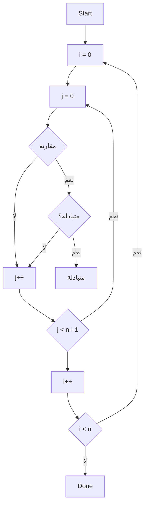
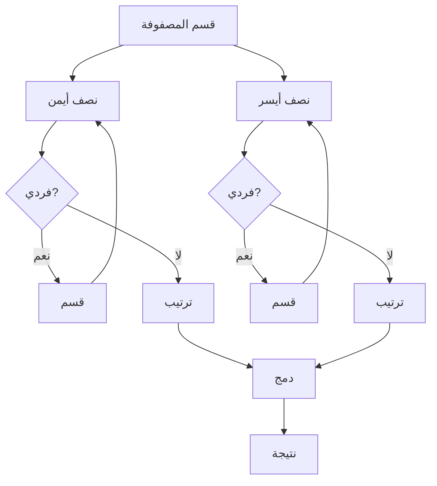

# خوارزميات 1 · Algorithms I

## 📐 التعاريف الأساسية · Core Definitions

- **الخوارزمية** (Algorithm): سلسلة محددة من الخطوات لحل مشكلة معينة في زمن محدد.
- **التعقيد الزمني** (Time Complexity): قياس الزمن الذي تستغرقه الخوارزمية بدلالة حجم المدخلات $n$.
- **التعقيد المكاني** (Space Complexity): مقدار الذاكرة الإضافية التي تحتاجها الخوارزمية.
- **ترتيب asympotic** (Asymptotic Notation): طريقة للتعبير عن سلوك الخوارزمية عندما يقترب $n$ من اللانهائية.

### ترميزات أساسية · Basic Notations

$$O(g(n)) = \{ f(n) : \exists c, n_0 > 0 \text{ such that } 0 \leq f(n) \leq c \cdot g(n) \text{ for all } n \geq n_0 \}$$

$$\Omega(g(n)) = \{ f(n) : \exists c, n_0 > 0 \text{ such that } 0 \leq c \cdot g(n) \leq f(n) \text{ for all } n \geq n_0 \}$$

$$\Theta(g(n)) = O(g(n)) \cap \Omega(g(n))$$

---

## 🧮 النظريات والصيغ · Theorems & Formulas

### قواعد التعقيد · Complexity Rules

- **قاعدة الجمع** (Sum Rule): إذا كانت الخوارزميات تعمل متتابعتين:
  $$T_1(n) + T_2(n) = O(\max(f(n), g(n)))$$

- **قاعدة الضرب** (Product Rule):
  $$T_1(n) \cdot T_2(n) = O(f(n) \cdot g(n))$$

- **اللوغاريتمات** (Logarithms):
  $$\log_b(n) = \frac{\log_2(n)}{\log_2(b)}$$
  لأي أساس $b > 1$: $\log n$ هو نفسه ضمن ثابت.

### علاقات اللوغاريتمات · Log Relationships

$$\log n! = \Theta(n \log n)$$

$$n! = \sqrt{2\pi n}\left(\frac{n}{e}\right)^n(1 + \Theta(\frac{1}{n}))$$

---

## 🔁 الخوارزميات والعمليات · Algorithms & Processes

### 1. خوارزميات الترتيب · Sorting Algorithms

#### Bubble Sort (الترتيب الفقاعي)



```python
def bubble_sort(arr):
    n = len(arr)
    for i in range(n):
        for j in range(0, n-i-1):
            if arr[j] > arr[j+1]:
                arr[j], arr[j+1] = arr[j+1], arr[j]
    return arr
```

**التعقيد:** $O(n^2)$ في الأسوأ، $O(n)$ في الأفضل.

#### Insertion Sort (الترتيب بالإدراج)

```python
def insertion_sort(arr):
    for i in range(1, len(arr)):
        key = arr[i]
        j = i - 1
        while j >= 0 and arr[j] > key:
            arr[j + 1] = arr[j]
            j -= 1
        arr[j + 1] = key
    return arr
```

**التعقيد:** $O(n^2)$ في الأسوأ، $O(n)$ في الأفضل (مصفوفة مرتبة).

#### Merge Sort (الترتيب بالدمج)



```python
def merge_sort(arr):
    if len(arr) <= 1:
        return arr
    mid = len(arr) // 2
    left = merge_sort(arr[:mid])
    right = merge_sort(arr[mid:])
    return merge(left, right)
```

**التعقيد:** $O(n \log n)$ في جميع الحالات.

#### Quick Sort (الترتيب السريع)

```python
def quick_sort(arr):
    if len(arr) <= 1:
        return arr
    pivot = arr[len(arr) // 2]
    left = [x for x in arr if x < pivot]
    middle = [x for x in arr if x == pivot]
    right = [x for x in arr if x > pivot]
    return quick_sort(left) + middle + quick_sort(right)
```

**التعقيد:** $O(n \log n)$ في المتوسط، $O(n^2)$ في الأسوأ (مصفوفة مرتبة).

### 2. خوارزميات البحث · Search Algorithms

#### Linear Search (البحث الخطي)

```python
def linear_search(arr, target):
    for i in range(len(arr)):
        if arr[i] == target:
            return i
    return -1
```

**التعقيد:** $O(n)$

#### Binary Search (البحث الثنائي)

```python
def binary_search(arr, target):
    left, right = 0, len(arr) - 1
    while left <= right:
        mid = (left + right) // 2
        if arr[mid] == target:
            return mid
        elif arr[mid] < target:
            left = mid + 1
        else:
            right = mid - 1
    return -1
```

**التعقيد:** $O(\log n)$ (المصفوفة يجب أن تكون مرتبة).

---

## 🌲 الخصائص والثوابت · Properties & Invariants

### ترتيب التصاعدي للتعقيد · Ascending Complexity Order

$$O(1) < O(\log n) < O(n) < O(n \log n) < O(n^2) < O(2^n) < O(n!)$$

### خصائص الترتيب · Sorting Properties

- **الاستقرار** (Stability): الترتيب يحافظ على ترتيب العناصر المتساوية.
  - مستقر: Bubble Sort, Insertion Sort, Merge Sort
  - غير مستقر: Quick Sort, Selection Sort

- **التعقيد المكاني** (Space Complexity):
  - Merge Sort: $O(n)$ ذاكرة إضافية
  - Quick Sort: $O(\log n)$ ذاكرة (recursion stack)
  - In-place: Bubble, Selection, Insertion Sort

### المتراجحات الأساسية · Basic Inequalities

$$\log n < n \text{ for } n \geq 1$$

$$n^a < n^b \text{ for } a < b$$

$$2^n < n! \text{ for } n \geq 4$$

---

## 📝 أمثلة محلولة · Worked Examples

### مثال 1: تحليل تعقيد حلقة

```python
for i in range(n):
    for j in range(i, n):
        print(i, j)
```

**الحل:**
- التكرار الأول: $n$ مرة
- التكرار الثاني: $n-1$ مرة
- التكرار الثالث: $n-2$ مرة
- ...
- المجموع: $1 + 2 + ... + n = n(n+1)/2 = \Theta(n^2)$

### مثال 2: البحث الثنائي في مصفوفة مرتبة

**المعطيات:** مصفوفة مرتبة $[2, 5, 8, 12, 16]$، نبحث عن $12$.

**الحل:**
- left = 0, right = 4, mid = 2, arr[2] = 8 < 12 → left = 3
- left = 3, right = 4, mid = 3, arr[3] = 12 → تم العثور!

**عدد المقارنات:** $\lceil \log_2 5 \rceil = 3$

### مثال 3: مقارنة ترتيب الإدراج والفرز السريع

**مصفوفة مرتبة:** $[1, 2, 3, 4, 5]$
- Insertion Sort: $O(n)$ (مثالي)
- Quick Sort: $O(n^2)$ (الأسوأ)

**مصفوفة عشوائية:**
- Insertion Sort: $O(n^2)$
- Quick Sort: $O(n \log n)$

---

## 📊 جدول مرجعي شامل · Master Reference Table

### جدول التعقيد الزمني · Time Complexity Table

| الخوارزمية | أفضل | متوسط | أسوأ | مكاني | مستقر؟ |
| ---------- | ---- | ------ | ---- | ------ | ------ |
| **Bubble Sort** | $O(n)$ | $O(n^2)$ | $O(n^2)$ | $O(1)$ | نعم |
| **Selection Sort** | $O(n^2)$ | $O(n^2)$ | $O(n^2)$ | $O(1)$ | لا |
| **Insertion Sort** | $O(n)$ | $O(n^2)$ | $O(n^2)$ | $O(1)$ | نعم |
| **Merge Sort** | $O(n \log n)$ | $O(n \log n)$ | $O(n \log n)$ | $O(n)$ | نعم |
| **Quick Sort** | $O(n \log n)$ | $O(n \log n)$ | $O(n^2)$ | $O(\log n)$ | لا |
| **Heap Sort** | $O(n \log n)$ | $O(n \log n)$ | $O(n \log n)$ | $O(1)$ | لا |
| **Linear Search** | $O(1)$ | $O(n)$ | $O(n)$ | $O(1)$ | — |
| **Binary Search** | $O(1)$ | $O(\log n)$ | $O(\log n)$ | $O(1)$ | — |

### ترميز التعقيد · Complexity Notation Summary

| الرمز | المعنى | مثال |
| ------ | ------ | ---- |
| $O$ | أعلى حد | $3n^2 = O(n^2)$ |
| $\Omega$ | حد أدنى | $n^2 = \Omega(n)$ |
| $\Theta$ | حد دقيق | $\frac{1}{2}n(n-1) = \Theta(n^2)$ |
| $o$ | أعلى حد صارم | $n = o(n^2)$ |
| $\omega$ | حد أدنى صارم | $n^2 = \omega(n)$ |

---

## ⚠️ أخطاء شائعة وملاحظات · Common Pitfalls & Notes

### ❌ أخطاء شائعة

1. **الخلط بين $O$ و $\Omega$:** 
   - $O$ تعني "في الأسوأ" أو "لا يتجاوز"
   - $\Omega$ تعني "في أفضل" أو "لا يقل عن"
   - 💡 **ملاحظة**: $O(n^2)$ يشمل أيضًا $O(n)$!

2. **نسيان أن البحث الثنائي يتطلب مصفوفة مرتبة:**
   - Binary Search لا يعمل على مصفوفات غير مرتبة
   - إذا لم تكن مرتبة، استخدم Linear Search

3. **الخلط بين التعقيد المكاني والزمني:**
   - Merge Sort: $O(n \log n)$ زمنيًا لكن $O(n)$ ذاكرة
   - Quick Sort: $O(n \log n)$ زمنيًا في المتوسط، لكن $O(\log n)$ ذاكرة

4. **عدم مراعاة الثوابت:**
   - $O(100n)$ هو $O(n)$
   - $O(n^2/2)$ هو $O(n^2)$
   - الثوابت لا تؤثر على الترتيب asympotic

5. **البحث عن أفضل ترتيب:**
   - لا يوجد "ترتيب مثالي" لجميع الحالات
   - Quick Sort: الأفضل للمصفوفات العشوائية
   - Merge Sort: الأفضل للترتيب الخارجي
   - Insertion Sort: الأفضل للمصفوفات الصغيرة أو شبه المرتبة

### 💡 نصائح مهمة

- **Master Theorem** للعلاقات التكرارية:
  $$T(n) = aT(n/b) + f(n)$$
  حيث $a \geq 1, b > 1$

- **قاعدة التكرار** (Recurrence Rule):
  إذا كان $f(n) = O(n^{\log_b a - \epsilon})$:
  $$T(n) = \Theta(n^{\log_b a})$$

- **التحقق من الاستقرار** مهم عند الترتيب حسب مفتاحين أو أكثر.

### 📌 ملاحظات نهائية

- **Big-O** تستخدم لوصف الحد الأعلى (أسوأ حالة)
- **Big-Omega** تستخدم لوصف الحد الأدنى (أفضل حالة)
- **Big-Theta** تستخدم لوصف الحد الدقيق
- في التطبيقات العملية، نادرًا ما يستخدمون $\Omega$ و $\Theta$، التركيز على $O$
