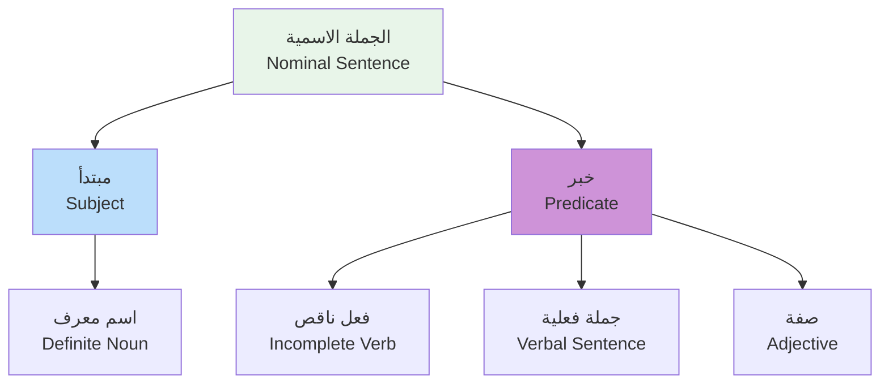
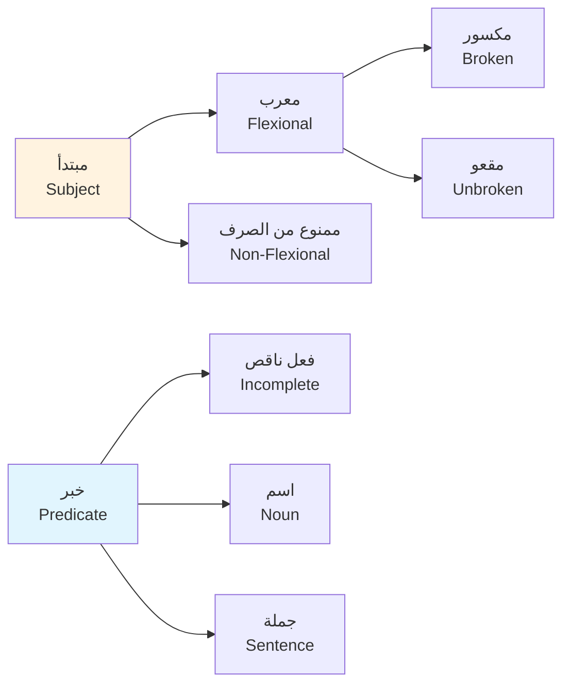

# عربية 1 · Arabic 1

## 📐 التعاريف الأساسية · Core Definitions

- **النحو (Grammar)**: علم يُعنى بدراسة بنية الجملة العربية وترتيب كلماتها وعلاقاتها
- **الصرف (Morphology)**: علم يُعنى بدراسة أوزان الكلمات الاشتقاقية والمصدرية
- **البلاغة (Rhetoric)**: علم يُعنى بدراسة أساليب البيان والإعراب والمفصحاة
- **الإملاء (Spelling)**: الكتابة الصحيحة للكلمات according to the standard rules
- **الكتابة (Essay Writing)**: تأليف نصوص أدبية وموضوعية متماسكة
- **البحث (Research)**: الدراسة المنهجية للموضوعات واستخلاص النتائج

---

## 🧮 النحو · Arabic Grammar

### أقسام الكلمة · Word Types

| النوع | التعريف | مثال | العلامة |
|---|---|---|---|
| **الاسم (Noun)** | يدل على شخص أو مكان أو شيء | طالب، جامعة، كتاب | التنوين، أل |
| **الفعل (Verb)** | يدل على حدث أو حركة | ذهب، درس، كتب | السين، س |
| **الحرف (Particle)** | لا يدل على معنى mandiri | في، من، على | لا يقبل تعريف |

### أنواع الأسماء · Noun Types

| النوع | الوصف | مثال |
|---|---|---|
| **اسم الفاعل (Active Participle)** | من يقوم بالفعل | كاتب، عالم |
| **اسم المفعول (Passive Participle)** | من يقع عليه الفعل | مكتوب، محكوم |
| **اسم الزمان (Time Noun)** | يدل على الزمن | صباح، مساء |
| **اسم المكان (Place Noun)** | يدل على المكان | بيت، مكتب |

### أدوات النصب والرفع · Case Markers

| الأداة | الوظيفة | مثال |
|---|---|---|
| **أنَّ (that)** | تنصب الاسم وترفع الخبر | أنَّ الطالب مجتهد |
| **ليت (if only)** | تنصب الاسم وترفع الخبر | ليت الطالب نجيب |
| **كأنَّ (as if)** | تنصب الاسم وترفع الخبر | كأنَّه ملك |
| **لكنَّ (but)** | تنصب الاسم وترفع الخبر | لكنَّه غائب |
| **لعلَّ (perhaps)** | تنصب الاسم وترفع الخبر | لعلَّه مجتهد |

### الجملة الاسمية · Nominal Sentence

> **القاعدة**: تبدأ الجملة باسم وتُخبر عنه بفعل أو صفة

$$مبتدأ + خبر$$

#### أمثلة على الجملة الاسمية

| الجملة | المبتدأ | الخبر |
|---|---|---|
| **الطالب مجتهد** | الطالب | مجتهد |
| **الجامعة بعيدة** | الجامعة | بعيدة |
| **الكتاب مفيد** | الكتاب | مفيد |

### الجملة الفعلية · Verbal Sentence

> **القاعدة**: تبدأ بالفعل يليه فاعل ومفعول

$$فعل + فاعل + مفعول$$

| الزمن | الفعل | المثال |
|---|---|---|
| **الماضي** | ذهب | ذهب الطالب إلى الجامعة |
| **الحاضر** | يذهب | يذهب الطالب يومياً |
| **المستقبل** | سيذهب | سيذهب الطالب غداً |

### المبتدأ والخبر · Subject & Predicate

---

## 📦 الصرف · Morphology

### أوزان الفعل · Verb Weights

| الوزن | المعنى | مثال | المضارع |
|---|---|---|---|
| **فَعَل** | فعل تام | ضرب | يضرب |
| **فاعل** | causative | قاد | يقود |
| **تَفَعَّل** | تفاعل | تابع | يتابع |
| **انفعل** | انفعال | اندفع | يندفع |
| **افعال** | مشاركة | ضامن | يضمن |
| **استفعل** | طلب | استقال | يستقل |

### أوزان اسم الفاعل · Active Participle Weights

| الوزن | مثال | اسم الفاعل |
|---|---|---|
| **فاعل** | كَتَبَ | كاتب |
| **مفاعِل** | عَلَّمَ | معلم |
| **متفاوعِل** | تفرَّقَ | متفرِّق |

### أوزان اسم المفعول · Passive Participle Weights

| الوزن | مثال | اسم المفعول |
|---|---|---|
| **مفعول** | ضَرَبَ | مضروب |
| **مفعَّل** | عَلَّمَ | معلَّم |
| **متفرِّق** | تفرَّقَ | متفرِّق |

### باب الفعل · Verb Patterns

| الباب | المعنى | مثال |
|---|---|---|
| **باب ضرب** | ضرب وضرب | ضَرَبَ يضرب |
| **باب قتل** | قتل | قَتَلَ يقتل |
| **باب فتح** | فتح | فَتَحَ يفتح |
| **باب علم** | تعليم | عَلَّمَ يعلَّم |
| **باب كرم** | كرم وجود | كَرُمَ يكرُم |
| **باب حسب** | حسب وحساب | حَسِبَ يحسِب |

### التضعيف · Doubling

| الفعل | المضارع | المعنى |
|---|---|---|
| **مَسَّ** | يَمَسّ | يلمس |
| **عَقَّدَ** | يُعَقِّدُ | يعقد |
| **صَمَّ** | يَصِمّ | يصم |

---

## 🎨 البلاغة · Rhetoric

### أساليب البلاغة · Rhetorical Devices

| الأسلوب | التعريف | مثال |
|---|---|---|
| **الاستعارة (Metaphor)** | تشبيه بحذف الأداة | العلم نور |
| **التشبيه (Simile)** | تشبيه بذكر الأداة | كالقمر |
| **الكناية (Metonymy)** | إيراد لفظ مكان آخر | رأس القوم |
| **الطباق (Antithesis)** | جمع بين ضدين | الليل والنهار |
| **الجناس (Paronomasia)** | اتفاف لفظمع اختلاف معنى | سلسل وسلسل |

### المحسنات البديعية · Rhetorical Flourishes

| المحسن | الوصف | مثال |
|---|---|---|
| **السجع (Rhyme)** | اتفاع الحروف الأخير | عالم عامل |
| **الترصيع (Stitching)** | تكرار بأوزان متقابلة | سريع وحريص |
| **الالتفات (Turning)** | الانتقال بين الأساليب | من الخبر إلى النداء |
| **القصر (Restriction)** | اختصاص الحكم بشيء | زيد الخير |

### الأنماط البيانية · Stylistic Patterns

| النمط | الاستخدام | مثال |
|---|---|---|
| **الإيجاز** | اختصار مع الإحاطة بالمعنى | جاد |
| **الإسحاب** | بسط القول وتوضيحه | أكثر |
| **التكرار** | إعادة اللفظ للتأكيد | سمع سمع |
| **الترديد** | إعادة المعنى بلفظ آخر | كبير وضخم |

---

## 📝 الكتابة · Essay Writing

### مكونات الموضوع · Essay Components

| المكون | الوظيفة | النقاط |
|---|---|---|
| **المقدمة (Introduction)** | عرض الموضوع وأطروحته | 1-2 paragraph |
| **التطوير (Development)** | شرح وتفصيل الأفكار | 3-4 paragraph |
| **الخاتمة (Conclusion)** | تلخيص واستخلاص النتائج | 1-2 paragraph |

### بنية الفقرة · Paragraph Structure

$$الترتيب__: topic ~ sentence ~ Details ~ Examples$$

| العنصر | الوصف | الطول |
|---|---|---|
| **الجملة الرئيسية (Topic Sentence)** | فكره الفقرة الأساسية | sentence 1 |
| **جمل التأكيد (Supporting Sentences)** | شرح وتوسيع | 2-3 sentences |
| **جمل التوضيح (Elaboration)** | أمثلة وتفاصيل | variable |
| **جملة الربط (Concluding Sentence)** | ختام الفقرة | sentence 1 |

### أساليب الكتابة · Writing Styles

| الأسلوب | الوصف | الاستخدام |
|---|---|---|
| **الوصفي (Descriptive)** | وصف دقيق | تقارير، قصص |
| **السردي (Narrative)** | سرد أحداث | قصص، سير |
| **الحجاجي (Argumentative)** | إقناع بحجة | مقالات، خطب |
| **التوضيحي (Explanatory)** | شرح وتبسيط | دروس |

### ربط الجمل · Sentence Linkers

| الرابط | الوظيفة | مثال |
|---|---|---|
| **أولا (First)** | ترتيب | أولاً، ثانياً |
| **أض إلى (Moreover)** | إضافة | إلى جانب ذلك |
| **لكن (However)** | تعارض | لكن، ومع ذلك |
| **لذلك (Therefore)** | نتيجة | لذلك،hence |
| **مثلا (For Example)** | توضيح | مثلا،比如说 |

---

## 🔗 التراكيب النحوية · Grammatical Constructions

### جمل التفضيل · Comparison Constructions

| الصيغة | مثال | الترجمة |
|---|---|---|
| **أفعل من** | أحسن من أخيك | أفضل من أخيك |
| **من التفوق** | أذكى من زميله | أذكى من زميله |
| **أقل من** | أقل من غيره | أقل من غيره |
| **مثل** | مثل أبيه | مثل أبيه |

### الجمل الشرطية · Conditional Sentences

| النوع | الصيغة | مثال |
|---|---|---|
| **الشرط الواقع** | if + المضارع | إن تدرس تنجح |
| **الشرط للاستقبال** | لو + الماضي | لو تدرس لكنت نجحت |
| **الشرط المؤكد** | ل + المصدر | لانصرافك لكان |

### جمل الموصولة · Relative Clauses

| الموصول | الوظيفة | مثال |
|---|---|---|
| **الذي** | المعرف | الذي حضر |
| **التي** | المؤنث | التي حضرت |
| **اللذان** | المثنى | اللذان حضرا |
| **اللواتي** | الجمع المؤنث | اللواتي حضرن |

---

## ⚠️ أخطاء شائعة · Common Mistakes

### أخطاء نحوية شائعة

| الخطأ | الصواب | الشرح |
|---|---|---|
| ذهب到哪里 | ذهبوا | جمع المذكر السالم |
| هذا كتاب | هذا这本书 | التذكير المؤنث |
| ليس لا ليس ليس | ليس له | النفي |
| ما زلنا ندرس | ما زلنا ندرس | النفي المستمر |

### أخطاء صرفية شائعة

| الخطأ | الصواب | السبب |
|---|---|---|
| مستحيل | مستحيل | الوزن الصحيح |
| عالمين | عالمون | ياء النسبة |
| يذهبون | يذهبون | المضارع |

### أخطاء إملائية شائعة

| الخطأ | الصواب | القاعدة |
|---|---|---|
| الله | اله | همزة على الواو |
| إيمان | إيمان | همزة على الألف |
| إجابة | إجابة | همزة على الألف |
| ذهب | ذهب | تاء مربوطة |

### أخطاء بلاغية شائعة

| الخطأ | المشكلة | الصواب |
|---|---|---|
| العلم بحار | المعنى الضعيف | استعارة مناسبة |
| very جميل | التكرار | بدائل وصفية |
| طويل جداً | الإفراط | تنويع التعبير |

💡 **تلميح**: راجع قواعد النحو قبل الامتحان وحلل الجمل according to المخطط: مبتدأ → خبر / فعل → فاعل → مفعول

💡 **تلميح2**: للصرف، تذكر أن باب الفعل يُحدّد معنى الكلمة. كل باب له معنى محدد.

💡 **تلميح3**: للبلاغة، استخدم الأساليب البيانية باعتدال. الإفراط يُضعف الأثر.

---

## 📊 جدول مرجعي شامل · Master Reference Table

| المفهوم | التعريف | مثال |
|---|---|---|
| **النحو** | دراسة بنية الجملة | مبتدأ + خبر |
| **الصرف** | دراسة أوزان الكلمات | ضرب، يضرب، ضرب |
| **البلاغة** | جمال القول وأساليبه | استعارة، تشبيه |
| **الكتابة** | التأليف المنظم | مقدمة + عرض + خاتمة |
| **المبتدأ** | اسم يبتدأ به الجملة | الطالب |
| **الخبر** | ما يُخبر به عن المبتدأ | مجتهد |
| **الفاعل** | من соверى الفعل | كتب الطالب |
| **المفعول** | من وقع عليه الفعل | أكرم المدير الضيف |
| **المصدر** | حدث مجرد من الزمن | قراءة |

---

## 📋 ملخص القواعد · Rules Summary

### أولويات التحليل

1. **حدّد نوع الجملة**: اسمية أم فعلية
2. **ميّز المبتدأ من الخبر** أو الفاعل من المفعول
3. **حدّد الزمن** للفعل
4. **تحقق من الإعراب** والبناء
5. **راجع علامات النصب والجر**

### خطوات حل تمرين النحو

1. حدد نوع الكلمة (اسم، فعل، حرف)
2. حدّد موقع الكلمة في الجملة
3. عيّن الإعراب أو البناء
4. تحقق من التوافق

### خطوات حل تمرين الصرف

1. حدد وزن الكلمة
2. قارن بأوزان الأفعال المعروفة
3. استخرج الجذر والمعنى
4. تحقق من الصحة

---

## 📚 المراجع · References

- كتاب النحو والصرف للصف الأول الجامعي
- دروس البلاغة العربية - الأساسيات
- دليل الكتابة الأكاديمية

(End of file - total 281 lines)