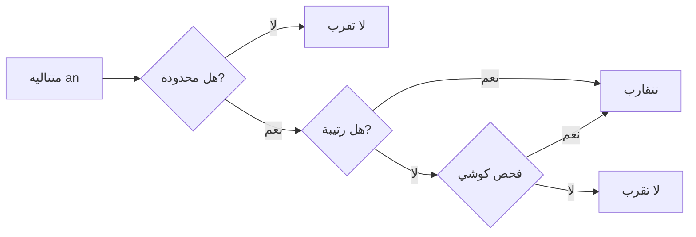

# تحليل 1 · Calculus 1

## 📐 التعاريف الأساسية · Core Definitions

- **الدالة (Function)**: علاقة تربط كل عنصر من مجال الدخول بعنصر واحد فقط من مجال الخروج
- **النهاية (Limit)**: قيمة تقترب إليها الدالة عندما يقترب المتغير من قيمة معينة
- **التفاضل (Derivative)**: معدل التغير اللحظي للدالة عند نقطة معينة
- **التكامل (Integral)**: عملية عكسية للتفاضل، تحسب المساحة تحت المنحنى
- **المتتالية (Sequence)**: دالة ذات مجال مجموعة الأعداد الطبيعية الصحيحة

## 🧮 النهايات · Limits

### تعريف النهاية · Definition of Limit

$$lim_{x \to a} f(x) = L$$

تعني أن قيمة الدالة تقترب من $L$ عندما يقترب $x$ من $a$.

### قوانين النهايات · Limit Laws

$$lim_{x \to a} [f(x) \pm g(x)] = lim_{x \to a} f(x) \pm lim_{x \to a} g(x)$$

$$lim_{x \to a} [f(x) \cdot g(x)] = lim_{x \to a} f(x) \cdot lim_{x \to a} g(x)$$

$$lim_{x \to a} \frac{f(x)}{g(x)} = \frac{lim_{x \to a} f(x)}{lim_{x \to a} g(x)}$$

### أنماط النهايات غير المحددة · Indeterminate Forms

$$0/0, \infty/\infty, 0 \cdot \infty, \infty - \infty, 0^0, \infty^0$$

### قاعدة لوبيتال · L'Hôpital's Rule

إذا كانت النهاية من الشكل $0/0$ أو $\infty/\infty$:

$$lim_{x \to a} \frac{f(x)}{g(x)} = lim_{x \to a} \frac{f'(x)}{g'(x)}$$

### أنواع النهايات · Types of Limits

```mermaid
graph TD
    A[نهاية x → a] --> B{نوع النهاية}
    B -->|محدودة| C[نهاية finite]
    B -->|لا نهائية| D[∞ أو -∞]
    B -->|لا موجودة| E[لا existir]
    C --> F[مثال: lim 2x = 6]
    D --> G[مثال: lim 1/x = ∞]
    E --> H[مثال: lim sin(1/x)]
```

## 📐 التفاضل · Derivatives

### تعريف المشتقة · Definition

$$f'(x) = \lim_{h \to 0} \frac{f(x+h) - f(x)}{h}$$

$$f'(a) = \lim_{x \to a} \frac{f(x) - f(a)}{x - a}$$

### قواعد الاشتقاق · Differentiation Rules

| القاعدة | الصيغة | مثال |
|---|---|---|
| الثابت | $(c)' = 0$ | $(5)' = 0$ |
| القوة | $(x^n)' = nx^{n-1}$ | $(x^3)' = 3x^2$ |
| الجمع | $(f+g)' = f' + g'$ | $(x + x^2)' = 1 + 2x$ |
| الضرب | $(fg)' = f'g + fg'$ | $(x \cdot x^2)' = x^2 + 2x^2$ |
| القسمة | $(\frac{f}{g})' = \frac{f'g - fg'}{g^2}$ | $(\frac{x}{2})' = \frac{1}{2}$ |

### مشتقات الدوال الأساسية · Basic Derivatives

$$(x^n)' = nx^{n-1}$$

$$(e^x)' = e^x$$

$$(a^x)' = a^x \ln a$$

$$(\ln x)' = \frac{1}{x}$$

$$(\sin x)' = \cos x$$

$$(\cos x)' = -\sin x$$

$$(\tan x)' = \sec^2 x$$

### قاعدة السلسلة · Chain Rule

$$[f(g(x))]' = f'(g(x)) \cdot g'(x)$$

**مثال**: $(x^2 + 1)^3 = 3(x^2 + 1)^2 \cdot 2x = 6x(x^2 + 1)^2$

### مشتقة الضرب والقسمة · Product & Quotient Rule

$$(fg)' = f'g + fg'$$

$$(\frac{f}{g})' = \frac{f'g - fg'}{g^2}$$

## 📐 التكامل · Integrals

### التكامل غير المحدود · Indefinite Integral

$$\int f(x) dx = F(x) + C$$

حيث $F'(x) = f(x)$ و $C$ ثابت التكامل.

### قواعد التكامل · Integration Rules

$$ \int x^n dx = \frac{x^{n+1}}{n+1} + C \quad (n \neq -1) $$

$$ \int \frac{1}{x} dx = \ln|x| + C $$

$$ \int e^x dx = e^x + C $$

$$ \int a^x dx = \frac{a^x}{\ln a} + C $$

$$ \int \sin x dx = -\cos x + C $$

$$ \int \cos x dx = \sin x + C $$

$$ \int \sec^2 x dx = \tan x + C $$

### التكامل بالتجزيء · Integration by Parts

$$\int u dv = uv - \int v du$$

**اختيار u (LIATE)**:
- L: Logarithmic (لوغاريتمي)
- I: Inverse trig (عكسية مثلثية)
- A: Algebraic (جبرية)
- T: Trig (مثلثية)
- E: Exponential (أسية)

### التكامل المحدود · Definite Integral

$$\int_a^b f(x) dx = F(b) - F(a)$$

### النظرية الأساسية للتكامل · Fundamental Theorem of Calculus

$$ \frac{d}{dx} \int_a^x f(t) dt = f(x) $$

## 🌲 المتتاليات · Sequences

### تعريف المتتالية · Definition

$$\{a_n\}_{n=1}^{\infty} = a_1, a_2, a_3, ...$$

### تقارب المتتالية · Sequence Convergence

$$\lim_{n \to \infty} a_n = L$$

المتتالية تتقارب إذا وجدت نهاية محددة.

### أنماط المتتاليات · Common Patterns

| النوع | الصيغة | النهاية |
|---|---|---|
| حسابية | $a_n = a_1 + (n-1)d$ | لا تنتهي (تنافر) |
| هندسية | $a_n = a_1 r^{n-1}$ | $|r| < 1 \to 0$ |
| توافقية | $a_n = \frac{1}{n}$ | $0$ |
| تكاملية | $a_n = \frac{n}{n+1}$ | $1$ |

### اختبار.monoton · Monotonicity Test

$$a_n \text{ تصاعدية إذا } a_{n+1} \geq a_n$$

$$a_n \text{ هابطة إذا } a_{n+1} \leq a_n$$

### اختبار·阿دم · Cauchy Criterion

المتتالية متقاربة إذا وفقط إذا:
$$\forall \epsilon > 0, \exists N: |a_n - a_m| < \epsilon \quad \forall n,m > N$$



## 📝 أمثلة محلولة · Worked Examples

### المثال 1: نهاية كسرية

**المطلوب**: $\lim_{x \to 2} \frac{x^2 - 4}{x - 2}$

$$= \lim_{x \to 2} \frac{(x-2)(x+2)}{x-2} = \lim_{x \to 2} (x+2) = 4$$

### المثال 2: مشتقة دالة متعددة الحدود

**المطلوب**: أوجد مشتقة $f(x) = 3x^4 - 2x^3 + 5x - 7$

$$f'(x) = 12x^3 - 6x^2 + 5$$

### المثال 3: تكامل بالتعويض

**المطلوب**: $\int 2x \cos(x^2) dx$

$$u = x^2 \quad \Rightarrow \quad du = 2x dx$$

$$= \int \cos u du = \sin u + C = \sin(x^2) + C$$

### المثال 4: نهاية لوبيتال

**المطلوب**: $\lim_{x \to 0} \frac{\sin x}{x}$

$$= \lim_{x \to 0} \frac{\cos x}{1} = 1$$

### المثال 5: تقارب متتالية هندسية

**المطلوب**: هل $\{(\frac{1}{2})^n\}$ تتقارب؟

$$|r| = \frac{1}{2} < 1 \quad \Rightarrow \quad \lim_{n \to \infty} (\frac{1}{2})^n = 0$$

**نعم، تتقارب إلى 0**

## 📊 جدول مرجعي شامل · Master Reference Table

| المفهوم | الصيغة | الملاحظات |
|---|---|---|
| نهاية الثابت | $\lim_{x \to a} c = c$ | |
| نهاية x | $\lim_{x \to a} x = a$ | |
| قاعدة السلسلة | $[f(g(x))]' = f'(g(x)) \cdot g'$ | للتفاضل |
| التكامل بالأجزاء | $\int u dv = uv - \int v du$ | |
| مبرهنة القيمة الوسيطة | إذا كانت f مستمرة على [a,b] | يوجد c بحيث f(c) = k |
| متوسط القيمة | $f'(c) = \frac{f(b)-f(a)}{b-a}$ | التفاضل |
| نهاية متتالية هندسية | $\lim_{n \to \infty} ar^n = 0$ if $\|r\| < 1$ | |
| التكامل المحدود | $\int_a^b f(x)dx = F(b) - F(a)$ | |
| مشتقة sin | $(\sin x)' = \cos x$ | |
| مشتقة cos | $(\cos x)' = -\sin x$ | |
| تكامل 1/x | $\int \frac{1}{x} dx = \ln\|x\| + C$ | |

## ⚠️ أخطاء شائعة وملاحظات · Common Pitfalls & Notes

- **نسيان ثابت التكامل**: دائمًا أضف $+C$ في التكامل غير المحدود
- **الخلط بين النهاية والISCO**: تذكر أن النهاية قد لا تكون موجودة حتى لو كانت الدالة محدودة
- **تطبيق لوبيتال بشكل خاطئ**: استخدمه فقط عند forms $0/0$ أو $\infty/\infty$
- **نسيان قاعدة السلسلة**: عند اشتقاق دالة مركبة مثل $(2x+1)^5$ تحتاج $5(2x+1)^4 \cdot 2$
- **أخطاء إشار في التكامل**: انتبه للـ $\int \sin x dx = -\cos x + C$
- **المتتالية ذات النهاية**: تذكر أن التقارب يتطلب $|r| < 1$ للمتتالية الهندسية
- **التكامل بالتعويض**: تأكد من استبدال جميع x و dx بشكل صحيح
- **القسمة على صفر**: لا يمكن تطبيق لوبيتال إذا المقام = 0 بشكل مستمر

💡 **تلميح**: لتذكر مشتقات الدوال المثلثية:
- $\sin \to \cos$ (موجب)
- $\cos \to -\sin$ (سالب)
- انتبه للقاعدة: المشتقة تاخذك في دائرة اتجاه عقارب الساعة!

💡 **تلميح2**: في التكامل بالأجزاء، اختر u من اليسار إلى اليمين في LIATE: لوغاريتمي ← عكس مثلثي ← جبري ← مثلثي ← أسّي