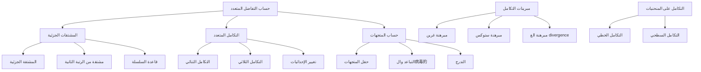

# تحليل 3 · Calculus 3

## 📐 المشتقات الجزئية · Partial Derivatives

### تعريف المشتقة الجزئية · Partial Derivative Definition

المشتقة الجزئية هي مشتقة دالة متعددة المتغيرات بالنسبة لمتغير واحد مع تثبيت المتغيرات الأخرى.

$$\frac{\partial f}{\partial x} = \lim_{\Delta x \to 0} \frac{f(x + \Delta x, y) - f(x, y)}{\Delta x}$$

$$\frac{\partial f}{\partial y} = \lim_{\Delta y \to 0} \frac{f(x, y + \Delta y) - f(x, y)}{\Delta y}$$

### ترميز المشتقة الجزئية · Partial Derivative Notation

| الترميز | المعنى |
|---|---|
| $\frac{\partial f}{\partial x}$ | المشتقة الجزئية بالنسبة لـ x |
| $\frac{\partial f}{\partial y}$ | المشتقة الجزئية بالنسبة لـ y |
| $f_x$ | الترميز الثاني للمشتقة الجزئية |
| $f_{xx}$ | المشتقة الجزئية الثانية |

### قواعد الاشتقاق الجزئي · Partial Differentiation Rules

قواعد الاشتقاق للدوال في متغير واحد تنطبق على المشتقات الجزئية:

$$\frac{\partial}{\partial x}(x^n) = nx^{n-1}$$

$$\frac{\partial}{\partial x}(e^x) = e^x$$

$$\frac{\partial}{\partial x}(\ln x) = \frac{1}{x}$$

$$\frac{\partial}{\partial x}(\sin x) = \cos x$$

$$\frac{\partial}{\partial x}(\cos x) = -\sin x$$

### المشتقة الجزئية من الرتبة الثانية · Second Order Partial Derivatives

$$f_{xx} = \frac{\partial^2 f}{\partial x^2} = \frac{\partial}{\partial x}\left(\frac{\partial f}{\partial x}\right)$$

$$f_{yy} = \frac{\partial^2 f}{\partial y^2} = \frac{\partial}{\partial y}\left(\frac{\partial f}{\partial y}\right)$$

$$f_{xy} = \frac{\partial^2 f}{\partial y \partial x} = \frac{\partial}{\partial y}\left(\frac{\partial f}{\partial x}\right)$$

$$f_{yx} = \frac{\partial^2 f}{\partial x \partial y} = \frac{\partial}{\partial x}\left(\frac{\partial f}{\partial y}\right)$$

### مبرهنة كليرو · Clairaut's Theorem

إذا كانت المشتقة الثانية مستمرة في المنطقة، فإن:

$$f_{xy} = f_{yx}$$

---

## ∭ التكامل المتعدد · Multiple Integrals

### التكامل الثنائي · Double Integral

التكامل الثنائي لدالة f(x,y) فوق المنطقة R:

$$\iint_R f(x,y) \, dA = \int_{a}^{b} \int_{c}^{d} f(x,y) \, dy \, dx$$

### ترتيب التكامل · Order of Integration

$$dA = dy \, dx \text{ أو } dx \, dy$$

### حساب التكامل الثنائي · Double Integral Evaluation

**المثال**: $\iint_R (x + y) \, dA$ حيث R: $0 \leq x \leq 2$, $0 \leq y \leq 1$

$$= \int_0^2 \int_0^1 (x + y) \, dy \, dx = \int_0^2 [xy + \frac{y^2}{2}]_0^1 dx$$

$$= \int_0^2 (x + \frac{1}{2}) dx = [\frac{x^2}{2} + \frac{x}{2}]_0^2 = 2 + 1 = 3$$

### التكامل الثلاثي · Triple Integral

التكامل الثلاثي لدالة f(x,y,z) في المنطقة E:

$$\iiint_E f(x,y,z) \, dV = \int_{a}^{b} \int_{c}^{d} \int_{e}^{f} f(x,y,z) \, dz \, dy \, dx$$

### تغيير المتغيرات · Change of Variables

#### الإحداثيات القطبية · Polar Coordinates

$$x = r\cos\theta, \quad y = r\sin\theta$$

$$dA = r \, dr \, d\theta$$

$$\iint_R f(x,y) \, dA = \int_{\alpha}^{\beta} \int_{0}^{r(\theta)} f(r\cos\theta, r\sin\theta) \, r \, dr \, d\theta$$

#### الإحداثيات الأسطوانية · Cylindrical Coordinates

$$x = r\cos\theta, \quad y = r\sin\theta, \quad z = z$$

$$dV = r \, dr \, d\theta \, dz$$

#### الإحداثيات الكروية · Spherical Coordinates

$$x = \rho\sin\phi\cos\theta, \quad y = \rho\sin\phi\sin\theta, \quad z = \rho\cos\phi$$

$$dV = \rho^2\sin\phi \, d\rho \, d\phi \, d\theta$$

---

## 🧭 حساب المتجهات · Vector Calculus

### حقل المتجهات · Vector Field

حقل المتجهات هو دالة تُرجع متجهًا لكل نقطة في الفضاء:

$$\vec{F}(x,y) = P(x,y)\hat{i} + Q(x,y)\hat{j}$$

$$\vec{F}(x,y,z) = P(x,y,z)\hat{i} + Q(x,y,z)\hat{j} + R(x,y,z)\hat{k}$$

### مؤثر ديل · Del Operator

$$\nabla = \hat{i}\frac{\partial}{\partial x} + \hat{j}\cdot\frac{\partial}{\partial y} + \hat{k}\frac{\partial}{\partial z}$$

### التباعد · Divergence

$$\nabla \cdot \vec{F} = \frac{\partial P}{\partial x} + \frac{\partial Q}{\partial y} + \frac{\partial R}{\partial z}$$

###病毒的 · Curl

$$\nabla \times \vec{F} = \begin{vmatrix} \hat{i} & \hat{j} & \hat{k} \\ \frac{\partial}{\partial x} & \frac{\partial}{\partial y} & \frac{\partial}{\partial z} \\ P & Q & R \end{vmatrix}$$

$$= (\frac{\partial R}{\partial y} - \frac{\partial Q}{\partial z})\hat{i} + (\frac{\partial P}{\partial z} - \frac{\partial R}{\partial x})\hat{j} + (\frac{\partial Q}{\partial x} - \frac{\partial P}{\partial y})\hat{k}$$

### التدرج · Gradient

$$\nabla f = \frac{\partial f}{\partial x}\hat{i} + \frac{\partial f}{\partial y}\hat{j} + \frac{\partial f}{\partial z}\hat{k}$$

### خصائص مؤثر ديل · Del Operator Properties

$$\nabla \cdot (\nabla f) = \nabla^2 f \text{ (لابلاسيان)}$$

$$\nabla \times (\nabla f) = \vec{0}$$

$$\nabla \cdot (\nabla \times \vec{F}) = 0$$

---

## ∫ التكامل الخطي · Line Integral

### التكامل الخطي لحقل قياسي · Line Integral of Scalar Field

تكامل دالة f على المنحنى C:

$$\int_C f(x,y,z) \, ds = \int_a^b f(\vec{r}(t)) |\vec{r}'(t)| \, dt$$

حيث $\vec{r}(t) = x(t)\hat{i} + y(t)\hat{j} + z(t)\hat{k}$ هي معادلة parametric للمنحنى.

$$ds = |\vec{r}'(t)| dt = \sqrt{(\frac{dx}{dt})^2 + (\frac{dy}{dt})^2 + (\frac{dz}{dt})^2} \, dt$$

### التكامل الخطي لحقل متجهات · Line Integral of Vector Field

تكامل حقل المتجهات $\vec{F}$ على المنحنى C:

$$\int_C \vec{F} \cdot d\vec{r} = \int_C \vec{F} \cdot \vec{T} \, ds$$

$$= \int_a^b \vec{F}(\vec{r}(t)) \cdot \vec{r}'(t) \, dt$$

### مثال توضيحي · Example

**المطلوب**: $\int_C \vec{F} \cdot d\vec{r}$ حيث $\vec{F} = (y, x)$ و C: $\vec{r}(t) = (t, t^2)$, $0 \leq t \leq 1$

$$\vec{F}(\vec{r}(t)) = (t^2, t)$$

$$\vec{r}'(t) = (1, 2t)$$

$$\vec{F} \cdot \vec{r}' = t^2 + 2t^2 = 3t^2$$

$$\int_0^1 3t^2 \, dt = [t^3]_0^1 = 1$$

---

## ⊙ التكامل السطحي · Surface Integral

### التكامل السطحي لحقل قياسي · Surface Integral of Scalar Field

$$\iint_S f(x,y,z) \, dS = \iint_D f(\vec{r}(u,v)) |\vec{r}_u \times \vec{r}_v| \, du \, dv$$

### المساحة السطحية · Surface Area

$$A = \iint_S dS = \iint_D |\vec{r}_u \times \vec{r}_v| \, du \, dv$$

### التكامل السطحي لمؤثر · Surface Integral of Vector Field

$$\iint_S \vec{F} \cdot \hat{n} \, dS = \iint_S \vec{F} \cdot d\vec{S}$$

$$= \iint_D \vec{F}(\vec{r}(u,v)) \cdot (\vec{r}_u \times \vec{r}_v) \, du \, dv$$

### مركبات السطح · Surface Parameterization

لل سطح $z = g(x,y)$:

$$\vec{r}(x,y) = x\hat{i} + y\hat{j} + g(x,y)\hat{k}$$

$$\vec{r}_x \times \vec{r}_y = (-g_x, -g_y, 1)$$

$$dS = \sqrt{1 + g_x^2 + g_y^2} \, dx \, dy$$

---

## 🔄 مبرهنة غرين · Green's Theorem

### الصيغة الأساسية · Basic Form

لمنحنى مغلق C الموجّه بعكس اتجاه عقارب الساعة، يحصر منطقة R:

$$\oint_C \vec{F} \cdot d\vec{r} = \iint_R \left(\frac{\partial Q}{\partial x} - \frac{\partial P}{\partial y}\right) dA$$

حيث $\vec{F} = P\hat{i} + Q\hat{j}$.

### الصيغة المتجهة · Vector Form

$$\oint_C \vec{F} \cdot \hat{T} \, ds = \iint_R (\nabla \times \vec{F}) \cdot \hat{k} \, dA$$

### صيغة المساحة · Area Form

مساحة المنطقة R:

$$A = \frac{1}{2} \oint_C (x \, dy - y \, dx)$$

### تطبيق مبرهنة غرين · Green's Theorem Application

**المثال**: أوجد $\oint_C (y^3 \, dx + x^3 \, dy)$ حيث C دائرة الوحدة.

$$\frac{\partial Q}{\partial x} = 3x^2, \quad \frac{\partial P}{\partial y} = 3y^2$$

$$\iint_R (3x^2 - 3y^2) dA = \iint_R 3(x^2 - y^2) dA$$

باستخدام الإحداثيات القطبية:

$$= \int_0^{2\pi} \int_0^1 3r^2 (\cos^2\theta - \sin^2\theta) \cdot r \, dr \, d\theta$$

$$= \int_0^{2\pi} \int_0^1 3r^3 \cos(2\theta) \, dr \, d\theta$$

$$= 3 \cdot \frac{1}{4} \cdot 0 = 0$$

---

## 🌊 مبرهنة ستوكس · Stokes' Theorem

### الصيغة · Formula

لمنحنى مغلق C على سطح S:

$$\oint_C \vec{F} \cdot d\vec{r} = \iint_S (\nabla \times \vec{F}) \cdot \hat{n} \, dS$$

حيث $\hat{n}$ هو المتجه العمودي الواحد على S.

### العلاقة مع مبرهنة غرين · Relation to Green's Theorem

مبرهنة ستوكس تعمم مبرهنة غرين في ثلاثة أبعاد:

$$\text{Green: } \oint_C P \, dx + Q \, dy = \iint_R (\frac{\partial Q}{\partial x} - \frac{\partial P}{\partial y}) dA$$

$$\text{Stokes: } \oint_C \vec{F} \cdot d\vec{r} = \iint_S (\nabla \times \vec{F}) \cdot \hat{n} \, dS$$

### تطبيق ستوكس · Stokes' Theorem Application

**المطلوب**: $\oint_C \vec{F} \cdot d\vec{r}$ حيث $\vec{F} = (y, z, x)$ و C تقاطع $z = y^2$ مع $x^2 + y^2 + z^2 = 1$.

$$\nabla \times \vec{F} = \begin{vmatrix} \hat{i} & \hat{j} & \hat{k} \\ \partial_x & \partial_y & \partial_z \\ y & z & x \end{vmatrix}$$

$$= (-1 - 1)\hat{i} + (0 - 1)\hat{j} + (0 - 1)\hat{k} = (-2, -1, -1)$$

على السطح $z = y^2$: $\hat{n} = \frac{1}{\sqrt{1+4y^2}}(0, -2y, 1)$

$$(\nabla \times \vec{F}) \cdot \hat{n} = \frac{2 + 2y - 1}{\sqrt{1+4y^2}} = \frac{1 + 2y}{\sqrt{1+4y^2}}$$

---

## 📐 مبرهنة الغ divergence · Divergence Theorem

### الصيغة · Formula

لجسم صلب E بسطح مغلق S:

$$\iint_S \vec{F} \cdot \hat{n} \, dS = \iiint_E (\nabla \cdot \vec{F}) \, dV$$

### التسمية · Naming

ت��عر�� أيضًا ب:

- مبرهنة غاوس (Gauss's Theorem)
- مبرهنة غاوس-أوستروغراتسكي

---

## 📝 أمثلة محلولة · Worked Examples

### المثال 1: المشتقة الجزئية

**المطلوب**: أوجد $\frac{\partial f}{\partial x}$ و $\frac{\partial f}{\partial y}$ لـ $f(x,y) = x^3 y^2 + 2xy^3$

$$\frac{\partial f}{\partial x} = 3x^2 y^2 + 2y^3$$

$$\frac{\partial f}{\partial y} = 2x^3 y + 6xy^2$$

### المثال 2: التكامل الثنائي

**المطلوب**: $\iint_R xy \, dA$ حيث R: $0 \leq x \leq 1$, $0 \leq y \leq 2$

$$= \int_0^1 \int_0^2 xy \, dy \, dx = \int_0^1 [x \frac{y^2}{2}]_0^2 dx$$

$$= \int_0^1 2x \, dx = [x^2]_0^1 = 1$$

### المثال 3: التكامل الخطي

**المطلوب**: $\int_C \vec{F} \cdot d\vec{r}$ حيث $\vec{F} = (2xy, x^2)$ و C: $\vec{r}(t) = (t^2, t)$, $0 \leq t \leq 1$

$$\vec{F}(\vec{r}(t)) = (2t^2 \cdot t, t^4) = (2t^3, t^4)$$

$$\vec{r}'(t) = (2t, 1)$$

$$\vec{F} \cdot \vec{r}' = 4t^4 + t^4 = 5t^4$$

$$\int_0^1 5t^4 \, dt = [t^5]_0^1 = 1$$

### المثال 4: مبرهنة غرين

**المطلوب**: $\oint_C (y \, dx + x \, dy)$ حيث C المربع unit من (0,0) إلى (1,1)

$$P = y, \quad Q = x$$

$$\frac{\partial Q}{\partial x} = 1, \quad \frac{\partial P}{\partial y} = 1$$

$$\iint_R (1 - 1) dA = 0$$

**النتيجة**: 0

### المثال 5: تغيير الإحداثيات

**المطلوب**: حوّل $\iint_R (x^2 + y^2) dA$ إلى إحداثيات قطبية، R: $x^2 + y^2 \leq 4$

$$= \int_0^{2\pi} \int_0^2 r^2 \cdot r \, dr \, d\theta = \int_0^{2\pi} \int_0^2 r^3 \, dr \, d\theta$$

$$= \int_0^{2\pi} [\frac{r^4}{4}]_0^2 d\theta = \int_0^{2\pi} 4 \, d\theta = 8\pi$$

---

## 🧮 جدول المتجهات · Vector Calculus Table

| العملية | الصيغة | الملاحظات |
|---|---|---|
| التباعد | $\nabla \cdot \vec{F}$ | حقل قياسي |
|病毒的 | $\nabla \times \vec{F}$ | حقل متجهي |
| التدرج | $\nabla f$ | حقل متجهي |
| لابلاسيان | $\nabla^2 f$ | التفاضل الثاني |
| غرين | $\oint_C \vec{F} \cdot d\vec{r} = \iint_R (\nabla \times \vec{F}) \cdot \hat{k} \, dA$ | 2D |
| ستوكس | $\oint_C \vec{F} \cdot d\vec{r} = \iint_S (\nabla \times \vec{F}) \cdot \hat{n} \, dS$ | 3D |
| الغ divergence | $\iint_S \vec{F} \cdot \hat{n} \, dS = \iiint_E \nabla \cdot \vec{F} \, dV$ | 3D |

---

## 📊 جدول التكامل · Integration Summary Table

| النوع | الصيغة | المتغيرات |
|---|---|---|
| الثنائي | $\iint_R f(x,y) dA$ | x, y |
| الثلاثي | $\iiint_E f(x,y,z) dV$ | x, y, z |
| الخطي (قياسي) | $\int_C f ds$ | منحنى |
| الخطي (متجه) | $\int_C \vec{F} \cdot d\vec{r}$ | منحنى |
| السطحي (قياسي) | $\iint_S f dS$ | surface |
| السطحي (متجه) | $\iint_S \vec{F} \cdot d\vec{S}$ | surface |

---

---

## ⚠️ أخطاء شائعة وملاحظات · Common Pitfalls & Notes

### المشتقات الجزئية
- **الخلط بين المشتقة الكلية والجزئية**: تذكر أن $\frac{\partial f}{\partial x}$ تُثبّت y
- **ترتيب المشتقات**: $f_{xy}$ قد لا تساوي $f_{yx}$ إلا إذا كانت مستمرة
- **القاعدة السلسلة**: للمركّبة، استخدم $\frac{\partial f}{\partial u} \cdot \frac{\partial u}{\partial x}$

### التكامل المتعدد
- **ترتيب التكامل**: غير الترتيب بحذر - قد يتغير الحل
- **حدود التكامل**: تأكد أن الحدود الخارجية تعتمد على المتغيرات الداخلية
- **عنصر المساحة/الحجم**: $dA = dx dy$ أو $dy dx$، $dV = dx dy dz$ الخ
- **الإحداثيات**: تذكر عامل اليacobian في التحول ($r$ في القطبية، $\rho^2\sin\phi$ في الكروية)

### حساب المتجهات
- **التباعد والتلوي**: حقل قياسي مقابل حقل متجهي
- **المؤثر ديل**: تذكر أن $\nabla \times (\nabla f) = 0$ و $\nabla \cdot (\nabla \times \vec{F}) = 0$
- **التلوي**: حقل $\vec{F}$ هو حقل محافظ إذا كان $= \nabla f$

### التكامل الخطي
- **اتجاه المنحنى**: التكامل يعتمد على اتجاه المنحنى
- **التعويض**: استخدم المعادلة الـ parametric الصحيحة
- **المسار**: بالنسبة لحقول غير محافظات، يعتمد التكامل على المسار

### التكامل السطحي
- **اختيار السطح**: يمكن اختيار أي سطح بين السطوح المحددة بـ C
- **الا��جا��**: $\hat{n}$ يحدد الاتجاه (قاعدة اليد اليمنى)
- **صيغة السطح**: تأكد من استخدام $dS$ الصحيح

### مبرهنة غرين
- **اتجاه المنحنى**: يجب أن يكون C موجهاً بعكس اتجاه عقارب الساعة (للمنطقة الموجبة)
- **السطح**: S هو سطح في المستوى xy ($\hat{n} = \hat{k}$)
- **الشرط**: المنحنى C وجميع المشتقات الجزئية يجب أن تكون مستمرة

### مبرهنة ستوكس
- **اختيار السطح**: السطح S المحدود بـ C يمكن أن يكون أي سطح
- **الاتجاه**: اتجاه C يحدد $\hat{n}$ (قاعدة اليد اليمنى)
- **الاتجاه**: إذا كان C بعكس اتجاه عقارب النظر $\to \hat{n}$ للأعلى

### مبرهنة الغ divergence
- **السطح**: S يجب أن يكون مغلقاً (يحدد جسماً)
- **الاتجاه**: $\hat{n}$ يشير للخارج (للجسم الموجب)
- **الشرط**: $\vec{F}$ وجميع المشتقات يجب أن تكون مستمرة داخل S وعلى حدودها

💡 **تلميح**: لتذكر ترتيب العمليات في حساب المتجهات:
- **التباعد → تفاضل** ($\nabla \cdot$ تُنتج عددًا)
- **التلوي → تفاضل** ($\nabla \times$ تُنتج متجهًا)
- **التدرج → تفاضل** ($\nabla$ تُنتج متجهًا من قياسي)

💡 **تلميح2**: في التكامل الخطي، إذا كان $\vec{F} = \nabla f$ (حقل محافظ):
- $\int_C \vec{F} \cdot d\vec{r} = f(\vec{r}(b)) - f(\vec{r}(a))$
- لا يعتمد على المسار!

💡 **تلميح3**: للتحقق من $\nabla \times \vec{F} = 0$:
- إذا كان $\vec{F} = P\hat{i} + Q\hat{j} + R\hat{k}$
- تحقق: $\frac{\partial R}{\partial y} = \frac{\partial Q}{\partial z}$، $\frac{\partial P}{\partial z} = \frac{\partial R}{\partial x}$، $\frac{\partial Q}{\partial x} = \frac{\partial P}{\partial y}$