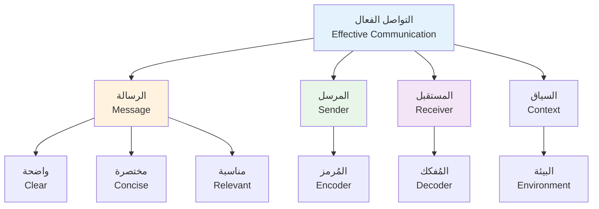
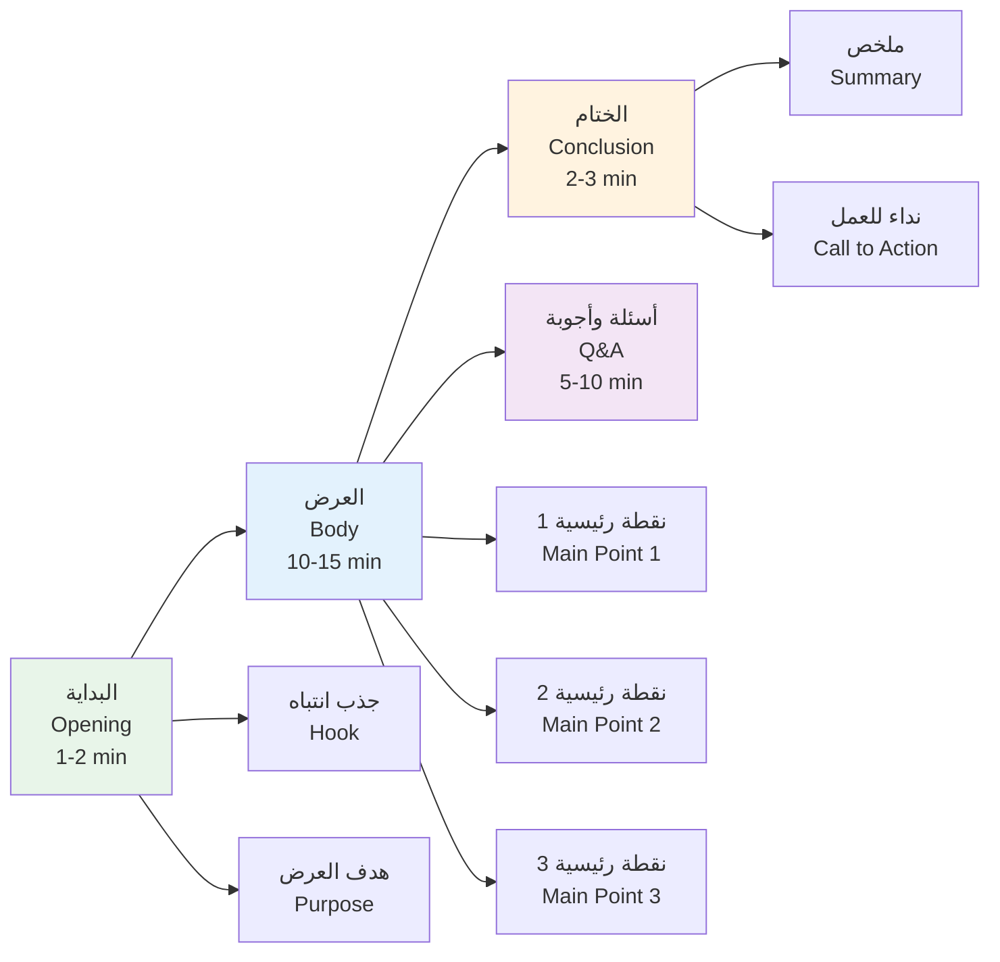
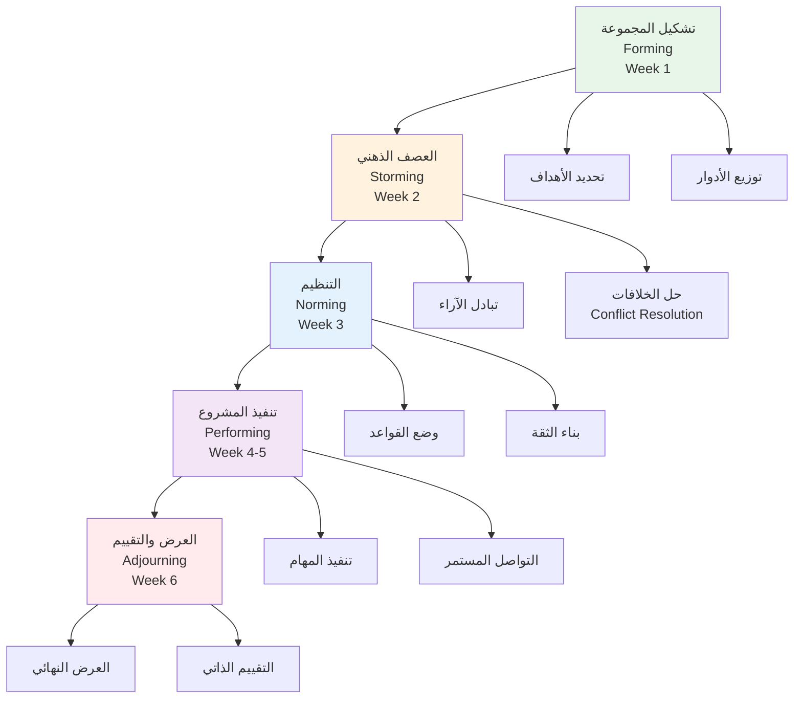

# مهارات التواصل · Communication Skills

## Year 2, Semester 2 · السنة الثانية، الفصل دراسي ثاني

---

## 📢 مقدمة · Introduction

التواصل الفعال هو قدرة الشخص على نقل أفكاره وعرضها بطريقة واضحة ومفهومة للآخرين.Communication skills refer to the ability to convey ideas and information clearly and effectively to others.

**أهمية التواصل**:
| الجانب | الأهمية |
|---|---|
| **الأكاديمي** | فهم المحاضرات والتفاعل مع الزملاء |
| **المهني** | بناء علاقات عمل ناجحة |
| **الاجتماعي** | تكوين صداقات وتواصل فعال |
| **الشخصي** | تطوير الثقة بالنفس |

---

## 🔊 مهارات التواصل · Communication Skills

### عناصر التواصل الفعال · Elements of Effective Communication



### أنواع التواصل · Types of Communication

| النوع | الوصف | مثال |
|---|---|---|
| **الكتابي (Written)** | تواصل عبر النصوص المكتوبة | تقارير، رسائل، بريد إلكتروني |
| **الشفهي (Oral)** | تواصل عبر الكلام | محاضرات، اجتماعات |
| **غير اللفظي (Non-verbal)** | تواصل بدون كلمات | لغة الجسد، تعبيرات الوجه |
| **البصري (Visual)** | تواصل عبر الصور والرسوم | عروض PowerPoint، رسومات |

### تقنيات التواصل · Communication Techniques

| التقنية | الوصف | مثال |
|---|---|---|
| **الاستماع الفعال (Active Listening)** | الإنصات الكامل مع التركيز | الحفاظ على التواصل البصري، إيماء الرأس |
| **طرح الأسئلة (Asking Questions)** | استفسار للتوضيح | "ماذا تعني بـ...؟" |
| **ملخص كلام المتحدث (Paraphrasing)** | إعادة صياغة بكلماتك | "إذا فهمت بشكل صحيح..." |
| **التعاطف (Empathy)** | التفاهم مع مشاعر الآخر | "أفهم شعورك بـ..." |

---

## 📊 تقنيات العرض التقديمي · Presentation Techniques

### التحضير للعرض · Presentation Preparation

| الخطوة | الوصف | العمل المطلوب |
|---|---|---|
| **1** | تحديد الهدف | ما الذي تريد تحقيقه؟ |
| **2** | معرفة الجمهور | من يستمع لك؟ |
| **3** | تنظيم المحتوى | هيكل واضح ومنطقي |
| **4** | إنشاء المرئيات | شرائح بسيطة وجذابة |
| **5** | التدرب | تدرب أكثر من مرة |

### بنية العرض · Presentation Structure



### نصائح للتقديم · Presentation Tips

| النصيحة | التطبيق |
|---|---|
| **التواصل البصري** | انظر إلى الجمهور بشكل متساوٍ |
| **التوقف المؤقت** | توقف بين الأفكار المهمة |
| **لغة الجسد** | استخدم إيماءات طبيعية |
| **الصوت** | طبقات صوت متنوعة وطبيعية |
| **الشرائح** | أقل نص وأكثر صور |

---

## 📝 كتابة التقارير · Report Writing

### أنواع التقارير · Types of Reports

| النوع | الوصف | الاستخدام |
|---|---|---|
| **التقرير الأكاديمي (Academic Report)** | بحث علمي منظم | مشاريع، أبحاث |
| **التقرير الفني (Technical Report)** | توثيق تقني | هندسة، برمجة |
| **التقرير الإداري (Managerial Report)** | ملخص للقيادة | قرارات إدارية |
| **تقرير المشروع (Project Report)** | تقدم عمل المشروع | متابعة المشاريع |

### بنية التقرير · Report Structure

```
┌─────────────────────────────────────┐
│ 1. العنوان (Title)                   │
│    - عنوان واضح وموجز              │
├─────────────────────────────────────┤
│ 2. الملخص (Abstract)                │
│    - ملخص 150-250 كلمة             │
├─────────────────────────────────────┤
│ 3. المقدمة (Introduction)          │
│    - خلفية، أهداف، نطاق           │
├─────────────────────────────────────┤
│ 4. المنهجية (Methodology)            │
│    - كيف تمت الدراسة                │
├─────────────────────────────────────┤
│ 5. النتائج (Results)                │
│    - بيانات، جداول، رسوم بيانية   │
├─────────────────────────────────────┤
│ 6. المناقشة (Discussion)           │
│    - تفسير النتائج                 │
├─────────────────────────────────────┤
│ 7. الخلاصة (Conclusion)            │
│    - ملخص النتائج والتوصيات       │
├─────────────────────────────────────┤
│ 8. المراجع (References)           │
│    - مصادر موثوقة                  │
└─────────────────────────────────────┘
```

### عناصر التقرير الجيد · Elements of Good Report

| العنصر | المعايير |
|---|---|
| **الوضوح** | لغة بسيطة ومفهومة |
| **التنظيم** | ترتيب منطقي للأفكار |
| **الدقة** | بيانات صحيحة ومدعومة |
| **الموضوعية** | آراء مبنية على أدلة |
| **الإحالة** | إحالة المصادر بشكل صحيح |

---

## ✍️ الكتابة التقنية · Technical Writing

### خصائص الكتابة التقنية · Characteristics of Technical Writing

| الخاصية | الوصف | مثال |
|---|---|---|
| **الوضوح** | لغة واضحة لا لبس فيها | "انقر على زر الحفظ" |
| **الإيجاز** | أقل كلمات تحقق المعنى | استخدم كلمات قوية |
| **الدقة** | معلومات صحيحة | تحقق من الأرقام |
| **التنظيم** | بنية منطقية | عناوين فرعية |
| **القابلية للتطبيق** | خطوات واضحة | 1، 2، 3 |

### قوالب الكتابة التقنية · Technical Writing Templates

####البريد الإلكتروني · Email Template

```
الموضوع: [موضوع واضح]

تحية [اسم/زميل]،

[الخط الرئيسي - الغرض من الرسالة]

[تفاصيل إضافية إذا لزم الأمر]

شكراً，
[اسمك]
[معلومات الاتصال]
```

#### نموذج المشكلة والحل · Problem-Solution Template

```
 المشكلة: [وصف المشكلة]

الأسباب المحتملة:
1. [سبب 1]
2. [سبب 2]

الحل المقترح:
1. [حل 1]
2. [حل 2]

النتائج المتوقعة:
- [نتيجة 1]
- [نتيجة 2]
```

---

## 👥 العمل الجماعي · Group Work

### أدوار فريق العمل · Team Roles

| الدور | الوصف | المسؤوليات |
|---|---|---|
| **القائد (Leader)** | تنسيق الفريق | توزيع المهام، توجيه النقاش |
| **كاتب الملاحظات (Recorder)** | توثيق القرارات | كتابة محاضر الاجتماعات |
| **المحفز (Facilitator)** | إدارة النقاش | ضمان مشاركة الجميع |
| **مراقب الوقت (Time Keeper)** | إدارة الوقت | متابعة الجدول الزمني |
| **العضو المساهم (Contributor)** | تنفيذ المهام | إنجاز العمل المكلف |

### مراحل العمل الجماعي · Group Work Stages



### نصائح للعمل الجماعي · Group Work Tips

| النصيحة | التطبيق |
|---|---|
| **التواصل المنتظم** | اجتمع أسبوعياً |
| **احترام آراء الآخرين** | استمع قبل الرد |
| **توزيع عادل للمهام** | كل عضو يعمل بالتساوي |
| **المتابعة المستمرة** | تحقق من التقدم |
| **حل المشكلات مبكراً** | لا تترك المشاكل تتراكم |

---

## 📋 مهارات المحادثة · Conversation Skills

### عبارات مفيدة · Useful Phrases

| الموقف | العبارات |
|---|---|
| **بدأ المحادثة** | "كيف حالك؟" · "ما رأيك في...؟" |
| **التعبير عن الرأي** | "أعتقد أن..." · "من وجهة نظري..." |
| **الموافقة** | "أوافقك الرأي" · "هذا صحيح" |
| **الاختلاف** | "أختلف معك في..." · "لدي رأي مختلف" |
| **طلب التوضيح** | "هل يمكنك التوضيح أكثر؟" · "ماذا تعني بـ...؟" |
| **الختام** | "شكراً لك على المحادثة" · "إلى اللقاء" |

### العبارات الاجتماعات · Meeting Phrases

| الموقف | العبارة |
|---|---|
| **بدء الاجتماع** | "لنبدأ اجتماعنا" · "حسناً، نبدأ" |
| **اقتراح موضوع** | "أقترح أن نناقش..." · "لدي نقطة أخرى" |
| **مقاطعة بشكل مؤدب** | "عذراً، هل يمكنني المقاطعة؟" · "اسمح لي بالمقاطعة" |
| **اتخاذ قرار** | "لنفترض تصويت على هذا الاقتراح" · "قراري النهائي هو..." |
| **إغلاق الاجتماع** | "هذا ملخص ما اتفقنا عليه" · "شكراً لكلمشاركة" |

---

## ⚠️ أخطاء شائعة · Common Mistakes

### أخطاء التواصل · Communication Mistakes

| الخطأ | التصحيح |
|---|---|
| **استخدام مصطلحات معقدة** | استخدم لغة بسيطة |
| **التحدث بسرعة** | أبطئ وتحدث بوضوح |
| **تجاهل لغة الجسد** | حافظ على التواصل البصري |
| **مقاطعة الآخرين** | انتظر دورك في الكلام |
| **عدم الاستماع** | استمع بفعالية |

### أخطاء الكتابة · Writing Mistakes

| الخطأ | التصحيح |
|---|---|
| **جمل طويلة جداً** | قسم الجمل الطويلة |
| **استخدام صوت المبني للمجهول** | استخدم الفعل المبني للمجهول بشكل مناسب |
| **جمل غير مكتملة** | تأكد من اكتمال الجملة |
| **اخطاء الإملاء** | راجع النص عدة مرات |
| **عدم التوثيق** | وثّق المصادر دائماً |

### أخطاء العروض التقديمية · Presentation Mistakes

| الخطأ | التصحيح |
|---|---|
| **شرائح مكتظة بالنص** | اقلل النص وأضف صور |
| **قراءة الشرائح** | تحدث بفعالية دون قراءة |
| **عدم التدرب** | تدرب كثيراً قبل العرض |
| **التواصل البصري الضعيف** | انظر للجمهور |
| **عدم التفاعل** | اسأل أسئلة للجمهور |

### أخطاء العمل الجماعي · Group Work Mistakes

| الخطأ | التصحيح |
|---|---|
| **السيطرة على المجموعة** | اسمح للآخرين بالمشاركة |
| **تأخر التسليم** | احترم المواعيد النهائية |
| **سوء التواصل** | تواصل بوضوح |
| **إلقاء اللوم** | تحمّل المسؤولية |
| **عدم إنجاز المهام** | أنجز عملك في الوقت |

---

## 📊 جدول مرجعي · Reference Table

| المفهوم | بالإنجليزية | بالعربية |
|---|---|---|
| التواصل الفعال | Effective Communication | نقل واضح للأفكار |
| الاستماع الفعال | Active Listening | الإنصات المركز |
| العرض التقديمي | Presentation | عرض شفهي |
| التقرير | Report | وثيقة منظمة |
| الكتابة التقنية | Technical Writing | كتابة توثيقية |
| العمل الجماعي | Group Work | عمل فريق |
| الملخص التنفيذي | Executive Summary | خلاصة موجزة |
| المرجع | Reference | مصدر |
| التنسيق | Formatting | تنسيق الوثيقة |
| التدقيق اللغوي | Proofreading | مراجعة نهائية |

---

## 💡 نصائح نهائية · Final Tips

> 1. **التواصل**: أكثر من التواصل مع الزملاء والأساتذة
> 2. **التدرب**: تدرب الكتابة والعروض بشكل مستمر
> 3. **التعلم من الأخطاء**: راجع أخطاءك وحسنها
> 4. **التوثيق**: وثّق دائماً مصادرك بشكل صحيح
> 5. **التعاون**: عامل زملاءك باحترام وتعاون

💡 **تلميح**: السر في التواصل الفعال هو **الوضوح والبساطة** - قل ما تريده بطريقة يفهمها الآخرون.

💡 **تلميح2**: للعروض الناجحة، تدرب أكثر وتتحدث بفعالية أكثر.

💡 **تلميح3**: للتقارير الجيدة، اقرأ وادرس التقارير المنشورة في مجالك.

---

## 📚 المراجع · References

- Academic Writing for Graduate Students
- Technical Writing Guide - University Resources
- Effective Communication Skills - Campus Workshops
- Group Work Guidelines - Student Handbook

---

*(End of file - Year 2, Semester 2)*