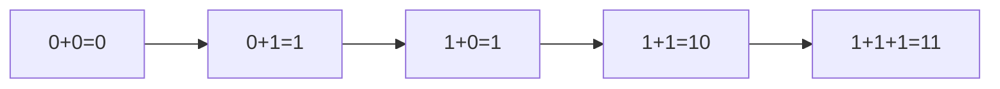
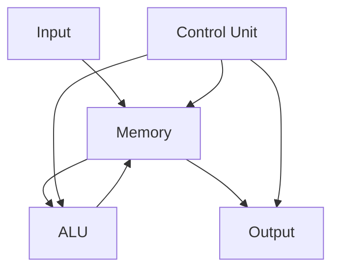
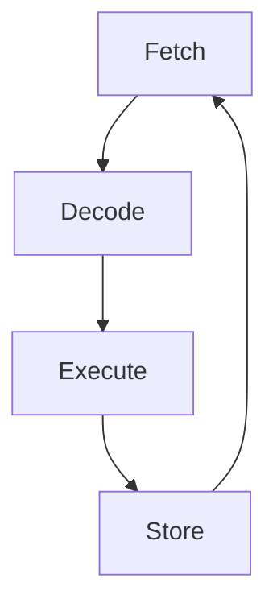

# مبادئ عمل الحاسوب · Computer Principles

## 📐 التعاريف الأساسية · Core Definitions

- **الحاسوب (Computer)**: جهاز إلكتروني لمعالجة البيانات وفق برنامج مُخزّن
- **العتاد (Hardware)**: الأجزاء المادية الملموسة للحاسوب
- **البرمجيات (Software)**: البرامج والتعليمات التي تُشغّل الحاسوب
- **نظام العد الثنائي (Binary System)**: نظام يستخدم الرقمين 0 و 1
- **البت (Bit)**: أصغر وحدة بيانات (0 أو 1)
- **البايت (Byte)**: 8 بتات

## 🧮 أنظمة العد · Number Systems

### التحويل بين الأنظمة

| من | إلى | الطريقة |
|---|---|---|
| ثنائي | عشري | $1011_2 = 1\times2^3 + 0\times2^2 + 1\times2^1 + 1\times2^0 = 11_{10}$ |
| عشري | ثنائي | قسمة متكررة على 2 |
| عشري | سداسي عشر | قسمة متكررة على 16 |
| ثنائي | سداسي عشر | تجميع كل 4 بتات |

### العمليات الحسابية الثنائية



**الجمع**: $0+0=0$, $0+1=1$, $1+0=1$, $1+1=10$ (carry)

## 🔁 بنية الحاسوب · Computer Architecture

### نموذج فون نيومان · Von Neumann Architecture



### المكونات الأساسية

| المكون | الوظيفة |
|---|---|
| **وحدة المعالجة المركزية CPU** | تنفيذ التعليمات والعمليات الحسابية |
| **الذاكرة RAM** | تخزين مؤقت للبيانات والبرامج |
| **ذاكرة القراءة فقط ROM** | تخزين ثابت للبيانات الأساسية |
| **وحدات الإدخال** | لوحة المفاتيح، الفأرة، الماسح الضوئي |
| **وحدات الإخراج** | الشاشة، الطابعة، السماعات |

## 💾 الذاكرة · Memory

### الهرمية الهرمية · Memory Hierarchy

```
┌─────────────────────────────────────┐
│         Register ( ultra fast )      │ ← CPU
├─────────────────────────────────────┤
│            Cache ( fast )            │
├─────────────────────────────────────┤
│      RAM ( main memory )            │
├─────────────────────────────────────┤
│    Secondary Storage ( slow )        │ ← HDD, SSD
└─────────────────────────────────────┘
```

### وحدات التخزين

- **1 KB** = $2^{10}$ = 1024 بايت
- **1 MB** = $2^{20}$ = 1,048,576 بايت
- **1 GB** = $2^{30}$ = 1,073,741,824 بايت
- **1 TB** = $2^{40}$ = 1,099,511,627,776 بايت

## ⚙️ المعالجات · Processors

### دورة تنفيذ الأمر



### مفاهيم مهمة

- **تردد المعالج (Clock Speed)**: عدد الدورات في الثانية (GHz)
- **عدد الأنوية (Cores)**: وحدات معالجة متعددة
- **ذاكرة الكاش (Cache)**: ذاكرة سريعة داخل المعالج
- **نواة المعالج (Core)**: وحدة معالجة مستقلة

## 📊 البياناتRepresentation

### تمثيل الأعداد الصحيحة

- **Signed**: موجب وسالب (طريقة الثنائي المتمم)
- **Unsigned**: موجب فقط

| النطاق (n بت) |_signed_ | _unsigned_ |
|---|---|---|
| 8-bit | -128 إلى 127 | 0 إلى 255 |
| 16-bit | -32768 إلى 32767 | 0 إلى 65535 |
| 32-bit | -2,147,483,648 إلى 2,147,483,647 | 0 إلى 4,294,967,295 |

### تمثيل النصوص (ASCII)

```c
'A' = 65 = 01000001₂
'a' = 97 = 01100001₂
'0' = 48 = 00110000₂
```

## 🔧 لغات البرمجة · Programming Languages

### المستويات

| المستوى | الأمثلة | الخصائص |
|---|---|---|
| **منخفض** | Assembly, C | سرعة عالية، تحكم كامل بالعتاد |
| **عالي** | Python, Java, C++ | سهولة الاستخدام، تجريد كبير |

### دورة الترجمة

```
Source Code → Preprocessor → Compiler → Assembly → Linker → Executable
```

## ⚠️ الأخطاء الشائعة · Common Pitfalls

1. **الخلط بين أنظمة العد** - تذكر أن $10_{16} = 16_{10}$
2. **تجاهل سعة الذاكرة** - تتجاوز النطاق 导致 overflow
3. **الارتباك بين Bit و Byte** - 8 bits = 1 Byte
4. **نسيان التمثيل السالب** - طريقة الثنائي المتمم

## 📝 ملخص · Summary

- الحاسوب يعتمد على النظام الثنائي (0, 1)
- بنية فون نيومان: وحدة تحكم، ذاكرة، ALU، إدخال/إخراج
- الذاكرة هرمية: سجلات ← كاش ← RAM ← تخزين ثانوي
- دورة التنفيذ: Fetch → Decode → Execute → Store

---

**المراجع**: محاضرات مبادئ عمل الحاسوب، جامعة Aleppo