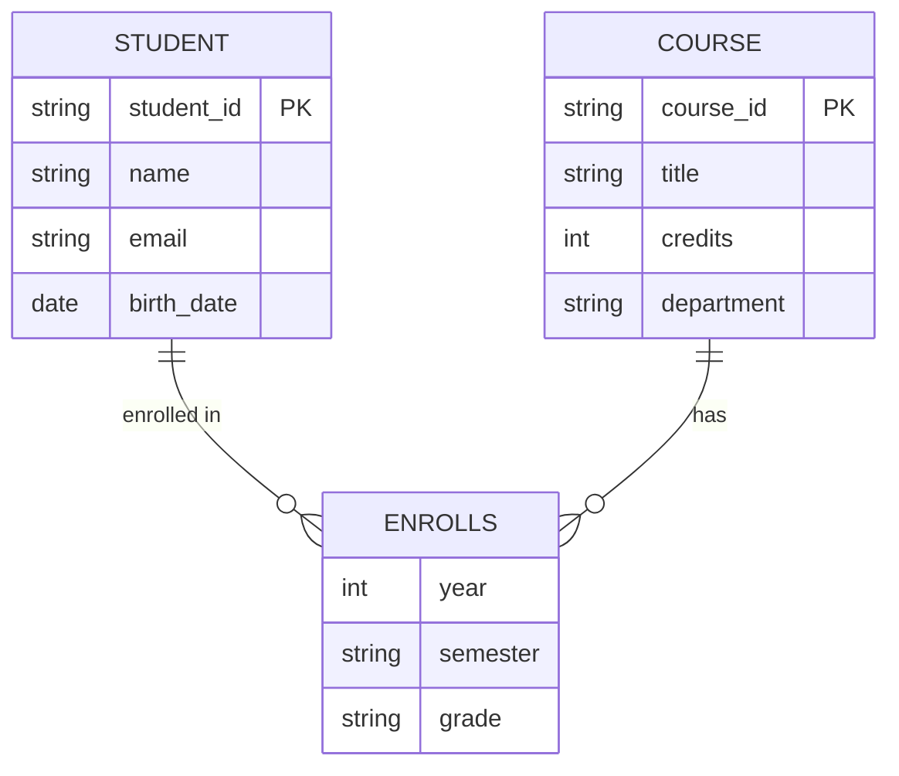

# قواعد المعطيات 1 · Databases 1

## 📐 التعاريف الأساسية · Core Definitions

- **قاعدة البيانات (Database)**: مجموعة من البيانات المنظمة والمترابطة بشكل منطقي
- **نظام إدارة قواعد المعطيات (DBMS)**: برنامج للتحكم بالوصول والتفاعل مع قاعدة البيانات
- **المخطط (Schema)**: البنية النظرية لقاعدة البيانات
- **المثيل (Instance)**: الحالة الفعلية للبيانات في لحظة معينة
- **المفتاح الأساسي (Primary Key)**: عمود أو مجموعة أعمدة تحدد كل صف بشكل فريد
- **المفتاح الخارجي (Foreign Key)**: عمود يشير إلى مفتاح أساسي في جدول آخر
- **الكيان (Entity)**: كائن له وجود مستقل قابل للتعريف
- **العلاقة (Relationship)**: ارتباط بين كيانين أو أكثر

## 🧮 النماذج والعلاقات · Models & Relationships

### نموذج الكيان والعلاقة (ER Model)



### مفاتيح العلاقات (Relationship Types)

- **واحد لواحد (1:1)**: كل كيان يرتبط بكيان واحد فقط
- **واحد لمتعدد (1:N)**: كيان واحد يرتبط بعدة كيانات
- **متعدد لمتعدد (N:M)**: عدة كيانات ترتبط بعدة كيانات

### Cardinality و Participation

$$|R| \in \{0, 1\}$$

- **Total Participation**: كل كيان يجب أن يرتبط بعلاقة
- **Partial Participation**: الكيان قد لا يرتبط بعلاقة

## 🔁 التسوية والصيغ · Normalization & Formulas

### أشكال التسوية (Normal Forms)

| المستوى | الاسم | الشرط |
|---------|-------|-------|
| 1NF | First Normal Form | القيم الذرية، بدون مجموعات متكررة |
| 2NF | Second Normal Form | 1NF + كل عمود غير مفتاحي يعتمد على المفتاح بالكامل |
| 3NF | Third Normal Form | 2NF + لا توجد اعتماديات متعدية |
| BCNF | Boyce-Codd Normal Form | كل محدد يجب أن يكون مفتاحاً مرشحاً |

### التبعيّات الوظيفية (Functional Dependencies)

$$X \rightarrow Y$$

تعني: إذا عرفنا $X$، يمكننا تحديد $Y$ بشكل فريد.

### قواعد أرمسترونج (Armstrong's Axioms)

1. **الانعكاس (Reflexivity)**: إذا كان $Y \subseteq X$، فإن $X \rightarrow Y$
2. **الزيادة (Augmentation)**: إذا كان $X \rightarrow Y$، فإن $XZ \rightarrow YZ$
3. **الترانزيتفيتي (Transitivity)**: إذا كان $X \rightarrow Y$ و $Y \rightarrow Z$، فإن $X \rightarrow Z$

### القانون المشتق

$$X \rightarrow Y \land X \rightarrow Z \implies X \rightarrow YZ$$

## 🌲 عمليات SQL الأساسية · Basic SQL Operations

### لغة تعريف البيانات (DDL)

```sql
CREATE TABLE table_name (
    column1 datatype PRIMARY KEY,
    column2 datatype NOT NULL,
    column3 datatype DEFAULT value
);
```

```sql
ALTER TABLE table_name ADD column datatype;
DROP TABLE table_name;
```

### لغة معالجة البيانات (DML)

```sql
SELECT column1, column2
FROM table_name
WHERE condition
ORDER BY column1 ASC|DESC;

INSERT INTO table_name (col1, col2)
VALUES (value1, value2);

UPDATE table_name
SET col1 = new_value
WHERE condition;

DELETE FROM table_name
WHERE condition;
```

### التجميع (Aggregation)

```sql
SELECT department, COUNT(*) as count, AVG(salary) as avg_salary
FROM employees
GROUP BY department
HAVING COUNT(*) > 5;
```

### JOIN Operations

```sql
SELECT *
FROM table1
INNER|LEFT|RIGHT|OUTER JOIN table2
ON table1.col = table2.col;
```

## 📝 أمثلة عملية · Worked Examples

### مثال 1: إنشاء جدول طلاب

```sql
CREATE TABLE students (
    student_id VARCHAR(10) PRIMARY KEY,
    name VARCHAR(50) NOT NULL,
    email VARCHAR(100) UNIQUE,
    gpa DECIMAL(3,2) DEFAULT 0.0,
    enrollment_year INT
);
```

### مثال 2: استعلام مع JOIN

```sql
SELECT s.name, c.title, e.grade
FROM students s
INNER JOIN enrolls e ON s.student_id = e.student_id
INNER JOIN courses c ON c.course_id = e.course_id
WHERE e.grade = 'A';
```

### مثال 3: حساب المعدل التراكمي

$$GPA = \frac{\sum (grade\_points \times credits)}{\sum credits}$$

```sql
SELECT SUM(g.grade_points * c.credits) / SUM(c.credits) as gpa
FROM enrolls e
JOIN grades g ON e.grade = g.letter
JOIN courses c ON e.course_id = c.course_id
WHERE e.student_id = 'S12345';
```

## 📊 جدول مرجعي شامل · Master Reference Table

### أنواع البيانات في SQL

| النوع | الوصف | مثال |
|-------|-------|------|
| INT, INTEGER | أعداد صحيحة | 42 |
| DECIMAL(p,s) | أعداد عشرية | DECIMAL(5,2) |
| VARCHAR(n) | نص بطول متغير | VARCHAR(100) |
| CHAR(n) | نص بطول ثابت | CHAR(10) |
| DATE | تاريخ | 2024-01-15 |
| DATETIME | تاريخ ووقت | 2024-01-15 14:30:00 |
| BOOLEAN | قيم منطقية | TRUE/FALSE |

### درجات التسوية والانتقالات

| 1NF → 2NF | 2NF → 3NF | 3NF → BCNF |
|-----------|----------|-----------|
| إزالة المجموعات المتكررة | إزالة الاعتماديات الجزئية | تقوية المفاتيح المرشحة |

## ⚠️ أخطاء شائعة وملاحظات · Common Pitfalls & Notes

- **ملاحظة 1**: المفتاح الأساسي لا يجب أن يكون NULL أبداً
- **ملاحظة 2**: استخدام INDEX لتحسين أداء الاستعلامات، لكن الإفراط يزيد حجم التخزين
- **ملاحظة 3**: الـ JOIN بدون شرط يُنتج حاصل ضرب كارتيزي (Cartesian Product)
- **ملاحظة 4**: SELECT * يُبطئ الأداء، حدد الأعمدة صراحةً
- **ملاحظة 5**: النمذجة الصحيحة تسبق التنفيذ - خطة التصميم أهم من الكود

💡 **تلميح**: لتذكر أشكال التسوية، فكر: **1**ذري، **2**كلي، **3**متعدٍ، **BC**مفتاح