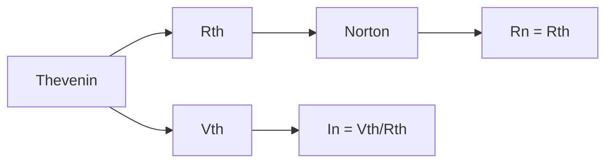

# دارات كهربائية · Electrical Circuits

## 📐 المفاهيم الأساسية · Core Concepts

- **الجهد (Voltage)**: القوة الدافعة الكهربائية ($V$)
- **التيار (Current)**: تدفق الشحنات الكهربائية ($I$)
- **المقاومة (Resistance)**: معاكسة لتدفق التيار ($R$)
- **الطاقة الكهربائية (Power)**: معدل نقل الطاقة ($P$)

---

## ⚡ قوانين الأساس · Fundamental Laws

### قانون أوم · Ohm's Law

$$V = IR$$

where:
- $V$: الجهد بالفولت (Volts)
- $I$: التيار بالأمبير (Amperes)
- $R$: المقاومة بالأوم (Ohms)

### قانون كيرشوف للتيار · Kirchhoff's Current Law (KCL)

$$\sum I_{in} = \sum I_{out}$$

**مجموع التيارات الداخل للعقدة = مجموع التيارات الخارج**

### قانون كيرشوف للجهد · Kirchhoff's Voltage Law (KVL)

$$\sum V_{loop} = 0$$

**مجموع جهود المصدر والمقاومات في أي حلقة مغلقة = صفر**

---

## 🔌 تحليل الدوائر · Circuit Analysis

### التوصيل على التوالي · Series Connection

$$R_{eq} = R_1 + R_2 + R_3 + \cdots$$

$$I_{total} = I_1 = I_2 = I_3$$

$$V_{total} = V_1 + V_2 + V_3$$

### التوصيل على التوازي · Parallel Connection

$$\frac{1}{R_{eq}} = \frac{1}{R_1} + \frac{1}{R_2} + \frac{1}{R_3}$$

$$V_{total} = V_1 = V_2 = V_3$$

$$I_{total} = I_1 + I_2 + I_3$$

### المقاومات المكافئة · Equivalent Resistance

**سلسل (Series/على التوالي)**:
$$R_{eq} = \sum_{i=1}^{n} R_i$$

**متوازية (Parallel/على التوازي)**:
$$R_{eq} = \frac{1}{\sum_{i=1}^{n} \frac{1}{R_i}}$$

---

## 🔬 تحليل العقد · Nodal Analysis

### خطوات الحل:

1. **اختر عقدة مرجعية** (reference node)
2. **حدد العقد الأخرى** وسمّها ($V_1, V_2, ...$)
3. **طبّق KCL** على كل عقدة غير مرجعية
4. **حل المعادلات** لإيجاد جهود العقد

### معادلة العقدة:

$$\frac{V_1 - V_{source}}{R_1} + \frac{V_1 - V_2}{R_2} = 0$$

---

## 🔄 تحليل الشبكة · Mesh Analysis

### خطوات الحل:

1. **حدّد الشبكات (meshes)** في الدائرة
2. **سمّه تيار الشبكة** لكل شبكة ($I_1, I_2, ...$)
3. **طبّق KVL** على كل شبكة
4. **حل المعادلات** لإيجاد تيارات الشبكة

### مثال لشبكتين:

**Mesh 1**:
$$V_{source} - I_1 R_1 - (I_1 - I_2) R_2 = 0$$

**Mesh 2**:
$$-(I_2 - I_1) R_2 - I_2 R_3 = 0$$

---

## 🌟 نظريات الدوائر · Circuit Theorems

### نظرية ثيفينين · Thevenin's Theorem

أي دائرة خطية يمكن تمثيلها بـ:
- **مصدر جهد** ($V_{th}$) + **مقاومة** ($R_{th}$)

$$V_{th} = V_{open-circuit}$$

$$R_{th} = \frac{V_{th}}{I_{short-circuit}}$$

### نظرية نورتون · Norton's Theorem

أي دائرة خطية يمكن تمثيلها بـ:
- **مصدر تيار** ($I_n$) + **مقاومة** ($R_n$)

$$I_n = \frac{V_{th}}{R_{th}}$$

$$R_n = R_{th}$$

### تحويل ثيفينين ← نورتون



### التراكب · Superposition

1. أطفئ كل مصادر الطاقة ما عدا واحداً
2. احسب المساهمة لهذا المصدر
3. كرر لكل مصدر
4. اجمع جميع المساهمات

**لإطفاء مصدر جهد**: ضع قصر (short circuit)
**لإطفاء مصدر تيار**: ضع فتحة (open circuit)

---

## ⏱️ دارات RL و RC · RL and RC Circuits

### دارة RC (مكثف)

### الشحن (Charging):

$$V_C(t) = V_{source} \left(1 - e^{-t/RC}\right)$$

$$I(t) = \frac{V_{source}}{R} e^{-t/RC}$$

### التفريغ (Discharging):

$$V_C(t) = V_0 e^{-t/RC}$$

$$I(t) = -\frac{V_0}{R} e^{-t/RC}$$

where:
- $\tau = RC$: ثابت الزمن (Time Constant)

### تيار الشحن والتفريغ:

$$I_C(t) = C \frac{dV_C}{dt}$$

### دارة RL

### نمو التيار (Current Growth):

$$I(t) = I_{max} \left(1 - e^{-t/\tau}\right)$$

where $\tau = \frac{L}{R}$

### تناقص التيار (Current Decay):

$$I(t) = I_0 e^{-t/\tau}$$

### الجهد على المحث:

$$V_L(t) = L \frac{dI}{dt}$$

---

## 🔊 التيار المتناوب · AC Circuits

### القيم الفعالة · RMS Values

$$V_{rms} = \frac{V_{peak}}{\sqrt{2}}$$

$$I_{rms} = \frac{I_{peak}}{\sqrt{2}}$$

### الممانعة · Impedance

$$Z = R + jX$$

where:
- $R$: المقاومة الحقيقية (Real)
- $X$: الممانعة التخيلية (Imaginary)
- $j = \sqrt{-1}$

### مقاومة المكثف · Capacitive Reactance

$$X_C = \frac{1}{2\pi f C}$$

### مقاومة المحث · Inductive Reactance

$$X_L = 2\pi f L$$

### قانون أوم للتيار المتناوب:

$$V_{rms} = I_{rms} \cdot Z$$

### القدرة في AC:

$$P_{avg} = V_{rms} I_{rms} \cos\phi$$

where $\cos\phi$: معامل القدرة (Power Factor)

$$P_{avg} = I_{rms}^2 R$$

### زاوية الطور:

$$\tan\phi = \frac{X_L - X_C}{R}$$

---

## 📊 جدول القوانين · Laws Table

| القانون | الصيغة | الوصف |
|---------|--------|-------|
| قانون أوم | $V = IR$ | العلاقة الأساسية |
| قانون كيرشوف للتياري | $\sum I_{in} = \sum I_{out}$ | التيار في العقد |
| قانون كيرشوف للجهد | $\sum V = 0$ | الجهد في الحلقة |
| القدرة | $P = IV = I^2R = V^2/R$ | الطاقة |
| ثابت الزمن RC | $\tau = RC$ | زمن الاستجابة |
| ثابت الزمن RL | $\tau = L/R$ | زمن الاستجابة |
| القدرة AC | $P = V_{rms} I_{rms} \cos\phi$ | القدرة المتوسطة |
| ممانعة المكثف | $X_C = \frac{1}{2\pi f C}$ | معاكسة للتيار |
| ممانعة المحث | $X_L = 2\pi f L$ | معاكسة للتيار |

---

## 📈 جدول الوحدات · Units Table

| الخاصية | الرمز | الوحدة | رمز الوحدة |
|---------|-------|--------|-----------|
| الجهد | $V$ | فولت | V |
| التيار | $I$ | أمبير | A |
| المقاومة | $R$ | أوم | $\Omega$ |
| السعة | $C$ | فاراد | F |
| المحاثة | $L$ | هنري | H |
| القدرة | $P$ | واط | W |
| الطاقة | $E$ | جول | J |
| التردد | $f$ | هرتز | Hz |

---

## 🔧 دارات التيار المستمر · DC Circuits

### تجميع المقاومات:

```
سلسل:  R_total = R1 + R2 + R3
متوازية:  1/R_total = 1/R1 + 1/R2 + 1/R3
```

### تجميع المكثفات (سلسل):

$$C_{eq} = \frac{1}{\frac{1}{C_1} + \frac{1}{C_2} + \frac{1}{C_3}}$$

### تجميع المحاثات (سلسل):

$$L_{eq} = L_1 + L_2 + L_3$$

---

## 💡 حل المسائل · Problem Solving

### Steps for Circuit Analysis:

1. **حدد نوع الدائرة** (DC, AC, Transient)
2. **ارسم الدائرة** وسمّ كل عنصر
3. **حدد ما هو مطلوب** (جهد، تيار، قدرة)
4. **اختر طريقة مناسبة**:
   - تحليل العقد (Nodal) → للدوائر المعقدة
   - تحليل الشبكة (Mesh) → للدوائر البسيطة
   - ثيفينين/نورتون → للدوائر الخطية
   - التراكب → لدوائر متعددة المصادر
5. **حل المعادلات** وتحقق من النتائج
6. **افحص الوحدات** والأرقام المعقولة

---

## ⚠️ أخطاء شائعة وملاحظات · Common Pitfalls

### أخطاء التحليل:

- **خطأ 1**: الخلط بين التوصيل على التوازي والتوالي
- **خطأ 2**: نسيان تطبيق KCL على العقد الصحيحة
- **خطأ 3**: عدم مراعاة polarities في KVL
- **خطأ 4**: استخدام القانون الخطأ لمجموع المقاومات

### أخطاء الأوم:

- **خطأ 5**: استخدام التيار Peak بدلاً من RMS في AC
- **خطأ 6**: نسيان وحدة ثابت الزمن ($\tau = RC$ ثواني)
- **خطأ 7**: الخلط بين $X_L$ و $X_C$ (متعاكسان)

### أخطاء حساب القدرة:

- **خطأ 8**: استخدام $P = IV$ للقدرة اللحظية في AC
- **خطأ 9**: نسيان معامل القدرة ($\cos\phi$)
- **خطأ 10**: استخدام قيم Peak للقدرة الفعالة

### ملاحظات مهمة:

💡 **ملاحظة 1**: في التوازي، الجهد نفسه على كل العناصر

💡 **ملاحظة 2**: في السلسل، التيار نفسه عبر كل العناصر

💡 **ملاحظة 3**: المكثف يوقف التيار المستمر (DC) بعد استقرار الحالة

💡 **ملاحظة 4**: المحث يوقف التغير المفاجئ للتيار

💡 **ملاحظة 5**: $V_{rms} = V_{peak} / \sqrt{2}$ لل sinusoids فقط

💡 **تلميح**: في دوائر AC، المركبة المُقاومة هي فقط التي تستهلك قدرة حقيقية

---

## 🧮 معادلات مهمة · Important Equations

### قوانين كيرشوف:

```
KCL:  ΣI_in = ΣI_out
KVL:  ΣV = 0
```

### أوم والمقاومة:

```
V = IR
P = IV = I²R = V²/R
R_series = ΣR
1/R_parallel = Σ(1/R)
```

### ثيفينين / نورتون:

```
Vth = الجهد المفتوح
Rth = Vth / Isc
In = Vth / Rth
```

### RC / RL:

```
τ_RC = RC (ثواني)
τ_RL = L/R (ثواني)
V_C(t) = V(1 - e^(-t/RC))
I_L(t) = I_max(1 - e^(-tR/L))
```

### AC:

```
Vrms = Vpeak/√2
Irms = Ipeak/√2
Z = R + j(XL - XC)
P_avg = Vrms × Irms × cos(φ)
```

---

*دارات كهربائية - Year 1 Semester 2*