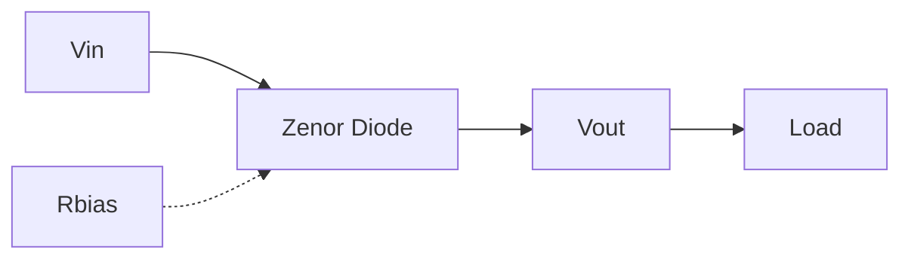
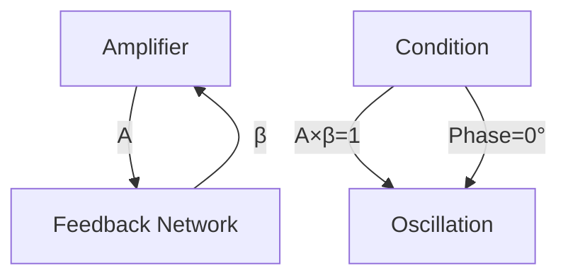

# الكترونيات · Electronics

## 📡 أشباه الموصلات · Semiconductors

### المواد شبه الموصلة · Semiconductor Materials

| المادة | النوع | خصائص |
|--------|-------|--------|
| السيليكون (Silicon) | غيري (Intrinsic) | $E_g = 1.12$ eV، الأكثر استخداماً |
| الجرمانيوم (Germanium) | غيري | $E_g = 0.67$ eV، نطاق ترددي أضيق |
| الكربون السيليكوني (SiC) | غيري | $E_g = 3.26$ eV، عزل عالي |
| GaAs | غيري | $E_g = 1.43$ eV، تطبيقات عالية التردد |

### الإلكترونات والثقوب · Electrons and Holes

```
نصف ناقل (Intrinsic):  n = p = ni

n: تركيز الإلكترونات (cm⁻³)
p: تركيز الثقوب (cm⁻³)
ni: التركيز الجوهري (intrinsic carrier concentration)
```

---

## 🔶 الثنائيات · Diodes

### البنية والعملية · Structure and Operation

```
                P-type          N-type
                 (+)             (-)
    ──────────[██████]───[██████]────────
                 │              │
                 │              │
                P               N
```

### منحني الخصائص · I-V Characteristic

$$I_D = I_S \left(e^{\frac{V_D}{nV_T}} - 1\right)$$

where:
- $I_S$: تيار التشبع العكسي (Saturation Current)
- $n$: معامل الجودة (Quality Factor) ≈ 1-2
- $V_T = \frac{kT}{q}$: الجهد الحراري (Thermal Voltage) ≈ 26mV at 300K

### أنماط التشغيل · Operating Regions

| النمط | الجهد | التيار |
|-------|-------|--------|
| الأمام (Forward) | $V_D > 0.7V$ (Si) | يتدفق بشكل كبير |
| العكس (Reverse) | $V_D < 0$ | تيار تسرب صغير |
| الانهيار (Breakdown) | $V_D < -V_{Z}$ | تيار عكسي كبير |

### معادلة الثنائي · Diode Equation

$$I_D = I_S \left(e^{\frac{qV_D}{nkT}} - 1\right)$$

### تقسيم الثنائيات · Diode Types

| النوع | الرمز | الاستخدام |
|-------|-------|-----------|
| ثنائي عادي | ○─|─● | تقويم، حماية |
| ثنائي زينر | ○─|─● with Z | تنظيم الجهد |
| ثنائي ضوئي LED | ○─|─● with ⊗ | إضاءة |
| ثنائي شottky | ○─|─● with S | تجميع سريع |
| ثنائي Tunnel | ○─|─● with T | تطبيقات متذبذبة |

### الثنائي زينر · Zener Diode

$$V_Z = V_{Z0} + I_Z R_Z$$

**في منطقة الانهيار العكسي**:
- الجهد ثابت تقريباً
- يستخدم لتنظيم الجهد

$$V_{out} = V_Z \quad \text{(when } V_{in} > V_Z \text{)}$$

### دارة التقويم · Rectifier Circuits

#### تقويم نصف الموجة:

$$V_{dc} = \frac{V_{peak}}{\pi}$$

#### تقويم الموجة الكاملة:

$$V_{dc} = \frac{2V_{peak}}{\pi}$$

#### جسر التقويم:

```
     ┌──────┐
   ──┤  D1  ├──┐
   │  └──────┘  │
   │            │
  Vin         Vout
   │            │
   │  ┌──────┐  │
   └─┤  D4  ├──┘
     └──────┘
     
   D2, D3 في الفرع الآخر
```

### مرشحات الجهد · Voltage Regulators



**المقاومة**:

$$R_{bias} = \frac{V_{in} - V_Z}{I_Z + I_{load}}$$

---

## 🔷 الترانزستورات · Transistors

### الترانزستور ثنائي القطبية · BJT (Bipolar Junction Transistor)

#### البنية:

```
         Collector
            │
     ┌──────┴──────┐
     │    P-type   │
     │             │
   B │             │ E
     │    N-type   │
     └──────┬──────┘
            │
         Emitter
```

**أنواع**:

| النوع | الوصف |
|-------|-------|
| NPN | Emitter → N، Base → P، Collector → N |
| PNP | Emitter → P، Base → N، Collector → P |

#### معادلات التشغيل:

$$I_C = \alpha I_E$$

$$I_B = \frac{I_C}{\beta}$$

$$I_E = I_B + I_C$$

where:
- $\alpha$: معامل传送 (Current Transfer Ratio)
- $\beta$: معامل التكبير (Current Gain)

**العلاقة**:

$$\beta = \frac{\alpha}{1 - \alpha}$$

#### منحنيات الخصائص:

$$I_C = \beta I_B \quad \text{(Active Region)}$$

$$V_{CE} = V_{CC} - I_C R_C$$

#### أنماط التشغيل:

| النمط | Base-Emitter | Base-Collector | الاستخدام |
|-------|--------------|----------------|-----------|
| القطع (Cutoff) | عكسي | عكسي | مفتوح |
| التشبع (Saturation) | أمامي | أمامي | مغلق |
| النشط (Active) | أمامي | عكسي | مكبر |

### الترانزستور الحقلي · FET (Field Effect Transistor)

#### أنواع FET:

| النوع | الوصف |
|-------|-------|
| MOSFET | MOSFET: Metal-Oxide-Semiconductor FET |
| JFET | JFET: Junction FET |
| MESFET | MESFET: Metal-Semiconductor FET |

#### MOSFET:

```
         Drain
            │
     ┌──────┴──────┐
     │    N-type   │ ← Channel
     │             │
   S │             │ G
     │    P-type   │
     └──────┬──────┘
            │
         Source
```

**أنواع**:

| النوع | الوصف |
|-------|-------|
| Enhancement | لا يوجد channel initially |
| Depletion | يوجد channel initially |

#### معادلات MOSFET:

**ال منطقة التشبع (Saturation)**:

$$I_D = \frac{\mu_n C_{ox}}{2} \frac{W}{L} (V_{GS} - V_{th})^2$$

or:

$$I_D = K_n (V_{GS} - V_{th})^2$$

where:
- $K_n = \frac{\mu_n C_{ox}}{2} \frac{W}{L}$
- $V_{th}$: جهد العتبة (Threshold Voltage)

**الطقة الخطية (Linear Region)**:

$$I_D = K_n \left[2(V_{GS} - V_{th})V_{DS} - V_{DS}^2\right]$$

### مقارنة BJT و FET:

| الخاصية | BJT | FET |
|---------|-----|-----|
| التحكم | تيار | جهد |
| المدخل | Base | Gate |
| مقاومة المدخل | منخفضة | عالية جداً |
| الضوضاء | أعلى | أقل |
| السرعة | أقل | أعلى |
| الاستهلاك | أعلى | أقل |

---

## 📈 المكبرات · Amplifiers

### مكبرات الإشارة · Signal Amplification

$$A_v = \frac{v_{out}}{v_{in}}$$

**أنواع التكبير**:

| النوع | الوصف |
|-------|-------|
| الجهد (Voltage) | $A_v$ |
| التيار (Current) | $A_i$ |
| القدرة (Power) | $A_p = A_v \times A_i$ |

### مكبر ترانزستور BJT · BJT Amplifier

#### تكوينات التكبير:

| التكوين | Gain | المدخل | المخرج |
|---------|------|--------|--------|
| Common Emitter | عالي | Base | Collector |
| Common Base | ~1 | Emitter | Collector |
| Common Collector | ~1 | Base | Emitter |

#### منحى العمل (Biasing):

$$V_{CE} = \frac{V_{CC}}{2} \quad \text{(Mid-point)}$$

$$V_{RC} = V_{CC} - V_{CE}$$

$$I_C = \frac{V_{RC}}{R_C}$$

#### معادلات التكبير:

**Common Emitter**:

$$A_v = -\frac{g_m R_C}{r_{\pi}}$$

$$g_m = \frac{I_C}{V_T}$$

$$r_{\pi} = \frac{\beta}{g_m}$$

**Common Collector (Emitter Follower)**:

$$A_v \approx \frac{R_E}{R_E + r_{\pi}} \approx 1$$

### مكبر MOSFET:

$$A_v = -g_m R_D \quad \text{(Common Source)}$$

$$g_m = \frac{2I_D}{V_{GS} - V_{th}}$$

### مكبر العمليات · Operational Amplifier

#### خصائص مثالية:

| الخاصية | القيمة المثالية |
|---------|----------------|
| Gain | ∞ |
| Input Impedance | ∞ |
| Output Impedance | 0 |
| Bandwidth | ∞ |
| CMRR | ∞ |

#### الدارات الأساسية:

**المكبر العاكس (Inverting)**:

$$A_v = -\frac{R_f}{R_{in}}$$

**المكبر غير العاكس (Non-Inverting)**:

$$A_v = 1 + \frac{R_f}{R_{in}}$$

**المكبر الجامع (Summing)**:

$$V_{out} = -R_f \left(\frac{V_1}{R_1} + \frac{V_2}{R_2} + \cdots\right)$$

**المكبر التكاملي (Integrator)**:

$$V_{out} = -\frac{1}{RC} \int V_{in} \, dt$$

**المكبر التفاضلي (Differentiator)**:

$$V_{out} = -RC \frac{dV_{in}}{dt}$$

### استجابة التردد · Frequency Response

$$f_H = \frac{1}{2\pi R_{eq} C_{eq}}$$

**عرض النطاق (Bandwidth)**:

$$BW = f_H - f_L$$

**حاصل التكبير×العرض**:

$$A_v \times BW = \text{constant}$$

### معدل الصعود · Slew Rate

$$SR = \frac{dV_{out}}{dt} \quad [V/\mu s]$$

**الشرط**:

$$SR > 2\pi f V_{peak}$$

---

## 🔄 المتذبذبات · Oscillators

### مبدأ التذبذب · Oscillation Principle

$$A \cdot \beta = 1$$

where:
- $A$: تكبير الحلقة (Loop Gain)
- $\beta$: تغذية راجعة (Feedback Factor)
- الطور = 0° أو 360°

### أنواع المتذبذبات:

#### متذبذب RC:

$$f = \frac{1}{2\pi RC}$$

**Phase Shift Oscillator**:

- 3 مراحل RC
- كل مرحلة 60°

#### متذبذب LC:

$$f = \frac{1}{2\pi\sqrt{LC}}$$

**Colpitts Oscillator**:

$$f = \frac{1}{2\pi\sqrt{L \frac{C_1 C_2}{C_1 + C_2}}}$$

**Hartley Oscillator**:

$$f = \frac{1}{2\pi\sqrt{(L_1 + L_2)C}}$$

### متذبذب الكريستال · Crystal Oscillator

$$f = \frac{1}{2\pi\sqrt{L C_{eq}}}$$

- $Q$ عالي جداً
- استقرار ممتاز
- التردد: kHz إلى MHz

### متذبذب المقارنة · Comparator (Astable)

$$T = 2R C \ln\left(1 + \frac{2R_1}{R_2}\right)$$

$$f = \frac{1}{T}$$

### شروط التذبذب:

1. **حلق Gain = 1**: $|A\beta| = 1$
2. **طور = 0°**: Phase = 360°



---

## 🔢 البوابات المنطقية · Logic Gates

### البوابات الأساسية · Basic Gates

| البوابة | الرمز | الجدول |
|---------|-------|--------|
| NOT | ○─|─● | A → Ā |
| AND | ○─|&─● | A·B |
| OR | ○─≥1─● | A+B |
| NAND | ○─|&─● with ¬ | A·B |
| NOR | ○─≥1─● with ¬ | A+B |
| XOR | ○─=1─● | A⊕B |
| XNOR | ○─=1─● with ¬ | A⊙B |

### جداول الحقيقة · Truth Tables

#### NOT:

| A | Ā |
|---|---|
| 0 | 1 |
| 1 | 0 |

#### AND:

| A | B | A·B |
|---|---|-----|
| 0 | 0 | 0 |
| 0 | 1 | 0 |
| 1 | 0 | 0 |
| 1 | 1 | 1 |

#### OR:

| A | B | A+B |
|---|---|-----|
| 0 | 0 | 0 |
| 0 | 1 | 1 |
| 1 | 0 | 1 |
| 1 | 1 | 1 |

#### XOR:

| A | B | A⊕B |
|---|---|-----|
| 0 | 0 | 0 |
| 0 | 1 | 1 |
| 1 | 0 | 1 |
| 1 | 1 | 0 |

### عائلات المنطق · Logic Families

| العائلة | الوصف | Fan-out | Noise Margin |
|---------|-------|---------|---------------|
| TTL | Transistor-Transistor Logic | 10 | 0.4V |
| CMOS | Complementary MOS | >50 | 0.45×Vdd |
| ECL | Emitter-Coupled Logic | 25 | 0.2V |

### بوابات CMOS:

#### NAND:

```
Vdd
 │
 ├─[N-MOS]─[N-MOS]─⊥
 │           │
 A ──────────┤
 │
 ├─[P-MOS]─[P-MOS]
 │           │
 B ──────────┤
 │
 OUT
```

#### NOR:

```
Vdd
 │
 ├─[P-MOS]─┐
 │         │
 A ─────────┼─ OUT
 │         │
 ├─[P-MOS]─┘
 │
 ├─[N-MOS]─┐
 │         │
 B ─────────┼─ ⊥
 │         │
 └─[N-MOS]─┘
```

### التعبيرات Boolean:

$$F = A \cdot B + \bar{A} \cdot C$$

$$F = \overline{A \cdot B} = \bar{A} + \bar{B}$$

**قوانين ديمورغان**:

$$\overline{A \cdot B} = \bar{A} + \bar{B}$$

$$\overline{A + B} = \bar{A} \cdot \bar{B}$$

### تبسيط الدوائر · Circuit Simplification

**خريطة كارنو (Karnaugh Map)**:

- 2 متغيرات: 4 خلايا
- 3 متغيرات: 8 خلايا
- 4 متغيرات: 16 خلية

**ألوان الجيران**:

- كل خلية لها جيران (أعلى، أسفل، يمين، يسار)
- مجموعات من 2، 4، 8، 16

---

## 📊 جدول الثنائيات · Diodes Table

| الثنائي |$V_F$|$I_F$|$V_R$|التطبيق|
|---------|-----|------|-----|--------|
| 1N4001 | 1.0V | 1A | 50V | تقويم |
| 1N4007 | 1.0V | 1A | 1000V | تقويم عالي الجهد |
| 1N5819 | 0.45V | 1A | 40V | شottky |
| 1N4735 | 6.2V | 41mA | 6.2V | زينر 5W |
| 1N4733 | 5.1V | 49mA | 5.1V | زينر 5W |
| LED | 2V | 20mA | 5V | إضاءة |

---

## 📊 جدول الترانزستورات · Transistors Table

| الترانزستور | النوع |$V_{CE}$|$I_C$|$\beta$|التطبيق|
|-------------|-------|--------|-----|-----|--------|
| 2N2222 | NPN | 40V | 600mA | 100 | مفتاح |
| 2N3904 | NPN | 40V | 200mA | 100 | مكبر |
| 2N3906 | PNP | 40V | 200mA | 100 | مكبر |
| 2N4401 | NPN | 40V | 600mA | 150 | مفتاح |
| 2N5485 | JFET N | 25V | - | - | مكبر |
| IRF540 | MOSFET N | 100V | 27A | - | مفتاح |
| IRF9540 | MOSFET P | 100V | 19A | - | مفتاح |

---

## 📊 جدول البوابات · Logic Gates Table

| البوابة | التعبير | التفعيل |
|---------|--------|----------|
| NOT | $\bar{A}$ | A̅ |
| AND | $A \cdot B$ | AB |
| OR | $A + B$ | A+B |
| NAND | $\overline{A \cdot B}$ | A̅ + B̅ |
| NOR | $\overline{A + B}$ | A̅ · B̅ |
| XOR | $A \oplus B$ | A·B̅ + A̅·B |
| XNOR | $\overline{A \oplus B}$ | A·B + A̅·B̅ |

---

## ⚠️ أخطاء شائعة وملاحظات · Common Pitfalls

### أخطاء الثنائيات:

- **خطأ 1**: نسيان انخفاض الجهد على الثنائي (0.7V for Si)
- **خطأ 2**: عدم وضع مقاومة محدودة للتيار مع LED
- **خطأ 3**: استخدام ثنائي عادي بدلاً من زينر لتنظيم الجهد
- **خطأ 4**: ربط الثنائي عكساً في دارة التقويم

### أخطاء الترانزستورات:

- **خطأ 5**: الخلط بين NPN و PNP
- **خطأ 6**: عدم تحديد نقطة العمل الصحيحة
- **خطأ 7**: نسيان مقاومة القاعدة في BJT
- **خطأ 8**: عدم حساب dissipations الحرارة

### أخطاء المكبرات:

- **خطأ 9**: استخدام مصدر تغذية واحد فقط مع Op-Amp
- **خطأ 10**: عدم استخدام تغذية راجعة negative
- **خطأ 11**: تجاوز معدل الصعود (Slew Rate)
- **خطأ 12**: الخلط بين تكبير الجهد وتكبير التيار

### أخطاء المتذبذبات:

- **خطأ 13**: عدم تحقيق شرط Gain = 1
- **خطأ 14**: تجاهل phase shift في المراحل
- **خطأ 15**: اختيار قيم L/C خاطئة

### أخطاء البوابات:

- **خطأ 16**: الخلط بين NAND و NOR
- **خطأ 17**: عدم ربط المدخلات floating
- **خطأ 18**: استخدام مستوى الجهد الخطأ

### ملاحظات مهمة:

💡 **ملاحظة 1**: الثنائي الزينر يستخدم في منطقة الانهيار العكسي

💡 **ملاحظة 2**: BJT يتحكم بالتيار، MOSFET يتحكم بالجهد

💡 **ملاحظة 3**: Op-Amp يتطلب تغذية راجعة سالبة للتكبير

💡 **ملاحظة 4**: CMOS يستخدم جهد الغشت (Vdd) وجهد الأرض (GND)

💡 **ملاحظة 5**: للذبذبة، يجب أن تكون Gain × Feedback = 1

💡 **تلميح**: دائماً تحقق من polarities قبل التشغيل

💡 **تلميح**: استخدم Multisim أو SPICE للمحاكاة قبل البناء

---

## 🧮 معادلات مهمة · Important Equations

### الثنائيات:

```
I_D = Is(e^(V_D/V_T) - 1)
V_Z = V_Z0 + I_Z × R_Z
V_out = V_Z (منظم)
```

### الترانزستورات:

```
BJT:  IC = β × IB
FET:  ID = K(V_GS - V_th)²
V_CE = V_CC - IC × RC
```

### المكبرات:

```
Av = -Rf/Rin (inverting)
Av = 1 + Rf/Rin (non-inverting)
Av = -gm × RC (CE)
gm = IC/V_T
```

### المتذبذبات:

```
RC:  f = 1/(2πRC)
LC:  f = 1/(2π√LC)
Colpitts: f = 1/(2π√L×C_eq)
Crystal: f = 1/(2π√L×C_eq)
```

### البوابات:

```
F = A·B + A̅·C
NAND = A̅ + B̅ (De Morgan)
NOR = A̅·B̅ (De Morgan)
```

---

## 🔧 دارات عملية · Practical Circuits

### دارة تقويم مع فلتر:

```
Input → Diode Bridge → Capacitor → Regulator → Output
```

### مكبر صوتي بسيط:

```
Input → C_in → Base → Amplifier → C_out → Speaker
                ↑
           Bias Network
```

### مضاعف الجهد:

```
    C1     C2
Vin ──┬────┬────┬── Vout
      │    │    │
     D1   D2   GND
```

---

*إلكترونيات - Year 2 Semester 1*