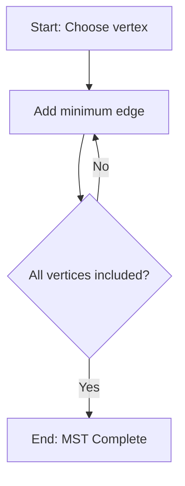
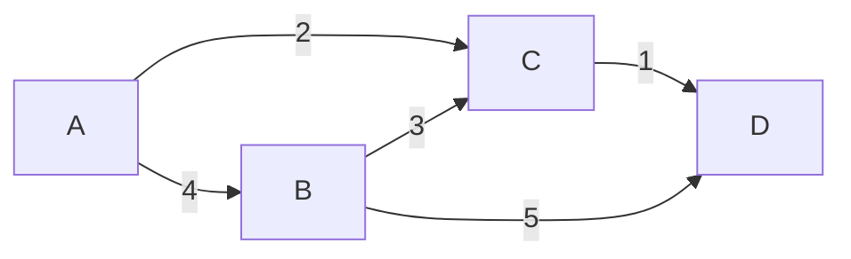

# نظرية المخططات · Graph Theory

## 📐 التعاريف الأساسية · Core Definitions

- **المخطط (Graph)**: بنية رياضية تتكون من مجموعة رؤوس $V$ ومجموعة حواف $E$، يُرمز لها بـ $G(V,E)$
- **درجة الرأس (Degree)**: عدد الحواف المتصلة بالرأس، تُرمز لها بـ $\deg(v)$ أو $d(v)$
- **المخطط الفرعي (Subgraph)**: جزء من المخطط الأصلي يحتفظ برؤوس وحواف محددة
- **الاتصال (Adjacency)**: رأسان مترابطان إذا وُجدت بينهما حافة
- **المسار (Path)**: تتابع رؤوس حيث كل زوج متتابع متجاور
- **الدورة (Cycle)**: مسار يبدأ وينتهي من نفس الرأس

## 🧮 النظريات والصيغ · Theorems & Formulas

### نظرية مصافقة الأيدي (Handshaking Lemma)
$$\sum_{v \in V} \deg(v) = 2|E|$$

**النتيجة**: عدد الرؤوس ذات الدرجة الفردية يكون زوجياً.

### نظرية أويلر للدورات (Eulerian Circuit)
مخطط متصل $G$ يحتوي دورة أويلر (تمر بكل حافة مرة واحدة بالضبط) **إذا وفقط إذا** كانت درجة كل رأس فيه زوجية:
$$\deg(v) \equiv 0 \pmod{2} \quad \forall v \in V$$

### صيغة أويلر للمخططات المستوية (Euler's Formula)
$$n - m + r = c + 1$$

حيث:
- $n$: عدد الرؤوس
- $m$: عدد الحواف
- $r$: عدد المناطق
- $c$: عدد المكونات المتصلة

### شرط المستوية (Planarity Condition)
مخطط einfacher بدون حواف متقاطعة يمكن رسمه في المستوى بدون تقاطعات إذا حقق:
$$m \leq 3n - 6 \quad \text{(لـ } n \geq 3\text{)}$$

## 🔁 الخوارزميات والعمليات · Algorithms & Processes

### 1. خوارزمية بريم لأشجار التغطية الصغرى (Prim's Algorithm)
```
1. اختر رأساً ابتدائياً arbitrary
2. أضف الحواف الأصغر وزناً من الـ frontier
3. كرر حتى تشمل جميع الرؤوس
```


**التعقيد**: $O(E \log V)$ مع استخدام heap

### 2. خوارزمية ديكسترا (Dijkstra's Algorithm)
لمسارات أقصر Weghted graphs:
```
1. المسافة الابتدائية = 0 للمصدر، = ∞ للباقي
2. اختر الرأس غير المزور بأقل مسافة
3. حدث جيرانه
4. كرر حتى الوصول للهدف أو全集 المزورة
```

**التعقيد**: $O((V+E) \log V)$

### 3. خوارزمية البحث بالعمق أولاً (DFS)
```
1. زر الرأس الحالي
2. إذا لم يُزر جيرانه، ادفع للم-stack
3. أخرج من Stack وزر следующий
```

## 🌲 الخصائص والثوابت · Properties & Invariants

- **عدد كروماتيك (Chromatic Number) $\chi(G)$**: меньше عدد الألوان اللازمة تلوين الرؤوس بدون تناقض
- **عدد الاستقلال (Independence Number) $\alpha(G)$**: الحد الأقصى للرؤوس المستقلة
- **الكفاءة (Clique Number) $\omega(G)$**: الحد الأقصى لحجم الـ clique

### المتراجحات الأساسية · Key Inequalities

$$\chi(G) \geq \omega(G)$$

$$\chi(G) \geq \frac{n}{\alpha(G)}$$

$$|E| \leq \binom{n}{2} = \frac{n(n-1)}{2} \quad \text{(للمخطط الكامل)}$$

## 📝 أمثلة محلولة · Worked Examples

### المثال 1: التحقق من وجود مسار أويلر
**المعطيات**: مخطط بـ 4 رؤوس، درجات الرؤوس: 2, 2, 2, 2

**الحل**: جميع الدرجات زوجية ← **يوجد مسار أويلر**

### المثال 2: حساب عدد المناطق لمخطط مستوي
**المعطيات**: $n=4$, $m=4$, $c=1$

**الحل**:
$$r = m - n + c + 1 = 4 - 4 + 1 + 1 = 2$$

**النتيجة**: منطقتان

### المثال 3: MST بـ خوارزمية بريم


**الحل**: الحواف المختارة: AC, CD, BC, AB
$$Weight = 2 + 1 + 3 + 4 = 10$$

## 📊 جدول مرجعي شامل · Master Reference Table

| المخطط | $|V|$ | $|E|$ | $\chi$ | مستوي؟ | ثنائي القسم؟ | $\delta_{min}$ |
|---|---|---|---|---|---|---|
| $K_1$ | 1 | 0 | 1 | نعم | نعم | 0 |
| $K_2$ | 2 | 1 | 2 | نعم | نعم | 1 |
| $K_3$ | 3 | 3 | 3 | نعم | نعم | 2 |
| $K_4$ | 4 | 6 | 4 | نعم | لا | 3 |
| $K_5$ | 5 | 10 | 5 | لا | لا | 4 |
| $K_{3,3}$ | 6 | 9 | 2 | لا | نعم | 3 |
| $W_n$ | n | n-1 | 3 | نعم | لا | 2 |
| $C_n$ | n | n | 2 | نعم | نعم | 2 |
| $P_n$ | n | n-1 | 2 | نعم | نعم | 1 |

## ⚠️ أخطاء شائعة وملاحظات · Common Pitfalls & Notes

- **ملاحظة 1**: شرط لازم ≠ شرط كافٍ. مثلاً: $m \leq 3n-6$ شرط لازم للمستوية لكن ليس كافياً
- **ملاحظة 2**: المخطط ثنائي القسم (Bipartite) إذا وفقط إذا لم يحتوِ دورة فردية
- **ملاحظة 3**: Dijkstra لا تعمل مع أوزان سلبية
- **ملاحظة 4**: BFS يعطي أقصر مسار في مخطط غير موزون

💡 **تلميح**: للتمييز بين DFS و BFS، تذكر: **D**epth = مكدس (Stack)، **B**readth = طابور (Queue)