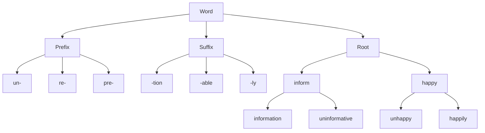
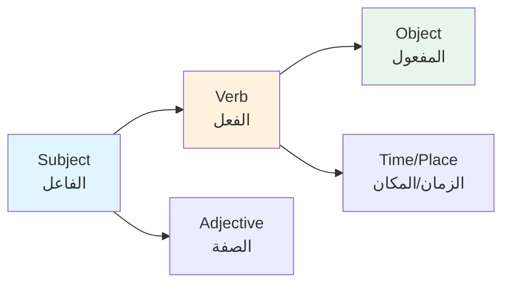
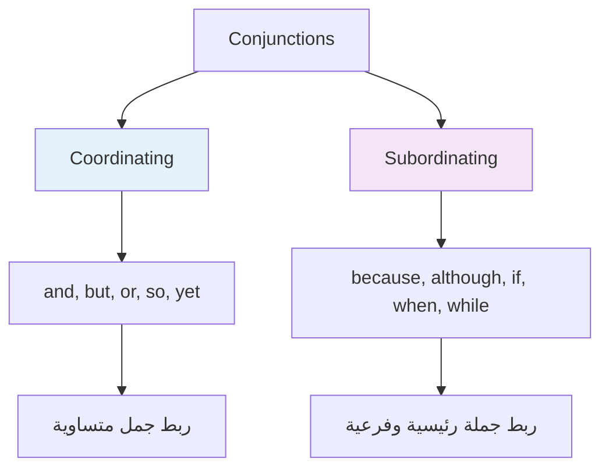

# لغة 1 · Language 1

## 📐 التعاريف الأساسية · Core Definitions

- **القواعد (Grammar)**: مجموعة القواعد التي تحكم تشكيل الجمل والكلمات في اللغة
- **المفردات (Vocabulary)**: مجموعة الكلمات التي يعرفها الشخص ويستخدمها
- **البنية الجملية (Sentence Structure)**: الترتيب الصحيح للكلمات لتكوين جملة مفيدة
- **الكلمة الفعالة (Verb)**: كلمة تدل على حدث أو حالة
- **الاسم (Noun)**: كلمة تدل على شخص أو مكان أو شيء
- **الصفة (Adjective)**: كلمة تصف الاسم وتحدد خصائصه

## 🧮 القواعد الأساسية · Basic Grammar

### أنواع الجمل · Types of Sentences

| النوع | الوصف | مثال |
|---|---|---|
| **جملة خبرية (Declarative)** | جملة تبين حقيقة | "The student studies hard." |
| **جملة استفهامية (Interrogative)** | جملة سؤال | "Where is the university?" |
| **جملة أمرية (Imperative)** | جملة أمر أو طلب | "Open your book please." |
| **جملة تعجبية (Exclamatory)** | جملة تعبر عن عاطفة | "What a beautiful day!" |

### أزمنة الفعل · Verb Tenses

| الزمن | الصيغة | الاستخدام | مثال |
|---|---|---|---|
| **الحاضر البسيط (Present Simple)** | base/V+s | حقائق، عادات | "I study English." |
| **الماضي البسيط (Past Simple)** | V+ed | أحداث ماضية | "She passed the exam." |
| **المستقبل (Future)** | will + V | أحداث مستقبلية | "They will graduate soon." |
| **الحاضر المستمر (Present Continuous)** | is/am/are + V-ing | يحدث الآن | "I am reading now." |
| **الماضي المستمر (Past Continuous)** | was/were + V-ing | كان يحدث في الماضي | "We were studying at 5 PM." |

###构词法 · Word Formation



## 📦 المفردات الأساسية · Basic Vocabulary

### كلمات الجمع · Plural Forms

| المفرد | الجمع | القاعدة |
|---|---|---|
| **book** | books | + s |
| **city** | cities | y → ies |
| **leaf** | leaves | f → v + es |
| **child** | children | تغيير كامل |
| **woman** | women | تغيير كامل |
| **mouse** | mice | تغيير كامل |

### الأفعال الشاذة · Irregular Verbs

| المصدر | الماضي | الماضي التام | المعنى |
|---|---|---|---|
| **be** | was/were | been | يكون |
| **have** | had | had | يملك |
| **do** | did | done | يفعل |
| **go** | went | gone | يذهب |
| **come** | came | came | يأتي |
| **see** | saw | seen | يرى |
| **say** | said | said | يقول |
| **get** | got | got | يحصل |
| **make** | made | made | يصنع |
| **take** | took | taken | يأخذ |

## 🔁 بنية الجملة · Sentence Structure

### الترتيب الأساسي · Basic Order

$$Subject + Verb + Object$$



### الجملة البسيطة · Simple Sentence

> **Structure**: Subject + Verb + Object + (Optional)

```cpp
// أمثلة على جمل بسيطة
"The professor teaches."           // S + V
"The student reads a book."       // S + V + O
"The university is in Damascus."  // S + V + Complement
```

### الجملة المركبة · Compound Sentence

> **Structure**: Simple + Conjunction + Simple

$$Simple_1 + (and/or/but/so) + Simple_2$$

| الرابط | الوظيفة | مثال |
|---|---|---|
| **and** | إضافة | "I study and work." |
| **but** | تعارض | "She is smart but lazy." |
| **or** | اختيار | "Study hard or fail." |
| **so** | نتيجة | "It rained, so we stayed." |

### الجملة الشرطية · Conditional Sentence

| النوع | الصيغة | الاستخدام |
|---|---|---|
| **الصفر (Zero)** | If + present, present | حقائق عامة |
| **الأول (First)** | If + past, will + V | احتمال حقيقي |
| **الثاني (Second)** | If + past perfect, would + V | احتمال بعيد |
| **الثالث (Third)** | If + past perfect, would have + V | ماضي مستحيل |

## 🧮 الأفعال المساعدة · Auxiliary Verbs

### أفعال التعجب · Modal Verbs

| الفعل | الوظيفة | مثال |
|---|---|---|
| **can** | قدرة | "I can speak English." |
| **could** | قدرة ماضية | "She could read at age 3." |
| **may** | إذن/احتمال | "May I help you?" |
| **must** | وجوب | "You must study." |
| **should** | نصيحة | "You should review." |
| **will** | مستقبل/عرض | "I will help you." |

### أدوات الربط · Conjunctions



## 📝 أمثلة محلولة · Worked Examples

### المثال 1: تحويل زمن الفعل

**المطلوب**: ضع الفعل بين أقواس في الزمن المناسب

> "Yesterday, I ___ (go) to the university."

$$Answer: "Yesterday, I went to the university."$$

### المثال 2: تصحيح الجملة

**المطلوب**: صحح الأخطاء

> "She don't knows the answer."

$$Answer: "She doesn't know the answer."$$

### المثال 3: تكوين جملة من الكلمات

**المطلوب**: رتب الكلمات لجملة صحيحة

> "studies / computer / The / student / science"

$$Answer: "The student studies computer science."$$

## 📊 جدول مرجعي شامل · Master Reference Table

| المفهوم | الإنجليزية | بالعربية |
|---|---|---|
| الفاعل | Subject | من يفعل |
| المفعول | Object | من يتأثر |
| الفعل | Verb | الحدث |
| الصفة | Adjective | الوصف |
| الظرف | Adverb | كيفية الحدث |
| الجملة البسيطة | Simple Sentence | جملة واحدة |
| الجملة المركبة | Compound Sentence | جملتين برابط |
| الجملة Complex | Complex Sentence | جملة رئيسية + فرعية |
| رابط التسلسل | Conjunction | و / أو / لكن |
| أداة التعجب | Modal Verb | can, must, should |

## ⚠️ أخطاء شائعة وملاحظات · Common Pitfalls & Notes

- **الخلط بين الفعل المساعد والفعل الرئيسي**: "She doesn't *go*" وليس "She doesn't *goes*"
- **نسيان حرف الـ s مع he/she/it**: "He *studies*" وليس "He *study*"
- **استخدام continuous مع 상태 verbs**: لا نقول "I am *knowing*" بل "I *know*"
- **Place of adjectives**: الصفة قبل الاسم "beautiful flowers" وليس "flowers beautiful"
- **أخطاء التشكيل الشائعة**: 
  - "There/Their/They're" → هناك/لهم/هم
  - "Your/You're" → لك/أنت
  - "Its/It's" →له/إنه

💡 **تلميح**: تذكر قاعدة **S-V-O** لتسلسل الجملة الإنجليزية: الفاعل → الفعل → المفعول

💡 **تلميح2**: لأزمنة الفعل، انتبه لـ:
- **Simple**: عادة أو حقيقة
- **Continuous**: يحدث الآن أو كان يحدث
- **Perfect**: أكتمل قبل وقت آخر

💡 **تلميح3**: الأفعال التي لا تُستخدم في Continuous:
  - **State**: be, have (تملك), know, believe, love, hate, want
  - **Perception**: see, hear, smell, feel
  - **Possession**: own, belong