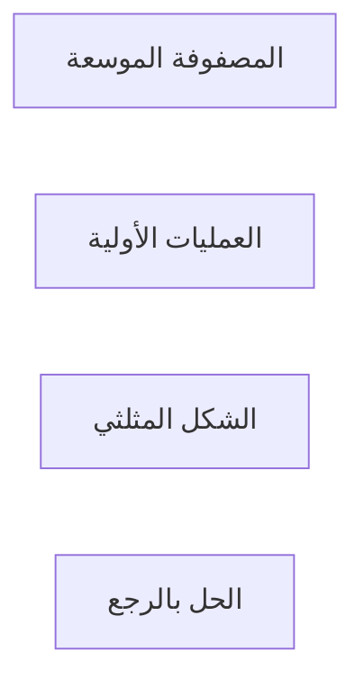

# الجبر الخطي · Linear Algebra

## 📐 المفاهيم الأساسية · Core Concepts

- **المصفوفة (Matrix)**: جدول أرقام مرتبة في صفوف وأعمدة $A_{m \times n}$
- **المتجه (Vector)**: مصفوفة أحادية العمود
- **Rank المصفوفة**: rank = عدد الأسطر أو الأعمدة المستقلة خطياً

## 🧮 العمليات على المصفوفات · Matrix Operations

### جمع المصفوفات
$$(A + B)_{ij} = a_{ij} + b_{ij}$$
$$A_{m \times n} + B_{m \times n} = C_{m \times n}$$

### ضرب المصفوفات
$$(AB)_{ik} = \sum_{j=1}^{n} a_{ij} b_{jk}$$
$$A_{m \times n} \times B_{n \times p} = C_{m \times p}$$

## 🔁 المحددات · Determinants

### حساب المحدد (2×2)
$$
\begin{vmatrix} a & b \\ c & d \end{vmatrix} = ad - bc
$$

### حساب المحدد (3×3)
$$
\begin{vmatrix} a & b & c \\ d & e & f \\ g & h & i \end{vmatrix} = a(ei - fh) - b(di - fg) + c(dh - eg)
$$

## 📊_properties_

| الخاصية | الصيغة |
|--------|---------|
| $|A^T| = |A|$ | المتماثل |
| $|AB| = |A| \cdot |B|$ | الضرب |
| $|A^{-1}| = \frac{1}{\|A\|}$ | معكوس |

## 🌲 الأنظمة الخطية · Linear Systems

### طريقة كرامر (Cramer's Rule)
$$x_i = \frac{|A_i|}{|A|}$$

### طريقة Gauss

## ⚠️ أخطاء شائعة

- **خطأ 1**: ضرب مصفوفتين غير متوافقتين ($n \neq m$)
- **خطأ 2**: حساب معكوس مصفوفة مفرد (det = 0)
- **خطأ 3**: عدم التحقق من أبعاد المصفوفة

💡 **تلميح**: $|AB| \neq |A| \cdot |B|$ بل $|AB| = |A| \cdot |B|$