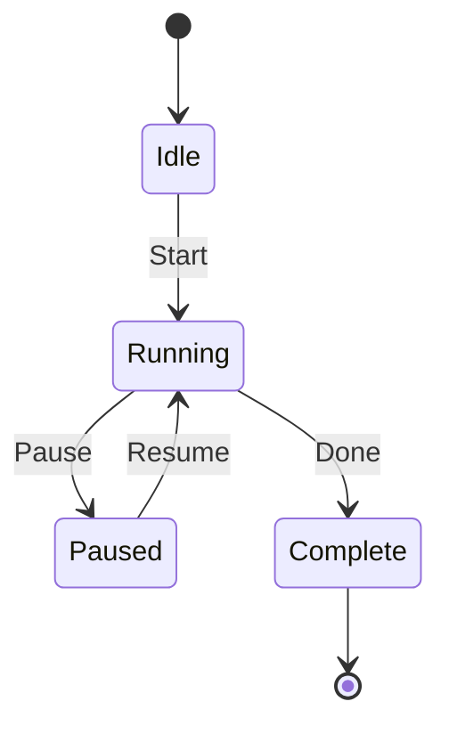
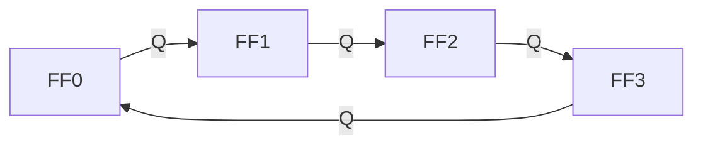
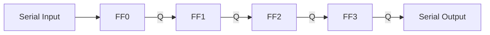

# دارات منطقية · Logic Circuits

## 📐 المفاهيم الأساسية · Core Concepts

- **الجبر البولياني (Boolean Algebra)**: نظام جبري للمتغيرات الثنائية ($0$، $1$)
- **البوابات المنطقية (Logic Gates)**: دوائر إلكترونية تنفذ عمليات بوليانية
- **الدوائر التوافقية (Combinational Circuits)**: مخرجات تعتمد على المدخلات الحالية فقط
- **الدوائر التسلسلية (Sequential Circuits)**: مخرجات تعتمد على المدخلات الحالية والسابقة

---

## 🔢 الجبر البولياني · Boolean Algebra

### العمليات الأساسية · Basic Operations

#### AND (الضرب المنطقي):
$$F = A \cdot B = A \land B = A \times B$$

#### OR (الجمع المنطقي):
$$F = A + B = A \lor B$$

#### NOT (النفي):
$$F = \overline{A} = A' = \lnot A$$

### القوانين · Laws

#### قانون الهوية:
$$A + 0 = A \quad,\quad A \cdot 1 = A$$

#### قانون الصفر:
$$A + 1 = 1 \quad,\quad A \cdot 0 = 0$$

#### قانون idempotent:
$$A + A = A \quad,\quad A \cdot A = A$$

#### قانون المتمم:
$$A + \overline{A} = 1 \quad,\quad A \cdot \overline{A} = 0$$

#### قانون التبادل:
$$A + B = B + A \quad,\quad AB = BA$$

#### قانون التجميع:
$$(A + B) + C = A + (B + C)$$
$$(AB)C = A(BC)$$

#### قانون التوزيع:
$$A(B + C) = AB + AC$$
$$A + BC = (A + B)(A + C)$$

#### قوانين دي مورغان:
$$\overline{A + B} = \overline{A} \cdot \overline{B}$$
$$\overline{A \cdot B} = \overline{A} + \overline{B}$$

---

## 🚪 البوابات المنطقية · Logic Gates

### بوابات أساسية · Basic Gates

```
AND Gate:  F = A · B
OR Gate:   F = A + B
NOT Gate:  F = A'
```

### جدول الحقيقة · Truth Table

| A | B | AND ($A \cdot B$) | OR ($A + B$) | NAND | NOR | XOR | XNOR |
|---|---|-------------------|--------------|------|-----|-----|-----|
| 0 | 0 | 0 | 0 | 1 | 1 | 0 | 1 |
| 0 | 1 | 0 | 1 | 1 | 0 | 1 | 0 |
| 1 | 0 | 0 | 1 | 1 | 0 | 1 | 0 |
| 1 | 1 | 1 | 1 | 0 | 0 | 0 | 1 |

### بوابات مشتقة · Derived Gates

#### NAND (بوابة NAND):
$$F = \overline{A \cdot B}$$

#### NOR (بوابة NOR):
$$F = \overline{A + B}$$

#### XOR (بوابة XOR):
$$F = A \oplus B = A\overline{B} + \overline{A}B$$

#### XNOR (بوابة XNOR):
$$F = \overline{A \oplus B} = AB + \overline{A}\overline{B}$$

### رموز البوابات · Gate Symbols

| البوابة | الرمز | المعادلة | الاستخدام |
|---------|------|-----------|-----------|
| AND | & | $F = AB$ | شرط all inputs |
| OR | ≥1 | $F = A+B$ | شرط أي input |
| NOT | 1 | $F = A'$ | inverter |
| NAND | &̄ | $F = \overline{AB}$ | universal gate |
| NOR | ≥1̄ | $F = \overline{A+B}$ | universal gate |
| XOR | =1 | $F = A\oplus B$ | parity check |
| XNOR | =1̄ | $F = \overline{A\oplus B}$ | equality |

---

## 🗺️ خرائط كارنوف · Karnaugh Maps

### التعريف · Definition

طريقة بصرية لتبسيط الدوال البوليانية باستخدام خرائط ($K$-maps)

### أحجام الخرائط · Map Sizes

- **2 متغيرات**: خريطة $2 \times 2$
- **3 متغيرات**: خريطة $2 \times 4$
- **4 متغيرات**: خريطة $4 \times 4$

### مثال: خريطة $2 \times 2$

```
        AB
        00   01   11   10
    +----+----+----+----+
 C=0|  0 |  1 |  1 |  0 |
    +----+----+----+----+
 C=1|  1 |  0 |  0 |  1 |
    +----+----+----+----+
```

### طريقة التبسيط:

1. **ارسم الخريطة** حسب عدد المتغيرات
2. **ضع الـ 1s** في الخلايا المناسبة
3. **جمّع الـ 1s** في مجموعات ($1, 2, 4, 8$)
4. **احذف المتغيرات** التي تتغير بين الـ 1s في المجموعة
5. **اكتب الحد الأدنى** لكل مجموعة

### groupings:

- مجموعة من $2^n$ خلية
- الـ cells يجب أن تكون متجاورة (أفقياً أو عمودياً)
- يمكن أن تتداخل المجموعات
- المجموعات يمكن أن تتجاوز حدود الخريطة

### مثال على التبسيط:

دالة مجموع ($F = \sum m(1,3,5,6,7)$):

$$F = \overline{A}B + B\overline{C} + \overline{A}C$$

يمكن تبسيطها إلى:

$$F = B + C$$

---

## 🔗 الدوائر التوافقية · Combinational Circuits

### التعريف · Definition

دوائر_output يعتمد على المدخلات الحالية فقط، بدون ذاكرة

### أنواع الدوائر التوافقية:

```
المُكثفات (Multiplexers/MUX)
المُفككات (Demultiplexers/DEMUX)
المُشفرات (Encoders)
المُفككات (Decoders)
المُجمعات (Adders)
المُطالعات (Comparators)
```

### المُجمّع الكامل · Full Adder

#### المدخلات:
- $A$, $B$: بتات الجمع
- $C_{in}$: الحمل الداخل

#### المخرجات:
- $S$: المجموع
- $C_{out}$: الحمل الخارج

#### المعادلات:

$$S = A \oplus B \oplus C_{in}$$

$$C_{out} = AB + C_{in}(A \oplus B)$$

### المُجمّع النصفي · Half Adder

$$S = A \oplus B$$
$$C = AB$$

### المُكثف (MUX):

$$F = \overline{S_1} \cdot \overline{S_0} \cdot I_0 + \overline{S_1} \cdot S_0 \cdot I_1 + S_1 \cdot \overline{S_0} \cdot I_2 + S_1 \cdot S_0 \cdot I_3$$

---

## 🔄 الدوائر التسلسلية · Sequential Circuits

### التعريف · Definition

دوائر ذات ذاكرة، المخرجات تعتمد على المدخلات الحالية والسابقة

### الفرق بين التوافقي والتسلسلي:

|因素|دائرة توافقية|دائرة تسلسلية|
|----|---------------|-------------|
| الذاكرة | لا | نعم |
| المخرجات | مدخلات فقط | مدخلات + الحالة السابقة |
| التعقيد | أقل | أكثر |
| التصميم | Boolean algebra | state diagrams |

### مخطط الحالة · State Diagram



---

## 🗄️ القلابات · Flip-Flops

### التعريف · Definition

عناصر ذاكرة ثنائية تحتفظ بحالة (state) واحد

### أنواع القلابات:

#### RS Flip-Flop:

$$Q_{next} = S + \overline{R}Q$$

Restrictions: $SR = 0$ (لا يمكن أن يكون $S=R=1$)

#### JK Flip-Flop:

$$Q_{next} = J\overline{Q} + \overline{K}Q$$

#### D Flip-Flop:

$$Q_{next} = D$$

#### T Flip-Flop:

$$Q_{next} = T\overline{Q} + \overline{T}Q$$

### جدول الحقيقة · Truth Tables

#### RS Flip-Flop:

| R | S | Q(t+1) |
|---|---|--------|
| 0 | 0 | Q(t) |
| 0 | 1 | 1 |
| 1 | 0 | 0 |
| 1 | 1 | محظور |

#### JK Flip-Flop:

| J | K | Q(t+1) |
|---|---|--------|
| 0 | 0 | Q(t) |
| 0 | 1 | 0 |
| 1 | 0 | 1 |
| 1 | 1 | Q'(t) |

#### D Flip-Flop:

| D | Q(t+1) |
|---|--------|
| 0 | 0 |
| 1 | 1 |

#### T Flip-Flop:

| T | Q(t+1) |
|---|--------|
| 0 | Q(t) |
| 1 | Q'(t) |

### مدخلات التحكم:

- **Clock (CLK)**: إشارة التزامن
- **Preset (PR)**: ضبط القيمة الابتدائية
- **Clear (CLR)**: مسح القيمة

---

## 🔢 العدادات · Counters

### التعريف · Definition

دوائر تسلسلية Produce تسلسل محدد من الحالات

### أنواع العدادات:

#### عداد تصاعدي (Up Counter):

$$0000 \rightarrow 0001 \rightarrow 0010 \rightarrow \cdots \rightarrow 1111 \rightarrow 0000$$

#### عداد تنازلي (Down Counter):

$$1111 \rightarrow 1110 \rightarrow 1101 \rightarrow \cdots \rightarrow 0000 \rightarrow 1111$$

#### عداد ثنائي-عشري (BCD Counter):

$$0000 \rightarrow 0001 \rightarrow \cdots \rightarrow 1001 \rightarrow 0000$$

### عداد JK:

```
العداد يستخدم JK Flip-Flops
كل flip-flop يستقبل clock منPrevious
 Q --> J,K (المقبل) مع Toggle when Q' = 1
```

### جدول_states للعداد (4-bit):

| State | Q3 | Q2 | Q1 | Q0 |
|-------|----|----|----|----|
| 0 | 0 | 0 | 0 | 0 |
| 1 | 0 | 0 | 0 | 1 |
| 2 | 0 | 0 | 1 | 0 |
| 3 | 0 | 0 | 1 | 1 |
| 4 | 0 | 1 | 0 | 0 |
| ... | ... | ... | ... | ... |
| 15 | 1 | 1 | 1 | 1 |

### عداد حلقي (Ring Counter):



---

## 📦 السجلات · Registers

### التعريف · Definition

مجموعة من Flip-Flops لتخزينWords متعدد

### أنواع السجلات:

#### سجل الإزاحة (Shift Register):

```
Input --> FF0 --> FF1 --> FF2 --> FF3 --> Output
```

#### سجل التوازي (Parallel Register):

```
Input0 --> FF0 --> Output0
Input1 --> FF1 --> Output1
Input2 --> FF2 --> Output2
Input3 --> FF3 --> Output3
```

### عمليات السجل:

| العملية | الوصف |
|---------|-------|
| Load | تحميل البيانات |
| Shift Right | إزاحة يمين |
| Shift Left | إزاحة يسار |
| Clear | مسح البيانات |
| Preset | ضبط القيمة |

### مخطط سجل إزاحة:



---

## 📊 جدول البوابات · Gates Table

| البوابة | المدخلات | المخرجات | الصيغة |
|---------|----------|-----------|--------|
| NOT | 1 | 1 | $F = A'$ |
| AND | 2+ | 1 | $F = AB$ |
| OR | 2+ | 1 | $F = A+B$ |
| NAND | 2+ | 1 | $F = \overline{AB}$ |
| NOR | 2+ | 1 | $F = \overline{A+B}$ |
| XOR | 2 | 1 | $F = A\oplus B$ |
| XNOR | 2 | 1 | $F = \overline{A\oplus B}$ |

---

## 💡 حل المسائل · Problem Solving

### Steps for Combinational Circuits:

1. **حدد المدخلات والمخرجات**
2. **اكتب جدول الحقيقة** (إن لزم)
3. **اكتب المعادلة البوليانية**
4. **طبّق قوانين التبسيط** (Boolean algebra, K-map)
5. **ارسم الدائرة** باستخدام البوابات

### Steps for Sequential Circuits:

1. **ارسم مخطط الحالة** (State Diagram)
2. **حدد جدول الحالة** (State Table)
3. **اختر Flip-Flops** المناسبة
4. **صمم الـ Excitation Table**
5. **ارسم الدائرة**

### Steps for Counter Design:

1. **حدد نوعالعداد** (Up, Down, Mod-N)
2. **حدد.number of Flip-Flops**
3. **ارسم جدول الحالة**
4. **صمم الـ excitation logic**
5. **تحقق من الـ states غير المُستخدمة**

---

## 🧮 معادلات مهمة · Important Equations

### Boolean Algebra:

```
AND: F = A·B
OR:  F = A+B
NOT: F = A'
```

### De Morgan:

```
NOT(A+B) = A'·B'
NOT(A·B) = A'+B'
```

### XOR/XNOR:

```
XOR:  F = A⊕B = AB' + A'B
XNOR: F = (A⊕B)' = AB + A'B'
```

### Half Adder:

```
S = A⊕B
C = AB
```

### Full Adder:

```
S = A⊕B⊕Cin
Cout = AB + Cin(A⊕B)
```

### Flip-Flops:

```
RS:  Q+ = S + R'Q
JK:  Q+ = JQ' + K'Q
D:   Q+ = D
T:   Q+ = T⊕Q
```

---

## ⚠️ أخطاء شائعة وملاحظات · Common Pitfalls

### أخطاء Boolean Algebra:

- **خطأ 1**: الخلط بين OR (+) و AND (·)
- **خطأ 2**: نسيان تطبيق قوانين دي مورغان
- **خطأ 3**: استخدام $A + AB = A$ (خطأ - correct is $A + B$)
- **خطأ 4**: استخدام $A + A' = 0$ (خطأ - correct is $1$)

### أخطاء البوابات:

- **خطأ 5**: remembering NAND كuniversal gate (يمكن بناء أي بوابة)
- **خطأ 6**: الخلط بين XOR و XNOR
- **خطأ 7**: نسيان أن بوابة NOT تحتاج inverter

### أخطاء K-Maps:

- **خطأ 8**: grouping غير المتجاورة cells
- **خطأ 9**: grouping太小 (أحجام غير $2^n$)
- **خطأ 10**: نسيان أن الخريطة.wrap around

### أخطاء Flip-Flops:

- **خطأ 11**: RS مع $S=R=1$ (محظور!)
- **خطأ 12**: نسيان Clock signal
- **خطأ 13**: الخلط بين synchronous و asynchronous inputs

### أخطاء العدادات:

- **خطأ 14**: نسيان unused states
- **خطأ 15**: تصميم غير صحيح للـ modulo
- **خطأ 16**:Synchronization problems

### ملاحظات مهمة:

💡 **ملاحظة 1**: NAND و NOR هما universal gates - يمكن بناء أي دائرة

💡 **ملاحظة 2**: XOR تُستخدم للـ parity detection

💡 **ملاحظة 3**: K-map أفضل من Boolean لتبسيط الدوال

💡 **ملاحظة 4**: Flip-Flop يتغير على edge وليس level من الـ clock

💡 **ملاحظة 5**: عداد $N$ يحتاج $ \lceil \log_2 N \rceil $ flip-flops

💡 **تلميح**: في Sequential circuits، تحقق من جميع الـ states

---

*دارات منطقية - Year 2 Semester 2*

(End of file - total 376 lines)