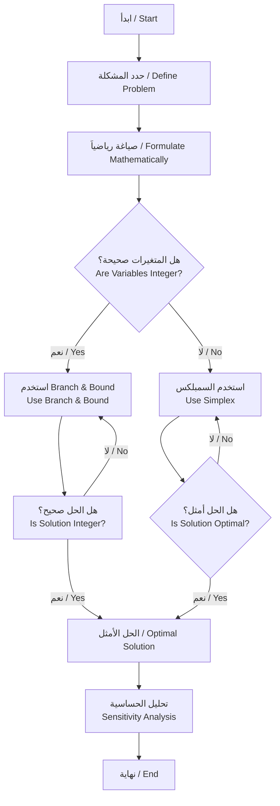

# برمجة رياضية (Mathematical Programming)

## Year 2, Semester 1

---

## 1. مقدمة في البرمجة الخطية (Introduction to Linear Programming)

### 1.1 تعريف البرمجة الخطية (Definition)

البرمجة الخطية هي طريقة رياضية لإيجاد أفضل نتيجة في نموذج رياضي متطلباته ممثلة بمتراجحات خطية. الهدف هو تعظيم أو تقليل دالة خطية خاضع لمجموعة من القيود.

> Linear programming is a mathematical method for finding the best outcome in a mathematical model whose requirements are represented by linear relationships. The goal is to maximize or minimize a linear function subject to a set of constraints.

### 1.2 الصيغة العامة (General Form)

$$\text{Maximize/Minimize} \quad Z = c_1x_1 + c_2x_2 + \cdots + c_nx_n$$

$$\text{Subject to:}$$

$$
\begin{aligned}
a_{11}x_1 + a_{12}x_2 + \cdots + a_{1n}x_n &\leq b_1 \\
a_{21}x_1 + a_{22}x_2 + \cdots + a_{2n}x_n &\leq b_2 \\
\vdots \\
a_{m1}x_1 + a_{m2}x_2 + \cdots + a_{mn}x_n &\leq b_m \\
x_1, x_2, \ldots, x_n &\geq 0
\end{aligned}
$$

### 1.3 الصيغة المعيارية (Standard Form)

$$\text{Maximize} \quad Z = \mathbf{c}^T \mathbf{x}$$

$$\text{Subject to:} \quad \mathbf{A}\mathbf{x} \leq \mathbf{b}, \quad \mathbf{x} \geq \mathbf{0}$$

---

## 2. طريقة السمبلكس (Simplex Method)

### 2.1 مفهوم طريقة السمبلكس (Concept)

طريقة السمبلكس هي خوارزمية للتعامل مع مشاكل البرمجة الخطية. ابتكرها جورج دانتزغ في عام 1947. الفكرة الأساسية هي الانتقال من قمة رؤوسية إلى أخرى في المضلع feasibility حتى الوصول إلى الحل الأمثل.

> The Simplex Method is an algorithm for solving linear programming problems. It was invented by George Dantzig in 1947. The basic idea is to move from one vertex to another in the feasibility polygon until reaching the optimal solution.

### 2.2 خطوات الطريقة (Steps)

| الخطوة | الوصف / Description |
|--------|---------------------|
| 1 | تحويل المشكلة إلى الصيغة المعيارية / Convert problem to standard form |
| 2 | إضافة متغيرات الفائض (Slack Variables) / Add slack variables |
| 3 | إنشاء جدول السمبلكس الأولي / Create initial simplex table |
| 4 | تحديد العمود المحوري (Pivot Column) / Determine pivot column |
| 5 | تحديد الصف المحوري (Pivot Row) / Determine pivot row |
| 6 | إجراء عمليات Gauss-Jordan / Perform Gauss-Jordan operations |
| 7 | التحقق من optimality / Check for optimality |
| 8 | التكرار حتى الوصول للحل الأمثل / Repeat until optimal solution |

### 2.3 جدول السمبلكس (Simplex Table)

```
┌─────────────┬──────────────┬────────────┬─────┬─────┬─────┐
│     CB      │      XB      │     b      │ x₁  │ x₂  │ x₃  │
├─────────────┼──────────────┼────────────┼─────┼─────┼─────┤
│     0       │      s₁      │     b₁     │ a₁₁ │ a₁₂ │ a₁₃ │
│     0       │      s₂      │     b₂     │ a₂₁ │ a₂₂ │ a₂₃ │
│    c₃       │      x₃      │     b₃     │ a₃₁ │ a₃₂ │ a₃₃ │
├─────────────┼──────────────┼────────────┼─────┼─────┼─────┤
│     Zj      │              │     Z      │ c₁-z₁│c₂-z₂│     │
└─────────────┴──────────────┴────────────┴─────┴─────┴─────┘
```

### 2.4 معايير اختيار العمود والصف المحوري (Pivot Selection Criteria)

**العمود المحوري (Pivot Column):**
- اختر العمود ذو القيمة الموجبة الأكبر في صف Z (لمسألة تعظيم)
- اختر العمود ذو القيمة السالبة الأصغر في صف Z (لمسألة تقليل)

> Choose the column with the largest positive value in the Z row (for maximization).

**الصف المحوري (Pivot Row):**
- اختر الصف ذو أصغر نسبة موجبة: $\theta = \frac{b_i}{a_{ij}}$

> Choose the row with the smallest positive ratio: $\theta = \frac{b_i}{a_{ij}}$

### 2.5 مثال تطبيقي (Example)

**المشكلة / Problem:**

$$\text{Maximize} \quad Z = 3x_1 + 2x_2$$

$$\text{Subject to:}$$
$$
\begin{aligned}
x_1 + x_2 &\leq 8 \\
2x_1 + x_2 &\leq 12 \\
x_1, x_2 &\geq 0
\end{aligned}
$$

**الحل / Solution:**

1. **أضف متغيرات الفائض / Add slack variables:**
   $$
   \begin{aligned}
   x_1 + x_2 + s_1 &= 8 \\
   2x_1 + x_2 + s_2 &= 12
   \end{aligned}
   $$

2. **جدول السمبلكس الأولي / Initial Simplex Table:**

| CB | XB |  b  | x₁ | x₂ | s₁ | s₂ | θ   |
|----|----|-----|----|----|----|----|-----|
| 0  | s₁ |  8  | 1  | 1  | 1  | 0  |  8  |
| 0  | s₂ | 12  | 2  | 1  | 0  | 1  |  6  |
|    | Z  |  0  | -3 | -2 | 0  | 0  |     |

3. **العمود المحوري: x₁ (لأن -3 هي الأصغر) / Pivot Column: x₁**

4. **الصف المحوري: s₂ (لأن 6 < 8) / Pivot Row: s₂**

5. **بعد التحويل / After transformation:**

| CB | XB |  b   | x₁ | x₂ | s₁ | s₂ | θ   |
|----|----|------|----|----|----|----|-----|
| 0  | s₁ |  2   | 0  | 0.5| 1  | -0.5|  4  |
| 3  | x₁ |  6   | 1  | 0.5| 0  | 0.5 | 12  |
|    | Z  |  18  | 0  | -0.5| 0  | 1.5 |     |

6. **الحل الأمثل / Optimal Solution:**
   - $x_1 = 6$, $x_2 = 0$
   - $Z_{max} = 18$

---

## 3. النظرية الثنائية (Duality Theory)

### 3.1 تعريف الثنائية (Definition)

كل مسألة برمجة خطية لها مسألة ثنائية مرتبطة بها. الحل الأمثل للمشكلة الثنائية يعطي معلومات عن الحل الأمثل للمشكلة الأصلية.

> Every linear programming problem has a dual problem. The optimal solution of the dual provides information about the optimal solution of the primal.

### 3.2 الصيغة الثنائية (Dual Form)

**المشكلة الأصلية (Primal):**
$$\text{Maximize} \quad Z = \mathbf{c}^T\mathbf{x}$$
$$\text{Subject to:} \quad \mathbf{A}\mathbf{x} \leq \mathbf{b}, \quad \mathbf{x} \geq \mathbf{0}$$

**المشكلة الثنائية (Dual):**
$$\text{Minimize} \quad W = \mathbf{b}^T\mathbf{y}$$
$$\text{Subject to:} \quad \mathbf{A}^T\mathbf{y} \geq \mathbf{c}, \quad \mathbf{y} \geq \mathbf{0}$$

### 3.3 العلاقات بين المشكلتين (Relations)

| الخاصية / Property | الأصلية (Primal) | الثنائية (Dual) |
|-------------------|-----------------|----------------|
|Objective / الهدف | Maximize | Minimize |
|Constraints / القيود | ≤ | ≥ |
|Variables / المتغيرات | ≥ 0 | Unrestricted |

### 3.4 نظريات الثنائية (Duality Theorems)

**نظرية الثنائية الضعيفة (Weak Duality):**
$$\mathbf{c}^T\mathbf{x} \leq \mathbf{b}^T\mathbf{y}$$

> The objective value of any feasible primal solution is less than or equal to any feasible dual solution.

**نظرية الثنائية القوية (Strong Duality):**
إذا كان $\mathbf{x}^*$ و $\mathbf{y}^*$ حلولاً مثالية:
$$\mathbf{c}^T\mathbf{x}^* = \mathbf{b}^T\mathbf{y}^*$$

> If both primal and dual have feasible solutions, they have optimal solutions with equal objective values.

### 3.5 استخدامات الثنائية (Applications)

1. **التحقق من الحلول / Solution Verification**
2. **الحساسية Sensitivity Analysis**
3. **التعامل مع مشاكل التعظيم / Handling Maximization Problems**
4. **التفسير الاقتصادي / Economic Interpretation**

---

## 4. البرمجة الصحيحة (Integer Programming)

### 4.1 تعريف (Definition)

البرمجة الصحيحة هي حالة خاصة من البرمجة الخطية حيث تتطلب بعض أو كل المتغيرات أن تكون أعداداً صحيحة.

> Integer programming is a special case of linear programming where some or all variables must be integers.

### 4.2 الأنواع (Types)

| النوع / Type | الوصف / Description |
|--------------|---------------------|
| Pure Integer | جميع المتغيرات صحيحة / All variables are integers |
| Mixed Integer | بعض المتغيرات صحيحة / Some variables are integers |
| Binary | متغيرات صفرية أو واحدية / Variables are 0 or 1 |

### 4.3 طرق الحل (Solution Methods)

#### 4.3.1 طريقة التفريع والتقييد (Branch and Bound)

```
┌─────────────────────────────────────┐
│        Branch and Bound             │
├─────────────────────────────────────┤
│ 1. حل المشكلة الخطية المسترخلة      │
│    Solve relaxed LP                 │
│                                     │
│ 2. إذا كانت الحل غير صحيح          │
│    If solution not integer:         │
│    -Branch: قسّم المشكلة            │
│                                     │
│ 3.Bound: احسب الحدود                │
│    Calculate bounds                 │
│                                     │
│ 4. إذا كان الحد أدنى > current best │
│    If lower bound > current best:   │
│    -Prune: تخطى هذا الفرع           │
│    -Skip this branch                │
└─────────────────────────────────────┘
```

#### 4.3.2 طريقة القطع (Cutting Plane Method)

أضف قيود جديدة لتقريب الحل الصحيح تدريجياً.

> Add new constraints to gradually approximate the integer solution.

### 4.4 مشكلة الحقيبة (Knapsack Problem)

$$\text{Maximize} \quad Z = \sum_{j=1}^{n} p_j x_j$$

$$\text{Subject to:} \quad \sum_{j=1}^{n} w_j x_j \leq W$$

$$x_j \in \{0, 1\}$$

---

## 5. تحليل الحساسية (Sensitivity Analysis)

### 5.1 مفهوم التحليل الحدسي (Concept)

تحليل الحساسية يدرس كيف تتأثر الحل الأمثل بالتغييرات في معاملات المشكلة.

> Sensitivity analysis studies how the optimal solution is affected by changes in problem coefficients.

### 5.2 أنواع التغييرات (Types of Changes)

1. **تغيير右侧 (Right-hand Side Changes):**
   $$\Delta b_i \rightarrow \text{New shadow price}$$

2. **تغيير معاملات الدالة الهدف (Objective Coefficient Changes):**
   $$\Delta c_j \rightarrow \text{New optimal solution}$$

3. **إضافة قيود جديدة (Adding New Constraints):**
   Check feasibility and optimality

### 5.3 نطاق المعقولية (Range of Optimality)

$$c_j - \Delta c_j \leq c_j \leq c_j + \Delta c_j$$

> The range of values for objective coefficients where the current basis remains optimal.

### 5.4 أسعار الظل (Shadow Prices)

السعر الظل هو معدل تغير الدالة الهدف عند تغيير右侧 بمقدار وحدة واحدة.

> The shadow price is the rate of change in the objective function when the right-hand side is increased by one unit.

---

## 6. انسياب البرمجة الخطية (Linear Programming Flow)



---

## 7. الأخطاء الشائعة (Common Pitfalls)

### 7.1 أخطاء الصياغة (Formulation Errors)

| الخطأ / Error | الوصف / Description | الحل / Solution |
|---------------|---------------------|-----------------|
|Wrong inequality direction | اتجاه المتراجحة خاطئ | تحقق من ظروف المشكلة |
|Missing non-negativity | نسيان شرط غير السالبية | أضف $x_i \geq 0$ |
|Incorrect units | وحدات خاطئة | تأكد من اتساق الوحدات |

### 7.2 أخطاء طريقة السمبلكس (Simplex Method Errors)

| الخطأ / Error | الوصف / Description | الحل / Solution |
|---------------|---------------------|-----------------|
|Wrong pivot selection | اختيار محوري خاطئ | اتبع قواعد الاختيار |
|Arithmetic mistakes | أخطاء حسابية | راجع الحسابات |
|Ignoring negative b | تجاهل b السالب | تأكد من $b_i \geq 0$ |

### 7.3 أخطاء الثنائية (Duality Errors)

| الخطأ / Error | الوصف / Description | الحل / Solution |
|---------------|---------------------|-----------------|
|Reversing max/min | عكس التعظيم/التقليل | تحقق من نوع المشكلة |
|Wrong inequality direction | اتجاه المتراجحة خاطئ | استخدم الجدول الصحيح |
|Forgetting dual variables | نسيان المتغيرات الثنائية | أضف $y_i \geq 0$ |

### 7.4 نصائح مهمة (Important Tips)

✅ **دائماً / Always:**
- تحقق من feasibility الحل
- راجع جدول السمبلكس بعد كل تكرار
- استخدم الأسعار الظلة للتحقق

❌ **لا تفعل / Don't:**
- تقرب decimals في الحسابات
- تخطى التحقق من optimality
- تهمل شروط غير السالبية

---

## 8. ملخص القوانين (Formula Summary)

### 8.1 الصيغ الأساسية (Basic Formulas)

| الصيغة / Formula | الوصف / Description |
|------------------|--------------------|
| $Z = \sum c_j x_j$ | دالة الهدف / Objective function |
| $\sum a_{ij}x_j \leq b_i$ | القيود / Constraints |
| $x_j \geq 0$ | غير السالبية / Non-negativity |
| $\theta = b_i / a_{ij}$ | نسبة الاختبار / Test ratio |
| $Z_j = \sum c_i a_{ij}$ | قيمة Z للعمود / Z value for column |

### 8.2 شروط الأمثلية (Optimality Conditions)

- **تعظيم / Maximization:** يجب أن تكون جميع $c_j - Z_j \leq 0$
- **تقليل / Minimization:** يجب أن تكون جميع $c_j - Z_j \geq 0$

---

## 9. مراجع للتعلم (References for Learning)

### 9.1 الكتب الموصى بها (Recommended Books)

1. **"Introduction to Operations Research"** - Hillier & Lieberman
2. **"Linear Programming"** - Chvatal
3. **"Applied Mathematical Programming"** - Bradley, Hax, Magnanti

### 9.2 المواقع المفيدة (Useful Websites)

- [MathWorks - Linear Programming](https://www.mathworks.com)
- [Wikipedia - Simplex Algorithm](https://en.wikipedia.org/wiki/Simplex_algorithm)

---

## 10. تمارين للمراجعة (Review Exercises)

### تمرين 1 / Exercise 1

حل مسألة البرمجة الخطية التالية:

$$\text{Maximize} \quad Z = 5x_1 + 3x_2$$

$$\text{Subject to:}$$
$$
\begin{aligned}
x_1 + x_2 &\leq 6 \\
5x_1 + 3x_2 &\leq 15 \\
x_1, x_2 &\geq 0
\end{aligned}
$$

### تمرين 2 / Exercise 2

اكتب المشكلة الثنائية للمشكلة السابقة.

### تمرين 3 / Exercise 3

حل مسألة البرمجة الصحيحة باستخدام Branch and Bound:

$$\text{Maximize} \quad Z = 4x_1 + 5x_2$$

$$\text{Subject to:}$$
$$
\begin{aligned}
x_1 + 2x_2 &\leq 8 \\
3x_1 + 2x_2 &\leq 12 \\
x_1, x_2 &\geq 0, \text{ integer}
\end{aligned}
$$

---

**ملاحظة / Note:** هذا الملف يحتوي على مفاهيم أساسية untuk Year 2, Semester 1. للمراجعة العميقة، يُنصح بحل المزيد من التمارين من الكتب المرجعية.

> This file contains basic concepts for Year 2, Semester 1. For deeper review, solving more exercises from reference books is recommended.

---

*آخر تحديث / Last Updated: 2026*