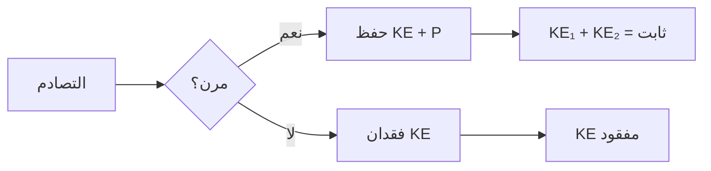

# فيزياء 1 · Physics I

## 📐 المفاهيم الأساسية · Core Concepts

- **الكينماتيكا (Kinematics)**: وصف الحركة دون النظر إلى أسبابها
- **الديناميكات (Dynamics)**: دراسة أسباب الحركة والقوى المؤثرة
- **الطاقة (Energy)**: القدرة على إنجاز شغل، تقسم إلى حركية وحرارية
- **الزخم (Momentum)**: كمية الحركة الخطية لجسم

## 🧮 الكينماتيكا · Kinematics

### الحركة في خط مستقيم

$$v = \frac{\Delta x}{\Delta t} = \frac{dx}{dt}$$

$$a = \frac{\Delta v}{\Delta t} = \frac{dv}{dt}$$

### المعادلات kinematics الأساسية

$$v = v_0 + at$$

$$x = x_0 + v_0 t + \frac{1}{2}at^2$$

$$v^2 = v_0^2 + 2a(x - x_0)$$

$$x = x_0 + \frac{1}{2}(v_0 + v)t$$

### السقوط الحر

$$y = y_0 + v_0 t + \frac{1}{2}gt^2$$

$$v^2 = v_0^2 + 2g(y - y_0)$$

where $g = 9.8 \, m/s^2$ (تسارع الجاذبية)

## 📊 جدول الكينماتيكا

| المتغير | الرمز | الوحدة | المعنى |
|---------|-------|--------|--------|
| الإزاحة | $x$ | $m$ | الموقع |
| السرعة | $v$ | $m/s$ | معدل التغير |
| التسارع | $a$ | $m/s^2$ | معدل التغير |
| الزمن | $t$ | $s$ | الوقت |

## 🔁 الديناميكات · Dynamics

### قوانين نيوتن

**القانون الأول (عطالة)**: يبقى الجسم في حالة سكون أو حركة منتظمة ما لم تؤثر فيه قوة خارجية

**القانون الثاني**:
$$\sum F = ma$$

**القانون الثالث (فعل - رد فعل)**:
$$F_{12} = -F_{21}$$

### قوة الاحتكاك

$$f_k = \mu_k N$$

$$f_s \leq \mu_s N$$

where:
- $\mu_k$: معامل الاحتكاك الحركي
- $\mu_s$: معامل الاحتكاك السكوني
- $N$: القوة العمودية

### قوة الجذب المركزي

$$F_c = \frac{mv^2}{r} = mr\omega^2$$

## 🌲 الطاقة · Energy

### الطاقة الحركية

$$K = \frac{1}{2}mv^2$$

### الطاقة الكامنة ( الثقالة )

$$U = mgh$$

### الشغل

$$W = F \cdot d \cdot \cos\theta$$

### نظرية الشغل - الطاقة

$$W_{total} = \Delta K = K_f - K_i$$

### قانون حفظ الطاقة

$$E_{total} = K + U = \text{ثابت}$$

## ⚡ الزخم · Momentum

### تعريف الزخم

$$p = mv$$

### قانون حفظ الزخم

$$\sum p_{before} = \sum p_{after}$$

### الدفع (Impulse)

$$J = \Delta p = F_{avg} \cdot \Delta t$$

### التصادمات

**مرن تماماً**:
$$v_1' = \frac{(m_1 - m_2)v_1 + 2m_2v_2}{m_1 + m_2}$$

**غير مرن تماماً**:
$$v' = \frac{m_1v_1 + m_2v_2}{m_1 + m_2}$$

## 📝 جدول العلاقات الأساسية

| المفهوم | الصيغة | القانون |
|---------|--------|---------|
| التسارع الثابت | $v = v_0 + at$ | كينماتيكا |
| الشغل | $W = Fd\cos\theta$ | ديناميكات |
| الطاقة الحركية | $K = \frac{1}{2}mv^2$ | طاقة |
| الزخم | $p = mv$ | زخم |
| القوة | $F = ma$ | نيوتن 2 |

## ⚠️ أخطاء شائعة وملاحظات

- **خطأ 1**: استخدام المسافة بدل الإزاحة في المعادلات
- **خطأ 2**: إهمال إشارة التسارع في السقوط الحر (-g)
- **خطأ 3**: الخلط بين الكتلة والوزن ($W = mg$)
- **خطأ 4**: إهمال حساب جميع أشكال الطاقة في نظام مغلق
- **خطأ 5**: الخلط بين قانون حفظ الزخم (يبقى الزخم ثابتاً) وقانون حفظ الطاقة الحركية (يصلح للتصادمات المرنة فقط)

💡 **تلميح**: في السقوط الحر، السرعة الابتدائية غالباً = 0 ما لم يُذكر خلاف ذلك

💡 **ملاحظة**: الاحتكاك السكوني أكبر دائماً من الحركي ($\mu_s > \mu_k$)

---

*فيزياء 1 - Year 1 Semester 1*
