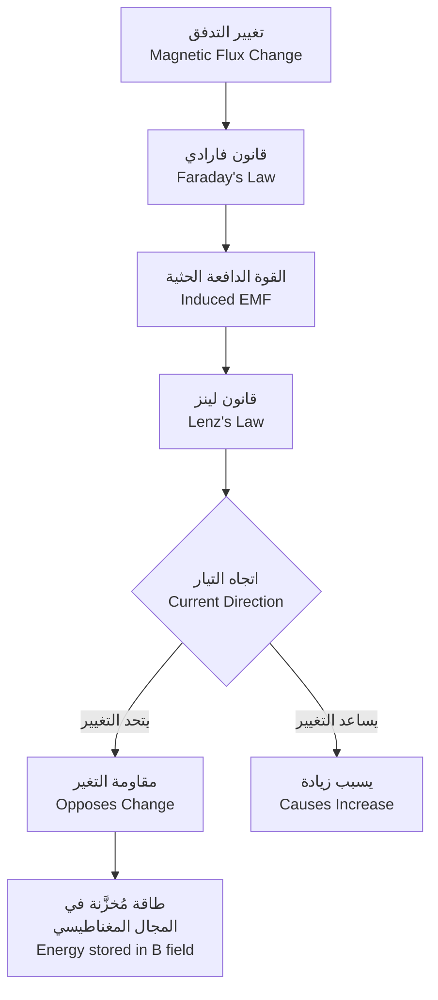

# فيزياء 2 · Physics II

## ⚡ الكهرباء الساكنة · Electrostatics

### قانون كولوم (Coulomb's Law)

القوة بين شحنتين نقطيتين:

$$F = k_e \frac{|q_1 q_2|}{r^2}$$

where:
- $k_e = 8.99 \times 10^9 \, N\cdot m^2/C^2$ (ثابت كولوم)
- $q_1, q_2$: الشحنتان (C)
- $r$: المسافة بين الشحنتين (m)

**الاتجاه**: تنافر للشحنات المتماثلة، تجاذب للمختلفة

### المجال الكهربائي (Electric Field)

تعريف المجال:

$$E = \frac{F}{q} = k_e \frac{Q}{r^2}$$

where:
- $E$: المجال الكهربائي (N/C أو V/m)
- $Q$: الشحنة المصدر
- $q$: شحنة الاختبار

### الجهد الكهربائي (Electric Potential)

**الطاقة الكامنة**:

$$U = k_e \frac{Qq}{r}$$

**الجهد**:

$$V = \frac{U}{q} = k_e \frac{Q}{r}$$

where:
- $V$: الجهد (Volt = J/C)

### العلاقة بين المجال والجهد

$$E = -\frac{dV}{dr}$$

للجهد الثابت في اتجاه واحد:

$$V = Ed$$

---

## 🔋 المكثفات · Capacitors

### سعة المكثف (Capacitance)

$$C = \frac{Q}{V}$$

where:
- $C$: السعة (Farad = F)
- $Q$: الشحنة المخزنة
- $V$: الجهد

### أنواع المكثفات

**المكثف الصفحي**:

$$C = \varepsilon_0 \frac{A}{d}$$

where:
- $\varepsilon_0 = 8.85 \times 10^{-12} \, F/m$ (سماحية الفراغ)
- $A$: المساحة (m²)
- $d$: المسافة بين الصفحتين (m)

**المكثف الكروي**:

$$C = 4\pi\varepsilon_0 \frac{r_1 r_2}{r_2 - r_1}$$

### طاقة المكثف المخزنة

$$U = \frac{1}{2}CV^2 = \frac{Q^2}{2C} = \frac{1}{2}QV$$

### ربط المكثفات

**على التوازي**:

$$C_{eq} = C_1 + C_2 + C_3$$

**على التوالي**:

$$\frac{1}{C_{eq}} = \frac{1}{C_1} + \frac{1}{C_2} + \frac{1}{C_3}$$

---

## 🔌 الكهرباء الديناميكية · Current Electricity

### قانون أوم (Ohm's Law)

$$V = IR$$

where:
- $V$: الجهد (V)
- $I$: التيار (A)
- $R$: المقاومة (Ω)

### المقاومة النوعية (Resistivity)

$$R = \rho \frac{L}{A}$$

where:
- $\rho$: المقاومة النوعية ($\Omega\cdot m$)
- $L$: الطول (m)
- $A$: المقطع (m²)

### الطاقة والقدرة

**الطاقة dissipated**:

$$W = IVt = I^2 Rt = \frac{V^2}{R}t$$

**القدرة**:

$$P = IV = I^2 R = \frac{V^2}{R}$$

---

## ⚡ دوائر التيار المستمر · DC Circuits

### قوانين كيرشوف (Kirchhoff's Laws)

**القانون الأول (توصيل العقد)**:

$$\sum I_{in} = \sum I_{out}$$

**القانون الثاني (جهد_loop)**:

$$\sum V = 0$$

### تحليل الدوائر

**مقاومة التوازي**:

$$R_{eq} = \left(\frac{1}{R_1} + \frac{1}{R_2}\right)^{-1}$$

**توزيع الجهد (Voltage Divider)**:

$$V_{out} = V_{in} \frac{R_2}{R_1 + R_2}$$

**توزيع التيار (Current Divider)**:

$$I_1 = I_{total} \frac{R_2}{R_1 + R_2}$$

### ثابت الوقت (Time Constant)

$$RC = \tau$$

**شحن المكثف**:

$$V(t) = V_0\left(1 - e^{-t/\tau}\right)$$

**تفريغ المكثف**:

$$V(t) = V_0 e^{-t/\tau}$$

---

## 🧲 المغناطيسية · Magnetism

### المجال المغناطيسي (Magnetic Field)

**قوة لورنتز (Lorentz Force)**:

$$F = qvB \sin\theta$$

where:
- $B$: المجال المغناطيسي (Tesla = T)
- $v$: سرعة الجسيم
- $\theta$: الزاوية بين $v$ و $B$

### قوة على موصل يحمل تيار

$$F = ILB \sin\theta$$

where:
- $I$: التيار (A)
- $L$: طول الموصل (m)

### قانون بيوت-سافار (Biot-Savart Law)

$$dB = \frac{\mu_0}{4\pi} \frac{I d\ell \times \hat{r}}{r^2}$$

where:
- $\mu_0 = 4\pi \times 10^{-7} \, T\cdot m/A$ (سماحية الفراغ المغناطيسية)

**ملف دائري في المركز**:

$$B = \frac{\mu_0 NI}{2r}$$

**سلك مستقيم طويل**:

$$B = \frac{\mu_0 I}{2\pi r}$$

### التدفق المغناطيسي (Magnetic Flux)

$$\Phi_B = BA \cos\theta$$

where:
- $\Phi_B$: التدفق (Weber = Wb)

---

## 📯 الحث الكهرومغناطيسي · Electromagnetic Induction

### قانون فارادي (Faraday's Law)

$$\varepsilon = -\frac{d\Phi_B}{dt}$$

where:
- $\varepsilon$: القوة الدافعة الحثية (V)

**ملف**:

$$\varepsilon = -N \frac{d\Phi_B}{dt}$$

### قانون لينز (Lenz's Law)

الاتجاه يت opposition التغير في التدفق (يتناقض مع السبب)

### الحث المتبادل (Mutual Inductance)

$$M = \frac{N_1 \Phi_{21}}{I_2} = \frac{N_2 \Phi_{12}}{I_1}$$

**القوة الدافعة**:

$$\varepsilon_1 = -M \frac{dI_2}{dt}$$

### الحث الذاتي (Self Inductance)

$$L = \frac{N\Phi}{I}$$

**القوة الدافعة**:

$$\varepsilon = -L \frac{dI}{dt}$$

### طاقة المجال المغناطيسي

$$U = \frac{1}{2}LI^2$$

**كثافة الطاقة**:

$$u = \frac{B^2}{2\mu_0}$$

---

## 🔄 الكهرومغناطيسية · Electromagnetism

### معادلات ماكسويل (Maxwell's Equations)

**قانون غاوس للكهرباء**:

$$\oint E \cdot dA = \frac{Q}{\varepsilon_0}$$

**قانون غاوس للمغناطيسية**:

$$\oint B \cdot dA = 0$$

**قانون فارادي**:

$$\oint E \cdot d\ell = -\frac{d\Phi_B}{dt}$$

**قانون أمبير (المعدّل)**:

$$\oint B \cdot d\mu = \mu_0 I + \mu_0\varepsilon_0 \frac{d\Phi_E}{dt}$$

### موجات كهرومغناطيسية

**السرعة**:

$$c = \frac{1}{\sqrt{\mu_0\varepsilon_0}} = 3 \times 10^8 \, m/s$$

**العلاقة**:

$$c = f\lambda$$

## 📊 جدول العلاقات الكهربائية

| المفهوم | الصيغة | الوحدة |
|--------|--------|--------|
| قوة كولوم | $F = k_e \frac{q_1 q_2}{r^2}$ | N |
| المجال الكهربائي | $E = k_e \frac{Q}{r^2}$ | N/C |
| الجهد الكهربائي | $V = k_e \frac{Q}{r}$ | V |
| سعة المكثف | $C = \frac{Q}{V}$ | F |
| طاقة المكثف | $U = \frac{1}{2}CV^2$ | J |
| قانون أوم | $V = IR$ | V |
| القدرة الكهربائية | $P = IV$ | W |
| قوة لورنتز | $F = qvB\sin\theta$ | N |
| المجال المغناطيسي (سلك) | $B = \frac{\mu_0 I}{2\pi r}$ | T |
| قانون فارادي | $\varepsilon = -\frac{d\Phi_B}{dt}$ | V |
| الحث الذاتي | $\varepsilon = -L\frac{dI}{dt}$ | V |
| ثابت الوقت RC | $\tau = RC$ | s |

## ⚠️ أخطاء شائعة وملاحظات

### الكهرباء الساكنة
- **خطأ 1**: استخدام الوحدات الخاطئة (جرب التحويل!)
- **خطأ 2**: نسيان إشارة الشحنة في حساب القوة
- **خطأ 3**: الخلط بين الجهد والمجال ($V = Ed$ صحيحة فقط في المجال المنتظم)

### المكثفات
- **خطأ 4**: جمع السعات كأنها مقامات (تذكر: متوازي تُجمع، متسلسل تُقلب)
- **خطأ 5**: نسيان أن الجهد على المكثفات المتسلسلة متساوٍ

### التيار المستمر
- **خطأ 6**: تطبيق قانون أوم على المكونات غير أومية (الصمام الثنائي، LED)
- **خطأ 7**: عدم مراعاة المقاومة الداخلية للمصدر

### المغناطيسية
- **خطأ 8**: استخدام يسار لورنتز بدلاً من右手 قاعدة (يمين)
- **خطأ 9**: نسيان إشارة (-) في قانون فارادي
- **خطأ 10**: الخلط بين قانون لينز (الاتجاه) وقانون فارادي (المقدار)

💡 **تلميح**: تذكر أن التيار يتدفق من الموجب إلى السالب (الاتجاه التقليدي)، بينما الإلكترونات تتدفق من السالب إلى الموجب

💡 **ملاحظة**: قوة لورنتز تعتمد على الزاوية - تكون أقوى عندما تكون السرعة عمودية على المجال

---

*فيزياء 2 - Year 1 Semester 2*
