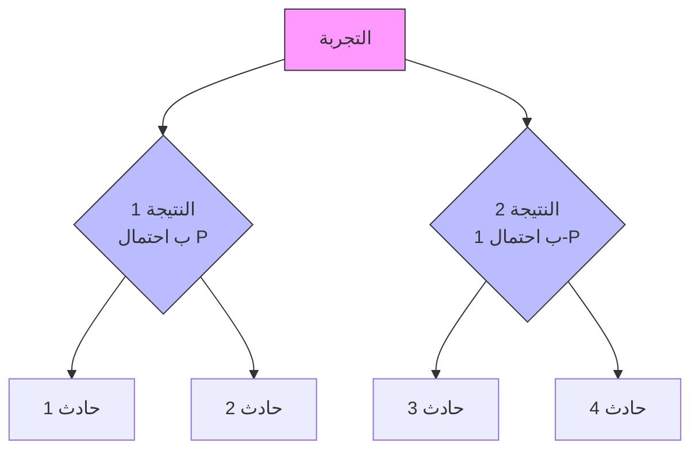
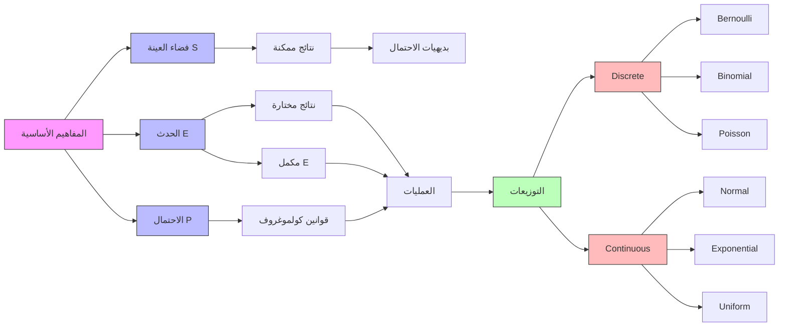

# الاحتمالات · Probability Theory

## 📐 التعاريف الأساسية · Core Definitions

- **التجربة العشوائية (Random Experiment)**: إجراء له نتائج متعددة غير مؤكدة
- **المساحة (Sample Space)**: مجموعة جميع النتائج الممكنة $S$
- **الحدث (Event)**: مجموعة جزئية من النتائج $E \subseteq S$
- **الاحتمال (Probability)**: قياس عددي للامكانية $0 \leq P(E) \leq 1$
- **المتغير العشوائي (Random Variable)**: متغير يأخذ قيماً عشوائية

## 🎲 فضاء العينة · Sample Space

### تعريف فضاء العينة

$$\Omega = \{s_1, s_2, s_3, ...\}$$

حيث كل $s_i$ يمثل نتيجة واحدة ممكنة.

### أمثلة · Examples

| التجربة | فضاء العينة |
| -------- | ----------- |
| رمي نرد | $\{1, 2, 3, 4, 5, 6\}$ |
| رمي عملة | $\{H, T\}$ |
| إلقاء نردين | $\{(i,j): 1 \leq i,j \leq 6\}$ |

---

## 🚶 الأحداث · Events

### أنواع الأحداث

- **الحدث البسيط (Simple Event)**: نتيجة واحدة فقط
- **الحدث المركب (Compound Event)**: عدة نتائج
- **الحدث المؤكد (Certain Event)**: $S$ بأكمله
- **الحدث المستحيل (Impossible Event)**: مجموعة فارغة $\emptyset$
- **الحدث المكمل (Complement Event)**: $E^c = S - E$

### عمليات الأحداث

$$E_1 \cup E_2 \quad \text{(union - اجتماع)}$$

$$E_1 \cap E_2 \quad \text{(intersection - تقاطع)}$$

$$E^c \quad \text{(complement - مكمل)}$$

---

## 🎯 الاحتمال · Probability

### بديهيات كولموغروف Kolmogorov's Axioms

$$P(E) \geq 0 \quad \text{(non-negativity)}$$

$$P(S) = 1 \quad \text{(normalization)}$$

$$P(E_1 \cup E_2) = P(E_1) + P(E_2) \quad \text{(if } E_1 \cap E_2 = \emptyset)$$

### قوانين الاحتمال

$$P(\emptyset) = 0$$

$$P(E^c) = 1 - P(E)$$

$$P(E_1 \cup E_2) = P(E_1) + P(E_2) - P(E_1 \cap E_2)$$

$$P(A \cap B) = P(A) \cdot P(B) \quad \text{(if independent)}$$

---

## 📊 الاحتمال الشرطي وبايز · Conditional Probability & Bayes

### الاحتمال الشرطي

$$P(E|F) = \frac{P(E \cap F)}{P(F)}$$

شرط: $P(F) > 0$

### قانون الضرب العام

$$P\left(\bigcap_{i=1}^{n} E_i\right) = P(E_1) \cdot P(E_2|E_1) \cdot P(E_3|E_1 \cap E_2) \cdots$$

### صيغة بايز Bayes

$$P(A|B) = \frac{P(B|A) \cdot P(A)}{P(B)}$$

أو بشكل عام:

$$P(A_i|B) = \frac{P(B|A_i) \cdot P(A_i)}{\sum_{j=1}^{n} P(B|A_j) \cdot P(A_j)}$$

### مخطط شجرة الاحتمالات

---

## 🎲 المتغيرات العشوائية · Random Variables

### تعريف

$$X: \Omega \rightarrow \mathbb{R}$$

المتغير العشوائي يربط كل نتيجة لعدد حقيقي.

### أنواع المتغيرات

| النوع | القيم | مثال |
| ------ | ----- | ---- |
| متقطع (Discrete) | قابل للعد | عدد الرميات |
| مست��ر (Continuous) | فترة كاملة | الطول، الوزن |

### دالة الكتلة الاحتمالية PMF

$$p_X(x) = P(X = x)$$

$$\sum_{x} p_X(x) = 1$$

### دالة الكثافة PDF

$$P(a \leq X \leq b) = \int_a^b f_X(x) \, dx$$

$$\int_{-\infty}^{\infty} f_X(x) \, dx = 1$$

### التوقع والتباين

**التوقع (Expected Value):**

$$E[X] = \sum_{x} x \cdot p_X(x) \quad \text{(discrete)}$$

$$E[X] = \int_{-\infty}^{\infty} x \cdot f_X(x) \, dx \quad \text{(continuous)}$$

**التباين (Variance):**

$$\text{Var}(X) = E[X^2] - (E[X])^2$$

$$\sigma_X = \sqrt{\text{Var}(X)} \quad \text{(standard deviation)}$$

---

## 📈 التوزيعات المنفصلة · Discrete Distributions

### توزيع Bernoulli

| المعامل | القيمة |
| -------- | ------- |
| Support | $\{0, 1\}$ |
| PMF | $P(X=1) = p$, $P(X=0) = 1-p$ |
| Expected | $E[X] = p$ |
| Variance | $\text{Var}(X) = p(1-p)$ |

### توزيع Binomial $X \sim \text{Bin}(n,p)$

$$P(X=k) = \binom{n}{k} p^k (1-p)^{n-k}$$

| المعامل | الصيغة |
| -------- | ------- |
| Support | $\{0, 1, 2, ..., n\}$ |
| Expected | $E[X] = np$ |
| Variance | $\text{Var}(X) = np(1-p)$ |
| PGF | $(q + pz)^n$ |

### توزيع Poisson $X \sim \text{Poisson}(\lambda)$

$$P(X=k) = \frac{\lambda^k e^{-\lambda}}{k!}$$

| المعامل | الصيغة |
| -------- | ------- |
| Support | $\{0, 1, 2, ...\}$ |
| Expected | $E[X] = \lambda$ |
| Variance | $\text{Var}(X) = \lambda$ |
| PGF | $e^{\lambda(z-1)}$ |

### جدول التوزيعات المنفصلة

| التوزيع | المعلمات | Support | $E[X]$ | $\text{Var}(X)$ |
| -------- | --------- | ------- | ------- | --------------- |
| Bernoulli | $p$ | $\{0,1\}$ | $p$ | $p(1-p)$ |
| Binomial | $n, p$ | $\{0,...,n\}$ | $np$ | $np(1-p)$ |
| Poisson | $\lambda$ | $\{0,1,...\}$ | $\lambda$ | $\lambda$ |

---

## 📉 التوزيعات المستمرة · Continuous Distributions

### التوزيع الطبيعي $X \sim N(\mu, \sigma^2)$

$$f(x) = \frac{1}{\sigma\sqrt{2\pi}} e^{-\frac{(x-\mu)^2}{2\sigma^2}}$$

| المعامل | الصيغة |
| -------- | ------- |
| Support | $(-\infty, \infty)$ |
| Expected | $E[X] = \mu$ |
| Variance | $\text{Var}(X) = \sigma^2$ |

### التوزيع الطبيعي المعياري

$$Z \sim N(0,1)$$

$$Z = \frac{X - \mu}{\sigma}$$

$$f(z) = \frac{1}{\sqrt{2\pi}} e^{-z^2/2}$$

### قاعدة 68-95-99.7

$$P(\mu - \sigma \leq X \leq \mu + \sigma) \approx 68\%$$

$$P(\mu - 2\sigma \leq X \leq \mu + 2\sigma) approx 95\%$$

$$P(\mu - 3\sigma \leq X \leq \mu + 3\sigma) approx 99.7\%$$

### توزيع Exponential $X \sim \text{Exp}(\lambda)$

$$f(x) = \lambda e^{-\lambda x}$$

$$F(x) = 1 - e^{-\lambda x}$$

| المعامل | الصيغة |
| -------- | ------- |
| Support | $[0, \infty)$ |
| Expected | $E[X] = 1/\lambda$ |
| Variance | $\text{Var}(X) = 1/\lambda^2$ |

### Uniform $X \sim U(a,b)$

$$f(x) = \frac{1}{b-a}$$

| المعامل | الصيغة |
| -------- | ------- |
| Support | $[a, b]$ |
| Expected | $E[X] = (a+b)/2$ |
| Variance | $\text{Var}(X) = (b-a)^2/12$ |

### جدول التوزيعات المستمرة

| التوزيع | PDF | $E[X]$ | $\text{Var}(X)$ |
| -------- | --- | ------- | --------------- |
| Normal | $\frac{1}{\sigma\sqrt{2\pi}} e^{-(x-\mu)^2/2\sigma^2}$ | $\mu$ | $\sigma^2$ |
| Exponential | $\lambda e^{-\lambda x}$ | $1/\lambda$ | $1/\lambda^2$ |
| Uniform | $1/(b-a)$ | $(a+b)/2$ | $(b-a)^2/12$ |

---

## 📊 نظرية الحد المركزية · Central Limit Theorem

### نص النظرية

لأي متغير عشوائي $X_1, X_2, ..., X_n$ مستقلة ومتطابقة التوزيع:

$$\bar{X} = \frac{1}{n}\sum_{i=1}^{n} X_i \xrightarrow{d} N\left(\mu, \frac{\sigma^2}{n}\right)$$

أو:

$$\frac{\bar{X} - \mu}{\sigma/\sqrt{n}} \xrightarrow{d} N(0,1)$$

### التطبيقات

- إنشاء فترات ثقة
- اختبار الفروض
- التقريب الطبيعي للتوزيعات الأخرى

---

## 🧮 العمليات على المتغيرات العشوائية

### مجموع المتغيرات

$$E[X + Y] = E[X] + E[Y]$$

$$\text{Var}(X + Y) = \text{Var}(X) + \text{Var}(Y) + 2\text{Cov}(X,Y)$$

إذا مستقلة:

$$\text{Var}(X + Y) = \text{Var}(X) + \text{Var}(Y)$$

### تحويل المتغير

$$E[aX + b] = aE[X] + b$$

$$\text{Var}(aX) = a^2 \text{Var}(X)$$

---

## 📝 أمثلة محلولة · Worked Examples

### المثال 1: فضاء العينة

**المطلوب**: اكتب فضاء العينة عند رمي ثلاث عملات

$$S = \{HHH, HHT, HTH, THH, HTT, THT, TTH, TTT\}$$

$$|S| = 2^3 = 8$$

### المثال 2: الاحتمال الشرطي

**المعطيات**: في مجموعة 100 طالب، 30 يحبون الرياضيات، 25 يحبون الفيزياء، 10 يحبون كلاهما. إذا اختارنا طالب يحب الرياضيات، ما احتمال أنه يحب الفيزياء؟

$$P(\text{فيزياء} | \text{رياضيات}) = \frac{10}{30} = \frac{1}{3}$$

### المثال 3: بايز

**المعطيات**: اختبار مرض، 99% دقة موجبة (إيجابية)، 95% دقة سالبة (سلبية). إذا 1% من السكان المرضى، ما احتمال المرض عند نتيجة إيجابية؟

$$P(D|+) = \frac{0.99 \times 0.01}{0.99 \times 0.01 + 0.05 \times 0.99} = \frac{0.0099}{0.0594} \approx 0.167$$

### المثال 4: Poisson

**المعطيات**: متوسط 4 مكالمات في الساعة، ما احتمال أكثر من 5 مكالمات؟

$$P(X > 5) = 1 - P(X \leq 5) = 1 - \sum_{k=0}^{5} \frac{4^k e^{-4}}{k!}$$

### المثال 5: التوزيع الطبيعي

**المعطيات**: إذا $X \sim N(100, 15^2)$، احسب $P(X > 130)$

$$Z = \frac{130 - 100}{15} = 2$$

$$P(Z > 2) = 1 - \Phi(2) = 1 - 0.9772 = 0.0228$$

---

## ⚠️ أخطاء شائعة وملاحظات · Common Pitfalls

### ❌ أخطاء شائعة

1. **الخلط بين الأحداث المتقاطعة**:
   - $P(A \cup B) = P(A) + P(B) - P(A \cap B)$
   - لا تطرح إلا إذا كانت الأحداث ليست متقاطعة!

2. **عدم التحقق من الاستقلالية**:
   - $P(A \cap B) \neq P(A) \cdot P(B)$ إلا إذا كانت الأحداث مستقلة
   - تحقق دائماً أولاً!

3. **استخدام صيغة بايز بشكل خاطئ**:
   - تذكر البسط: $P(B|A) \cdot P(A)$
   - والمقام: المجموع على جميع الاحتمالات

4. **الخلط بين PMF و PDF**:
   - PMF: $P(X=x)$ للمتقطع
   - PDF: $P(a \leq X \leq b) = \int_a^b f(x)dx$ للمستمر

5. **الخلط بين التباين والانحراف المعياري**:
   - $\sigma^2$ هو التباين (variance)
   - $\sigma$ هو الانحراف المعياري (standard deviation)

6. **احتمال الحدث المستحيل**:
   - $P(\emptyset) = 0$
   - ولكن $P(A) = 0$ لا يعني دائماً $A = \emptyset$ (في الحالة المستمرة!)

7. **تباين المجموع**:
   - $\text{Var}(X + Y) \neq \text{Var}(X) + \text{Var}(Y)$ إلا إذا كانت مستقلة
   - أ��ف $2\text{Cov}(X,Y)$

8. **التوقع الشرطي**:
   - $E[X|Y]$ هو متغير عشوائي (دالة في Y)، وليس رقماً!

### 💡 نصائح مهمة

- **لاستخدام جدول التوزيع الطبيعي المعياري**:
  - $Z = 1$ → 0.8413 (تحت الذيل)
  - $Z = 1.96$ → 0.975
  - $Z = 2$ → 0.9772

- **قاعدة بايز**: انتبه جيداً للnumerator و denominator!

- **التوزيع المستمر**: $P(X = a) = 0$ لكن الحدث ليس مستحيلاً!

---

## 📊 جدول مرجعي شامل · Master Reference Table

| المفهوم | الصيغة | الملاحظات |
| -------- | ------- | --------- |
| فضاء العينة | $\Omega$ or $S$ | مجموعة جميع النتائج |
| الحدث | $E \subseteq S$ | مجموعة جزئية |
| المكمل | $E^c = S - E$ | |
| الاحتمال | $0 \leq P(E) \leq 1$ | |
| قانون الجمع | $P(E_1 \cup E_2) = P(E_1) + P(E_2) - P(E_1 \cap E_2)$ | |
| الضرب | $P(A \cap B) = P(A) \cdot P(B\|A)$ | |
| بايز | $P(A\|B) = \frac{P(B\|A)P(A)}{P(B)}$ | |
| Binomial | $\binom{n}{k}p^k(1-p)^{n-k}$ | $n$ تجارب |
| Poisson | $\frac{\lambda^k e^{-\lambda}}{k!}$ | معدل $\lambda$ |
| Normal | $\frac{1}{\sigma\sqrt{2\pi}} e^{-(x-\mu)^2/2\sigma^2}$ | params $\mu, \sigma$ |
| التوقع | $E[X]$ | mean |
| التباين | $\text{Var}(X) = E[X^2] - (E[X])^2$ | |
| CLT | $\bar{X} \to N(\mu, \sigma^2/n)$ | approx |

---

*سنة ثانية - فصل أول | Year 2, Semester 1*