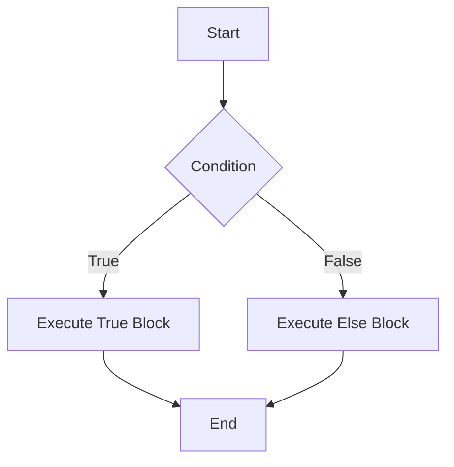
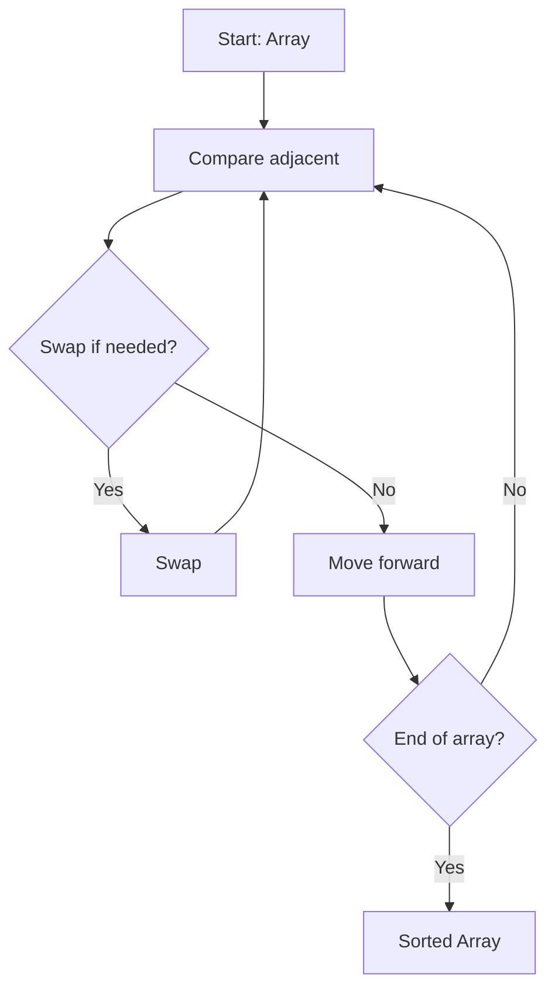

# برمجة 1 · Programming 1

## 📐 التعاريف الأساسية · Core Definitions

- **المتغير (Variable)**: موقع في الذاكرة يخزن قيمة، له اسم ونوع وقيمة
- **نوع البيانات (Data Type)**: تصنيف يحدد نوع القيم التي يمكن للمتغير تخزينها
- **المعامل (Operator)**: رمز يقوم بعملية على واحد أو أكثر من المعاملات (Operands)
- **بنية التحكم (Control Flow)**: ترتيب تنفيذ التعليمات البرمجية
- **الدالة (Function)**: كتلة برمجية قابلة لإعادة الاستخدام تؤدي مهمة محددة

## 🧮 الأنواع والبيانات · Data Types & Types

### الأنواع الأساسية · Primitive Types

| النوع | الحجم | الوصف | النطاق |
|---|---|---|---|
| `int` | 4 bytes | عدد صحيح | $-2^{31}$ إلى $2^{31}-1$ |
| `float` | 4 bytes | عدد عشري | $\pm3.4 \times 10^{\pm38}$ |
| `double` | 8 bytes | عدد عشري مضاعف | $\pm1.7 \times 10^{\pm308}$ |
| `char` | 1 byte | حرف واحد | $-128$ إلى $127$ |
| `bool` | 1 byte | قيمة منطقية | `true` أو `false` |

### تعريف المتغيرات · Variable Declaration

$$type\_name variable\_name = initial\_value;$$

```cpp
int age = 20;
float gpa = 3.75;
char grade = 'A';
bool isStudent = true;
```

## 🔁 التحكم في التدفق · Control Flow

### 1. الجملة الشرطية if-else

```cpp
if (condition) {
    // statements if true
} else {
    // statements if false
}
```



### 2. حلقة for (التكرار المحدود)

$$for(initialization; condition; increment)$$

```cpp
for (int i = 0; i < n; i++) {
    // statements
}
```

### 3. حلقة while (التكرار غير المحدود)

```cpp
while (condition) {
    // statements
}
```

### 4. حلقة do-while (تنفذ مرة واحدة على الأقل)

```cpp
do {
    // statements
} while (condition);
```

## 🧮 العمليات الحسابية والمنطقية · Arithmetic & Logical Operators

### العمليات الحسابية · Arithmetic Operators

| العامل | الاسم | مثال | النتيجة |
|---|---|---|---|
| `+` | جمع | `5 + 3` | `8` |
| `-` | طرح | `5 - 3` | `2` |
| `*` | ضرب | `5 * 3` | `15` |
| `/` | قسمة | `5 / 3` | `1` (integer) |
| `%` | باقٍ | `5 % 3` | `2` |

### عمليات المقارنة · Comparison Operators

| العامل | الاسم | مثال | النتيجة |
|---|---|---|---|
| `==` | تساوي | `5 == 3` | `false` |
| `!=` | لا تساوي | `5 != 3` | `true` |
| `>` | أكبر من | `5 > 3` | `true` |
| `<` | أصغر من | `5 < 3` | `false` |
| `>=` | أكبر أو يساوي | `5 >= 3` | `true` |
| `<=` | أصغر أو يساوي | `5 <= 3` | `false` |

### العمليات المنطقية · Logical Operators

| العامل | الاسم | الوصف |
|---|---|---|
| `&&` | AND | صحيح إذا كان كلاهما صحيحاً |
| `\|\|` | OR | صحيح إذا كان أحدهما صحيحاً |
| `!` | NOT | يعكس القيمة المنطقية |

**قانون دي مورغان (De Morgan's Laws)**:
$$\neg(A \land B) = \neg A \lor \neg B$$
$$\neg(A \lor B) = \neg A \land \neg B$$

## 📦 الدوال · Functions

### بنية الدالة · Function Structure

$$return\_type function\_name(parameters) \{ body; \}$$

```cpp
// دالة لحساب الـ Factorial
int factorial(int n) {
    if (n <= 1) return 1;
    return n * factorial(n - 1);
}
```

### أنواع التمرير · Passing Mechanisms

| النوع | الوصف |
|---|---|
| **Pass by Value** | نسخة من القيمة تُمرر |
| **Pass by Reference** | عنوان المتغير يُمرر `&` |
| **Pass by Pointer** | مؤشر للمتغير يُمرر `*` |

### النطاق الزمني للمتغير · Variable Scope

```cpp
int global = 10; // نطاق عام

void function() {
    int local = 5; // نطاق محلي
    static int count = 0; // retains value between calls
}
```

## 🧮 الخوارزميات الأساسية · Basic Algorithms

### 1. البحث الخطي · Linear Search

$$O(n)$$ - يفحص كل عنصر حتى يجد الهدف

```cpp
int linearSearch(int arr[], int n, int target) {
    for (int i = 0; i < n; i++) {
        if (arr[i] == target) return i;
    }
    return -1;
}
```

### 2. الترتيب الفقاعي · Bubble Sort

$$O(n^2)$$



### 3. حساب الـ Factorial

$$n! = n \times (n-1) \times (n-2) \times ... \times 1$$

$$0! = 1$$ (قاعدة أساسية)

```cpp
int factorial(int n) {
    if (n <= 1) return 1;
    return n * factorial(n - 1);
}
```

### 4. متتابعة فيبوناتشي · Fibonacci Sequence

$$F(n) = F(n-1) + F(n-2)$$

$$F(0) = 0, F(1) = 1$$

```cpp
int fibonacci(int n) {
    if (n <= 1) return n;
    return fibonacci(n-1) + fibonacci(n-2);
}
```

## 📝 أمثلة محلولة · Worked Examples

### المثال 1: التحقق من صحة الرقم

**المطلوب**: دالة تتأكد إذا كان الرقم موجباً أو سالباً أو صفراً

```cpp
void checkNumber(int num) {
    if (num > 0) cout << "موجب";
    else if (num < 0) cout << "سالب";
    else cout << "صفر";
}
```

### المثال 2: مجموع الأرقام من 1 إلى n

$$\sum_{i=1}^{n} i = \frac{n(n+1)}{2}$$

```cpp
int sumToN(int n) {
    return n * (n + 1) / 2;
}
```

**مثال**: $n=5$: $\frac{5 \times 6}{2} = 15$

### المثال 3: طباعة جدول الضرب

```cpp
for (int i = 1; i <= 10; i++) {
    for (int j = 1; j <= 10; j++) {
        cout << i << " * " << j << " = " << i*j << endl;
    }
}
```

## 📊 جدول مرجعي شامل · Master Reference Table

| المفهوم | الصيغة/الشكل | التعقيد |
|---|---|---|
| البحث الخطي | Linear Search | $O(n)$ |
| البحث الثنائي | Binary Search | $O(\log n)$ |
| الترتيب الفقاعي | Bubble Sort | $O(n^2)$ |
| الترتيب بالإدراج | Insertion Sort | $O(n^2)$ |
| الترتيب بالدمج | Merge Sort | $O(n \log n)$ |
| الـ Factorial | $n!$ | $O(n)$ |
| فيبوناتشي | $F_n = F_{n-1} + F_{n-2}$ | $O(2^n)$ |
| الأس | $a^n$ | $O(n)$ |
| القوى الثنائية | $a^n$ | $O(\log n)$ |

## ⚠️ أخطاء شائعة وملاحظات · Common Pitfalls & Notes

- **الخلط بين `=` و `==`**: `=` تعني إسناد، `==` تعني مقارنة
- **نسيان الأقواس `{ }`**: تنفيذ سطر واحد فقط بدون أقواس
- **التعامل مع الـ Division بشكل خاطئ**: `5/3` = 1 وليس 1.66 (لأعداد صحيحة)
- **تجاوز حدود المصفوفة**: المؤشر يبدأ من 0، size-1 هو الحد
- **نسيان return**: الدالة يجب أن ترجع قيمة حسب نوعها
- **المتغيرات غير المهيأة**: تحتوي على قيمة عشوائية

💡 **تلميح**: تذكر أن **المؤشرات (Pointers)** تخزن عناوين الذاكرة، استخدم `&` للحصول على العنوان و`*` للوصول للقيمة.

💡 **تلميح2**: للتمييز بين prefix و postfix في increment:
- `++i`: يزيد ثم يستخدم
- `i++`: يستخدم ثم يزيد