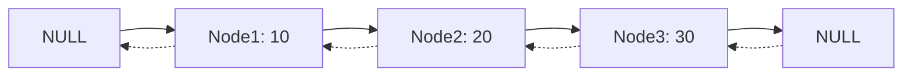
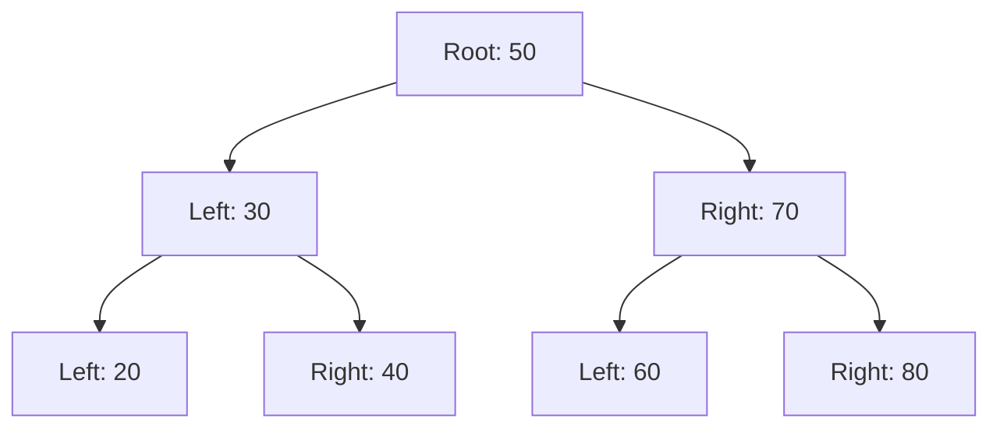
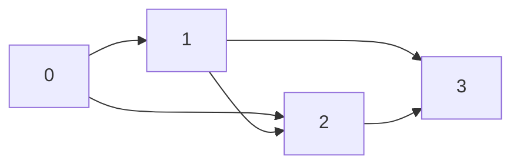

# برمجة 3 · Programming 3

## 📐 التعاريف الأساسية · Core Definitions

- **بنية البيانات (Data Structure)**: طريقة لتنظيم البيانات في الذاكرة لتسهيل الوصول والتعديل
- **المصفوفة (Array)**: مجموعة متتالية من العناصر من نفس النوع
- **القائمة المترابطة (Linked List)**: مجموعة من العقد تحتوي على بيانات ومؤشر للعقدة التالية
- **المكدس (Stack)**: بنية بيانات LIFO (Last In First Out)
- **الطابور (Queue)**: بنية بيانات FIFO (First In First Out)
- **الشجرة (Tree)**: بنية بيانات هرمية ذات عقد الجذور والأوراق
- **الكومة (Heap)**: شجرة ثنائية كاملة تحافظ على خاصية الترتيب
- **الرسم البياني (Graph)**: مجموعة من العقد متصلة بحواف
- **الخوارزمية (Algorithm)**: مجموعة من الخطوات لحل مشكلة معينة
- **التعقيد الزمني (Time Complexity)**: قياس وقت 실행 الخوارزمية بدلالة حجم المدخلات

## 📊 المصفوفات · Arrays

### 1. المصفوفة أحادية البعد · One-Dimensional Array

$$arr[index] = value$$

```cpp
//Declaration and initialization
int arr[5] = {1, 2, 3, 4, 5};
int arr2[] = {10, 20, 30}; // size = 3

// Access elements
for (int i = 0; i < 5; i++) {
    cout << arr[i] << " ";
}
```

### 2. المصفوفة ثنائية البعد · Two-Dimensional Array

$$arr[row][col]$$

```cpp
int matrix[3][3] = {
    {1, 2, 3},
    {4, 5, 6},
    {7, 8, 9}
};

// Access
for (int i = 0; i < 3; i++) {
    for (int j = 0; j < 3; j++) {
        cout << matrix[i][j] << " ";
    }
}
```

### 3. تعقيد المصفوفات · Array Complexity

| العملية | التعقيد الزمني | التعقيد الفراغي |
|---|---|---|
| الوصول لعنصر | $O(1)$ | - |
| البحث الخطي | $O(n)$ | $O(1)$ |
| البحث الثنائي | $O(\log n)$ | $O(1)$ |
| الإدراج | $O(n)$ | $O(1)$ |
| الحذف | $O(n)$ | $O(1)$ |

## 🔗 القوائم المترابطة · Linked Lists

### 1. القائمة المترابطة مفرداً · Singly Linked List

```cpp
struct Node {
    int data;
    Node* next;
};

class LinkedList {
private:
    Node* head;
public:
    LinkedList() { head = NULL; }
    
    void insert(int val) {
        Node* newNode = new Node();
        newNode->data = val;
        newNode->next = head;
        head = newNode;
    }
    
    void display() {
        Node* temp = head;
        while (temp != NULL) {
            cout << temp->data << " -> ";
            temp = temp->next;
        }
        cout << "NULL" << endl;
    }
};
```

### 2. القائمة المترابطة ثنائياً · Doubly Linked List

```cpp
struct DNode {
    int data;
    DNode* prev;
    DNode* next;
};
```



### 3. تعقيد القوائم المترابطة · Linked List Complexity

| العملية | singly | Doubly |
|---|---|---|
| الوصول لعنصر | $O(n)$ | $O(n)$ |
| الإدراج في البداية | $O(1)$ | $O(1)$ |
| الإدراج في النهاية | $O(n)$ | $O(1)$ |
| الحذف من البداية | $O(1)$ | $O(1)$ |
| الحذف من النهاية | $O(n)$ | $O(1)$ |
| الذاكرة | $O(n)$ | $O(n)$ |

## 📚 stacks · stacks

### 1. بنية المكدس · Stack Structure

$$LIFO: Last\;In\;First\;Out$$

```cpp
class Stack {
private:
    int top;
    int arr[100];
public:
    Stack() { top = -1; }
    
    void push(int val) {
        if (top >= 99) {
            cout << "Stack Overflow" << endl;
            return;
        }
        arr[++top] = val;
    }
    
    int pop() {
        if (top < 0) {
            cout << "Stack Underflow" << endl;
            return -1;
        }
        return arr[top--];
    }
    
    int peek() {
        if (top < 0) return -1;
        return arr[top];
    }
    
    bool isEmpty() {
        return top == -1;
    }
};
```

### 2. تطبيقات المكدس · Stack Applications

- تقييم التعبيرات (Expression Evaluation)
- الـ Recursion tracking
- الـ Backtracking
- تحويل الأعداد بين الأنظمة

## 🚶 Queues · Queues

### 1. بنية الطابور · Queue Structure

$$FIFO: First\;In\;First\;Out$$

```cpp
class Queue {
private:
    int front, rear;
    int arr[100];
public:
    Queue() { front = rear = -1; }
    
    void enqueue(int val) {
        if (rear >= 99) {
            cout << "Queue Full" << endl;
            return;
        }
        arr[++rear] = val;
        if (front == -1) front = 0;
    }
    
    int dequeue() {
        if (front == -1 || front > rear) {
            cout << "Queue Empty" << endl;
            return -1;
        }
        return arr[front++];
    }
    
    bool isEmpty() {
        return front == -1 || front > rear;
    }
};
```

### 2. الطابور الدائري · Circular Queue

```cpp
class CircularQueue {
private:
    int front, rear, size;
    int* arr;
public:
    CircularQueue(int s) {
        size = s;
        arr = new int[size];
        front = rear = -1;
    }
    
    void enqueue(int val) {
        if ((rear + 1) % size == front) {
            cout << "Full" << endl;
            return;
        }
        if (front == -1) front = 0;
        rear = (rear + 1) % size;
        arr[rear] = val;
    }
    
    int dequeue() {
        if (front == -1) {
            cout << "Empty" << endl;
            return -1;
        }
        int val = arr[front];
        if (front == rear) {
            front = rear = -1;
        } else {
            front = (front + 1) % size;
        }
        return val;
    }
};
```

## 🌳 الأشجار · Trees

### 1. الشجرة الثنائية · Binary Tree

```cpp
struct TreeNode {
    int data;
    TreeNode* left;
    TreeNode* right;
};

class BinaryTree {
private:
    TreeNode* root;
    
    TreeNode* insert(TreeNode* node, int val) {
        if (node == NULL) {
            TreeNode* newNode = new TreeNode();
            newNode->data = val;
            newNode->left = newNode->right = NULL;
            return newNode;
        }
        if (val < node->data) {
            node->left = insert(node->left, val);
        } else {
            node->right = insert(node->right, val);
        }
        return node;
    }
    
    void inorder(TreeNode* node) {
        if (node == NULL) return;
        inorder(node->left);
        cout << node->data << " ";
        inorder(node->right);
    }
    
public:
    BinaryTree() { root = NULL; }
    
    void insert(int val) {
        root = insert(root, val);
    }
    
    void inorder() {
        inorder(root);
    }
};
```

### 2. شجرة البحث الثنائية · Binary Search Tree (BST)



### 3. عمليات الشجرة · Tree Operations

| العملية | التعقيد |
|---|---|
| البحث | $O(h)$ |
| الإدراج | $O(h)$ |
| الحذف | $O(h)$ |
| الـ Inorder | $O(n)$ |
| الـ Preorder | $O(n)$ |
| الـ Postorder | $O(n)$ |

حيث $h$ هو ارتفاع الشجرة ($h = \log n$ في الشجرة المتوازنة)

## 🌾 الكومات · Heaps

### 1. بنية الكومة · Heap Structure

$$parent = \lfloor(i-1)/2\rfloor$$
$$left = 2i + 1$$
$$right = 2i + 2$$

```cpp
class MaxHeap {
private:
    vector<int> heap;
    
    void heapify(int n, int i) {
        int largest = i;
        int left = 2 * i + 1;
        int right = 2 * i + 2;
        
        if (left < n && heap[left] > heap[largest])
            largest = left;
        if (right < n && heap[right] > heap[largest])
            largest = right;
        
        if (largest != i) {
            swap(heap[i], heap[largest]);
            heapify(n, largest);
        }
    }
    
public:
    void insert(int val) {
        heap.push_back(val);
        for (int i = heap.size() / 2 - 1; i >= 0; i--) {
            heapify(heap.size(), i);
        }
    }
    
    void extractMax() {
        if (heap.empty()) return;
        heap[0] = heap.back();
        heap.pop_back();
        heapify(heap.size(), 0);
    }
};
```

### 2. تطبيق الكومة · Heap Applications

- Priority Queue
- Heap Sort: $O(n \log n)$
- Top-K elements
- Median finder

## 🔗 Graphs · Graphs

### 1. تمثيل الرسم البياني · Graph Representation

```cpp
// Adjacency Matrix
class Graph {
private:
    int V;
    vector<vector<int>> adj;
public:
    Graph(int v) {
        V = v;
        adj.resize(V, vector<int>(V, 0));
    }
    
    void addEdge(int u, int v) {
        adj[u][v] = 1;
        adj[v][u] = 1; // Undirected
    }
    
    void display() {
        for (int i = 0; i < V; i++) {
            cout << i << ": ";
            for (int j = 0; j < V; j++) {
                if (adj[i][j]) cout << j << " ";
            }
            cout << endl;
        }
    }
};
```

### 2. رسم بياني بقائمة المتاخمة · Adjacency List



### 3. خوارزميات الرسم البياني · Graph Algorithms

| الخوارزمية | التعقيد | الوصف |
|---|---|---|
| BFS | $O(V + E)$ | Breadth-First Search |
| DFS | $O(V + E)$ | Depth-First Search |
| Dijkstra | $O(V \log V + E)$ | Shortest path |
| Prim | $O(E \log V)$ | Minimum spanning tree |

## 🔄 الخوارزميات · Algorithms

### 1. ترتيب الدمج · Merge Sort

$$O(n \log n)$$

```cpp
void merge(int arr[], int left, int mid, int right) {
    int n1 = mid - left + 1;
    int n2 = right - mid;
    int L[n1], R[n2];
    
    for (int i = 0; i < n1; i++) L[i] = arr[left + i];
    for (int j = 0; j < n2; j++) R[j] = arr[mid + 1 + j];
    
    int i = 0, j = 0, k = left;
    while (i < n1 && j < n2) {
        if (L[i] <= R[j]) arr[k++] = L[i++];
        else arr[k++] = R[j++];
    }
    while (i < n1) arr[k++] = L[i++];
    while (j < n2) arr[k++] = R[j++];
}

void mergeSort(int arr[], int left, int right) {
    if (left < right) {
        int mid = left + (right - left) / 2;
        mergeSort(arr, left, mid);
        mergeSort(arr, mid + 1, right);
        merge(arr, left, mid, right);
    }
}
```

### 2. ترتيب الكومة · Heap Sort

$$O(n \log n)$$

```cpp
void heapSort(int arr[], int n) {
    // Build max heap
    for (int i = n / 2 - 1; i >= 0; i--) {
        heapify(arr, n, i);
    }
    
    // Extract elements
    for (int i = n - 1; i > 0; i--) {
        swap(arr[0], arr[i]);
        heapify(arr, i, 0);
    }
}
```

### 3. البحث الثنائي · Binary Search

$$O(\log n)$$

```cpp
int binarySearch(int arr[], int n, int target) {
    int low = 0, high = n - 1;
    while (low <= high) {
        int mid = low + (high - low) / 2;
        if (arr[mid] == target) return mid;
        if (arr[mid] < target) low = mid + 1;
        else high = mid - 1;
    }
    return -1;
}
```

## 🔁 العودية · Recursion

### 1. مبادئ العودية · Recursion Principles

$$T(n) = T(n-1) + O(1)$$

```cpp
// Factorial
int factorial(int n) {
    if (n <= 1) return 1;
    return n * factorial(n - 1);
}

// Power
int power(int base, int exp) {
    if (exp == 0) return 1;
    return base * power(base, exp - 1);
}

// Fibonacci
int fibonacci(int n) {
    if (n <= 1) return n;
    return fibonacci(n - 1) + fibonacci(n - 2);
}
```

### 2. العودية尾部 · Tail Recursion

```cpp
// Tail recursive factorial
int factorialTR(int n, int result = 1) {
    if (n == 0) return result;
    return factorialTR(n - 1, n * result);
}
```

### 3. تعقيد العودية · Recursion Complexity

| الدالة | الصيغة | التعقيد |
|---|---|---|
| Factorial | $n!$ | $O(n)$ |
| Fibonacci | $F(n)$ | $O(2^n)$ (naive) |
| Power | $a^n$ | $O(n)$ |
| Binary Search | $T(n) = T(n/2) + O(1)$ | $O(\log n)$ |
| Merge Sort | $T(n) = 2T(n/2) + O(n)$ | $O(n \log n)$ |

## 📊 جدول التعقيد الشامل · Master Complexity Table

### بنى البيانات · Data Structures

| البنية | الوصول | البحث | الإدراج | الحذف |
|---|---|---|---|---|
| Array | $O(1)$ | $O(n)$ | $O(n)$ | $O(n)$ |
| Linked List | $O(n)$ | $O(n)$ | $O(1)$ | $O(1)$ |
| Stack | - | $O(n)$ | $O(1)$ | $O(1)$ |
| Queue | - | $O(n)$ | $O(1)$ | $O(1)$ |
| BST | $O(\log n)$ | $O(\log n)$ | $O(\log n)$ | $O(\log n)$ |
| Heap | $O(1)$ | $O(n)$ | $O(\log n)$ | $O(\log n)$ |
| Hash Table | $O(1)$ | $O(1)$ | $O(1)$ | $O(1)$ |

### الخوارز��يات · Algorithms

| الخوارزمية | أفضل | متوسط | أسوأ | الذاكرة |
|---|---|---|---|---|
| Bubble Sort | $O(n)$ | $O(n^2)$ | $O(n^2)$ | $O(1)$ |
| Insertion Sort | $O(n)$ | $O(n^2)$ | $O(n^2)$ | $O(1)$ |
| Quick Sort | $O(n \log n)$ | $O(n \log n)$ | $O(n^2)$ | $O(\log n)$ |
| Merge Sort | $O(n \log n)$ | $O(n \log n)$ | $O(n \log n)$ | $O(n)$ |
| Heap Sort | $O(n \log n)$ | $O(n \log n)$ | $O(n \log n)$ | $O(1)$ |
| Binary Search | $O(1)$ | $O(\log n)$ | $O(\log n)$ | $O(1)$ |
| BFS | $O(V + E)$ | $O(V + E)$ | $O(V + E)$ | $O(V)$ |
| DFS | $O(V + E)$ | $O(V + E)$ | $O(V + E)$ | $O(V)$ |

## 📝 أمثلة محلولة · Worked Examples

### المثال 1: تنفيذ Stack باستخدام Linked List

```cpp
class StackLL {
private:
    struct Node {
        int data;
        Node* next;
    };
    Node* top;
public:
    StackLL() { top = NULL; }
    
    void push(int val) {
        Node* newNode = new Node();
        newNode->data = val;
        newNode->next = top;
        top = newNode;
    }
    
    int pop() {
        if (top == NULL) return -1;
        int val = top->data;
        Node* temp = top;
        top = top->next;
        delete temp;
        return val;
    }
    
    int peek() {
        if (top == NULL) return -1;
        return top->data;
    }
    
    bool isEmpty() {
        return top == NULL;
    }
};
```

### المثال 2: التحقق من توازن الأقواس

```cpp
bool isBalanced(string s) {
    StackLL st;
    for (char c : s) {
        if (c == '(' || c == '[' || c == '{') {
            st.push(c);
        } else if (c == ')' || c == ']' || c == '}') {
            if (st.isEmpty()) return false;
            char top = st.pop();
            if ((c == ')' && top != '(') ||
                (c == ']' && top != '[') ||
                (c == '}' && top != '{')) {
                return false;
            }
        }
    }
    return st.isEmpty();
}
```

### المثال 3: حساب عمق الشجرة · Tree Depth

```cpp
int depth(TreeNode* node) {
    if (node == NULL) return 0;
    int leftDepth = depth(node->left);
    int rightDepth = depth(node->right);
    return max(leftDepth, rightDepth) + 1;
}
```

## ⚠️ أخطاء شائعة وملاحظات · Common Pitfalls & Notes

- **تسريبات الذاكرة**: استخدام `delete` مع كل `new` في القوائم المترابطة
- **المؤشر NULL**: التحقق من المؤشر قبل الوصول إليه
- **الـ Overflow**: تجنب overflow في المصفوفات والـ Stack
- **الـ Infinite Recursion**: توقف حالة الأساس بشكل صحيح
- **الـ Memory**: المصفوفات تحتاج ذاكرة متواصلة، القوائم مرنة
- **الـ Stack Overflow**: recursion عميق قد يسبب overflow
- **الـ Circular Dependency**: في Linked Lists تأكد من نهاية القائمة
- **الـ Tree Balance**: BST يمكن أن يتحول لقائمة في أسوأ الحالات $O(n)$
- **الـ Graph Cycles**: استخدام visited array في DFS/BFS
- **الـ Queue Full**: التحقق من الامتلاء قبل الإدراج

## 📌 تلميحات · Tips

💡 **تلميح 1**:اختر بنية البيانات المناسبة:
- الوصول السريع ← Array
- إدراج/حذف متكرر ← Linked List
- LIFO ← Stack
- FIFO ← Queue
- ترتيب ← Heap

💡 **تلميح 2**:لتحسين recursion:
- استخدم tail recursion عندما الإمكان
- تجنب تكرار الحسابات (memoization)

💡 **تلميح 3**:لاختيار خوارزمية الترتيب:
- $n$ صغير ← Insertion Sort
- $n$ كبير ← Merge/Heap Sort
- almost sorted ← Insertion Sort
- memory محدود ← Heap Sort
- random data ← Quick Sort

💡 **تلميح 4**:لاختيار خوارزمية البحث:
- sorted data ← Binary Search
- unsorted data ← Linear Search
- large $n$ و sorted ← Binary Search

(End of file - total 388 lines)