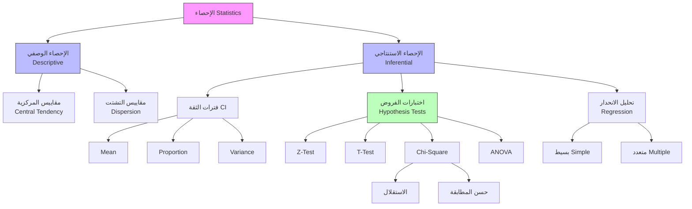

# الإحصاء · Statistics

## 📐 المقدمة · Introduction

الإحصاء هو علم جمع البيانات وتحليلها واست interpretها واتخاذ القرارات على أساسها. في هذا الملف، سنغطي المواضيع الأساسية للإحصاء التطبيقي في السنة الثانية، الفصل الدراسي الثاني.

Statistics is the science of collecting, analyzing, interpreting, and making decisions based on data. In this file, we cover the essential topics of applied statistics for Year 2, Semester 2.

---

## 📊 الإحصاء الوصفي · Descriptive Statistics

### مقاييس النزعة المركزية · Measures of Central Tendency

| المقياس | الصيغة | التعريف |
|---|---|---|
| المتوسط الحسابي (Mean) | $\bar{x} = \frac{1}{n}\sum_{i=1}^{n} x_i$ | مجموع القيم مقسوماً على عددها |
| الوسيط (Median) | القيمة في المنتصف | القيمة التي تقسيم البيانات إلى نصفين |
| المنوال (Mode) | القيمة الأكثر تكراراً | القيمة التي تظهر أكثر من غيرها |

### مقاييس التشتت · Measures of Dispersion

| المقياس | الصيغة | التعريف |
|---|---|---|
| المدى (Range) | $R = x_{max} - x_{min}$ | الفرق بين أكبر وأصغر قيمة |
| التباين (Variance) | $s^2 = frac{1}{n-1}\sum_{i=1}^{n}(x_i - \bar{x})^2$ | متوسط مربع الانحرافات |
| الانحراف المعياري (Std Dev) | $s = \sqrt{s^2}$ | الجذر التربيعي للتباين |
| معامل الاختلاف (CV) | $CV = \frac{s}{\bar{x}} \times 100\%$ | نسبة الانحراف إلى المتوسط |

### النطاقات الربعية · Quartiles

$$Q_1 = \text{الربع الأول (25\%)}$$

$$Q_2 = \text{الوسيط (50\%)}$$

$$Q_3 = \text{الربع الثالث (75\%)}$$

$$IQR = Q_3 - Q_1 \quad \text{( المدى الربيعي )}$$

### قاعدة outlier detection

$$\text{outlier} < Q_1 - 1.5 \times IQR \quad \text{أو} \quad \text{outlier} > Q_3 + 1.5 \times IQR$$

---

## 🎲 التوزيعات العينية · Sampling Distributions

### مفهوم التوزيع العيني

التوزيع العيني هو توزيع احتمالي لإ statistic معين عند أخذ عينات متعددة من الحجم $n$ من المجتمع.

The sampling distribution is the probability distribution of a statistic obtained by sampling from a population.

### توزيع Mittelwert der Stichprobe

$$\bar{X} \sim N\left(\mu, \frac{\sigma^2}{n}\right) \quad \text{( عند n كبير )}$$

أو:

$$E[\bar{X}] = \mu$$

$$\text{Var}(\bar{X}) = \frac{\sigma^2}{n}$$

$$\sigma_{\bar{X}} = \frac{\sigma}{\sqrt{n}} \quad \text{( الخطأ المعياري )}$$

### مبرهنة النهاية المركزية

لأي توزيع مع medium $\mu$ وتباين $\sigma^2$:

$$\frac{\bar{X} - \mu}{s/\sqrt{n}} \xrightarrow{d} N(0,1) \quad \text{when } n \to \infty$$

For any population with mean $\mu$ and variance $\sigma^2$:

$$\frac{\bar{X} - \mu}{s/\sqrt{n}} \xrightarrow{d} N(0,1) \quad \text{as } n \to \infty$$

### توزيع النسبة العينية

$$widehat{p} \sim N\left(p, \frac{p(1-p)}{n}\right)$$

حيث $p$ هو النسبة الحقيقية في المجتمع.

Where $p$ is the true population proportion.

---

## 📏 فترات الثقة · Confidence Intervals

### مفهوم فترة الثقة

فترة الثقة هي نطاق من القيم التي تحتوي على PARAMETER الحقيقي بنسبة ثقة معينة (confidence level).

A confidence interval is a range of values that contains the true parameter with a certain confidence level.

### صيغة عامة

$$\text{CI} = \text{Statistic} \pm (\text{Critical Value}) \times (\text{Standard Error})$$

### فترات الثقة لمتوسط المجتمع

#### التباين معروف (known variance)

$$\bar{x} \pm z_{\alpha/2} \times \frac{\sigma}{\sqrt{n}}$$

#### التباين غير معروف (unknown variance)

$$\bar{x} \pm t_{\alpha/2, n-1} \times \frac{s}{\sqrt{n}}$$

### فترات الثقة للنسبة

$$\widehat{p} \pm z_{\alpha/2} \times \sqrt{\frac{\widehat{p}(1-\widehat{p})}{n}}$$

### فترات الثقة للتباين

$$\frac{(n-1)s^2}{\chi^2_{\alpha/2, n-1}} \leq \sigma^2 \leq \frac{(n-1)s^2}{\chi^2_{1-\alpha/2, n-1}}$$

### جدول فترات الثقة

| PARAMETER | CI الصيغة | الشروط |
|---|---|---|
| $\mu$ | $\bar{x} \pm z_{\alpha/2}(\sigma/\sqrt{n})$ | $\sigma$ معروف، $n \geq 30$ |
| $\mu$ | $\bar{x} \pm t_{\alpha/2, n-1}(s/\sqrt{n})$ | $\sigma$ غير معروف |
| $p$ | $\widehat{p} \pm z_{\alpha/2}\sqrt{p(1-p)/n}$ | $np \geq 10, n(1-p) \geq 10$ |
| $\sigma^2$ | $\frac{(n-1)s^2}{\chi^2_{\alpha/2}}$ | بيانات طبيعية |

---

## 🧪 اختبارات الفروض · Hypothesis Testing

### مفهوم اختبار الفرض

اختبار الفرض هو إجراء لاتخاذ قرار بشأن صحة主张 إحصائية بناءً على بيانات العينة.

Hypothesis testing is a procedure for making a decision about a statistical claim based on sample data.

### أنواع الفروض

- **الفرض الصفري (Null Hypothesis)**: $H_0$ - الافتراض Default
- **الفرض البديل (Alternative Hypothesis)**: $H_1$ أو $H_a$ - ما نريد إثباته

### أنواع الاختبارات

| النوع | $H_1$ | مثال |
|---|---|---|
| ذيلين (Two-tailed) | $\neq$ | $\mu \neq 100$ |
| أيسر (Left-tailed) | $<$ | $\mu < 100$ |
| أيمن (Right-tailed) | $>$ | $\mu > 100$ |

### أخطاء الاختبار

| TYPE | الوصف | $H_0$ الصحيح | $H_0$ الخاطئ |
|---|---|---|---|
| Type I Error ($\alpha$) | رفض $H_0$ خطأ | √ | |
| Type II Error ($\beta$) | قبول $H_0$ خطأ | | √ |
| Power ($1-\beta$) | رفض $H_0$正确 | | √ |

### خطوات اختبار الفرض

1. تحديد $H_0$ و $H_1$
2. اختيار مستوى الدلالة $\alpha$ (عادة 0.05)
3. حساب إحصائية الاختبار
4. تحديد القيمة الحرجة أو $p$-value
5. اتخاذ القرار

### اختبار Mittelwert لعينة واحدة

#### التباين معروف

$$z = \frac{\bar{x} - \mu_0}{\sigma / \sqrt{n}}$$

#### التباين غير معروف

$$t = \frac{\bar{x} - \mu_0}{s / \sqrt{n}}$$

### اختبار Mittelwert لعجلتين مستقلتين

$$t = \frac{\bar{x}_1 - \bar{x}_2}{\sqrt{\frac{s_1^2}{n_1} + \frac{s_2^2}{n_2}}}$$

### اختبار النسبة

$$z = \frac{\widehat{p} - p_0}{\sqrt{\frac{p_0(1-p_0)}{n}}}$$

---

## 🔗 اختبار مربع كاي · Chi-Square Tests

### مفهوم اختبار كاي

اختبار كاي يُستخدم لاختبار العلاقة بين المتغيرات النوعية أو اختبار التوزيع.

Chi-square test is used to test the relationship between categorical variables or test distributions.

### أنواع اختبارات كاي

| الاختبار | الاستخدام | إحصائية |
|---|---|---|
| حسن المطابقة (Goodness of Fit) | اختبار التوزيع | $\chi^2 = \sum\frac{(O-E)^2}{E}$ |
| الاستقلال (Independence) | اختبار العلاقة | $\chi^2 = \sum\sum\frac{(O-E)^2}{E}$ |
| التجانس (Homogeneity) | مقارنة توزيعات |_same formula |

### جدول التوافقات

$$E_{ij} = \frac{(\text{صف } i \text{ الإجمالي}) \times (\text{عمود } j \text{ الإجمالي})}{\text{الإجمالي الكلي}}$$

### درجات الحرية

| الاختبار | df |
|---|---|
| حسن المطابقة | $k - 1$ |
| الاستقلال | $(r-1)(c-1)$ |

حيث $k$ هو عدد الفئات، $r$ هو عدد الصفوف، $c$ هو عدد الأعمدة.

### شرط الاستخدام

$$E_{ij} \geq 5 \quad \text{(すべてのخلايا أكثر من 5)}$$

---

## 📈 تحليل الانحدار · Regression Analysis

### مفهوم الانحدار

تحليل الانحدار هو نموذج لإظهار العلاقة بين متغير تابع (dependent) ومتغير مستقل (independent).

Regression analysis is a model to show the relationship between dependent and independent variables.

### الانحدار الخطي البسيط

$$y = \beta_0 + beta_1 x + \varepsilon$$

حيث:
- $y$ : المتغير التابع
- $x$ : المتغير المستقل
- $\beta_0$ : نقطة التقاطع (intercept)
- $\beta_1$ : ميل الانحدار (slope)
- $\varepsilon$ : الخطأ العشوائي

### تقدير المعلمات

$$widehat{beta}_1 = \frac{\sum(x_i - \bar{x})(y_i - \bar{y})}{\sum(x_i - \bar{x})^2} = \frac{S_{xy}}{S_{xx}}$$

$$widehat{beta}_0 = \bar{y} - \widehat{beta}_1 \bar{x}$$

### معامل التحديد

$$R^2 = \frac{SSR}{SST} = 1 - \frac{SSE}{SST}$$

أو:

$$R^2 = r^2 \quad \text{(لاستخدام بسيط)}$$

حيث:
- $SSR$: مجموع مربع الانحدار
- $SST$: مجموع مربع الإجمالي
- $SSE$: مجموع مربع الخطأ

### معامل الارتباط

$$r = \frac{S_{xy}}{\sqrt{S_{xx} S_{yy}}} = \frac{\sum(x_i - \bar{x})(y_i - \bar{y})}{\sqrt{\sum(x_i - \bar{x})^2 \sum(y_i - \bar{y})^2}}$$

### اختبار معنوية الانحدار

$$H_0: \beta_1 = 0$$

$$H_1: \beta_1 \neq 0$$

$$t = \frac{\widehat{beta}_1}{SE(\widehat{beta}_1)}$$

### فترة الثقة للpredicted value

$$\widehat{y} \pm t_{\alpha/2, n-2} \times s_e \times \sqrt{\frac{1}{n} + \frac{(x_0 - \bar{x})^2}{S_{xx}}}$$

### جدول ANOVA للانحدار

| Source | SS | df | MS | F |
|---|---|---|---|---|
| Regression | $SSR$ | 1 | $MSR$ | $MSR/MSE$ |
| Error | $SSE$ | $n-2$ | $MSE$ | |
| Total | $SST$ | $n-1$ | | |

---

## 📊 مقارنة الاختبارات الإحصائية

| الاختبار | الاستخدام | المتغيرات | الصيغة |
|---|---|---|---|
| $z$-test | mean واحد | كمي | $z = \frac{\bar{x}-\mu_0}{\sigma/\sqrt{n}}$ |
| $t$-test | mean واحد | كمي | $t = \frac{\bar{x}-\mu_0}{s/\sqrt{n}}$ |
| $t$-test | means عرفتان | كمي | $t = \frac{\bar{x}_1-\bar{x}_2}{s_p\sqrt{1/n_1+1/n_2}}$ |
| $z$-test | proportion | نسب |
| $\chi^2$-test | استقلال | نوعي | $\sum(O-E)^2/E$ |
| ANOVA | means متعددة | كمي | $F = MS_{between}/MS_{within}$ |
| Regression | علاقة | كمي | $y = \beta_0 + \beta_1 x$ |

---

## ⚠️ أخطاء شائعة وملاحظات · Common Pitfalls

### فترات الثقة

- **عدم الخلط بين $\alpha$ و confidence level**: 
  - $\alpha = 0.05$ ��عني 95% ثقة
  
- **تفسير فترة الثقة بشكل خاطئ**:
  - "95% من الفترات تحتوي على المتوسط الحقيقي" ← correcta
  - "احتمال أن enthält الفترة المتوسط هو 95%" ← خاطئة

### اختبارات الفروض

- **الخلط بين Type I و Type II**:
  - Type I: رفض $H_0$ خطأ (false positive) - $\alpha$
  - Type II: قبول $H_0$ خطأ (false negative) - $\beta$

- **$p$-value误解**:
  - $p$-value ليس "احتمال صحة $H_0$"
  - $p$-value هو "احتمال الحصول على$resultados extrême إذا كانت $H_0$ صحيحة"

- **تقليل حجم العينة**:
  - $n$ الصغير يزيد الخطأ المعياري
  - قد تحتاج إلى $t$-test بدلاً من $z$-test

### كاي squared

- **استخدام test مع valores صغيرة**:
  - كل خلية يجب أن تحتوي على $E \geq 5$
  - دمج الفئات إذا لزم الأمر

- **الخلط بين الاستقلال والتجانس**:
  - الاستقلال: عينة واحدة
  - التجانس: عينات متعددة

### تحليل الانحدار

- **الارتباط ليس سببية**:
  - $r$ القوي لا يعني أن $x$ يسبب $y$
  - قد يكون هناك متغير مُربِك (confounding variable)

- ** extrapolation extrapolation**:
  - لا extrapolate خارج نطاق البيانات

- **heteroscedasticity**:
  - افتراض ثبات التباين قد يكون خاطئاً
  - تحقق منscatter plot

- **الخطية**:
  - افتراض العلاقة الخطية قد يكون خاطئاً
  - تحقق منscatter plot

### Tips

💡 **تلميح**: تذكر الفرق:
- $s$: انحراف معياري للعينة
- $\sigma$: انحراف معياري للمجتمع
- $SE$: خطأ معياري للم Mittelwert

💡 **تلميح**: اختيار الاختبار الصحيح:
- بيانات نوعية → chi-square
- بيانات كمي + groupين → t-test
- بيانات كمي + >2 groups → ANOVA
- بيانات كمي + علاقة → regression

---

## 📝 أمثلة محلولة · Worked Examples

### مثل 1: فترة ثقة للمتوسط

**المعطيات**: عينة من $n=25$ student، $\bar{x}=75$، $s=10$

**المطلوب**: أوجد فترة ثقة 95%

$$t_{0.025, 24} = 2.064$$

$$\bar{x} \pm t \times s/\sqrt{n} = 75 \pm 2.064 \times 10/5 = 75 \pm 4.128$$

$$CI = (70.87, 79.13)$$

### مثل 2: اختبار فرض للمتوسط

**المعطيات**: $\bar{x}=105$، $\mu_0=100$، $s=15$، $n=36$

**المطلوب**: اختبر $H_0: \mu=100$ مقابل $H_1: \mu>100$

$$z = \frac{105-100}{15/\sqrt{36}} = \frac{5}{2.5} = 2$$

$$p = P(Z > 2) = 0.0228$$

$$p < 0.05 \Rightarrow \text{رفض } H_0$$

### مثل 3: chi-square للاستقلال

**المعطيات**: جدول توافقات 2×2

| | يحبون | لا يحبون | |
|---|---|---|---|
| ذكور | 30 | 20 | 50 |
| إناث | 25 | 25 | 50 |
| | 55 | 45 | 100 |

**المطلوب**: اختبر الاستقلال

$$E_{11} = \frac{50 \times 55}{100} = 27.5$$

$$\chi^2 = \frac{(30-27.5)^2}{27.5} + \frac{(20-22.5)^2}{22.5} + \frac{(25-27.5)^2}{27.5} + \frac{(25-22.5)^2}{22.5}$$

$$\chi^2 = 0.227 + 0.278 + 0.227 + 0.278 = 1.01$$

$$df = (2-1)(2-1) = 1$$

$$p = P(\chi^2 > 1.01) > 0.05$$

$$p > 0.05 \Rightarrow \text{لا رفض } H_0$$

### مثل 4: انحدار خطي

**المعطيات**: بيانات $x$ (السعر) و $y$ (المبيعات)

| $x$ | $y$ |
|---|---|
| 10 | 50 |
| 15 | 60 |
| 20 | 65 |
| 25 | 80 |
| 30 | 85 |

**المطلوب**: أوجد معادلة الانحدار

$$\bar{x} = 20, \quad \bar{y} = 68$$

$$S_{xx} = 250, \quad S_{xy} = 475$$

$$\widehat{beta}_1 = \frac{475}{250} = 1.9$$

$$\widehat{beta}_0 = 68 - 1.9(20) = 30$$

$$\widehat{y} = 30 + 1.9x$$

$$R^2 = 0.95 \quad \text{(نسبة جيدة)}$$

---

## 📊 خريطة المفاهيم الإحصائية

---

## 📊 جدول مرجعي شامل · Master Reference Table

| المفهوم | الصيغة | الملاحظات |
|---|---|---|
| المتوسط | $\bar{x} = \frac{1}{n}\sum x_i$ | |
| التباين | $s^2 = \frac{1}{n-1}\sum(x_i-\bar{x})^2$ | $n-1$ للمجتمع |
| الانحراف المعياري | $s = \sqrt{s^2}$ | |
| الخطأ المعياري | $SE = \sigma/\sqrt{n}$ | |
| CI للمتوسط | $\bar{x} \pm z_{\alpha/2}(\sigma/\sqrt{n})$ | $\sigma$ معروف |
| CI للمتوسط | $\bar{x} \pm t_{\alpha/2}(s/\sqrt{n})$ | $\sigma$ غير معروف |
| CI للنسبة | $\widehat{p} \pm z\sqrt{\widehat{p}(1-\widehat{p})/n}$ | |
| Z-Statistic | $z = \frac{\bar{x}-\mu_0}{\sigma/\sqrt{n}}$ | |
| T-Statistic | $t = \frac{\bar{x}-\mu_0}{s/\sqrt{n}}$ | $df=n-1$ |
| Chi-Square | $\chi^2 = \sum(O-E)^2/E$ | $df$ مناسب |
| الانحدار | $\widehat{y} = \widehat{beta}_0 + \widehat{beta}_1 x$ | |
| معامل التحديد | $R^2 = 1 - SSE/SST$ | |
| معامل الارتباط | $r = S_{xy}/\sqrt{S_{xx}S_{yy}}$ | $-1 \leq r \leq 1$ |

---

## 📚 المراجع · References

-Probability and Statistics for Engineering and the Sciences, Jay Devore
- Introduction to Statistical Methods, Cover andacock
- المعاني الإحصائية في البحث العلمي، various Arabic textbooks

---

💡 **ملاحظة نهائية**: هذا الملف يغطي المواضيع الأساسية للإحصاء التطبيقي. تأكد من فهم المفاهيم الأساسية قبل حل المسائل المعقدة.

💡 **Final Note**: This file covers essential applied statistics topics. Ensure you understand basic concepts before tackling complex problems.