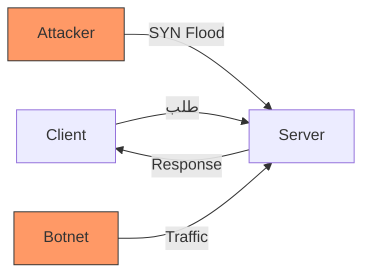
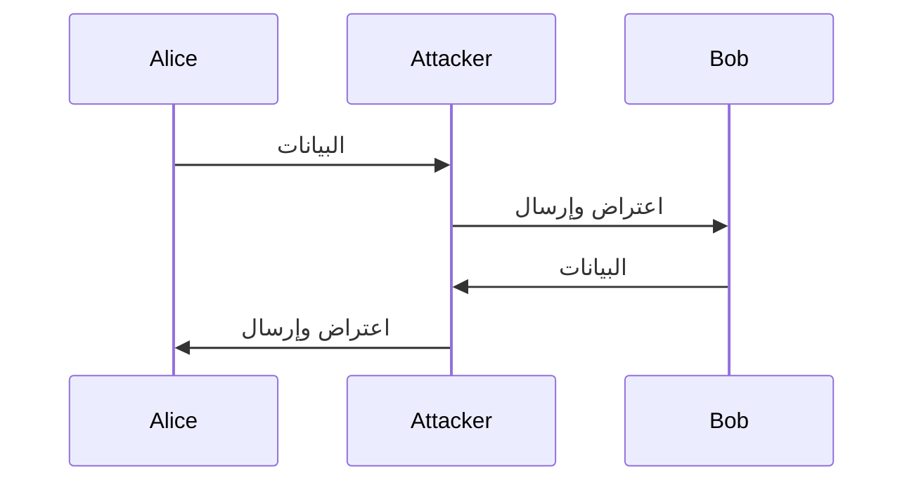
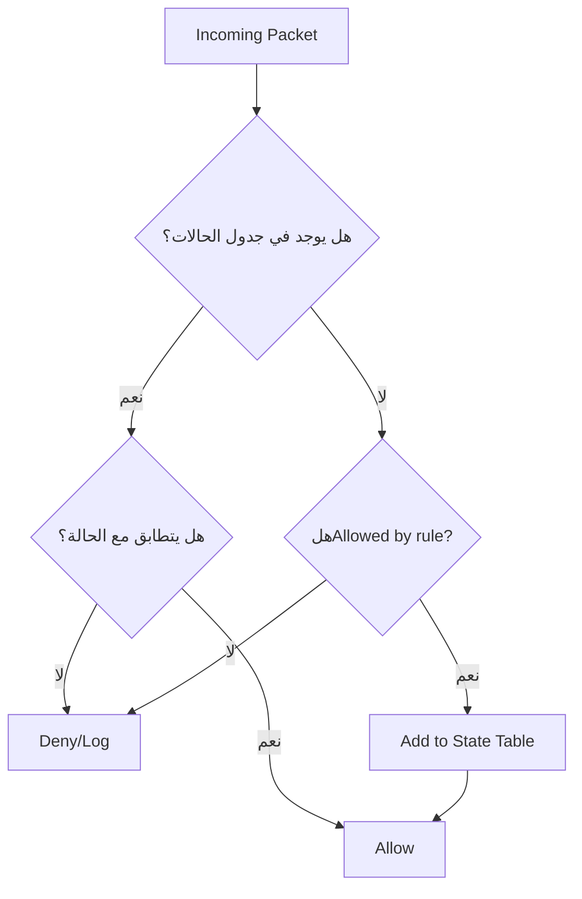
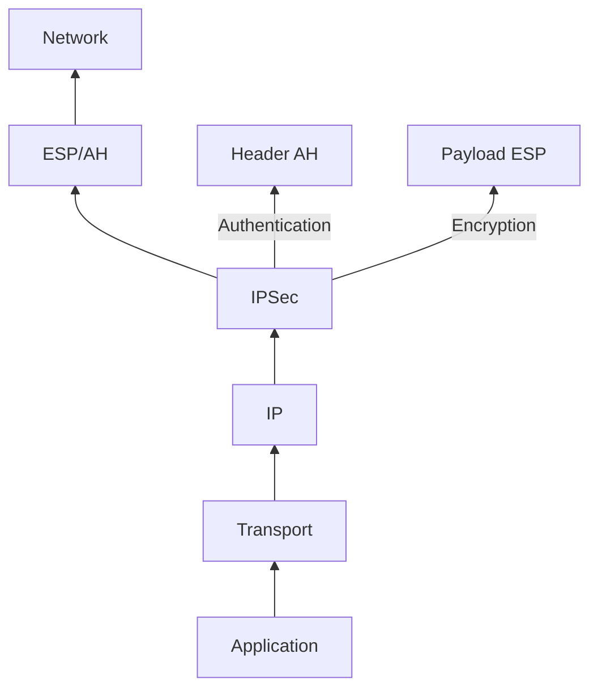
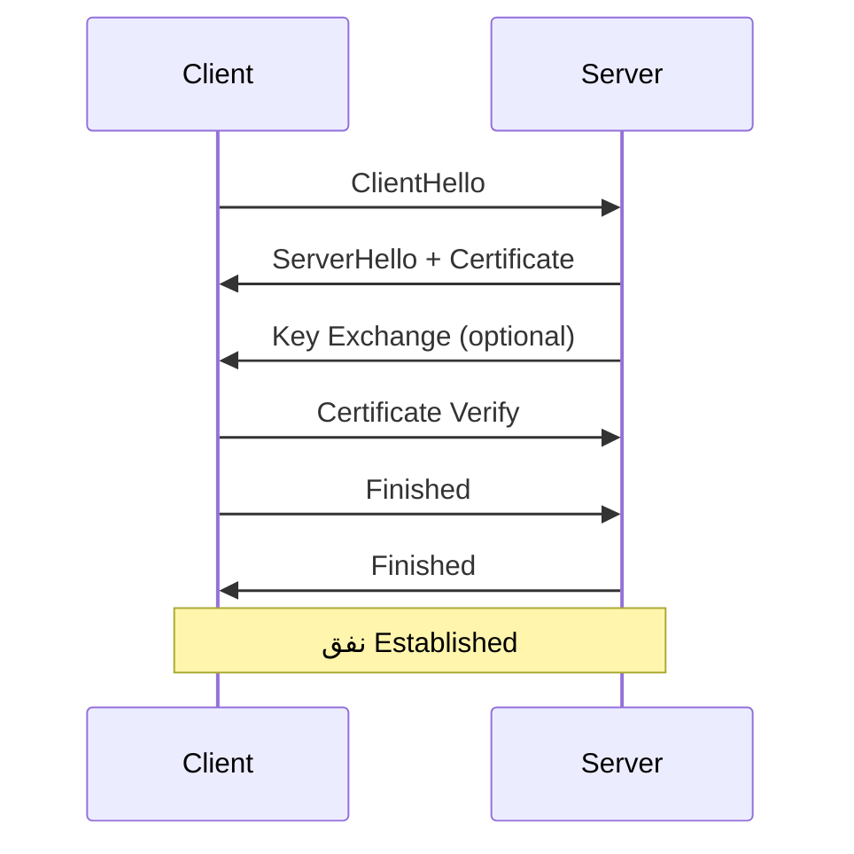
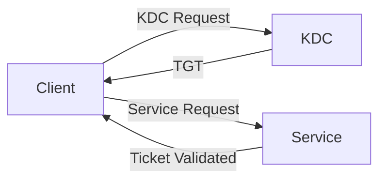
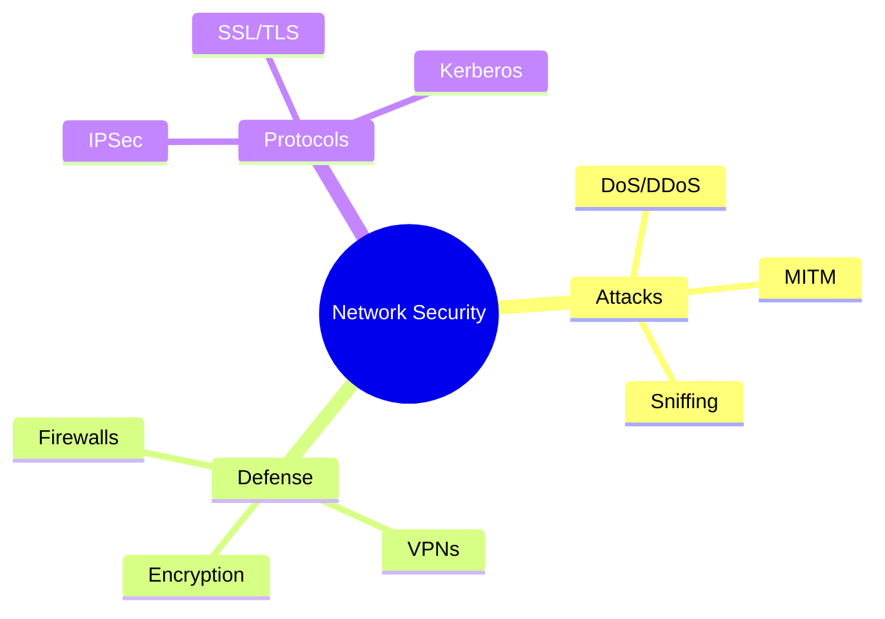

# أمن الشبكات (Network Security)

## نظرة عامة (Overview)

```
┌─────────────────────────────────────────────────────────────┐
│                   Network Security                  │
├─────────────────────────────────────────────────────┤
│  Network Attacks → Firewalls → VPNs → Protocols   │
└─────────────────────────────────────────────────────┘
```

---

## 1. هجمات الشبكات (Network Attacks)

### أنواع الهجمات الشائعة (Common Attack Types)

| نوع الهجوم | الوصف | الطبقة |
|-----------|-------|--------|
| DoS/DDoS | رفض الخدمة الموزع | L3-L7 |
| MITM | hombre in the middle | L2-L3 |
| ARP Spoofing | تسميم ARP | L2 |
| DNS Spoofing | تسميم DNS | L3 |
| Port Scanning | فحص المنافذ | L3-L4 |
| SQL Injection | حقن SQL | L7 |

### هجوم Denial of Service (DoS)



**Types:**
- **SYN Flood**: استهلاك موارد الخادم بـ TCP half-open connections
- **UDP Flood**: إغراق المنافذ بـ UDP packets
- **ICMP Flood**: إغراق ping requests

**Defense:**
```bash
# Rate limiting بـ iptables
iptables -A INPUT -p tcp --syn -m connlimit --connlimit-above 10 -j DROP
iptables -A INPUT -p icmp --icmp-type echo-request -m limit --limit 1/s -j ACCEPT
```

### Mann-in-the-Middle (MITM)



**التدابير الوقائية:**
- **Certificates SSL/TLS**: التحقق من شهادات HTTPS
- **HSTS**: إجبار اتصالات HTTPS
- **Certificate Pinning**: تثبيت الشهادات الموثوقة

---

## 2. جدران الحماية (Firewalls)

### أنواع الجدران (Firewall Types)

| النوع | الطبقة | الوظيفة |
|-------|--------|---------|
| Packet Filter | L3-L4 | تصفية الحزم |
| Stateful Inspection | L3-L4 | تتبع الاتصالات |
| Application Layer | L7 | تصفية التطبيقات |
| Next-Generation | L3-L7 | فحص متقدم |

### جدار قاعدة القواعد (Rule-based Firewall)

```bash
# Example: iptables rules
# Allow established connections
iptables -A INPUT -m state --state ESTABLISHED,RELATED -j ACCEPT

# Allow HTTP/HTTPS
iptables -A INPUT -p tcp --dport 80 -j ACCEPT
iptables -A INPUT -p tcp --dport 443 -j ACCEPT

# Allow SSH (with rate limit)
iptables -A INPUT -p tcp --dport 22 -m state --state NEW -m recent --set
iptables -A INPUT -p tcp --dport 22 -m state --state NEW -m recent --update --seconds 60 --hitcount 4 -j DROP

# Drop all other INPUT
iptables -A INPUT -j DROP
```

### جدار جدول الحالات (Stateful Firewall)



---

## 3. الشبكات الخاصة الافتراضية (VPNs)

### بروتوكولات VPN

| البروتوكول | التشفير | المنفذ | الاستخدام |
|-------------|----------|---------|-----------|
| PPTP | MPPE | 1723 | قديم/غير آمن |
| L2TP/IPSec | 3DES/AES | 500, 1701 | آمن نسبياً |
| OpenVPN | AES | 1194 | مفتوح/آمن |
| WireGuard | ChaCha20-Poly1305 | 51820 | حديث/سريع |
| IPSec | ESP/AH | 50, 51 | معيار |

### IPSec Stack



### تكوين IPSec

```bash
# strongSwan configuration
# /etc/ipsec.conf
conn myvpn
    authby=secret
    left=%any
    right=server.ip
    auto=start
    esp=aes256-sha256!
    ike=aes256-sha256!
```

### SSL VPN

```
┌────────────────────────────────────┐
│          SSL VPN Flow              │
├────────────────────────────────────┤
│ Client → TCP/443                   │
│         ↓                          │
│    SSL/TLS Handshake               │
│         ↓                          │
│   Certificate Verification         │
│         ↓                          │
│   VPN Tunnel Established           │
│         ↓                          │
│  Encrypted Data Transfer           │
└────────────────────────────────────┘
```

---

## 4. IPSec Protocol

### هيكل IPSec


### modes

| Mode | الوصف | الاستخدمات |
|------|-------|--------------|
| Tunnel | يُغلف الحزمة | VPN بين الشبكات |
| Transport | تشفر البيانات فقط | host-to-host |

### تكوين IPSec العملي

```bash
# Check IPSec status
ipsec statusall

# Verify tunnel
ip xfrm state

# Monitor with tcpdump
tcpdump -i eth0 esp or ah
```

---

## 5. SSL/TLS

### SSL/TLS Handshake



### إصدارات TLS

| الإصدار | الحالة | التحسينات |
|---------|---------|-----------|
| SSL 2.0 | ⚠️ Deprecated | 1994 |
| SSL 3.0 | ⚠️ Deprecated | POODLE |
| TLS 1.0 | ⚠️ Deprecated | 1999 |
| TLS 1.1 | ⚠️ Deprecated | 2006 |
| TLS 1.2 | ✅ آمن | AEAD, SHA-256 |
| TLS 1.3 | ✅ آمن | 0-RTT, 1-RTT |

### تكوين الأمان (Hardening)

```nginx
# Nginx TLS configuration
server {
    listen 443 ssl http2;
    
    ssl_protocols TLSv1.2 TLSv1.3;
    ssl_ciphers 'TLS_AES_256_GCM_SHA384:TLS_CHACHA20_POLY1305_SHA256:ECDHE-RSA-AES256-GCM-SHA384';
    ssl_prefer_server_ciphers on;
    
    ssl_certificate /etc/ssl/certs/server.crt;
    ssl_certificate_key /etc/ssl/private/server.key;
    
    # HSTS
    add_header Strict-Transport-Security "max-age=63072000" always;
}
```

---

## 6. بروتوكولات المصادقة (Authentication Protocols)

### PAP vs CHAP

```diff
PAP (Password Authentication Protocol)
+─────────────────────────────
- plaintext 전송
- لا يوجد حماية
- ثنائي الإتجاه

CHAP (Challenge Handshake Authentication Protocol)
+───────────────────────────────
- تشفير كلمة المرور
-单向 desafío
-了三向 handshake
```

### Kerberos



**المراحل:**
1. **AS (Authentication Service)**: منح TGT
2. **TGS (Ticket Granting Service)**: منح خدمة التذكرة
3. **Service**: accès aux ressources

### RADIUS

```
┌─────────────────────────────────────────┐
│           RADIUS Flow                   │
├─────────────────────────────────────────┤
│                                         │
│  NAS ──[Access-Request]──> RADIUS        │
│  NAS <──[Access-Accept]── RADIUS        │
│                                         │
│  Attributes:                           │
│  - User-Name                            │
│  - User-Password                       │
│  - NAS-IP-Address                      │
│  - Service-Type                       │
└─────────────────────────────────────────┘
```

---

## 7. جدول المقارنات (Comparison Tables)

### جدول بروتوكولات التشفير

| البروتوكول | الخوارزمية | مفتاح | السرعة | الأمان |
|-------------|-------------|-------|---------|--------|
| DES | 56-bit | قصير | سريع | ضعيف |
| 3DES | 168-bit | متوسط | بطيء | متوسط |
| AES | 128/256-bit | طويل | سريع | عالي |
| RC4 | 40-256-bit | متغير | سريع | ضعيف |
| ChaCha20 | 256-bit | طويل | سريع | عالي |

### جدول أساليب الدفاع

| التهديد | الكشف | الحماية | التكلفة |
|----------|--------|----------|----------|
| DoS | IDS/IPS | Rate Limiting | منخفض |
| MITM | Certificate Pinning | VPN | متوسط |
| Sniffing | Encryption | SSL/TLS | منخفض |
| Phishing | MFA | 2FA | متوسط |

---

## 8. المشاكل الشائعة والمemarks (Common Pitfalls)

### ⚠️ Problems

```warning
❌ استخدام بروتوكول SSH1
❌ شهادات موقعة ذاتياً في الإنتاج
❌ كلمات مرور ضعيفة للـ VPN
❌ عدم تحديث الجدران الحماية
❌ التسهيل المفرط للجدارار
❌ تسجيل حركة المرور غير مفحوص
```

### ✅ Solutions

```bash
# SSH hardening
# /etc/ssh/sshd_config
PermitRootLogin no
PasswordAuthentication no
PubkeyAuthentication yes
Protocol 2
Ciphers chacha20-poly1305@openssh.com,aes256-gcm@openssh.com

# Check open ports
nmap -sT -O localhost

# Monitor failed logins
grep "Failed password" /var/log/auth.log
```

---

## 9. الأوامر السريعة (Quick Commands)

```bash
# Check open ports
netstat -tulpn

# Port scanning
nmap -sS -O target.com

# SSL certificate check
openssl s_client -connect target.com:443

# Test TLS versions
openssl s_client -tls1_2 -connect target.com:443
openssl s_client -tls1_1 -connect target.com:443

# Check firewall rules
iptables -L -n -v

# Monitor network traffic
tcpdump -i eth0 -w capture.pcap

# Check SSL labs
ssllabs-scan target.com
```

---

## 10. ملخص (Summary)



**Key Points:**
- 🛡️ **Defense in Depth**: طبقات متعددة من الأمان
- 🔐 **Encryption**: تشفير جميع الاتصالات الحساسة
- 🔑 **Authentication**: مصادقة قوية (MFA)
- 📊 **Monitoring**: مراقبة مستمرة
- 🔄 **Updates**: تحديث منتظم