# أمن المعلومات · Information Security (Year 4 - Semester 2)

## 🔐 مقدمة في أمن المعلومات · Introduction to Information Security

### مفهوم الأمن · Security Concept

- **أمن المعلومات** (Information Security): حماية المعلومات من الوصول غير المصرح به، التعديل، أو التدمير.
- **CIA Triad**: السرية، النزاهة، التوفر.

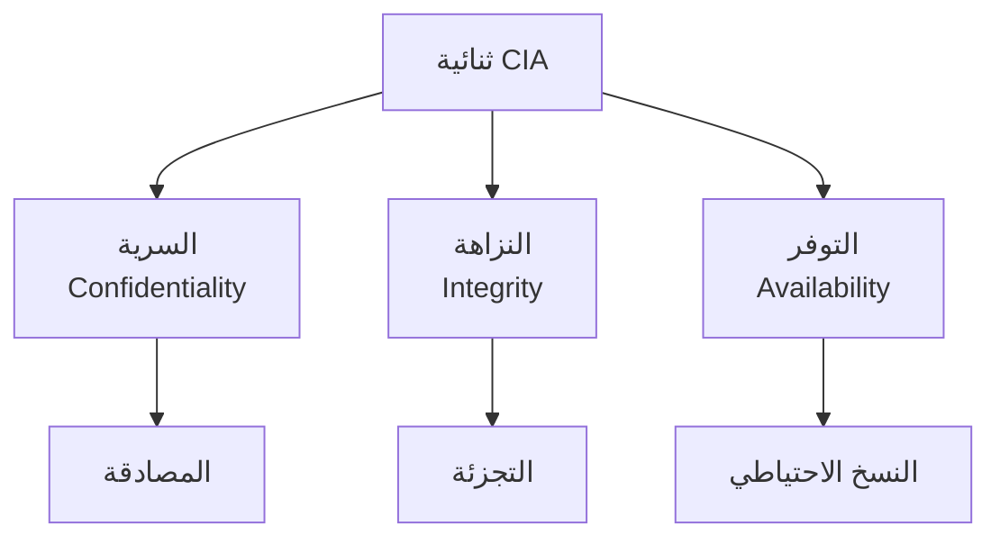

### تهديدات الأمن · Security Threats

| التهديد | الوصف | التأثير |
|---------|-------|--------|
| **Malware** | برمجيات خبيثة | تلف، سرقة |
| **Phishing** | تصيد احتيالي | سرقة بيانات |
| **Man-in-Middle** | اعتراض通信 | سرقة معلومات |
| **DDoS** | حجب الخدمة | تعطيل النظام |
| **SQL Injection** | حقن قواعد البيانات | اختراق |

---

## 🔢 التشفير · Cryptography

### مفهوم التشفير · Cryptography Concept

- **التشفير** (Cryptography): فن وعلم كتابة الرسائل السرية.
- **النص الواضح** (Plaintext): الرسالة الأصلية.
- **النص المشفر** (Ciphertext): الرسالة بعد التشفير.

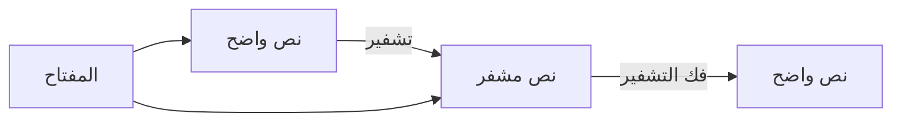

### أنواع التشفير · Encryption Types

| النوع | الوصف | الاستخدام |
|-------|-------|-----------|
| **متماثل** (Symmetric) | نفس المفتاح للتشفير وفك التشفير | تشفير البيانات |
| **غير متماثل** (Asymmetric) | مفتاح عام ومفتاح خاص | توقيع رقمي، تبادل مفاتيح |
| **تجزئة** (Hashing) | تحويل لنص ثابت الطول | التحقق من السلامة |

---

## 🔑 التشفير المتماثل · Symmetric Encryption

### مفهوم · Concept

نفس المفتاح للتشفير وفك التشفير.

$$C = E_k(P)$$

$$P = D_k(C)$$

where $k$ is the secret key.

### خوارزميات · Algorithms

| الخوارزمية | حجم المفتاح | السرعة | الاستخدام |
|------------|-------------|--------|-----------|
| **DES** | 56-bit | بطيء | قديم |
| **3DES** | 112/168-bit | متوسط | توافق قديم |
| **AES** | 128/192/256-bit | سريع | المعيار الحالي |
| **RC4** | متغير | سريع | قديم (ضعيف) |

### طريقة AES · AES Method

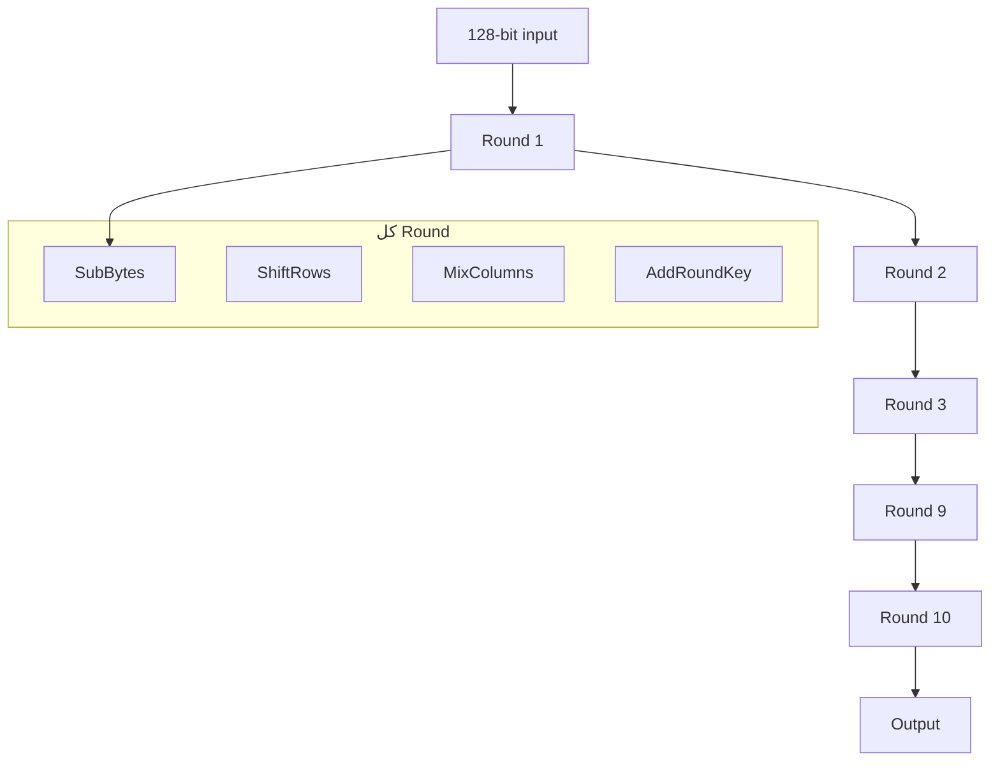

### أوضاع التشفير · Encryption Modes

| الوضع | الوصف | المميزات | العيوب |
|-------|-------|-----------|--------|
| **ECB** | كل كتلة مستقلة | بسيط | أنماط مرئية |
| **CBC** | ربط الكتل | آمن | بطيء |
| **CTR** | عداد | Fast, parallel | يحتاج nonce |
| **GCM** | Counter + Auth | Fast, authenticated | معقد |

#### صيغة CBC

$$C_i = E_k(P_i \oplus C_{i-1})$$

$$P_i = D_k(C_i) \oplus C_{i-1}$$

---

## 🔐 التشفير غير المتماثل · Asymmetric Encryption

### مفهوم · Concept

مفتاحان: عام (للتشفير) وخاص (لفك التشفير).

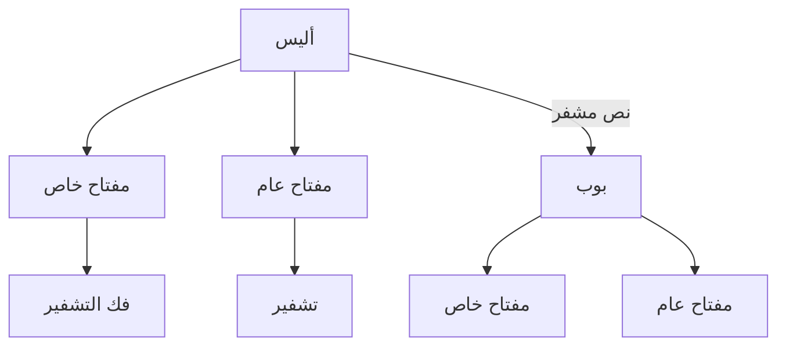

### RSA

$$C = P^e \mod n$$

$$P = C^d \mod n$$

where:
- $e$: exponent العام
- $d$: exponent الخاص
- $n$: modulus = $p \times q$
- $p, q$: عددان أوليان كبيران

### توليد المفاتيح · Key Generation

1. اختر عددين أوليين: $p, q$
2. احسب: $n = p \times q$
3. احسب: $\phi(n) = (p-1)(q-1)$
4. اختر $e$: $\gcd(e, \phi(n)) = 1$
5. احسب $d$: $d \times e \equiv 1 \pmod{\phi(n)}$

### Diffie-Hellman

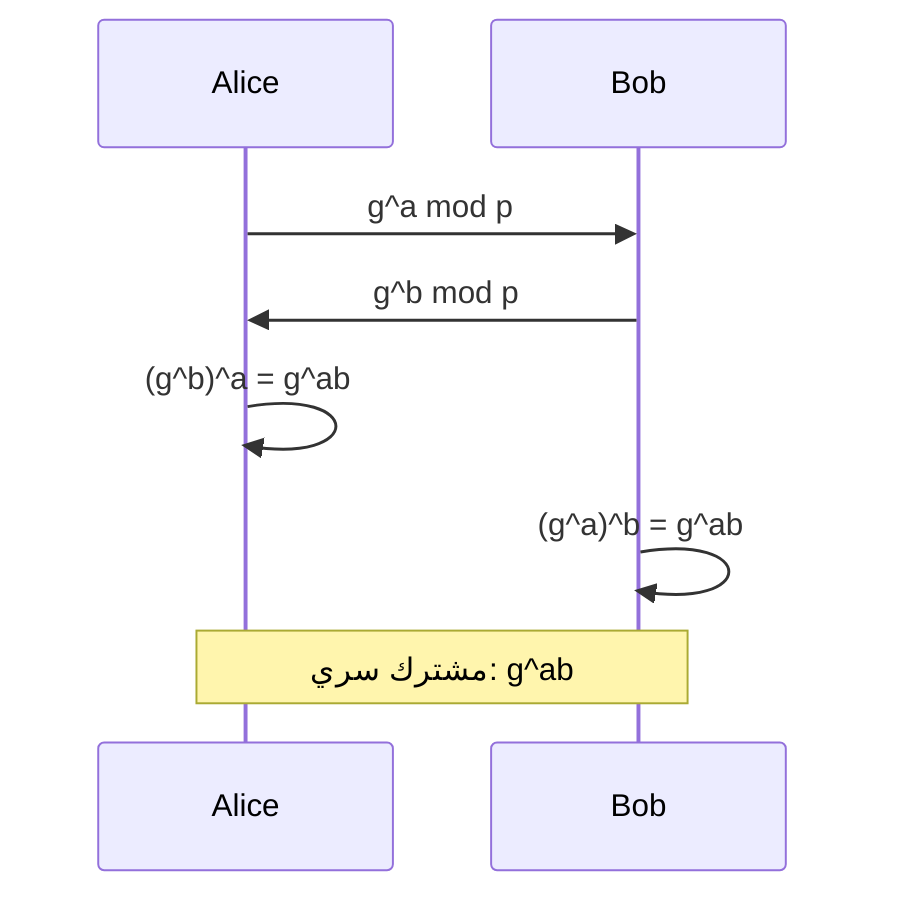

---

## 📝 التوقيع الرقمي · Digital Signature

### مفهوم · Concept

تحقق هوية المرسل وسلامة الرسالة.

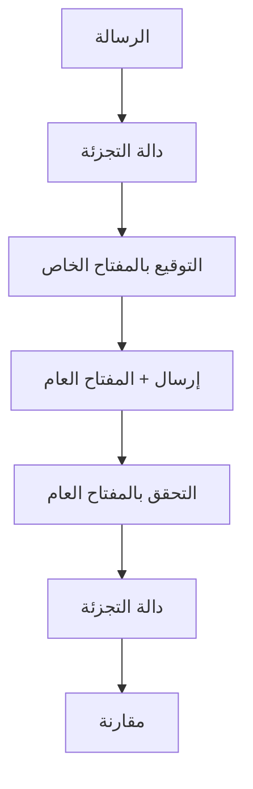

### DSA (Digital Signature Algorithm)

1. **التوقيع**:
   - اختيار $k$ عشوائي
   - حساب $r = (g^k \mod p) \mod q$
   - حساب $s = k^{-1}(H(m) + xr) \mod q$
   - التوقيع = $(r, s)$

2. **التحقق**:
   - حساب $w = s^{-1} \mod q$
   - حساب $u_1 = H(m)w \mod q$
   - حساب $u_2 = rw \mod q$
   - التحقق: $v = (g^{u_1} y^{u_2} \mod p) \mod q$

---

## 🔒 المصادقة · Authentication

### مفهوم · Concept

التحقق من هوية المستخدم/النظام.

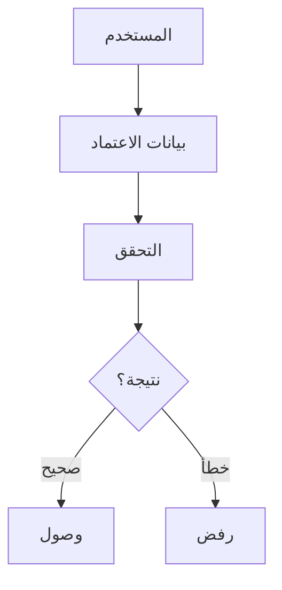

### طرق المصادقة · Authentication Methods

| الطريقة | الوصف | المزايا | العيوب |
|---------|-------|---------|--------|
| **كلمة مرور** | كلمة سر | سهل |薄弱 |
| **مفتاح مادي** | Token | آمن | تكلفة |
| **بيومترك** | بصمة، وجه | ملائم |expensive |
| **ث-factor** | SMS, app | آمن | بطيء |

### بروتوكول المصادقة · Authentication Protocols

#### Kerberos

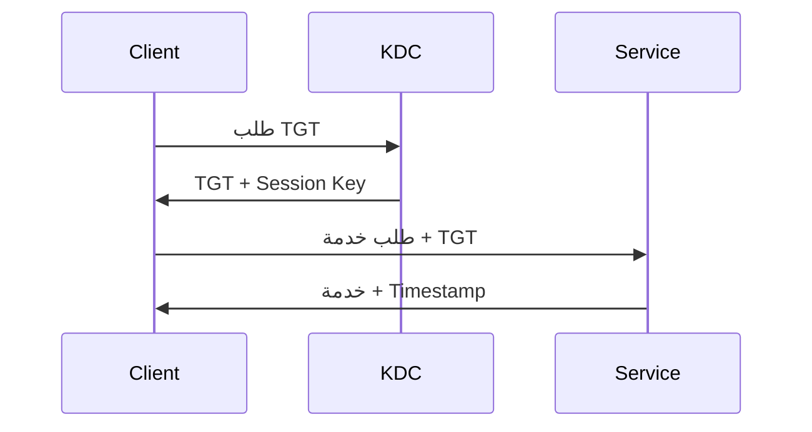

#### RADIUS

Remote Authentication Dial-In User Service - بروتوكول مركزي للمصادقة.

---

## 🌐 أمان الشبكات · Network Security

### طبقات الأمان · Security Layers

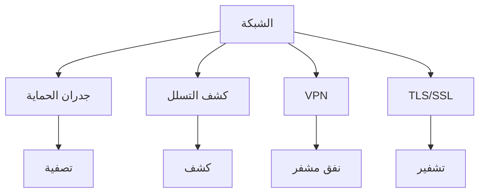

### جدران الحماية · Firewalls

| النوع | الوصف |
|-------|-------|
| **Packet Filter** | فلترة حزم IP |
| **Stateful** | تتبع الاتصالات |
| **Application** | فلترة التطبيقات |
| **Proxy** | وسيط بين العميل والخادم |

### VPN (Virtual Private Network)

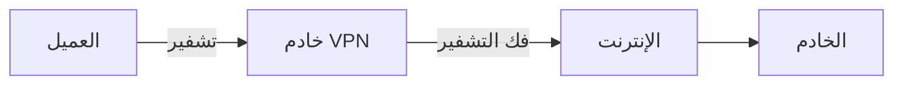

### TLS/SSL

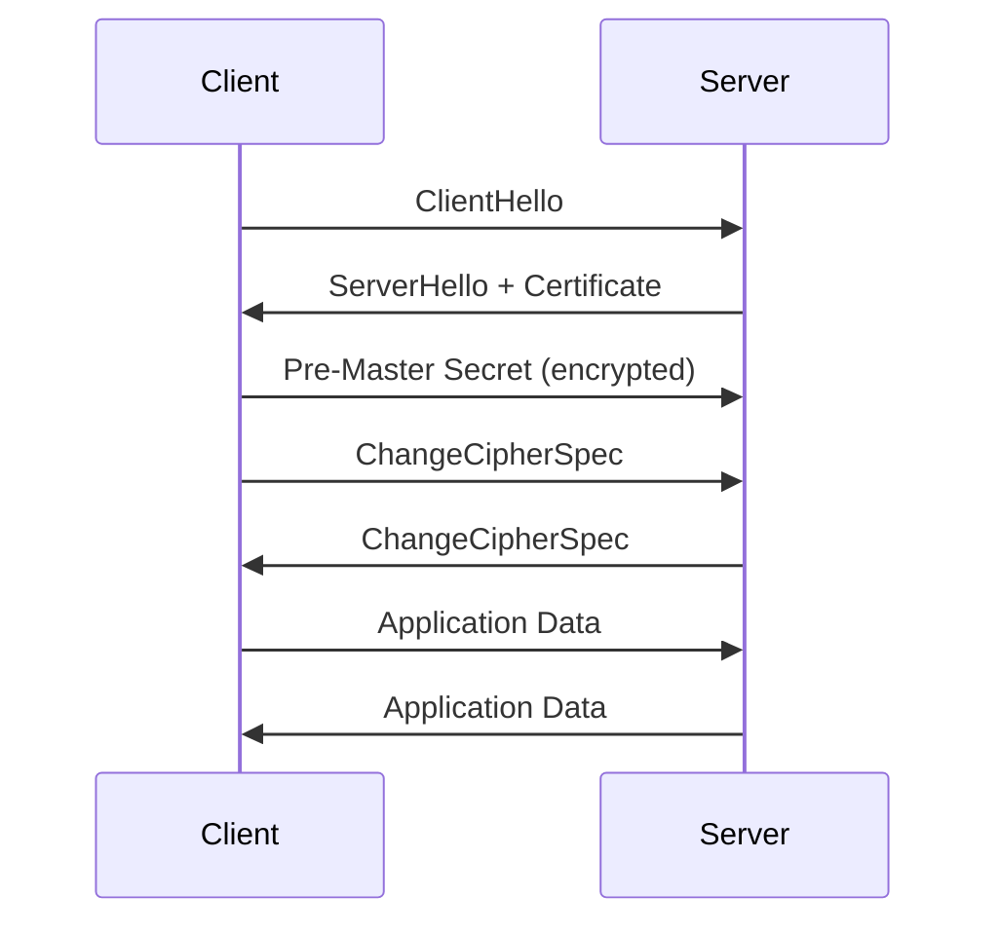

---

## 📋 بروتوكولات الأمان · Security Protocols

### SSH (Secure Shell)

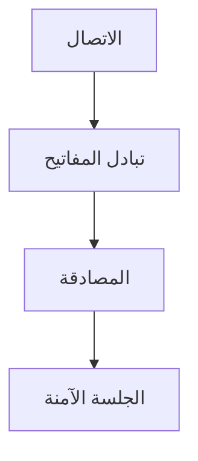

### IPsec

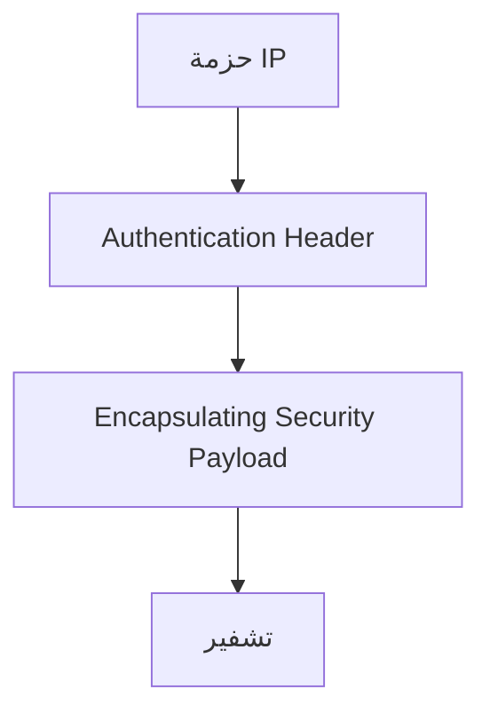

### SSL/TLS Handshake

1. **ClientHello**: إصدار TLS، خوارزميات
2. **ServerHello**: الإصدار المختار، الشهادة
3. **Certificate**: شهادة الخادم
4. **Key Exchange**: مشاركة المفتاح
5. **Finished**: تأكيد الاتصال

---

## 📊 جدول مرجعي شامل · Master Reference Table

### خوارزميات التشفير · Encryption Algorithms

| الخوارزمية | النوع | حجم المفتاح | الاستخدام |
|------------|-------|-------------|-----------|
| AES | Symmetric | 128/192/256 | تشفير البيانات |
| DES | Symmetric | 56 | قديم |
| RSA | Asymmetric | 1024-4096 | توقيع، تشفير |
| ECC | Asymmetric | 160-512 |.mobile |
| SHA-256 | Hash | ثابت | تجزئة |

### مستويات الأمان · Security Levels

| المستوى | الوصف |
|---------|-------|
| **Physical** | أمان فيزيائي |
| **Network** | أمان الشبكة |
| **Application** | أمان التطبيقات |
| **Data** | أمان البيانات |

### Attack Types

| الهجوم | الوصف | الحماية |
|--------|-------|--------|
| **DDoS** | حجب الخدمة | CDN, Firewall |
| **SQL Injection** | حقن SQL | Parameterized queries |
| **XSS** | نصوص برمجية | Escaping |
| **MITM** | اعتراض | TLS |

---

## ⚠️ أخطاء شائعة وملاحظات · Common Pitfalls & Notes

### ❌ أخطاء شائعة

1. **التشفير**:
   - استخدام خوارزميات ضعيفة/قديمة (DES, RC4)
   - تخزين مفاتيح ضعيفة

2. **المصادقة**:
   - كلمات مرور ضعيفة
   - عدم استخدام 2FA

3. **الشبكة**:
   - عدم تشفير الاتصالات
   - firewall misconfigured

4. **التطبيقات**:
   - عدم التحقق من المدخلات
   - ثغرات حقن

### 💡 نصائح مهمة

- **مبدأ الحد الأدنى**: فقط الصلاحيات المطلوبة
- **Defense in Depth**: طبقات متعددة من الأمان
- **Zero Trust**: لا تثق بأحد، تحقق دائماً
- **Keep Updated**: أحدث التصحيحات دائماً

### 📌 ملاحظات نهائية

- **CIA Triad**: الأساس في أمن المعلومات
- **Encryption at Rest**: تشفير البيانات المخزنة
- **Encryption in Transit**: تشفير البيانات المنقولة
- **Key Management**: إدارة المفاتيح حجر الأساس

---

## 📝 أمثلة محلولة · Worked Examples

### مثال 1: تشفير Caesar

**النص**: "HELLO"
**المفتاح**: 3

**الحل:**
- H → K
- E → H
- L → O
- L → O
- O → R

**النتيجة**: "KHOOR"

### مثال 2: RSA بسيط

**المعطيات:**
- p = 3, q = 11
- n = 33
- e = 3

**الحل:**
- $\phi(n) = (3-1)(11-1) = 20$
- $d = 7$ (since $3 \times 7 = 21 \equiv 1 \mod 20$)

**تشفير** (P=5):
$$C = 5^3 \mod 33 = 125 \mod 33 = 26$$

**فك التشفير**:
$$P = 26^7 \mod 33 = 5$$

### مثال 3: تجزئة SHA-256

**المدخل**: "hello"

**النتيجة** (hex):
```
2cf24dba5fb0a30e26e83b2ac5b9e29e1b161e5c1fa7425e73043362938b9824
```

---

(End of file)