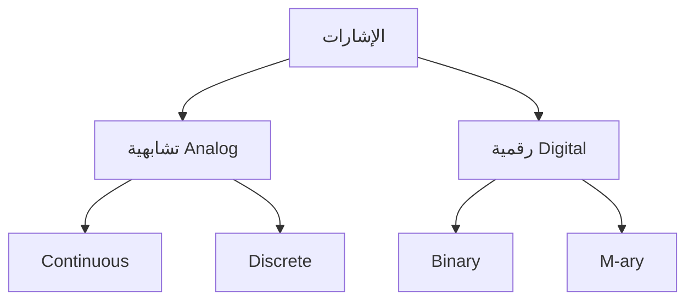
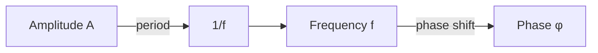
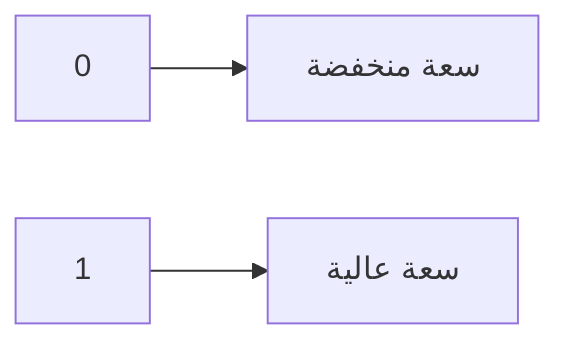
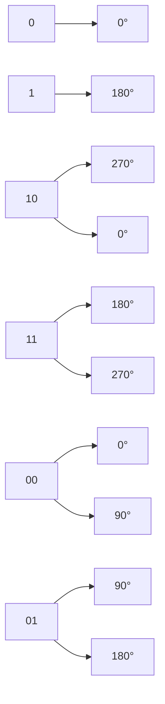
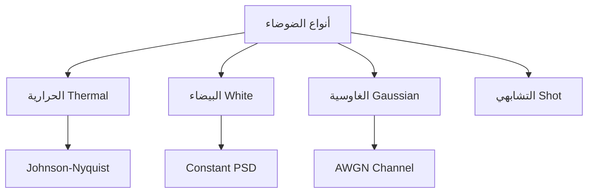
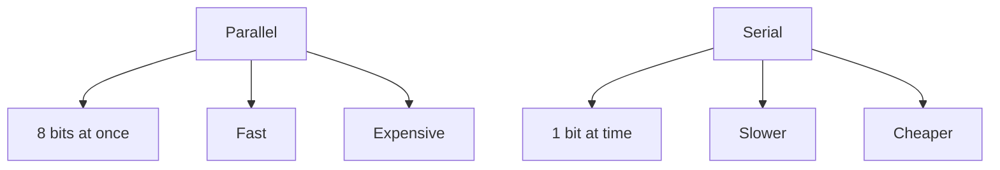
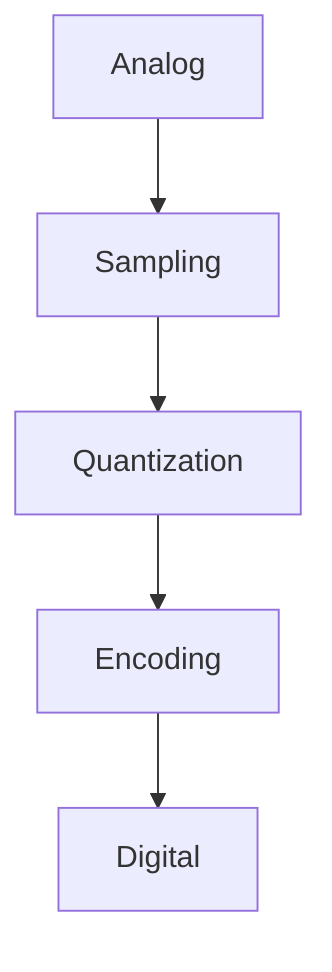

# اتصالات تشابهية ورقمية · Analog and Digital Communications (Year 3 - Semester 2)

---

## 🔊 الإشارات · Signals

### أنواع الإشارات · Signal Types



### الخصائص الأساسية · Basic Properties

| الخاصية | Property | الصيغة |
|---------|----------|--------|
| **السعة** | Amplitude | $A$ |
| **التردد** | Frequency | $f$ (Hz) |
| **الطور** | Phase | $\phi$ (radians) |
| **الطاقة** | Energy | $E = \int |x(t)|^2 dt$ |
| **الطاقة المتوسطة** | Avg Power | $P = \lim_{T\to\infty} \frac{1}{T} \int_{-T/2}^{T/2} |x(t)|^2 dt$ |

### الإشارة الجيبية · Sinusoidal Signal

$$x(t) = A \sin(2\pi f t + \phi)$$



---

## 🌊 التعديل · Modulation

### 1. التعديل التشابهي (Analog Modulation)

#### AM (Amplitude Modulation)

$$s_{AM}(t) = [A_c + m(t)] \cos(2\pi f_c t)$$

```python
def am_modulate(message, carrier_freq, carrier_amp):
    """تعديل السعة"""
    t = np.linspace(0, 1, 1000)
    carrier = carrier_amp * np.sin(2 * np.pi * carrier_freq * t)
    modulated = (carrier_amp + message) * np.sin(2 * np.pi * carrier_freq * t)
    return modulated
```

**المؤشر:**
- $m(t)$: إشارة الرسالة
- $A_c$: سعة الناقل
- $f_c$: تردد الناقل

#### FM (Frequency Modulation)

$$s_{FM}(t) = A_c \sin(2\pi f_c t + 2\pi k_f \int m(\tau) d\tau)$$

```python
def fm_modulate(message, carrier_freq, freq_dev):
    """تعديل التردد"""
    t = np.linspace(0, 1, 1000)
    integral = np.cumsum(message) * (t[1] - t[0])
    modulated = np.sin(2 * np.pi * carrier_freq * t + 2 * np.pi * freq_dev * integral)
    return modulated
```

### 2. التعديل الرقمي (Digital Modulation)

#### ASK (Amplitude Shift Keying)



```python
def ask_modulate(bits, carrier_freq, amp_low, amp_high):
    """تعديل سعة رقمي"""
    signal = []
    for bit in bits:
        t = np.linspace(0, 1, 100)
        if bit == 0:
            signal.extend(amp_low * np.sin(2 * np.pi * carrier_freq * t))
        else:
            signal.extend(amp_high * np.sin(2 * np.pi * carrier_freq * t))
    return np.array(signal)
```

#### FSK (Frequency Shift Keying)

```python
def fsk_modulate(bits, freq_0, freq_1):
    """تعديل تردد رقمي"""
    signal = []
    for bit in bits:
        t = np.linspace(0, 1, 100)
        if bit == 0:
            signal.extend(np.sin(2 * np.pi * freq_0 * t))
        else:
            signal.extend(np.sin(2 * np.pi * freq_1 * t))
    return np.array(signal)
```

#### PSK (Phase Shift Keying)



```python
def psk_modulate(bits, carrier_freq):
    """تعديل الطور"""
    signal = []
    for bit in bits:
        t = np.linspace(0, 1, 100)
        phase = 0 if bit == 0 else np.pi
        signal.extend(np.sin(2 * np.pi * carrier_freq * t + phase))
    return np.array(signal)
```

### مقارنة أنظمة التعديل

| النوع | Type | المميزات | العيوب | الاستخدام |
|-------|------|----------|--------|-----------|
| **AM** | تشابهي | بسيط، رخيص | ضوضائي | البث الإذاعي |
| **FM** | تشابهي | مقاوم للضوضاء | عرض نطاق أكبر | البث الصوتي |
| **ASK** | رقمي | بسيط | غير مقاوم | نقل بطيء |
| **FSK** | رقمي | مقاوم | عرض نطاق | المودم |
| **PSK** | رقمي | كفاء عالية | معقد | المودم |

---

## 🧮 الترميز · Encoding

### 1. الترميز الرقمي · Digital Encoding

#### NRZ (Non-Return-to-Zero)

```mermaid
gantt
    title NRZ Encoding
    dateFormat X
    axisFormat %s
    
    section Signal
    0 : 0, 3
    1 : 3, 7
    0 : 7, 10
    1 : 10, 13
```



```python
def nrz_encode(bits):
    """NRZ-L encoding"""
    return [1 if bit == 1 else -1 for bit in bits]
```

#### RZ (Return-to-Zero)

```python
def rz_encode(bits):
    """Return-to-Zero"""
    signal = []
    for bit in bits:
        if bit == 1:
            signal.extend([1, 0])
        else:
            signal.extend([-1, 0])
    return signal
```

#### Manchester Encoding

```python
def manchester_encode(bits):
    """Manchester (Bipolar)"""
    signal = []
    for bit in bits:
        if bit == 1:
            signal.extend([1, -1])  # rising edge
        else:
            signal.extend([-1, 1])  # falling edge
    return signal
```

### 2. ترميز البيانات · Data Encoding

#### ASCII & Unicode

```python
def text_to_binary(text):
    """تحويل نص لـ binary"""
    return ''.join(format(ord(c), '08b') for c in text)

def binary_to_text(binary):
    """تحويل binary لـ نص"""
    return ''.join(chr(int(binary[i:i+8], 2)) for i in range(0, len(binary), 8))
```

#### Huffman Encoding (للضغط)

```python
import heapq
from collections import Counter

def huffman_encode(data):
    # حساب التردد
    freq = Counter(data)
    
    # بناء heap
    heap = [[weight, [symbol, '']] for symbol, weight in freq.items()]
    heapq.heapify(heap)
    
    # بناء الشجرة
    while len(heap) > 1:
        lo = heapq.heappop(heap)
        hi = heapq.heappop(heap)
        for pair in lo[1:]:
            pair[1] = '0' + pair[1]
        for pair in hi[1:]:
            pair[1] = '1' + pair[1]
        heapq.heappush(heap, [lo[0] + hi[0]] + lo[1:] + hi[1:])
    
    return dict(heap[0][1:])
```

### جدول الترميز · Encoding Comparison

| الترميز | Bits/Level | المميزات | العيوب |
|---------|------------|----------|--------|
| **NRZ** | 1 | بسيط | DC component |
| **RZ** | 2 | self-clocking | عرض نطاق |
| **Manchester** | 2 | sync | بطيء |
| **Huffman** | variable | ضغط | معقد |

---

## 🔊 الضوضاء · Noise

### أنواع الضوضاء · Noise Types



### 1. ضوضاء حرارية (Thermal Noise)

$$P_n = kTB$$

حيث:
- $k$: ثابت بولتزمان ($1.38 \times 10^{-23}$ J/K)
- $T$: درجة الحرارة (Kelvin)
- $B$: عرض النطاق (Hz)

```python
def thermal_noise_power(temperature, bandwidth):
    """حساب قدرة الضوضاء الحرارية"""
    k = 1.38e-23  # Boltzmann constant
    return k * temperature * bandwidth
```

### 2. نسبة الإشارة للضوضاء (SNR)

$$SNR_{linear} = \frac{P_{signal}}{P_{noise}}$$

$$SNR_{dB} = 10 \log_{10}\left(\frac{P_{signal}}{P_{noise}}\right)$$

```python
def db_to_linear(db):
    return 10 ** (db / 10)

def linear_to_db(linear):
    return 10 * np.log10(linear)
```

### 3. الضوضاء في أنظمة الاتصال

#### Noise Figure

$$NF = \frac{SNR_{in}}{SNR_{out}}$$

#### Noise Temperature

$$T_e = T_{ref}(NF - 1)$$

---

## 📐 نظرية شانون · Shannon's Theorem

### 1. سعة قناة شانون (Channel Capacity)

$$C = B \log_2(1 + SNR)$$

حيث:
- $C$: السعة (bits/second)
- $B$: عرض النطاق (Hz)
- $SNR$: نسبة الإشارة للضوضاء

```python
def shannon_capacity(bandwidth, snr):
    """حساب سعة قناة شانون"""
    return bandwidth * np.log2(1 + snr)
```

### 2. نظرية الترميز

> **Shannon's Channel Coding Theorem:**
> إذا كانت المعدل $R < C$، يمكن الترميز بحيث يكون احتمال الخطأ صغيرًا بشكل تعسفي.

### 3. سعة قناة غاوسية

$$C = B \log_2\left(1 + \frac{P}{N_0 B}\right)$$

حيث:
- $P$: قدرة الإشارة
- $N_0$: كثافة طاقة الضوضاء

### 4. مخطط شانون

```mermaid
graph LR
    A[المصدر] --> B[المُرمّز]
    B --> C[القناة]
    C --> D[المُفكّك]
    D --> E[الاستقبال]
    
    style C fill:#ff6b6b
    C -->|ضوضاء| C
    
    subgraph سعة شانون
    F[ C = B log₂(1+SNR) ]
    end
```

---

## 📡 الإرسال الرقمي · Digital Transmission

### 1. الإرسال المتوازي مقابل التسلسلي



### 2. تقنيات الإرسال

#### PAM (Pulse Amplitude Modulation)

```python
def pam_modulate(bits, levels):
    """PAM with M levels"""
    m = len(levels)
    signal = []
    for bit_group in chunks(bits, int(np.log2(m))):
        index = int(bit_group, 2)
        signal.append(levels[index])
    return signal
```

#### PCM (Pulse Code Modulation)



```python
def pcm_encode(analog_signal, bits_per_sample):
    """PCM encoding"""
    # التكميم
    levels = 2 ** bits_per_sample
    max_val = max(analog_signal)
    quantized = [int(x / max_val * (levels - 1)) for x in analog_signal]
    
    # الترميز
    binary = [format(q, f'0{bits_per_sample}b') for q in quantized]
    return ''.join(binary)
```

### 3. معدل البيانات

#### معدل باود (Baud Rate)

$$Rate_{baud} = \frac{\text{bits per second}}{\text{bits per symbol}}$$

```python
def baud_rate(bits_per_second, bits_per_symbol):
    return bits_per_second / bits_per_symbol
```

### 4. عرض النطاق

$$B = \frac{R}{2 \log_2 M}$$

حيث:
- $R$: معدل البيانات
- $M$: مستويات الإشارة

---

## 📊 جدول مرجعي شامل · Master Reference Table

### أنواع التعديل

| النوع | الوصف | SNR المطلوب | عرض النطاق |
|-------|-------|-------------|-------------|
| **AM** | تعديل السعة | عالي | 2× message |
| **FM** | تعديل التردد | منخفض | 2× message |
| **ASK** | 2 مستويات | عالي | منخفض |
| **FSK** | 2 ترددات | متوسط | عالي |
| **PSK** | 2 طور | منخفض | منخفض |

### صيغ شانون

| الصيغة | المعنى |
|--------|--------|
| $C = B \log_2(1+SNR)$ | سعة القناة |
| $SNR_{dB} = 10 \log_{10}(SNR)$ | dB conversion |
| $P_n = kTB$ | قدرة الضوضاء |
| $B = R / (2 \log_2 M)$ | عرض النطاق |

### ترميز الإشارة

| الترميز | Clock | DC | Noise |
|---------|-------|-----|-------|
| **NRZ** | لا | نعم | حساس |
| **RZ** | نعم | لا | حساس |
| **Manchester** | نعم | لا | مقاوم |

---

## ⚠️ أخطاء شائعة وملاحظات · Common Pitfalls & Notes

### ❌ أخطاء شائعة

1. **الخلط بين Hz و rad/s:**
   - $2\pi f$ للتحويل
   - تردد الزاوية rad/s ≠ تردد Hz

2. **الخلط بين السعة والقدرة:**
   - السعة $A$، القدرة $A^2$
   - SNR للقدرة ≠ SNR للسعة

3. **تطبيق صيغة شانون بشكل خاطئ:**
   - $C$ تقاس بـ bits/second وليس bits/s/Hz
   - SNR يجب أن يكون linear وليس dB

4. **البحث عن معدل باود:**
   - Baud = symbols/second
   - Bit rate = baud × bits/symbol

5. **تعديل FM vs PM:**
   - FM: تغير التردد مع الزمن
   - PM: تغير الطور مع الزمن
   - $\frac{d\phi}{dt} = 2\pi f$

### ❌ مفاهيم خاطئة شائعة

- **"FM أفضل من AM":** كلاهما لمختلف الاستخدامات
- **" المزيد من التردد = أفضل":** عرض النطاق مورد محدود
- **" Shannon_limit قابل للتحقيق":** نظري فقط، عملياً ناقص

### 💡 نصائح مهمة

- **لاختيار التعديل:**
  - ضوضاء عالية → FM/PSK
  - عرض نطاق محدود → PSK
  - تكلفة منخفضة → ASK

- **لشانون:**
  - $SNR_{dB} = SNR_{linear}$ في dB
  - $C$ يقرب من $1.44 B$ when $SNR \gg 1$

---

## 📝 أمثلة محلولة · Worked Examples

### مثال 1: حساب سعة شانون

**المعطيات:** $B = 4 \text{ kHz}$، $SNR = 30 \text{ dB}$

**الحل:**
$$SNR_{linear} = 10^{30/10} = 1000$$

$$C = 4000 \times \log_2(1001) \approx 4000 \times 9.97 = 39.88 \text{ kbps}$$

### مثال 2: ترميز NRZ

**البتات:** 10110

**NRZ-L:** -1, 1, 1, -1, 1

### مثال 3: مقارنة التعديل

**سيناريو:** إرسال 1 Mbps على قناة 10 kHz

| الطريقة | Bits/Symbol | Baud | SNR المطلوب |
|---------|-------------|------|-------------|
| **ASK** | 1 | 1M | عالي |
| **FSK** | 1 | 1M | متوسط |
| **QPSK** | 2 | 500K | منخفض |

---

(End of file)
