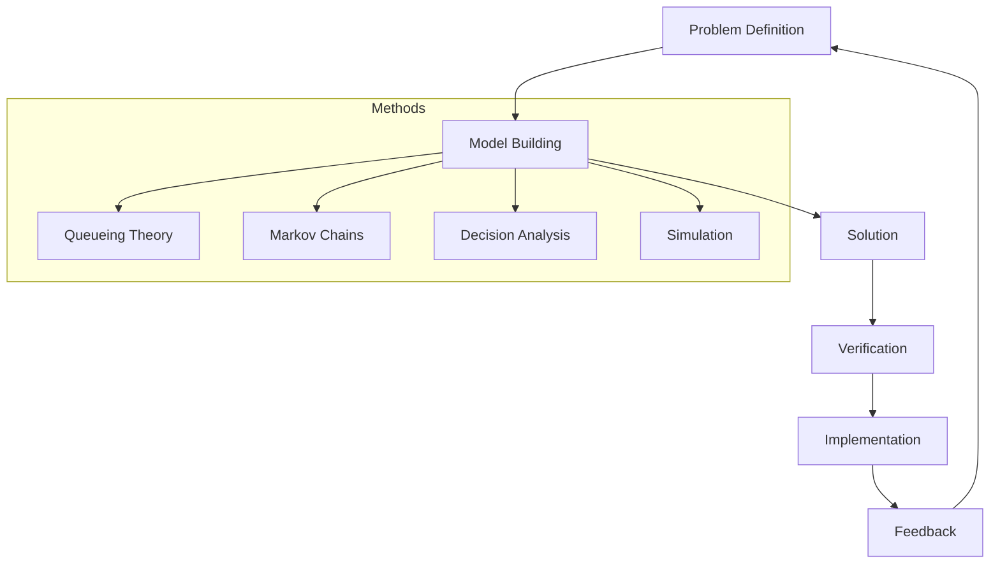
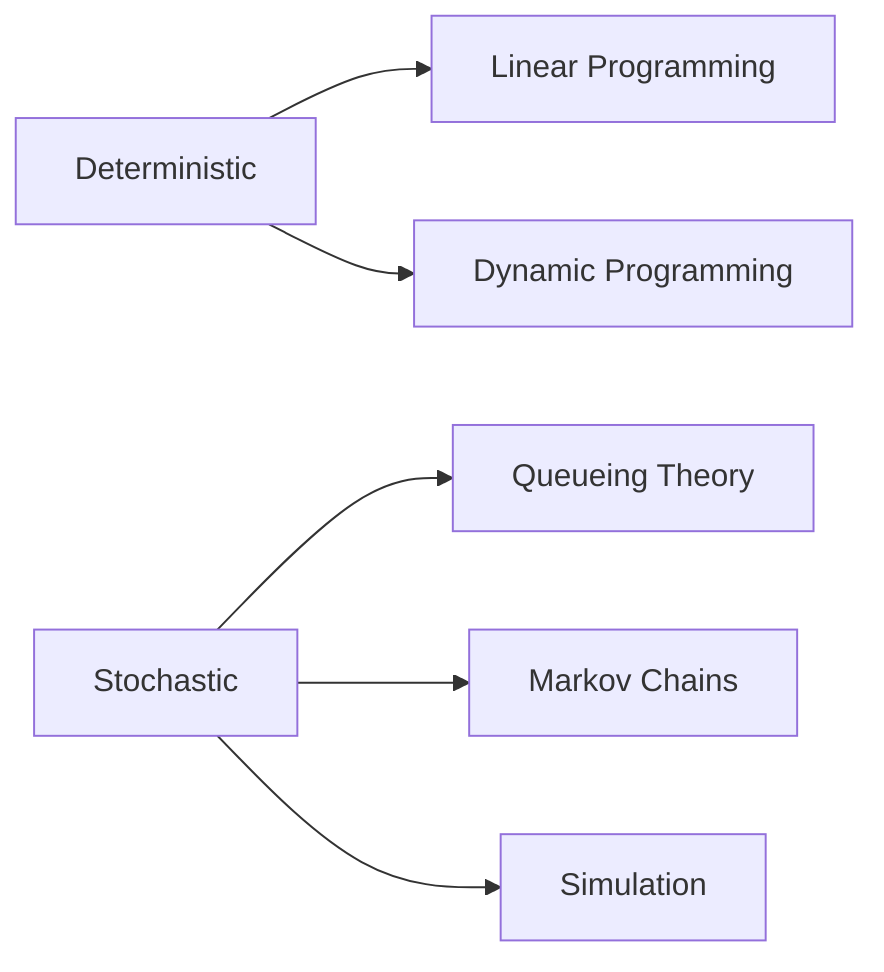

# بحوث العمليات · Operations Research

## 📐 التعاريف الأساسية · Core Definitions

- **نظرية الطوابير** (Queueing Theory): دراسة'attente والخدمة.
- **سلاسل ماركوف** (Markov Chains): Processes probabilistic with memoryless property.
- **تحليل القرارات** (Decision Analysis): اتخاذ قرارات under uncertainty.
- **المحاكاة** (Simulation): نمذجة النظم عشوائيًا.
- **التحسين** (Optimization): إيجاد best solution.
- **البرمجة الخطية** (Linear Programming): تحسين دالة خطية.

---

## 🔁 نموذج النظام · System Model

### دورة بحوث العمليات · OR Cycle

### أنواع النماذج · Model Types

---

## 🧮 النظريات والصيغ · Theorems & Formulas

### 1. نظرية الطوابير · Queueing Theory

#### نموذج M/M/1

$$\rho = \frac{\lambda}{\mu}$$

where:
- $\lambda$: arrival rate (customers/time)
- $\mu$: service rate (customers/time)

$$0 \leq \rho < 1$$

#### AverageNumber in System

$$L = \frac{\rho}{1 - \rho}$$

#### average Waiting Time

$$W = \frac{1}{\mu - \lambda}$$

#### Little's Law

$$L = \lambda times W$$

### 2. سلاسل ماركوف · Markov Chains

#### Transition Matrix

$$P = \begin{pmatrix} p_{11} & p_{12} \\ p_{21} & p_{22} \end{pmatrix}$$

where $p_{ij}$ = probability of transition from state $i$ to $j$

#### Stationary Distribution

$$\pi P = \pi$$
$$\sum \pi_i = 1$$

#### n-step Probability

$$P^{(n)} = P^n$$

### 3. تحليل القرارات · Decision Analysis

#### Expected Value

$$E[X] = \sum p_i x_i$$

#### Expected Monetary Value (EMV)

$$EMV = \sum p_i \times V_i$$

#### Expected Opportunity Loss (EOL)

$$EOL = \sum p_i \times L_i$$

### 4. المحاكاة · Simulation

#### Random Number Generation

$$U_i = (a \times U_{i-1} + c) \mod m$$

#### Inverse Transform Method

$$X = F^{-1}(U)$$

---

## 📊 جدول مرجعي · Reference Tables

### جدول نماذج الطوابير · Queueing Models

| النموذج | arrival | Service | Servers | التطبيقات |
| ---------- | ----- | ----- | ----- | ---------- |
| **M/M/1** | Poisson | Exponential | 1 | single queue |
| **M/M/c** | Poisson | Exponential | c | multi-server |
| **M/D/1** | Poisson | Deterministic | 1 | fixed service |
| **D/M/1** | Deterministic | Exponential | 1 | periodic arrival |

### جدول الصيغ · Queueing Formulas

| Metri c| M/M/1 | M/M/c |
| ---------- | ----- | ----- |
| $L_q$ | $\frac{\rho^2}{1-\rho}$ | complex |
| $W_q$ | $\frac{\rho}{\mu(1-\rho)}$ | complex |
| Utilization | $\rho$ | $\frac{\lambda}{c\mu}$ |

### جدول التوزيعات · Distributions

| التوزيع | PDF/CDF | الاست��دام |
| ---------- | ----- | ----- |
| **Uniform** | $f(x) = 1/(b-a)$ | random selection |
| **Exponential** | $f(x) = \lambda e^{-\lambda x}$ | interarrival times |
| **Normal** | $f(x) = \frac{1}{\sigma\sqrt{2\pi}} e^{-(x-\mu)^2/2\sigma^2}$ | measurement errors |
| **Poisson** | $P(k) = \frac{\lambda^k e^{-\lambda}}{k!}$ | rare events |

---

## 📝 أمثلة محلولة · Worked Examples

### مثال 1: M/M/1 Queue

**المعطيات:**
- Arrival rate: 10 customers/hour
- Service rate: 15 customers/hour

**الحل:**
$$\rho = \frac{10}{15} = 0.667$$

$$L = \frac{0.667}{1 - 0.667} = \frac{0.667}{0.333} = 2$$

$$W = \frac{1}{15 - 10} = \frac{1}{5} = 0.2 \text{ hours} = 12 \text{ minutes}$$

### مثال 2: Markov Chain steady-state

**المعطيات:**
$$P = \begin{pmatrix} 0.7 & 0.3 \\ 0.4 & 0.6 \end{pmatrix}$$

**الحل:**
$$\pi_1 = 0.7\pi_1 + 0.4\pi_2$$
$$\pi_2 = 0.3\pi_1 + 0.6\pi_2$$
$$\pi_1 + \pi_2 = 1$$

Solving:
$$\pi_1 = 0.4\pi_1 + 0.4\pi_2 \implies 0.6\pi_1 = 0.4\pi_2$$
$$\pi_1 = \frac{2}{3}\pi_2$$

$$\frac{2}{3}\pi_2 + \pi_2 = 1 \implies \frac{5}{3}\pi_2 = 1 \implies \pi_2 = \frac{3}{5} = 0.6$$

$$\pi_1 = \frac{2}{3} times 0.6 = 0.4$$

### مثال 3: Decision Tree

**المعطيات:**
- Option A: Invest in project (cost $100K)
  - High demand (60%): profit $300K
  - Low demand (40%): loss $50K
- Option B: Do nothing

**الحل:**
$$EMV_A = 0.6 times 300K + 0.4 times (-50K)$$
$$= 180K - 20K = 160K$$
$$Net = 160K - 100K = 60K$$

$$EMV_B = 0$$

**القرار**: Choose A (higher EMV)

---

## ⚠️ أخطاء شائعة وملاحظات · Common Pitfalls & Notes

### ❌ أخطاء شائعة

1. **الخلط بين $\rho$ و utilization:**
   - $\rho$: traffic intensity
   - Utilization: busy fraction
   - 💡 **ملاحظة**: For M/M/1, $\rho = \lambda/\mu = U$!

2. **نسيان شرط الاستقرار:**
   - For M/M/1: $\rho < 1$
   - If $\rho \geq 1$: infinite queue!
   - System becomes unstable

3. **الخلط بين stationary و transient:**
   - Stationary: long-term behavior
   - Transient: initial behavior
   - Markov chains converge to stationary!

4. **عدم فهم Little's Law:**
   - $L = \lambda \times W$
   - Important: consistent units!
   - If $\lambda$ in customers/hour, $W$ in hours

### 💡 نصائح مهمة

- **Queueing Theory:**
  - Optimize cost vs service level
  - Use simulation for complex systems
  - Consider multiple queues

- **Markov Chains:**
  - Classify states: recurrent vs transient
  - Find stationary distribution
  - Use for reliability analysis

- **Simulation:**
  - Warm-up period: ignore initial data
  - Run length: sufficient for precision
  - Replications: reduce variance

### 📌 ملاحظات نهائية

- **Decision Criteria:**
  - EMV: expected value
  - EVPI: value of perfect information
  - Sensitivity analysis

- **Optimization Types:**
  - Linear: objective and constraints linear
  - Integer: some variables integer
  - Dynamic: multi-stage decisions

- **Applications:**
  - Manufacturing
  - Transportation
  - Healthcare
  - Finance