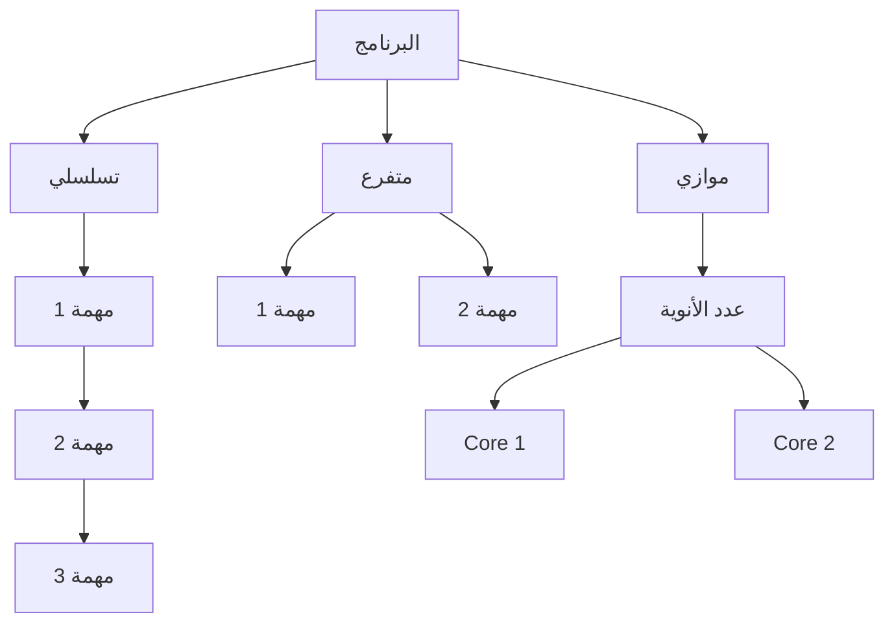
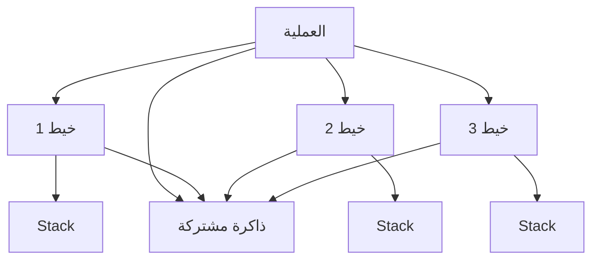
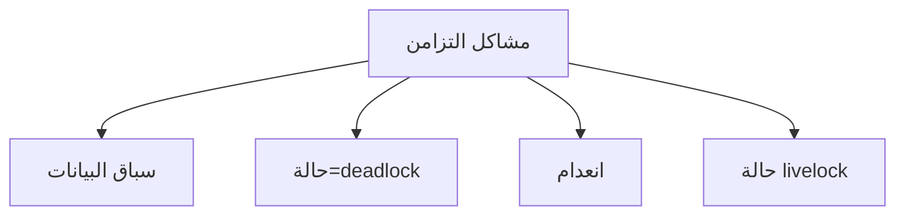
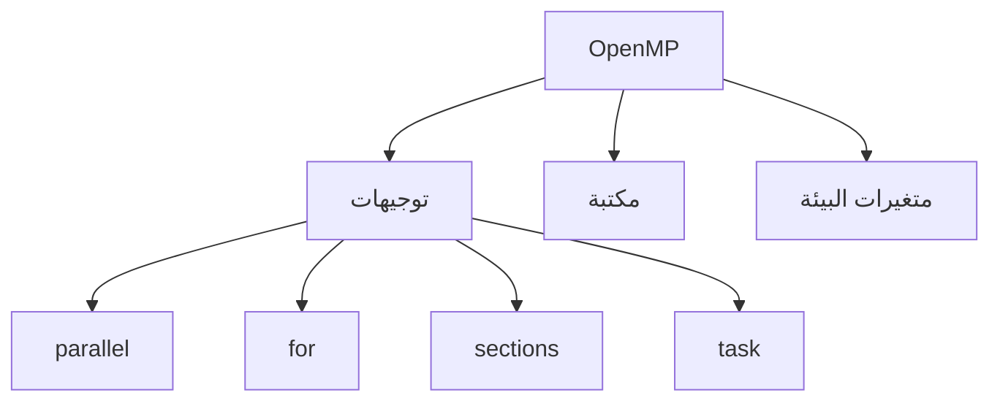
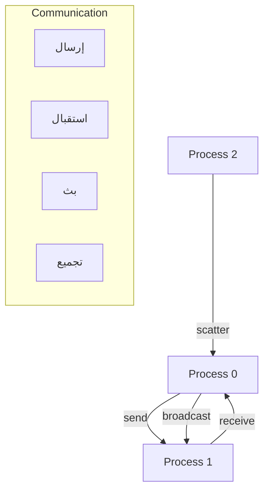
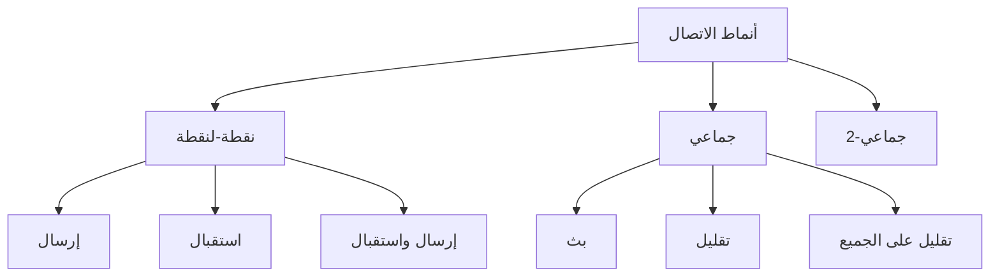
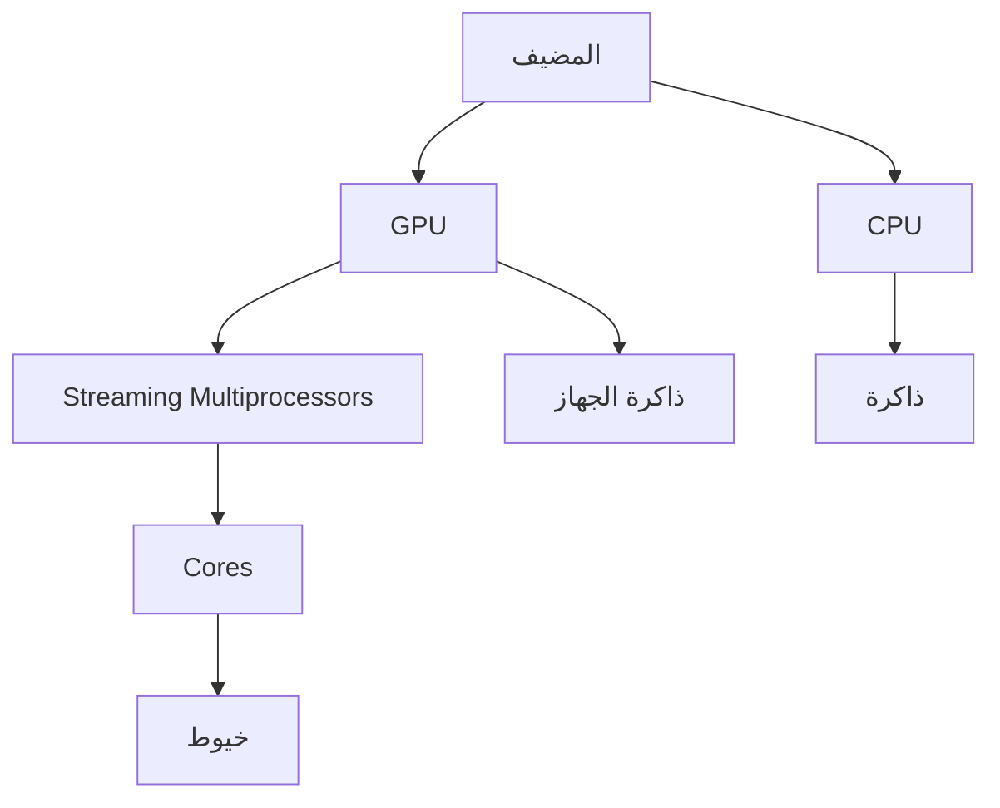
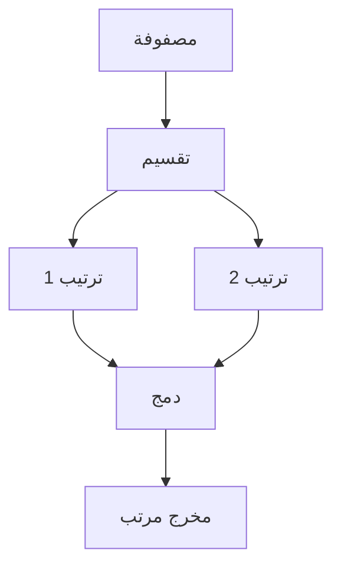

# برمجة تفريعية · Parallel Programming (Year 4 - Semester 2)

## 🔄 مقدمة في البرمجة التفريعية · Introduction to Parallel Programming

### مفهوم التفريع · Concurrency Concept

- **البرمجة التفريعية** (Parallel Programming): تنفيذ مهام متعددة في نفس الوقت.
- **التفريع** (Concurrency): تنفيذ عدة مهام بشكل متداخل.
- **التوازي** (Parallelism): تنفيذ عدة مهام بشكل متزامن فعلي.



### لماذا التفريع؟

| السبب | الوصف |
|-------|-------|
| **السرعة** | تنفيذ أسرع للمهام المستقلة |
| **الاستجابة** | واجهة مستخدم أكثر استجابة |
| **الموارد** | استخدام كامل الموارد |
| **النمو** | التوسع مع المزيد من الأنوية |

---

## 🧵 الخيوط Threads

### مفهوم الخيط

- **الخيط** (Thread): وحدة تنفيذ خفيفة داخل عملية.
- **العملية** (Process): برنامج قيد التشغيل مع ذاكرة خاصة.



### في C (POSIX Threads)

```c
#include <pthread.h>

void* thread_function(void* arg) {
    int id = *(int*)arg;
    printf("Thread %d running\n", id);
    return NULL;
}

int main() {
    pthread_t threads[4];
    int ids[4] = {0, 1, 2, 3};
    
    for (int i = 0; i < 4; i++) {
        pthread_create(&threads[i], NULL, thread_function, &ids[i]);
    }
    
    for (int i = 0; i < 4; i++) {
        pthread_join(threads[i], NULL);
    }
    
    return 0;
}
```

### في Python

```python
import threading

def worker(thread_id):
    print(f"Thread {thread_id} running")

threads = []
for i in range(4):
    t = threading.Thread(target=worker, args=(i,))
    threads.append(t)
    t.start()

for t in threads:
    t.join()
```

### مشاكل التزامن · Concurrency Problems



---

## ⚡ OpenMP - Open Multi-Processing

### مفهوم OpenMP

- **OpenMP**: واجهة برمجة للتوازي المشترك.
- **المبدأ**: استخدام التوجيهات (#pragma) للتوازي.



### التوجيهات الأساسية

#### Parallel Region

```c
#pragma omp parallel
{
    printf("Hello from thread %d\n", omp_get_thread_num());
}
```

#### Parallel For

```c
#pragma omp parallel for
for (int i = 0; i < N; i++) {
    a[i] = b[i] + c[i];
}
```

#### Sections

```c
#pragma omp parallel sections
{
    #pragma omp section
    task_a();
    
    #pragma omp section
    task_b();
}
```

#### Reduction

```c
int sum = 0;
#pragma omp parallel for reduction(+:sum)
for (int i = 0; i < N; i++) {
    sum += a[i];
}
```

### synchronized

```c
#pragma omp critical
{
    total += local_sum;
}
```

---

## 🌐 MPI - Message Passing Interface

### مفهوم MPI

- **MPI**: معيار للتواصل بين العمليات.
- **النموذج**: ذاكرة موزعة (Distributed Memory).



### دوال MPI الأساسية

```c
#include <mpi.h>

int main(int argc, char** argv) {
    MPI_Init(&argc, &argv);
    
    int rank, size;
    MPI_Comm_rank(MPI_COMM_WORLD, &rank);
    MPI_Comm_size(MPI_COMM_WORLD, &size);
    
    // إرسال
    if (rank == 0) {
        int data = 42;
        MPI_Send(&data, 1, MPI_INT, 1, 0, MPI_COMM_WORLD);
    }
    
    // استقبال
    if (rank == 1) {
        int data;
        MPI_Recv(&data, 1, MPI_INT, 0, 0, MPI_COMM_WORLD, MPI_STATUS_IGNORE);
    }
    
    MPI_Finalize();
    return 0;
}
```

### العمليات الجماعية · Collective Operations

```c
// Broadcast - إرسال لكل العمليات
MPI_Bcast(&data, 1, MPI_INT, 0, MPI_COMM_WORLD);

// Scatter - توزيع على العمليات
MPI_Scatter(sendbuf, 1, MPI_INT, &recvbuf, 1, MPI_INT, 0, MPI_COMM_WORLD);

// Gather - تجميع من كل العمليات
MPI_Gather(&sendbuf, 1, MPI_INT, recvbuf, 1, MPI_INT, 0, MPI_COMM_WORLD);

// Reduce - تقليل
MPI_Reduce(&sendbuf, &result, 1, MPI_INT, MPI_SUM, 0, MPI_COMM_WORLD);

// Allreduce - تقليل على الجميع
MPI_Allreduce(&sendbuf, &result, 1, MPI_INT, MPI_SUM, MPI_COMM_WORLD);
```

### أنماط الاتصال · Communication Patterns



---

## 🎮 برمجة GPU - GPU Computing

### مفهوم GPU

- **GPU**: معالج رسوميات، مصمم للتوازي الضخم.
- **CUDA**: منصة GPU من NVIDIA.



### نموذج CUDA

```cuda
// Kernel - يعمل على GPU
__global__ void add_vectors(float* a, float* b, float* c, int n) {
    int idx = blockIdx.x * blockDim.x + threadIdx.x;
    if (idx < n) {
        c[idx] = a[idx] + b[idx];
    }
}

int main() {
    // نسخ البيانات للجهاز
    cudaMemcpy(d_a, h_a, size, cudaMemcpyHostToDevice);
    
    // إطلاق Kernel
    int blocks = (n + 255) / 256;
    add_vectors<<<blocks, 256>>>(d_a, d_b, d_c, n);
    
    // استرجاع النتائج
    cudaMemcpy(h_c, d_c, size, cudaMemcpyDeviceToHost);
}
```

### نموذج البرمجة

| المكون | الوصف |
|--------|-------|
| **Thread** | أصغر وحدة تنفيذ |
| **Block** | مجموعة خيوط |
| **Grid** | مجموعة كتل |
| **Warp** | 32 خيط تنفذ معاً |

---

## 🔀 الخوارزميات المتوازية · Parallel Algorithms

### خوارزمية التصغير · Reduction

```c
// تسلسلي
int sum = 0;
for (int i = 0; i < n; i++) sum += a[i];

// متوازي (OpenMP)
int sum = 0;
#pragma omp parallel for reduction(+:sum)
for (int i = 0; i < n; i++) sum += a[i];
```

### خوارزمية المسح · Scan

```c
// Parallel Prefix Sum
// المدخل: [1, 2, 3, 4, 5]
// المخرج: [1, 3, 6, 10, 15]

void parallel_scan(int* a, int n) {
    for (int d = 1; d < n; d *= 2) {
        #pragma omp parallel for
        for (int i = d; i < n; i++) {
            a[i] += a[i - d];
        }
    }
}
```

### خوارزمية الدمج · Merge Sort المتوازي



### خوارزمية الفرز المتوازي

```c
void parallel_merge_sort(int* a, int* temp, int n) {
    if (n <= 1) return;
    
    int mid = n / 2;
    
    #pragma omp task
    parallel_merge_sort(a, temp, mid);
    
    #pragma omp task
    parallel_merge_sort(a + mid, temp + mid, n - mid);
    
    #pragma omp taskwait
    
    merge(a, temp, mid, n - mid);
}
```

---

## 📊 جدول مرجعي شامل · Master Reference Table

### مقارنة النماذج

| النموذج | الذاكرة | التعقيد | الاستخدام |
|---------|---------|---------|-----------|
| **Threads** | مشتركة | متوسط | عام |
| **OpenMP** | مشتركة | منخفض | multicore |
| **MPI** | موزعة | عالي | clusters |
| **GPU** | موزعة | عالي | parallel massive |

### OpenMP Clauses

| Clause | الوصف |
|--------|-------|
| `num_threads(n)` | عدد الخيوط |
| `private(var)` | متغيرات خاصة |
| `shared(var)` | متغيرات مشتركة |
| `reduction(op:var)` | تقليل |
| `schedule(type)` | جدولة |

### MPI Functions

| الدالة | الوصف |
|--------|-------|
| `MPI_Init` | تهيئة |
| `MPI_Send` | إرسال |
| `MPI_Recv` | استقبال |
| `MPI_Bcast` | بث |
| `MPI_Reduce` | تقليل |
| `MPI_Finalize` | إنهاء |

---

## ⚠️ أخطاء شائعة وملاحظات · Common Pitfalls & Notes

### ❌ أخطاء شائعة

1. **سباق البيانات**:
   - الوصول المتزامن لبيانات مشتركة
   - 💡 استخدم أقفال أو متغيرات atomic

2. **Deadlock**:
   - انتظار دائري للأقفال
   - 💡 ترتيب ثابت للأقفال

3. **حالة التسرب**:
   - عدم إنهاء العمليات
   - 💡 استخدام join/barrier

4. **الأداء**:
   - خيوط أكثر من اللازم
   - 💡 التوازن بين العدد والعبء

### 💡 نصائح مهمة

- **Amdahl's Law**: التسريع محدود بنسبة التسلسل
- **Load Balancing**: توزيع العمل بالتساوي
- **Localization**: تقليل التواصل
- **Granularity**: حجم المهمة المناسب

### 📌 ملاحظات نهائية

- **الذاكرة المشتركة**: أسهل لكن مشكلة التوسع
- **الذاكرة الموزعة**: أفضل للتوسع الكبير
- **GPU**: للعمليات المتكررة على بيانات كثيرة
- **Hybrid**: الجمع بين عدة نماذج

---

## 📝 أمثلة محلولة · Worked Examples

### مثال 1: ضرب مصفوفات متوازي (OpenMP)

```c
void parallel_matrix_multiply(float** A, float** B, float** C, int n) {
    #pragma omp parallel for collapse(2)
    for (int i = 0; i < n; i++) {
        for (int j = 0; j < n; j++) {
            C[i][j] = 0;
            for (int k = 0; k < n; k++) {
                C[i][j] += A[i][k] * B[k][j];
            }
        }
    }
}
```

### مثال 2: Pi Monte Carlo (MPI)

```c
void pi_monte_carlo(int samples) {
    int inside = 0;
    
    #pragma omp parallel for reduction(+:inside)
    for (int i = 0; i < samples; i++) {
        double x = (double)rand() / RAND_MAX;
        double y = (double)rand() / RAND_MAX;
        if (x*x + y*y <= 1) inside++;
    }
    
    double pi = 4.0 * inside / samples;
}
```

### مثال 3: حساب Pi (MPI Reduction)

```c
double pi = 0.0;
double h = 1.0 / n;

#pragma omp parallel for reduction(+:pi)
for (int i = 0; i < n; i++) {
    double x = h * (i + 0.5);
    pi += 4.0 / (1.0 + x*x);
}
```

---

(End of file)