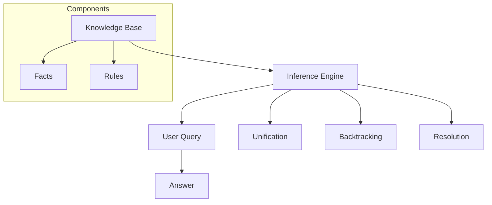
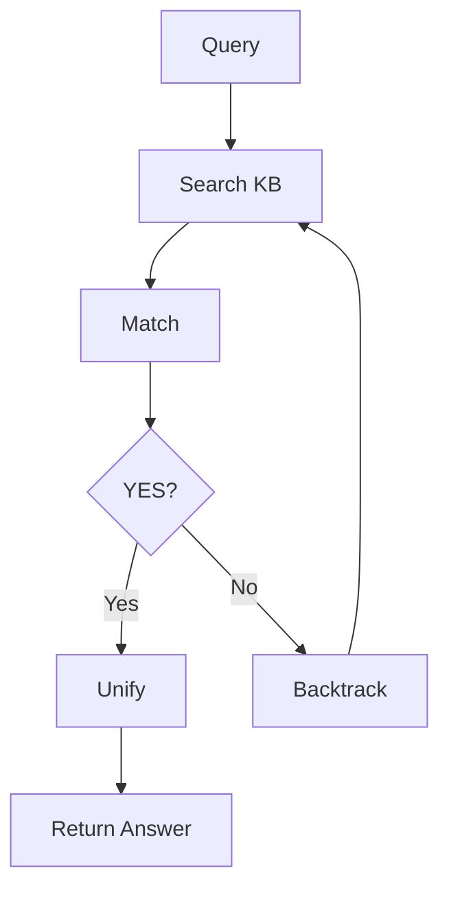
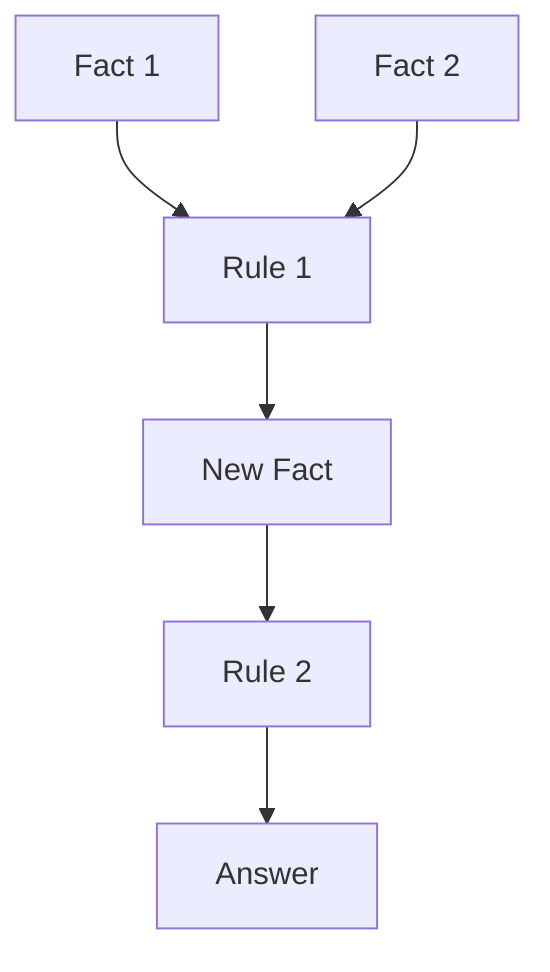
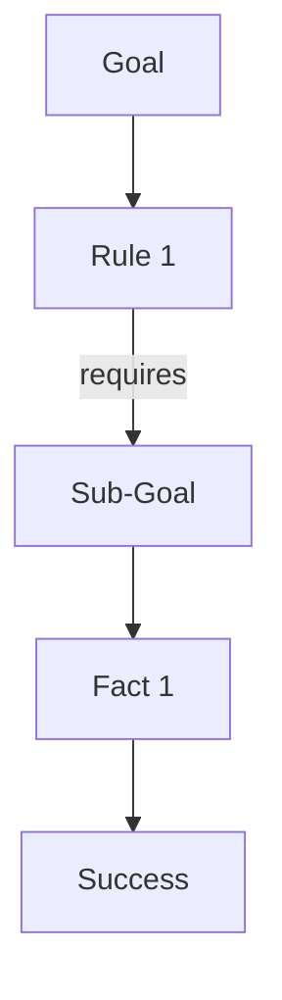

# برمجة منطقية · Logic Programming

## 📐 التعاريف الأساسية · Core Definitions

- **البرمجة المنطقية** (Logic Programming): نموذج برمجة يستند على المنطق.
- **Prolog**: لغة برمجة منطقية.
- **التوحيد** (Unification): عملية مطابقة الأنماط.
- **التراجع** (Backtracking): البحث عن حلول بديلة.
- **الاستنتاج** (Inference): استنتاج حقائق جديدة.
- **قاعدة البيانات المنطقية** (Knowledge Base): مجموعة من الحقائق والقواعد.

---

## 🔁 نموذج البرمجة المنطقية · Model

### بنية نظام Prolog · Prolog System



### دورة التنفيذ · Execution Cycle



---

## 🧮 النظريات والصيغ · Theorems & Formulas

### 1. التوحيد · Unification

#### قاعدة التوحيد

$$unify(t_1, t_2) = \theta \iff t_1\theta = t_2\theta$$

where $\theta$ is substitution

#### قواعد التوحيد:

| الشرط | النتيجة |
| ----- | ----- |
| $X = X$ | نجاح |
| $X = f(a)$ | فشل if $X$ is variable |
| $f(a,b) = f(a,c)$ | فشل |
| $f(X) = f(a)$ | $X = a$ |

### 2. المنطق · Logic

#### modus ponens

$$\frac{P \rightarrow Q, P}{Q}$$

#### قاعدة Resolution

$$\frac{P \vee Q, \neg P \vee R}{Q \vee R}$$

### 3. الاستدلال · Inference

#### Forward Chaining



#### Backward Chaining



---

## 📊 جدول مرجعي · Reference Tables

### جدول أنواع البيانات · Data Types

| النوع | مثال | الوصف |
| ---------- | ----- | ----- |
| **Atom** | `john`, `red` | ثوابت |
| **Variable** | `X`, `_` | متغيرات |
| **Number** | `42`, `3.14` | أرقام |
| **Compound** | `book(title, author)` | مركب |
| **List** | `[a, b, c]` | قائمة |

### جدول العمليات · Operators

| العملية | الوصف | مثال |
| ---------- | ----- | ----- |
| `is/2` | تقييم حسابي | `X is 3+4` |
| `=/2` | توحيد | `X = 5` |
| `=:=` | تساوي حسابي | `3 =:= 3` |
| `=` | نسخ | `X = Y` |
| `\=` | لا توحيد | `X \= Y` |
| `<`, `>`, `=<`, `>=` | مقارنة | `X > Y` |

### جدول Predicates内置

| Predicate | الوصف |
| ---------- | ----- |
| `write/1` | كتابة |
| `read/1` | قراءة |
| `nl/0` | سطر جديد |
| `assert/1` | إضافة fakta |
| `retract/1` | حذف fakta |
| `findall/3` | جمع solutions |

---

## 📝 أمثلة محلولة · Worked Examples

### مثال 1: Family Tree

```prolog
% Facts
male(john).
male(bob).
male(alice). % typo!
female(mary).
female(sue).

parent(john, bob).
parent(john, mary).
parent(sue, mary).
parent(bob, alice).

% Rules
father(X, Y) :- male(X), parent(X, Y).
mother(X, Y) :- female(X), parent(X, Y).
grandparent(X, Y) :- parent(X, Z), parent(Z, Y).
sibling(X, Y) :- parent(Z, X), parent(Z, Y), X \= Y.
```

**Queries:**
```
?- father(john, X).
X = bob ;
X = mary.

?- grandparent(X, alice).
X = bob.
```

### مثال 2: List Processing

```prolog
% Base cases
member(X, [X|_]).
member(X, [_|T]) :- member(X, T).

append([], L, L).
append([H|T], L, [H|R]) :- append(T, L, R).

reverse([], []).
reverse([H|T], R) :- reverse(T, RT), append(RT, [H], R).

length([], 0).
length([_|T], N) :- length(T, N1), N is N1 + 1.
```

### مثال 3: Backtracking for N-Queens

```prolog
nqueens(N, Qs) :-
    permutation(Qs, 1:N),
    safe(Qs).

safe([]).
safe([Q|Qs]) :- 
    safe(Qs),
    not attack(Q, Qs).

attack(Q, Qs) :- 
    member(Diag, Qs), 
    Q is Diag + 1.
attack(Q, Qs) :- 
    member(Diag, Qs), 
    Q is Diag - 1.
```

---

## ⚠️ أخطاء شائعة وملاحظات · Common Pitfalls & Notes

### ❌ أخطاء شائعة

1. **الخلط بين `= و is`:**
   - `=`: توحيد (تحقق من التساوي)
   - `is`: تقييم رياضي
   - 💡 **ملاحظة**: `X = 3+4` → `X = 3+4` (no unification)But wait, I need to verify this: actually `X = 3+4` unifies with the term `+(3,4)`. But `X is 3+4` evaluates and gives 7.

2. **الخلط بين Cut وfail:**
   - `:!`:قطع (Stop backtracking)
   - `fail`: فشل always
   - Order matters!

3. **نسيان Order of Rules:**
   - Prolog uses sequential execution
   - More specific rules first
   - Base cases before recursive

4. **عدم فهم occurs check:**
   - `X = f(X)`: infinite term
   - Should check: `X \= f(X)` or use occurs check
   - Most Prolog implementations don't have this built-in!

### 💡 نصائح مهمة

- **Debugging:**
  - `trace/0`: enable tracing
  - `spy/1`: set breakpoints
  - `listing/0`: show all facts/rules

- **Performance:**
  - Use indexing (`:/2` predicates)
  - Avoid unnecessary backtracking
  - Use cuts wisely

- **Best Practices:**
  - Use meaningful atom names
  - Document your rules
  - Test incrementally

### 📌 ملاحظات نهائية

- **Execution Model:**
  - SLD resolution
  - Left-to-right execution
  - Depth-first search

- **Predicate Types:**
  - Fact: factual information
  - Rule: conditional knowledge
  - Query: question

- **Modes:**
  - `+`: input
  - `-`: output
  - `?`: input or output