# بنية وتنظيم الحاسب 1 · Computer Organization I (Year 3 - Semester 2)

---

## 🖥️ بنية المعالج · CPU Architecture

### نموذج фон Neumann

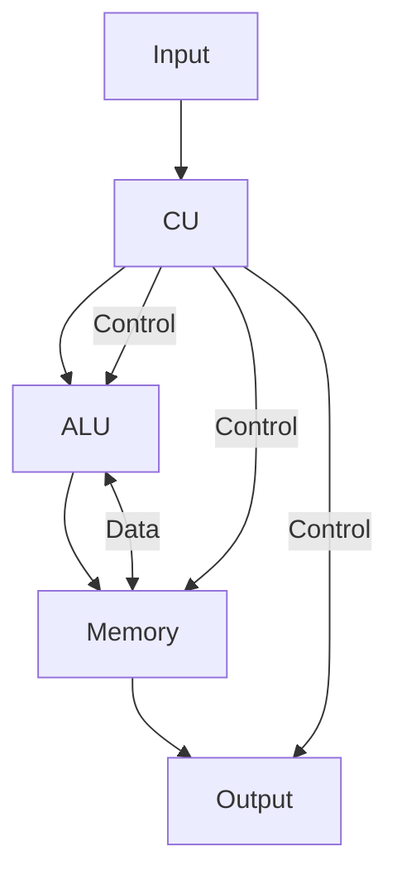

### المكونات الأساسية · Basic Components

| المكون | Component | الوظيفة |
|--------|-----------|---------|
| **ALU** | Arithmetic Logic Unit | العمليات الحسابية والمنطقية |
| **CU** | Control Unit | التحكم والتنفيذ |
| **Registers** | Registers | تخزين مؤقت سريع |
| **Cache** | Cache | ذاكرة مؤقتة سريعة |
| **Bus** | Bus | نقل البيانات |

---

## ⚙️ تصميم المعالج · CPU Design

### 1. مجموعة التعليمات (Instruction Set)

#### أنواع التعليمات · Instruction Types

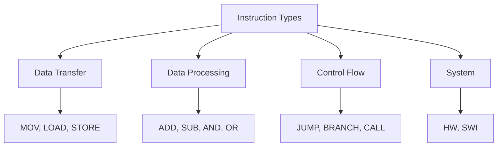

#### تنسيقات التعليمات · Instruction Formats

| Format | الوصف | مثال |
|--------|-------|------|
| **R-type** | Register-to-Register | `ADD R1, R2, R3` |
| **I-type** | Immediate | `ADDI R1, R2, 10` |
| **J-type** | Jump | `J label` |
| **S-type** | Store | `SW R1, 0(R2)` |
| **B-type** | Branch | `BEQ R1, R2, label` |

```python
# مثال: MIPS Instruction Format
# R-type: [opcode(6)] [rs(5)] [rt(5)] [rd(5)] [shamt(5)] [funct(6)]
# I-type: [opcode(6)] [rs(5)] [rt(5)] [immediate(16)]
# J-type: [opcode(6)] [address(26)]
```

### 2. أوضاع العنونة · Addressing Modes

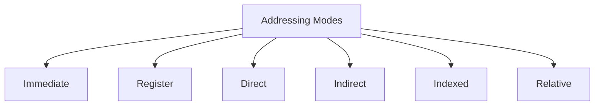

#### أمثلة · Examples

| Mode | Example | الوصف |
|------|---------|-------|
| **Immediate** | `MOV R1, #5` | القيمة مباشرة |
| **Register** | `ADD R1, R2` | المحتوى في السجل |
| **Direct** | `MOV R1, [100]` | عنوان ثابت |
| **Indirect** | `MOV R1, [R2]` | عنوان في السجل |
| **Indexed** | `MOV R1, [R2+10]` | عنوان + displacement |
| **Relative** | `JMP label` | نسبة للـ PC |

```python
# أمثلة على أوضاع العنونة
def addressing_modes_example():
    # Immediate
    immediate = 5  # القيمة مباشرة
    
    # Register
    r1 = 10  # في السجل
    
    # Direct
    memory = {100: 20}  # عنوان ثابت
    direct = memory[100]
    
    # Indirect
    r2 = 100  # عنوان في السجل
    indirect = memory[r2]
    
    # Indexed
    indexed = memory[r2 + 10]
    
    # Relative
    pc = 1000
    relative = memory[pc + 50]
```

---

## 🔄 خط التجميع · Pipelining

### المفهوم · Concept

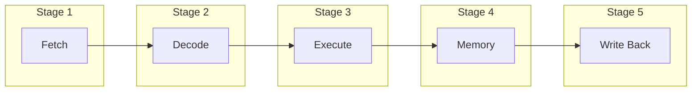

### مراحل الخط · Pipeline Stages

```python
# MIPS 5-Stage Pipeline
class MIPS_Pipeline:
    stages = {
        'IF': 'Instruction Fetch',
        'ID': 'Instruction Decode',
        'EX': 'Execute',
        'MEM': 'Memory Access',
        'WB': 'Write Back'
    }
    
    def __init__(self):
        self.registers = {}
        self.memory = {}
        self.pipeline = [None] * 5
```

### أنواع المخاطر · Hazard Types

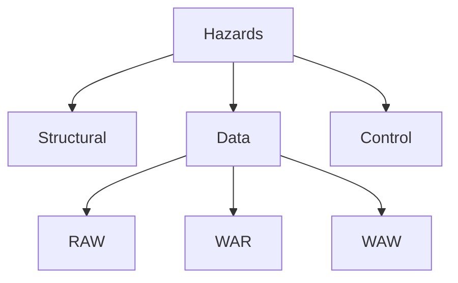

#### 1. مخاطر البيانات (Data Hazards)

##### RAW (Read After Write)

```python
# مثال: RAW Hazard
# I1: ADD R1, R2, R3  # R1 = R2 + R3
# I2: SUB R4, R1, R5   # R4 = R1 - R5  ← يعتمد على R1

# الحل: Forwarding
def forwarding_example():
    # Forward from EX/MEM to ID/EX
    if id_ex_reg == ex_mem_reg:
        return ex_mem_value
```

##### WAR/WAW

```python
# WAR: Write After Read (لا يحدث في MIPS)
# WAR: I1 تقرأ قبل I2 تكتب

# WAW: Write After Write
# I1: ADD R1, R2, R3
# I2: ADD R1, R4, R5
```

#### 2. مخاطر التحكم (Control Hazards)

```python
# مثال: Branch Hazard
# BEQ R1, R2, label
# الحل: Delay Slot
def branch_delay_slot():
    #_instruction before branch always executes
    nop = 0  # NOOP
    # branch target resolved after ID
```

#### 3. المخاطر الهيكلية (Structural Hazards)

```python
# مثال: Load/Store conflict
#Solution: Dual-port memory, Stall
```

### تقنيات حل المخاطر · Hazard Solutions

| التقنية | Description | الاستخدام |
|---------|-------------|-----------|
| **Stall** | إيقاف pipeline | RAW hazards |
| **Forwarding** | تمرير البيانات | RAW hazards |
| **Delay Slot** | تنفيذ تعليمة بعد الفرع | Control hazards |
| **Prediction** | تخمين الفرع | Control hazards |

---

## 📊 تسلسل الذاكرة · Memory Hierarchy

### المستويات · Levels

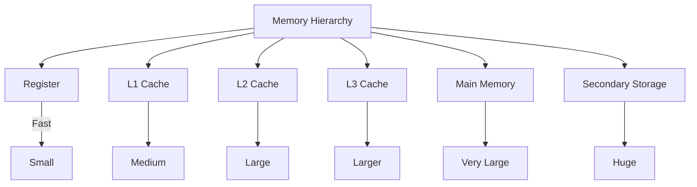

### خصائص المستويات · Level Properties

| المستوى | Size | Latency | Bandwidth |
|---------|------|---------|-----------|
| **Register** | 32-64 | 1 cycle | Very High |
| **L1 Cache** | 32KB | 1-2 cycles | High |
| **L2 Cache** | 256KB | 3-10 cycles | Medium |
| **L3 Cache** | 8MB | 10-20 cycles | Medium |
| **RAM** | 8GB | 50-100 cycles | Low |
| **SSD/HDD** | 1TB+ | 10K+ cycles | Very Low |

### سياسات الكتابة · Write Policies

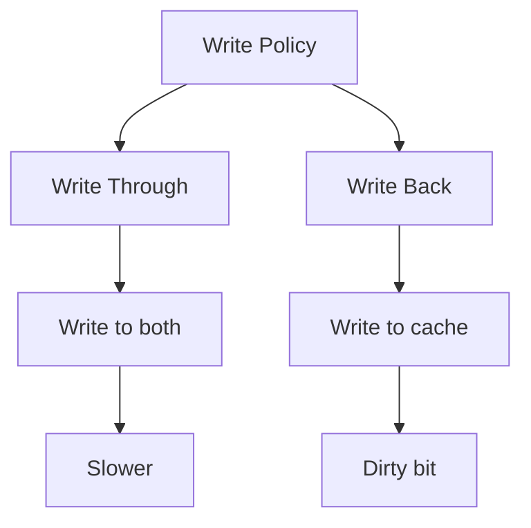

### خوارزميات الاستبدال · Replacement Algorithms

#### LRU (Least Recently Used)

```python
class LRU_Cache:
    def __init__(self, capacity):
        self.capacity = capacity
        self.cache = {}
        self.order = []
    
    def get(self, key):
        if key in self.cache:
            self.order.remove(key)
            self.order.append(key)
            return self.cache[key]
        return -1
    
    def put(self, key, value):
        if key in self.cache:
            self.order.remove(key)
        elif len(self.cache) >= self.capacity:
            oldest = self.order.pop(0)
            del self.cache[oldest]
        
        self.cache[key] = value
        self.order.append(key)
```

#### FIFO (First In First Out)

```python
class FIFO_Cache:
    def __init__(self, capacity):
        self.capacity = capacity
        self.cache = {}
        self.queue = []
    
    def put(self, key, value):
        if key in self.cache:
            return
        
        if len(self.cache) >= self.capacity:
            oldest = self.queue.pop(0)
            del self.cache[oldest]
        
        self.cache[key] = value
        self.queue.append(key)
```

---

## 🎯 ذاكرة التخزين المؤقت · Cache Memory

### 1. بنية الـ Cache

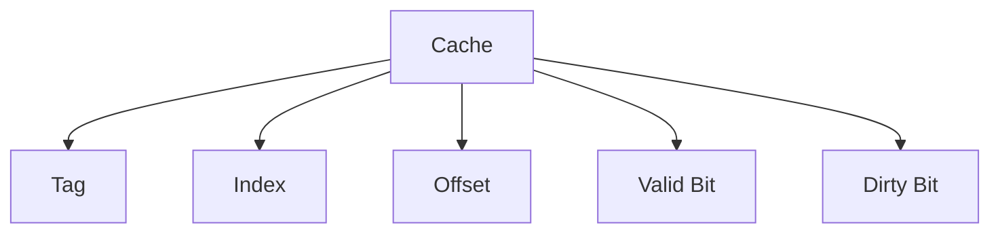

### 2. أنظمة الـ Cache

#### Direct Mapped

```python
def direct_mapped(address, cache_size, block_size):
    """Direct Mapped Cache"""
    num_blocks = cache_size // block_size
    index = address // block_size % num_blocks
    tag = address // (cache_size)
    offset = address % block_size
    return tag, index, offset
```

#### Set Associative

```python
def set_associative(address, num_sets, ways, block_size):
    """Set Associative Cache"""
    index = (address // block_size) % num_sets
    tag = address // (num_sets * block_size)
    offset = address % block_size
    return tag, index, offset
```

#### Fully Associative

```python
def fully_associative(address, block_size):
    """Fully Associative Cache"""
    tag = address // block_size
    offset = address % block_size
    return tag, offset
```

### 3. نسبة الإصابة (Hit Rate)

$$HitRate = \frac{Hits}{Hits + Misses}$$

```python
def calculate_hit_rate(hits, misses):
    return hits / (hits + misses)

def average_memory_access_time(hit_time, miss_rate, miss_penalty):
    """AMAT"""
    return hit_time + miss_rate * miss_penalty
```

### 4. أداء الـ Cache

| Metric | الصيغة |
|--------|--------|
| **Hit Time** | زمن الوصول عند الإصابة |
| **Miss Penalty** | زمن جلب من الذاكرة |
| **AMAT** | $T_{hit} + M \times P_{miss}$ |
| **CPI** | $CPI_{base} + M \times R_{miss}$ |

---

## 🏗️ بنية الحاسب · Computer Structure

### 1. نموذجFetcher

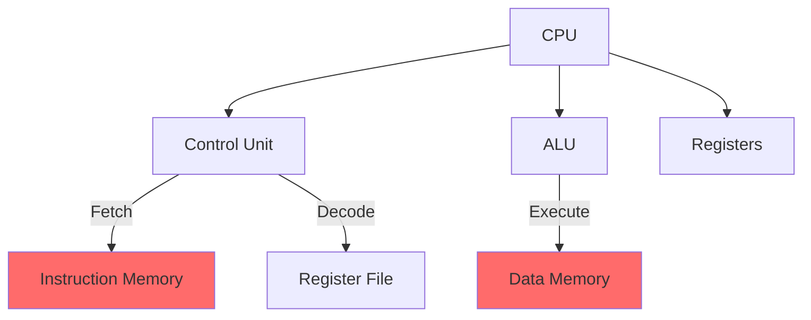

### 2. دورة التنفيذ · Execution Cycle

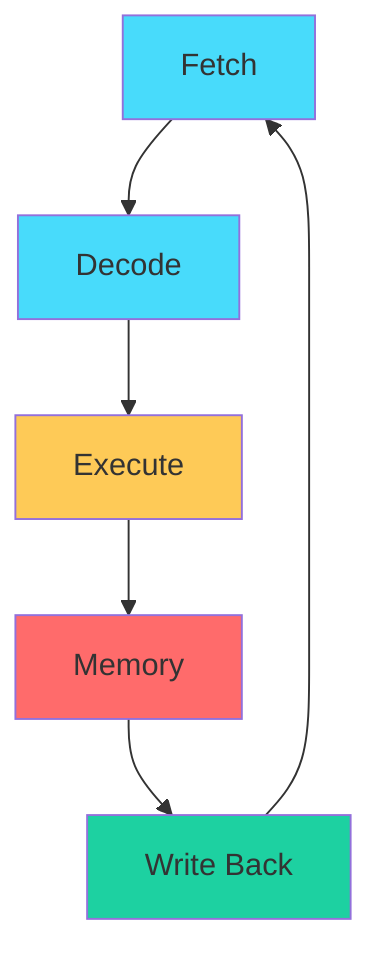

### 3. تنظيم الذاكرة · Memory Organization

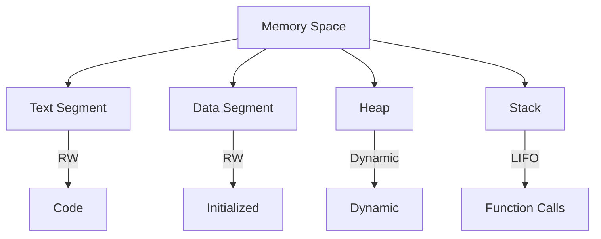

---

## 📊 جدول مرجعي شامل · Master Reference Table

### أوضاع العنونة

| Mode | Example | Cycles |
|------|---------|--------|
| **Immediate** | `MOV R1, #5` | 1 |
| **Register** | `ADD R1, R2` | 1 |
| **Direct** | `LDR R1, [100]` | 2+ |
| **Indirect** | `LDR R1, [R2]` | 2+ |
| **Indexed** | `LDR R1, [R2+#4]` | 2+ |

### مخاطر Pipeline

| النوع | الحل | Overhead |
|-------|------|----------|
| **RAW** | Forwarding | 0 |
| **WAR** | Register renaming | - |
| **WAW** | Register renaming | - |
| **Control** | Prediction |Branch delay slot |

### Cache Policies

| Policy | Write | Read | المميزات |
|--------|-------|------|---------|
| **WT** | Both | Cache | بسيط |
| **WB** | Cache only | Cache | efficient |
| **Write-Allocate** | Fetch block | - | On miss |
| **No-Write-Allocate** | Direct to memory | - | On miss |

---

## ⚠️ أخطاء شائعة وملاحظات · Common Pitfalls & Notes

### ❌ أخطاء شائعة

1. **الخلط بين Hit Rate و Miss Rate:**
   - $HitRate + MissRate = 1$
   - Miss Rate = 1 - Hit Rate

2. **حساب CPI بشكل خاطئ:**
   - $CPI = CPI_{base} + M \times MissRate$
   - M = cycles penalty per miss

3. **أنواع البيانات في MIPS:**
   - Byte: 8 bits
   - Halfword: 16 bits
   - Word: 32 bits

4. **Pipeline hazards:**
   - WAR و WAW لا تحدث في MIPS (in-order)
   - RAW هي المشكلة الرئيسية

5. **التخزين في Cache:**
   - Block size يؤثر على hit rate
   - لكن يزيد miss penalty

### ❌ مفاهيم خاطئة شائعة

- **"Cache أكبر = أفضل":** latency يزداد
- **"Pipeline أعمق = أسرع":** hazards أكثر
- **"Register أكثر = أفضل":** تكلفة عالية

### 💡 نصائح مهمة

- **لاختيار Cache:**
  - Direct: بسيطة، hit rate منخفض
  - Set-associative: توازن
  - Fully: غالية، hit rate عالي

- **لتحسين الأداء:**
  - Reduce miss rate
  - Reduce miss penalty
  - Reduce hit time

---

## 📝 أمثلة محلولة · Worked Examples

### مثال 1: حساب CPI

**المعطيات:**
- CPI_base = 1
- Load/Store = 20% من التعليمات
- Miss rate = 2%
- Miss penalty = 10 cycles

**الحل:**
$$CPI = 1 + 0.2 \times 0.02 \times 10 = 1 + 0.04 = 1.04$$

### مثال 2: Direct Mapped Cache

**المعطيات:**
- Cache: 64 KB
- Block: 16 bytes
- Address: 0x1234C

**الحل:**
- num_blocks = 64KB / 16 = 4096 = $2^{12}$
- index = 0x1234C / 16 % 4096 = 0x234C % 4096 = 2444
- tag = 0x1234C / (64KB) = 0x1
- offset = 0x1234C % 16 = 12

### مثال 3: Pipeline Hazards

**الكود:**
```
I1: ADD R1, R2, R3
I2: SUB R4, R1, R5
I3: AND R6, R1, R7
```

**RAW Hazards:**
- I2 يعتمد على I1 (R1)
- I3 يعتمد على I1 (R1)
- الحل: Forwarding من EX/MEM

---

(End of file)
