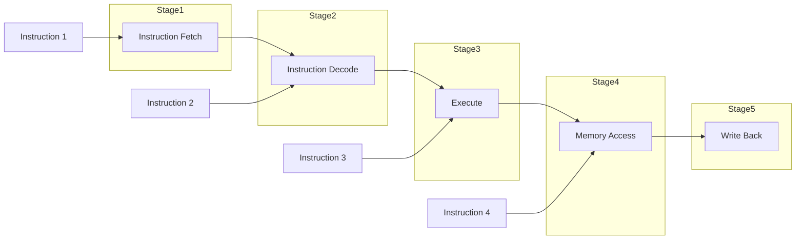
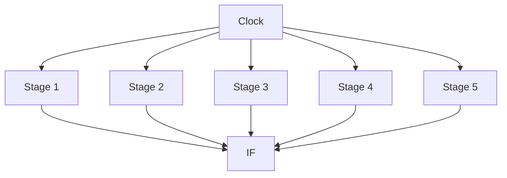
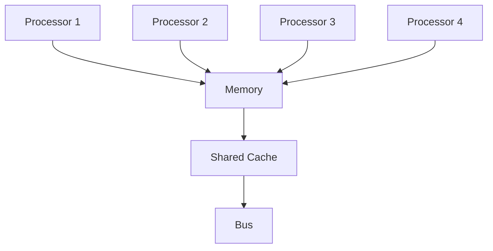
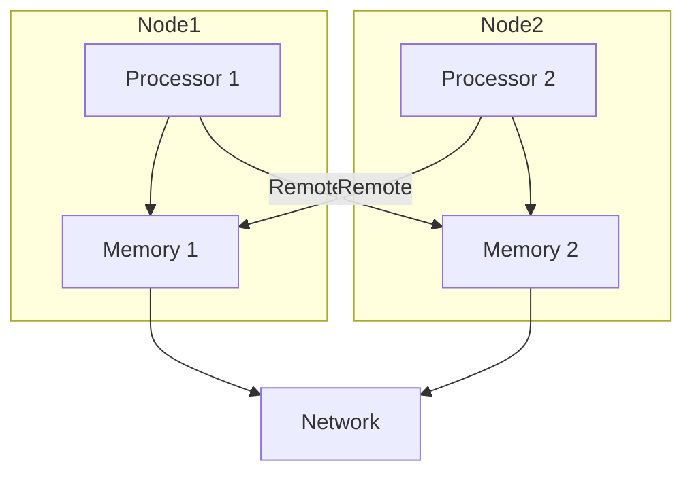

# بنية وتنظيم الحواسيب 2 · Computer Architecture II

## 📐 التعاريف الأساسية · Core Definitions

- **التعقيم** (Pipelining): تنفيذ تعليمات متعددة في مراحل متزامنة.
- **الذاكرة المؤقتة** (Cache): ذاكرة سريعة بين CPU وال RAM.
- **المعالج المتعدد** (Multiprocessor): عدة معالجات تعمل معًا.
- **المعالجة المتجهة** (Vector Processing): معالجة بيانات متعددة دفعة واحدة.
- **التقييم** (Performance Evaluation): قياس أداء النظام.

---

## 🔁 نموذج التعقيم · Pipelining Model

### مراحل التعقيم · Pipeline Stages

### دورة التعقيم · Pipeline Cycle

---

## 🧮 النظريات والصيغ · Theorems & Formulas

### 1. قانون أمدال · Amdahl's Law

$$S = \frac{1}{(1 - f) + frac{f}{k}}$$

حيث:
- $S$: speedup الكلي
- $f$: جزء البرنامج الذي يتأثر بالتحسين
- $k$: تحسن الجزء $f$

### 2. زمن التعقيم · Pipeline Timing

#### زمن الدورة · Cycle Time

$$T_c = max{T_{s1}, T_{s2}, ..., T_{sn}}$$

#### التردد · Frequency

$$f = frac{1}{T_c}$$

#### CPI · Cycles Per Instruction

$$CPI = frac{text{Cycles}}{text{Instructions}}$$

### 3. أداء الذاكرة المؤقتة · Cache Performance

#### معدل الوصول · Hit Rate

$$h = frac{N_{hits}}{N_{total}}$$

#### زمن الوصول المتوسط · Average Access Time

$$T_a = h cdot T_{cache} + (1 - h) cdot T_{memory}$$

#### عدد مرات الفشل · Miss Penalty

$$MP = T_{memory} - T_{cache}$$

### 4. تقييم الأداء · Performance Metrics

#### MIPS · Millions of Instructions Per Second

$$MIPS = frac{f}{CPI} = frac{Clock_MHz}{CPI}$$

#### MFLOPS · Millions of FLOating-point Operations Per Second

$$MFLOPS = frac{FLOPs}{10^6 times T}$$

#### الطاقة · Throughput

$$Throughput = frac{Jobs}{Time}$$

---

## 📊 جدول مرجعي · Reference Tables

### جدول الذاكرة المؤقتة · Cache Mapping

| النوع | التكلفة | التعقيد | المميزات |
| ---------- | ----- | -------- | ---------- |
| **Direct Mapped** | الأقل | سهل | conflicts |
| **Fully Associative** | الأعلى | صعب | مرن |
| **Set Associative** | متوسط | متوسط | توازن |

### جدول مستويات الذاكرة المؤقتة · Cache Levels

| المستوى | الحجم | الكمون | الت ASSOCIATIVITY |
| ---------- | ----- | ------ | ---------- |
| **L1** | 32 KB | 1-2 ns | 4-way |
| **L2** | 256 KB | 10 ns | 8-way |
| **L3** | 8 MB | 20 ns | 12-way |

### جدول المعالجات · Processor Types

| النوع | الوصف | استخدام |
| ---------- | ----- | ---- |
| **Single Core** | معالج واحد | بسيط |
| **Multi Core** | عدة cores | عام |
| **GPU** | رسوم | parallel |
| **DSP** | إشارات | real-time |
| **FPGA** | قابل للت_programming | مخصص |

---

## ⚙️ المعالجات المتعددة · Multiprocessors

### بنيةUMA · Uniform Memory Access

### بنيةNUMA · Non-Uniform Memory Access

---

## 📝 أمثلة محلولة · Worked Examples

### مثال 1: حساب speedup التعقيم

**المعطيات:**
- بدون تعقيم: 5 cycles/instruction
- مع تعقيم بأطوار 5: 1 cycle/instruction

**الحل:**
$$text{Speedup} = frac{5}{1} = 5$$

لكن مع Stall:
- Stall rate = 10%
$$CPI_{pipeline} = 1 + text{stalls} = 1 + 0.1 = 1.1$$
$$text{Speedup} = frac{5}{1.1} = 4.54 frac{}{text{cycles}}$$

### مثال 2: حساب نسبة الذاكرة المؤقتة

**المعطيات:**
- L1 hit rate = 95%
- L1 hit time = 1 ns
- Memory time = 100 ns

**الحل:**
$$T_a = 0.95 times 1 + 0.05 times 100$$
$$T_a = 0.95 + 5 = 5.95 text{ ns}$$

**الاستنتاج:** الذاكرة المؤقتة تحسن الأداء بـ:
$$frac{100}{5.95} = 16.8x$$

### مثال 3: حساب MIPS

**المعطيات:**
- Clock = 3 GHz
- CPI = 1.5

**الحل:**
$$MIPS = frac{3000 text{ MHz}}{1.5} = 2000 text{ MIPS}$$

---

## ⚠️ أخطاء شائعة وملاحظات · Common Pitfalls & Notes

### ❌ أخطاء شائعة

1. **الخلط بين CPI و Cycle Time:**
   - CPI: cycles per instruction
   - Cycle Time: زمن الدورة
   - 💡 **ملاحظة**: CPI × Clock = CPU Time!

2. **الخلط بين hit rate و miss rate:**
   - Hit rate: نسبة النجاح
   - Miss rate = 1 - hit rate
   - Don't forget: hit rate + miss rate = 1!

3. **نسيان Hazards:**
   - Data hazard: dependence on data
   - Control hazard: branches
   - Structural hazard: resource conflict

4. **عدم فهم Stall:**
   - Stall: تأخير بسبب hazard
   - Flush: مسح التعليمات بعد branch
   - Delay slot: تعليمات بعد branch

### 💡 نصائح مهمة

- **تحسين أداء التعقيم:**
  - Forwarding: نقل البيانات between stages
  - Branch prediction: توقع الـ branches
  - Out-of-order execution: تنفيذ خارج الترتيب

- **تحسين Cache:**
  - Prefetching: إحضار مسبق
  - Write buffer: كتابة مؤقتة
  - Victim cache: cache صغير للـ misses

- **تحسين NUMA:**
  - Locality: البيانات المحلية
  - Migration: نقل البيانات
  - Replication: تكرار البيانات

### 📌 ملاحظات نهائية

- **Pipeline Types:**
  - RISC: 5-stage pipeline
  - CISC: microcode
  - SuperScalar:多条 تعليمات

- **Cache Coherence:**
  - MESI protocol
  - Snooping vs directory
  - Write-back vs write-through

- **Memory Hierarchy:**
  -Registers → L1 → L2 → L3 → Main → Disk
  - كل مستوى: faster but smaller