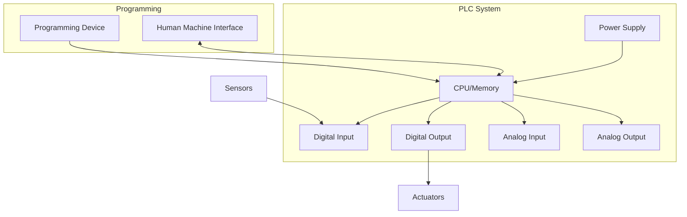
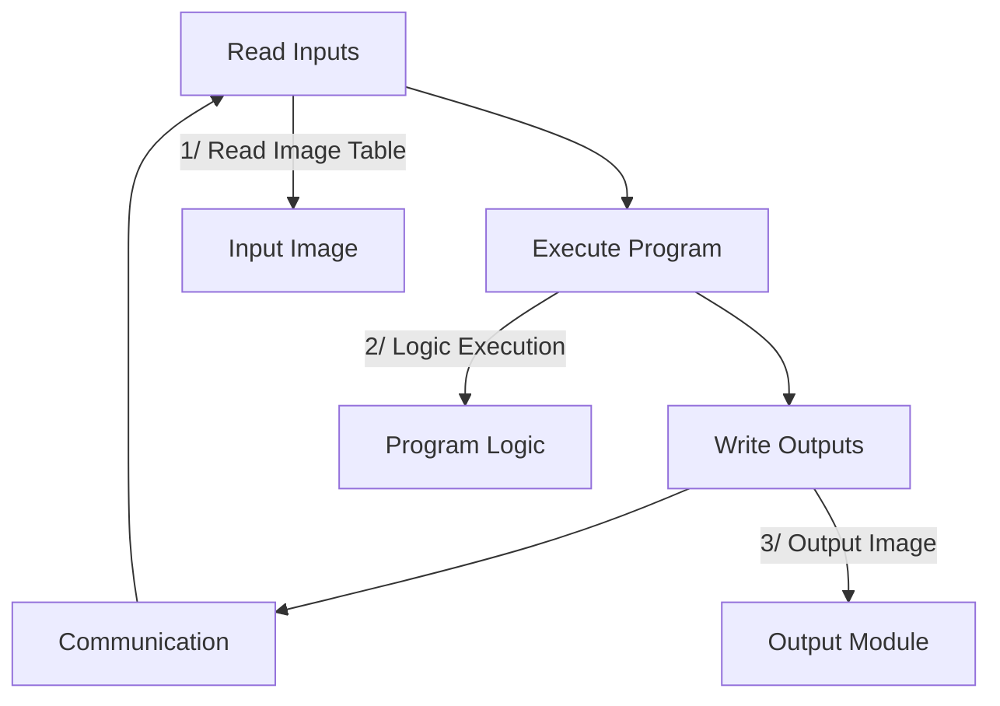
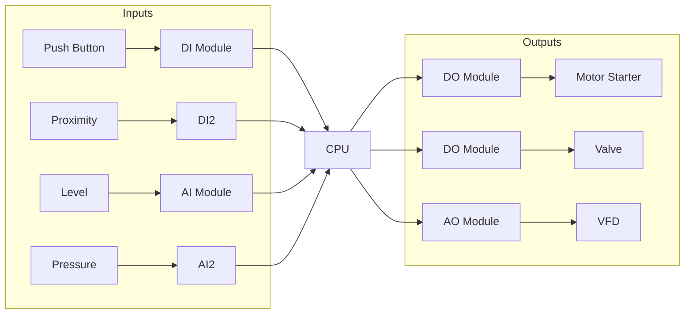
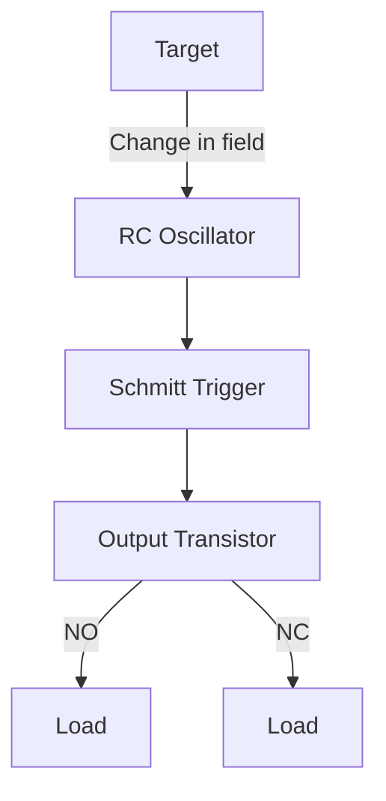
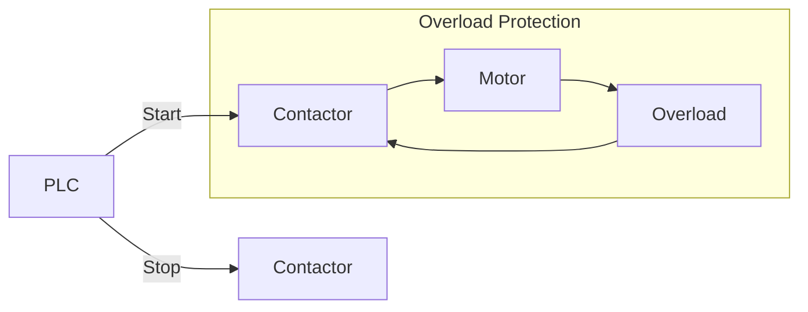
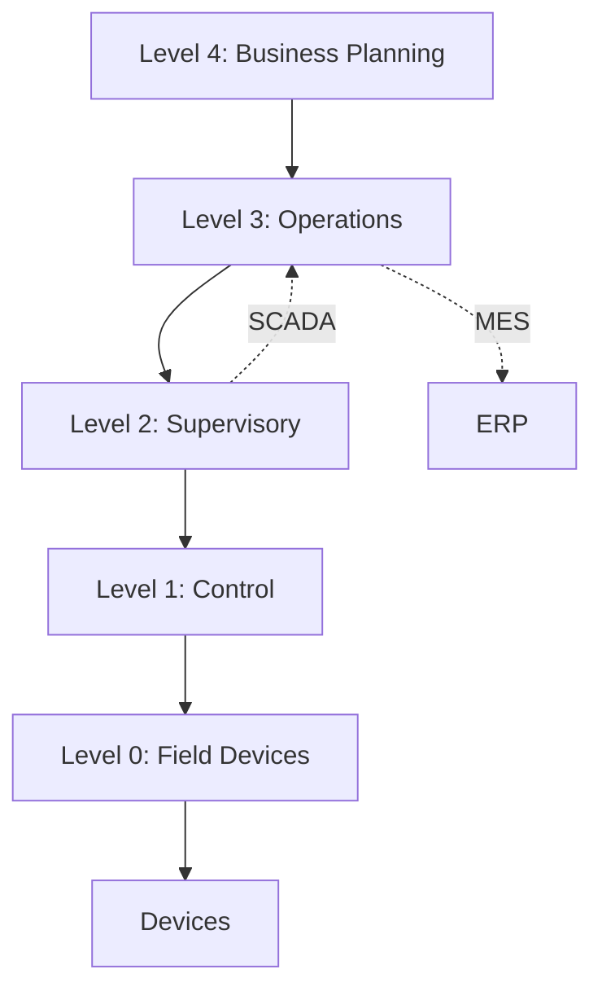
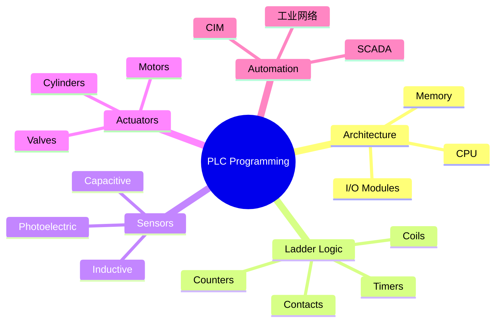

# تحكم منطقي مبرمج - PLC (Programmable Logic Controller)

## نظرة عامة (Overview)

```
┌─────────────────────────────────────────────────────────────┐
│                PLC Programming                      │
├─────────────────────────────────────────────────────┤
│  Ladder Logic → Architecture → I/O → Automation   │
└─────────────────────────────────────────────────────┘
```

---

## 1. بنية PLC (PLC Architecture)

### مكونات النظام



### مكونات PLC الأساسية

| المكون | الوظيفة | الوحدة |
|--------|----------|----------|
| CPU | معالجة البيانات | المعالج |
| Memory | تخزين البرامج | RAM/ROM |
| Power Supply | تغذية الطاقة | 24VDC |
| Input Module | استقبال الإشارات | DI/DO |
| Output Module | إرسال الإشارات | AI/AO |
| Communication | الاتصال بالشبكة | Ethernet/RS |

### دورة المسح (Scan Cycle)



**مراحل المسح:**
1. 📥 **Input Scan**: قراءة المدخلات
2. ⚙️ **Program Execution**: تنفيذ البرنامج
3. 📤 **Output Scan**: كتابة المخرجات

---

## 2. منطق السلم (Ladder Logic)

### أساسيات Ladder Logic

```mermaid
ladder
    ||---[ ]---|---[ ]---|---( )---||
    ||  I:1/1 ||  I:1/2 ||  O:1/1 ||
    ||  Start  ||  Stop   ||  Motor ||
```

### العناصر الأساسية

| الرمز | الاسم | الوظيفة | مثال |
|-------|-------|----------|-------|
| `||` | rails | القضبان | Power rails |
| `[ ]` | contact | تلامس | Input/Output |
| `( )` | coil | ملف | Output coil |
| `[ ]/` | normally closed | تلامس مغلق | NC contact |
| `( )/` | normally open | ملف معكوس | Reverse coil |

### عوامل التوقيت (Timers)

| النوع | الوظيفة | مخطط الوقت |
|-------|----------|--------------|
| TON | تأخير تشغيل | On-Delay |
| TOF | تأخير إيقاف | Off-Delay |
| RTO | تأخير متراكم | Retentive |

### TON Timer Example

```
┌─────────────────────────────────────────┐
│         ON Delay Timer                  │
├─────────────────────────────────────────┤
│                                         │
│  ||---[ ]---|---(TON)---|---( )---|       │
│  ||  Start  │   T:1     │  Out   │       │
│                                         │
│  Timer Settings:                        │
│  - Preset: 10 seconds                   │
│  - Done Bit: T:1/DN                     │
│  - Accum: T:1/ACC                       │
└─────────────────────────────────────────┘
```

```ladder
// TON Timer
||---[ ]---|---[ ]---|---(TON, T4:0, 10.0)---|---( )---|
|| Start    │  Enable │     Timer             │  Output ||
```

### عوامل العد (Counters)

| النوع | الوظيفة |
|-------|----------|
| CTU | عداد تصاعدي |
| CTD | عداد تنازلي |
| CTD |计数器 | عداد ثنائي الإتجاه |

```ladder
// Counter Up
||---[ ]---|---(CTU, C5:0, 10)---|---( )---|
||  Part    │     Counter        │  Complete ||
```

---

## 3. المدخلات والمخرجات (Inputs & Outputs)

### أنواع المدخلات (Input Types)

| النوع | الوصف | الجهد |
|-------|-------|------|
| Discrete/Digital | ثنائي (0/1) | 24VDC, 120VAC |
| Analog | تماثلي (0-10V, 4-20mA) | مستمر |
| Temperature | حراري (RTD, Thermocouple) | خاصة |
| Encoder | مشفر (Pulse) | ترددي |

### أنواع المخرجات (Output Types)

| النوع | الوصف | الحمل |
|-------|-------|--------|
| Relay | مرحل | AC/DC |
| Transistor | ترانزستور | DC |
| Triac | ترياك | AC |

### تكوين المدخلات/المخرجات



---

## 4. المجسات (Sensors)

### أنواع المجسات

| النوع | المبدأ | الاستخدام |
|-------|---------|-------------|
| Inductive | الحث المغناطيسي | المعادن |
| Capacitive | السعة | المواد الصلبة/السائلة |
| Photoelectric | الضوء | العامود، الكشف |
| Ultrasonic | الصدى | المسافة، المستوى |
| RTD | المقاومة | درجة الحرارة |
| Thermocouple | الجهد الحراري | درجات عالية |

### مجس inductif

```
┌─────────────────────────────────────────┐
│         Inductive Proximity              │
├─────────────────────────────────────────┤
│                                         │
│    ┌─────────┐                          │
│    │  Coil   │───→ Oscillator           │
│    │  Inductor  │───→ Detector         │
│    └─────────┘───→ Output               │
│                                         │
│    Detection Range:                    │
│    - M8:  1.5mm                        │
│    - M12: 4mm                          │
│    - M18: 8mm                          │
│    - M30: 15mm                         │
└─────────────────────────────────────────┘
```

### مجس Capacitif



###接线-diagram

```
┌─────────────────────────────────────────┐
│         Wiring Diagram                  │
├─────────────────────────────────────────┤
│                                         │
│  Brown  ───┬── Input Module             │
│            │                            │
│  Blue   ───┤── Common                   │
│            │                            │
│  Black ───┬── Load (Switch)             │
│            │                            │
│           ┌┴── +24VDC                  │
│                                         │
└─────────────────────────────────────────┘
```

---

## 5. المشغلات (Actuators)

### أنواع المشغلات

| النوع | الوظيفة | التحكم |
|-------|----------|----------|
| Motor AC/DC | دوران | ON/OFF, Variable |
| Solenoid Valve | صمامات | ON/OFF |
| Hydraulic Cylinder | هيدروليك | Proportional |
| Pneumatic Cylinder | نيوماتيك | Proportional |
| Heater/Cooler | تدفئة/تبريد | PWM |

### محرك starter



### صمام كهرومغناطيسي

```
┌─────────────────────────────────────────┐
│         Solenoid Valve                  │
├─────────────────────────────────────────┤
│                                         │
│  Spring    ──→ Gate Closed              │
│                                         │
│  Solenoid ──→ Gate Open                │
│                                         │
│  Types:                                 │
│  - 2/2 NC (Normally Closed)           │
│  - 2/2 NO (Normally Open)             │
│  - 3/2 NC/NO                          │
│  - 4/2                                │
└─────────────────────────────────────────┘
```

---

## 6. أتمتة صناعية (Industrial Automation)

### levels التحكم



### نموذج CIM

```
┌─────────────────────────────────────────┐
│    Computer Integrated Manufacturing    │
├─────────────────────────────────────────┤
│                                         │
│  ┌─────────┐    ┌─────────┐              │
│  │  CAD   │───→│  CAM   │              │
│  └─────────┘    └─────────┘              │
│       ↓              ↓                   │
│  ┌─────────┐    ┌─────────┐              │
│  │  CAPP  │───→│  MIS   │              │
│  └─────────┘    └─────────┘              │
│       ↓              ↓                   │
│  ┌─────────┐    ┌���────────┐              │
│  │  CAQ   │───→│  MRP   │              │
│  └─────────┘    └─────────┘              │
│                                         │
└─────────────────────────────────────────┘
```

### PROFINET Protocol

| الطبقة | البروتوكول |
|--------|-------------|
| Level 7 | Application |
| Level 4 | TCP/UDP |
| Level 3 | IP |
| Level 2 | Ethernet |

---

## 7. برمجة متقدمة (Advanced Programming)

### Structured Text

```pascal
// Structured Text (ST)
PROGRAM MotorControl
VAR
    StartButton AT %I0.0 : BOOL;
    StopButton AT %I0.1 : BOOL;
    MotorRun AT %Q0.0 : BOOL;
    MotorSpeed AT %Q0.1 : INT;
    TimerOn : TON;
    Fault : BOOL;
END_VAR

// Main Logic
IF StartButton AND NOT StopButton THEN
    TimerOn(IN := TRUE, PT := T#5S);
    IF TimerOn.DN THEN
        MotorRun := TRUE;
    END_IF
ELSE
    MotorRun := FALSE;
    TimerOn(IN := FALSE);
END_IF
```

### Function Block Diagram

```fbd
┌─────────────────────────────────────────┐
│      Function Block Diagram             │
├─────────────────────────────────────────┤
│                                         │
│  [Start]──┐                            │
│           ↓                            │
│        [AND]──→[TON]──→[Motor]          │
│           ↑                            │
│  [Stop]──┘                            │
│                                         │
└─────────────────────────────────────────┘
```

### Sequential Function Chart

```sfc
{
  "nodes": [
    {"id": "1", "label": "Start"},
    {"id": "2", "label": "Move to A"},
    {"id": "3", "label": "Process"},
    {"id": "4", "label": "Move to B"}
  ],
  "edges": [
    {"from": "1", "to": "2", "condition": "Start"},
    {"from": "2", "to": "3", "condition": "At Position"},
    {"from": "3", "to": "4", "condition": "Done"},
    {"from": "4", "to": "1", "condition": "Return"}
  ]
}
```

---

## 8. جدول المقارنات (Comparison Tables)

### لغات البرمجة

| اللغة | المستوى | المزايا | العيوب |
|--------|----------|---------|--------|
| Ladder Logic | منخفض | سهل الفهم, مرئي | محدود |
| Function Block | متوسط | مرئي, معياري | معقد |
| Structured Text | عالي | مرن, قوي | يحتاج خبرة |
| Sequential SFC | عالي | التحكم المتسلسل | معقد |

### اتصالات PLC

| البروتوكول | скорость | المسافة | الاستخدام |
|-------------|----------|---------|-------------|
| Ethernet/IP | 100Mbps | 100m | الصناعية |
| PROFINET | 100Mbps | 100m | سيمنز |
| EtherCAT | 100Mbps | 100m | حركات سريعة |
| Modbus TCP | 100Mbps | 100m | العامة |
| RS-232 | 115Kbps | 15m | قديمة |
| RS-485 | 10Mbps | 1200m | صناعية |

---

## 9. المشاكل الشائعة (Common Pitfalls)

### ⚠️ المشاكل

```warning
❌ عدم تأريض (Ground) صحيح
❌ تشابك (Ground Loops) بين الأجهزة
❌ عدم عزل المدخلات/المخرجات
❌ إشارات مستقرة (Floating Signals)
❌ تجاوز السعة (Input Overload)
❌ عدم استخدام واقي الجهد (Surge Protection)
❌ تأخير الاستجابة (Response Time)
```

### ✅ الحلول

```bash
# ✅ Proper Wiring
# Use shielded cables for analog signals
# Ground at one point only
# Use optocouplers for isolation

# ✅ Input Filtering
# Add RC filter for noisy signals
# Use debounce for mechanical switches
# Shield cables from EMI
```

---

## 10. الأوامر والتكوين (Commands & Configuration)

### عنونة المدخلات/المخرجات

| النمط | العنوان | مثال |
|-------|---------|------|
| Allen Bradley | `N7:0` | `I:1/0` |
| Siemens | `DB1.DBX0.0` | `%I0.0` |
| Mitsubishi | `X0` | `Y0` |
| Omron | `0.00` | `10.00` |

### PLC Configuration

```yaml
# PLC settings
cpu:
  model: Siemens S7-1500
  memory: 2MB
  scan_time: 1ms

io:
  digital_inputs: 32
  digital_outputs: 32
  analog_inputs: 8
  analog_outputs: 8

communication:
  - name: PROFINET
    port: 100
  - name: Modbus TCP
    port: 502
```

---

## 11. ملخص (Summary)



**Key Points:**
- ⚙️ **Architecture**: فهم بنية PLC
- 📊 **Ladder Logic**: برمجة السلم
- 🔌 **I/O**: المدخلات والمخرجات
- 🧪 **Sensors**: المجسات
- 🎮 **Actuators**: المشغلات
- 🏭 **Automation**: الأتمتة الصناعية