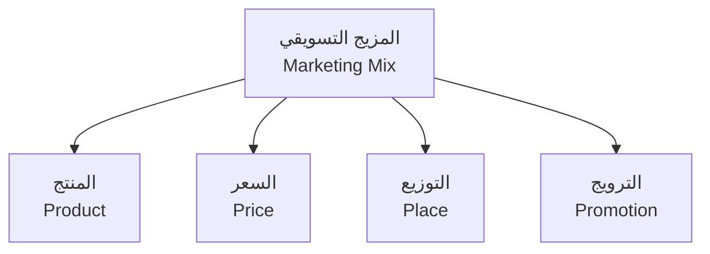
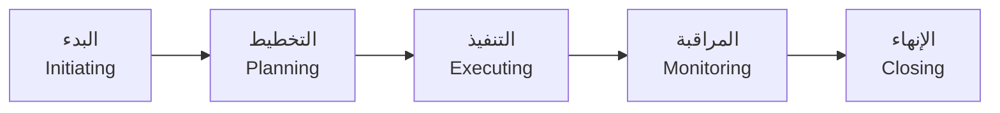
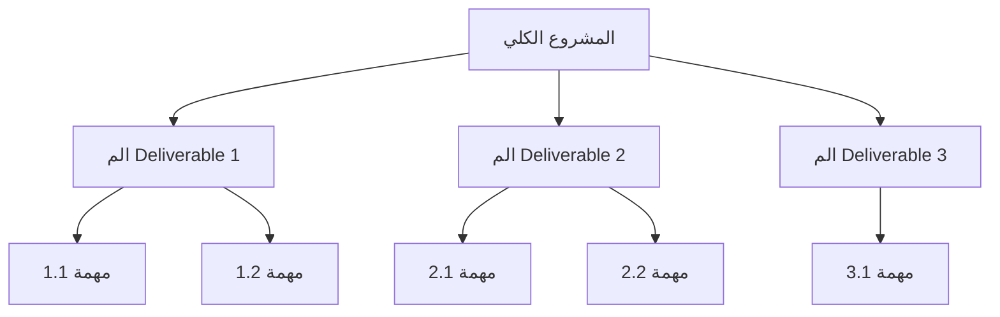
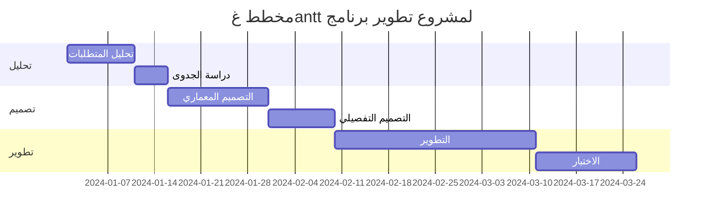
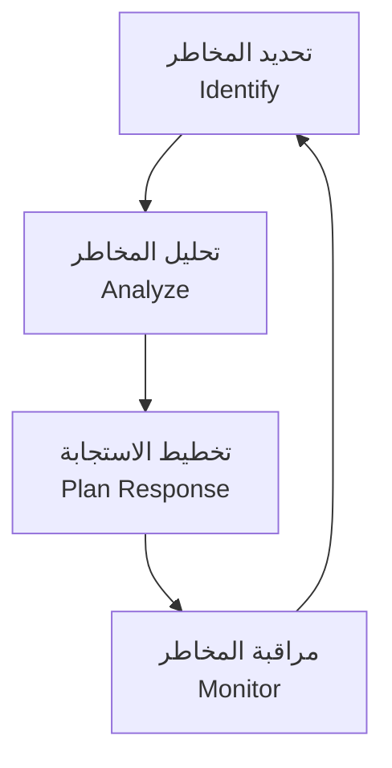

# تسويق وإدارة مشاريع · Marketing & Project Management (Year 4 - Semester 2)

## 📢 أساسيات التسويق · Marketing Fundamentals

### مفهوم التسويق · Concept of Marketing

- **التسويق** (Marketing): عملية إنشاء القيمة للعملاء وبناء علاقات قوية معهم لتحقيق قيمة متبادلة.
- **السوق** (Market): مجموعة من العملاء المحتملين الذين لديهم احتياجات مشتركة.
- **العميل المستهدف** (Target Customer): العملاء الذين يركز عليهم المنتج/الخدمة.

### عناصر المزيج التسويقي (4P) · Marketing Mix

| العنصر | الوصف | التطبيق |
|--------|-------|---------|
| **المنتج** | سلعة أو خدمة تلبي احتياجات العملاء | تصميم، جودة، علامة تجارية |
| **السعر** | القيمة المالية للمنتج | تسعير، خصومات، شروط |
| **التوزيع** | توصيل المنتج للعملاء | قنوات، مواقع، مخزون |
| **الترويج** | التواصل مع العملاء | إعلانات، علاقات عامة |

---

## 📋 إدارة المشاريع · Project Management

### تعريف المشروع · Project Definition

- **المشروع** (Project): جهد مؤقت لإنتاج منتج أو خدمة فريدة.
- **إدارة المشروع** (Project Management): تطبيق المعرفة والمهارات والأدوات لتحقيق أهداف المشروع.

### مراحل المشروع · Project Phases

### هيكل تقسيم العمل (WBS) · Work Breakdown Structure

---

## 📊 مخطط غانت · Gantt Chart

### التعريف · Definition

مخطط غانت هو أداة لتصور جدول المشروع，展示 الأنشطة والتبعيات الزمنية.

### العناصر الرئيسية · Key Elements

| العنصر | الوصف |
|--------|-------|
| **المهام** (Tasks) | الأنشطة التي يتكون منها المشروع |
| **المدة** (Duration) | زمن كل مهمة |
| **التبعيات** (Dependencies) | الترتيب بين المهام |
| **الميالstone** | نقاط نهاية المراحل |

### مثال · Example

### حساب المسار الحرج · Critical Path Method (CPM)

$$EC = ES + D$$

$$LC = LS - D$$

$$Slack = LS - ES = LF - EF$$

حيث:
- $EC$: وقت الانتهاء المبكر (Earliest Completion)
- $ES$: وقت البدء المبكر (Earliest Start)
- $D$: المدة (Duration)
- $LC$: وقت الانتهاء المتأخر (Latest Completion)
- $LS$: وقت البدء المتأخر (Latest Start)
- $LF$: وقت الانتهاء المتأخر (Latest Finish)

---

## ⚠️ إدارة المخاطر · Risk Management

### تعريف المخاطر · Risk Definition

- **الخطر** (Risk): حدث أو حالة غير مؤكدة قد تؤثر سلباً أو إيجاباً على أهداف المشروع.

### عملية إدارة المخاطر · Risk Management Process

### أنواع المخاطر · Risk Types

| النوع | الوصف | أمثلة |
|-------|-------|-------|
| **مخاطر تقنية** | متعلقة بالتكنولوجيا | فشل النظام، عدم توافق |
| **مخاطر خارجية** | خارج سيطرة المشروع | تغير السوق،自然灾害 |
| **مخاطر إدارية** | متعلقة بالإدارة | تأخر التسليم، ميزانية |
| **مخاطر بشرية** | متعلقة بالفريق | استقالة، عدم كفاءة |

### مصفوفة تقييم المخاطر · Risk Assessment Matrix

| الاحتمالية / الأثر | منخفض | متوسط | مرتفع |
|-------------------|-------|-------|-------|
| **عالي** | متوسط | مرتفع | حرج |
| **متوسط** | منخفض | متوسط | مرتفع |
| **منخفض** | منخفض | منخفض | متوسط |

### استراتيجيات الاستجابة · Response Strategies

- **تجنب** (Avoid): تغير الخطة لتجنب الخطر
- **تخفيف** (Mitigate): تقليل الاحتمالية أو الأثر
- **نقل** (Transfer): تحويل الخطر لجهة أخرى (تأمين)
- **قبول** (Accept): قبول الخطر وتخطيط للطوارئ

---

## 💰 إدارة الميزانية · Budget Management

### تقدير التكاليف · Cost Estimation

| الطريقة | الوصف | الدقة |
|---------|-------|-------|
| **التقدير من أسفل لأعلى** | تفصيل كل مهمة | عالية |
| **التقدير من أعلى لأسفل** | تقدير إجمالي | منخفضة |
| **المقارنة** | مشابه لمشاريع سابقة | متوسطة |
| **ثلاث نقاط** | متوسط (O + 4M + P) / 6 | متوسطة |

### صيغة التقدير بثلاث نقاط · Three-Point Estimation

$$E = \frac{O + 4M + P}{6}$$

$$SD = \frac{P - O}{6}$$

حيث:
- $O$: التقدير المتفائل (Optimistic)
- $M$: التقدير الأكثر احتمالاً (Most Likely)
- $P$: التقدير التشاؤمي (Pessimistic)
- $E$: التوقع (Expected)
- $SD$: الانحراف المعياري (Standard Deviation)

### أنواع التكاليف · Cost Types

- **تكاليف ثابتة** (Fixed Costs): لا تتغير بحجم الإنتاج
- **تكاليف متغيرة** (Variable Costs): تتناسب مع الإنتاج
- **تكاليف مباشرة** (Direct Costs): مرتبطة مباشرة بالمنتج
- **تكاليف غير مباشرة** (Indirect Costs): مشتركة بين عدة مشاريع

### مراقبة التكاليف · Cost Control

$$CV = BCWP - BCWP$$

$$SV = BCWP - BCWS$$

$$CPI = \frac{BCWP}{ACWP}$$

$$SPI = \frac{BCWP}{BCWS}$$

حيث:
- $CV$: تباين التكلفة (Cost Variance)
- $SV$: تباين الجدول (Schedule Variance)
- $CPI$: مؤشر أداء التكلفة (Cost Performance Index)
- $SPI$: مؤشر أداء الجدول (Schedule Performance Index)
- $BCWP$: القيمة المكتسبة (Budgeted Cost of Work Performed)
- $BCWS$: التكلفة المخططة للعمل المجدول (Budgeted Cost of Work Scheduled)
- $ACWP$: التكلفة الفعلية للعمل المنجز (Actual Cost of Work Performed)

---

## 📈 جدول مرجعي شامل · Master Reference Table

### أدوات إدارة المشاريع · Project Management Tools

| الأداة | الاستخدام | المميزات |
|--------|-----------|----------|
| **مخطط غانت** | جدولة المشاريع | تصور زمني بسيط |
| **PERT/CPM** | تحليل المسار الحرج | تحليل التبعيات |
| **مصفوفة RACI** | توزيع المسؤوليات | وضوح الأدوار |
| **مخطط السبب والنتيجة** | تحليل المشكلات | تحديد الأسباب الجذرية |
| **التدفق النقدي** | إدارة الميزانية | تتبع التدفقات |

### مؤشرات الأداء الرئيسية · KPIs

| المؤشر | الصيغة | المعيار |
|--------|--------|---------|
| **مؤشر أداء الجدول** | SPI = BCWP/BCWS | > 1 جيد |
| **مؤشر أداء التكلفة** | CPI = BCWP/ACWP | > 1 جيد |
| **نسبة الإنجاز** | % Complete | كلما اقترب من 100% |
| **الميالstone المحققة** | عدد/إجمالي | 100% عند الانتهاء |

---

## ⚠️ أخطاء شائعة وملاحظات · Common Pitfalls & Notes

### ❌ أخطاء شائعة في التسويق

1. **الخلط بين التسويق والمبيعات**:
   - التسويق: بناء العلاقة وجذب العملاء
   - sales: إغلاق الصفقة

2. **تجاهل تحليل المنافسين**:
   - 💡 selalu analisis SWOT untuk kompetitor

3. **عدم تحديد الفئة المستهدفة بدقة**:
   - العملاء المحتملين ≠ العملاء المستهدفين

### ❌ أخطاء شائعة في إدارة المشاريع

1. **تخطيط غير كافٍ**:
   - يبدأ المشروع بدون خطة واضحة

2. **تجاهل إدارة المخاطر**:
   - لا توجد خطة طوارئ

3. **عدم تحديث الميزانية**:
   - المشروع يخرج عن التحكم

4. **ضعف التواصل**:
   - عدم وضوح الأدوار والمسؤوليات

5. **متلازمة المؤسس**:
   - تأخير القرارات بانتظار معلومات كاملة

### 💡 نصائح مهمة

- **القاعدة 80/20**: 80% من النتائج تأتي من 20% من الجهود
- **مؤشر القيمة المكتسبة**: أفضل مقياس للتقدم
- **التواصل**: 90% من نجاح المشروع يعتمد على التواصل الفعال

### 📌 ملاحظات نهائية

- **المسار الحرج**: أطول سلسلة من المهام الحرجة
- **الميالstone**: نقطة نهاية مرحلة رئيسية
- **التدفق النقدي**: شريان الحياة للمشروع
- **إدارة التغيير**: أفضل الممارسات تتضمن عملية تغيير رسمية

---

## 📝 أمثلة محلولة · Worked Examples

### مثال 1: حساب المسار الحرج

**المعطيات:**

| المهمة | المدة (أيام) | التبعية |
|--------|--------------|---------|
| A | 5 | - |
| B | 3 | A |
| C | 4 | A |
| D | 6 | B, C |
| E | 2 | D |

**الحل:**

- المسارات:
  - A → B → D → E: 5 + 3 + 6 + 2 = 16 يوم
  - A → C → D → E: 5 + 4 + 6 + 2 = 17 يوم

- **المسار الحرج**: A → C → D → E (17 يوم)

### مثال 2: حساب مؤشر الأداء

**المعطيات:**
- BCWS = 100,000
- BCWP = 90,000
- ACWP = 110,000

**الحل:**

$$CPI = \frac{BCWP}{ACWP} = \frac{90000}{110000} = 0.82 < 1$$

$$SPI = \frac{BCWP}{BCWS} = \frac{90000}{100000} = 0.9 < 1$$

**النتيجة**: المشروع متأخر وتجاوز الميزانية!

---

(End of file)