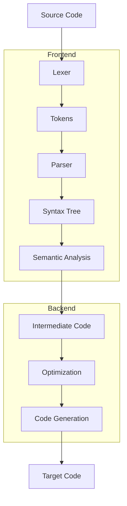
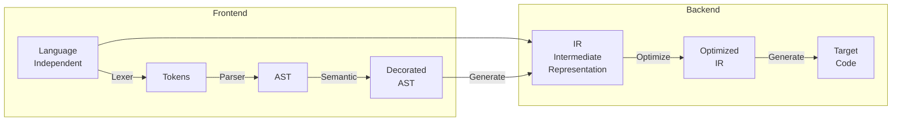
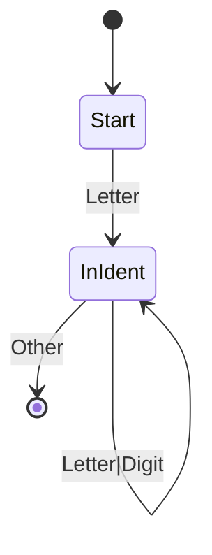
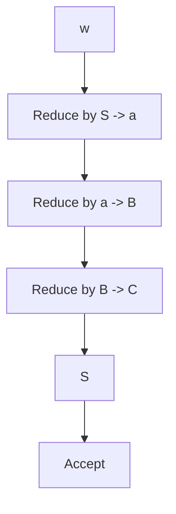
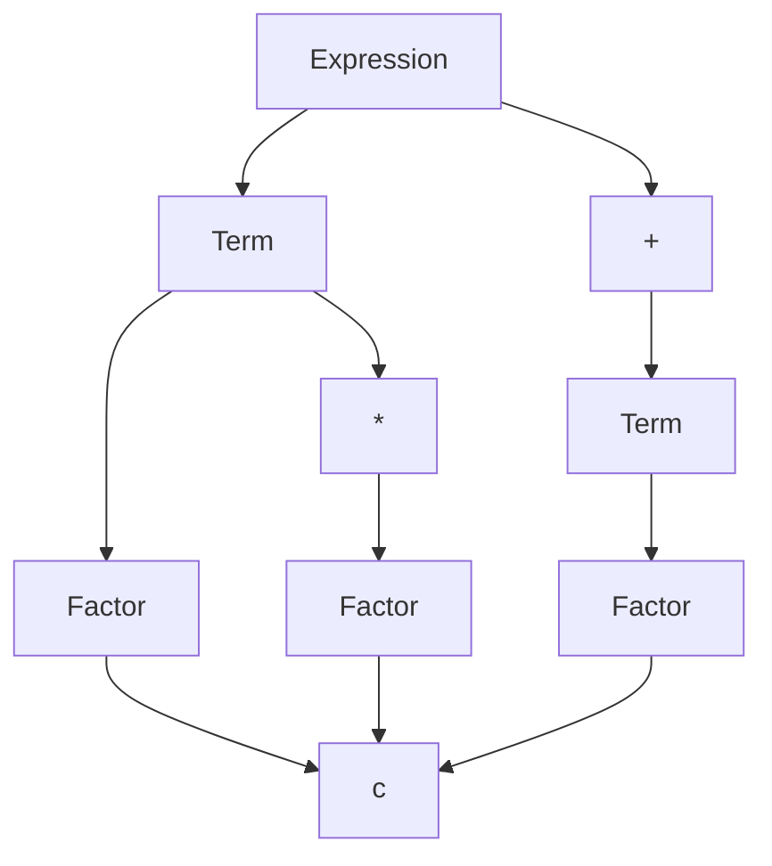

# تصميم المترجمات · Compiler Design

## 📐 التعاريف الأساسية · Core Definitions

- **المترجم** (Compiler): برنامج يترجم من لغة عالية المستوى إلى لغة الآلة.
- **المحلل المعجمي** (Lexer): يحول النص إلى رموز tokens.
- **المحلل النحوي** (Parser): يتحقق من صحة الصياغة Syntax.
- **بناء الجملة** (Syntax Tree): شجرة التمثيل الهرمي للكود.
- **فحص الأنواع** (Type Checking): يتحقق من توافق الأنواع.
- **توليد الكود** (Code Generation): إنتاج كود الآلة.
- **التحسين** (Optimization): تحسين الكود المُنتج.

---

## 🔁 بنية المترجم · Compiler Structure

### مراحل المترجم · Compiler Phases



### الواجهة الأمامية والخلفية · Frontend vs Backend



---

## 🧮 النظريات والصيغ · Theorems & Formulas

### 1. التحليل المعجمي · Lexical Analysis

#### التعابير المنتظمة · Regular Expressions

| البنية | الوصف | مثال |
| ------ | ----- | ---- |
| `a` | الرمز a | `a` |
| `a|b` | a أو b | `if\|else` |
| `a*` | صفر أو أكثر a | `a*` |
| `a+` | واحد أو أكثر a | `a+` |
| `a?` | اختياري a | `a?` |
| `.` | أي رمز | `.` |
| `[abc]` | أي من a,b,c | `[0-9]` |
| `[^abc]` | ليس a,b,c | `[^0-9]` |
| `(ab)` | مجموعة | `(ab)+` |

#### توليد الرموز · Token Generation

$$Token = (token-type, value, line, column)$$

#### Automata للمفرد · DFA for Identifiers



### 2. التحليل النحوي · Parsing

#### القواعد النحوية · Grammar Rules

$$G = (V, \Sigma, R, S)$$

where:
- $V$: المتغيرات (Non-terminals)
- $\Sigma$: الرموز الطرفية (Terminals)
- $R$: القواعد الإنتاجية
- $S$: رمز البداية

#### التحليل التصاعدي · Bottom-Up Parsing



#### جداول التحليل · Parsing Tables

| Action | id | + | * | $ |
| ------ |----- | --- | --- | --- |
| **E→** | s6 | | s5 | |
| **T→** | s2 | r2 | | r2 |
| **F→** | s3 | r4 | r4 | r4 |

### 3. بناء الشجرة · Syntax Tree

#### بنية الشجرة · Tree Structure



### 4. فحص الأنواع · Type Checking

#### جدول الرموز · Symbol Table

```python
SymbolEntry = {
    'name': str,
    'type': Type,
    'kind': 'variable' | 'function' | 'parameter',
    'scope': Scope,
    'line': int
}
```

#### قواعد التوافق · Type Compatibility

$$\tau_1 \compatible \tau_2 \iff \tau_1 = \tau_2 \text{ or } \tau_1 \compatible \tau_2$$

### 5. توليد الكود · Code Generation

#### الثلاثي · Three-Address Code (TAC)

```assembly
t1 = a + b
t2 = t1 * c
if t2 > 10 goto L1
```

####_operand Addressing

| النمط | الوصف | مثال |
| ------ | ----- | ---- |
| **Immediate** | قيمة مباشرة | `#42` |
| **Direct** | عنوان مباشر | `addr` |
| **Indirect** | عنوان غير مباشر | `@addr` |
| **Indexed** | فهرس | `addr[index]` |
| **Relative** | نسبي | `$addr` |

---

## 📊 جدول مرجعي · Reference Tables

### جدول التراكيب · Grammar Types

| النوع | الوصف |_parser Complexity |
| ---------- | ----- | ---- |
| **Regular** | $_2$ و $_1$ | O(n) |
| **LR(k)** |Shift-Reduce | O(n) |
| **LALR** | Lookahead LR | O(n) |
| **SLR** | Simple LR | O(n) |
| **LL(k)** | Recursive Descent | O(n) |

### جدول التحسين · Optimization Types

| التحسين | الوصف | مثال |
| ---------- | ----- | ---- |
| **Constant Folding** | حساب الثوابت | `2+3 → 5` |
| **Copy Propagation** |نسخ المتغيرات | `x=y; f(x) → f(y)` |
| **Common Subexpression** |تكرار مشترك | `a+b; c+(a+b) → c+t` |
| **Dead Code Elimination** |إزالة الميت | `if false → remove` |
| **Loop Invariant** |نقل الثابت |移到 خارج الحلقة |
| **Strength Reduction** |تقليل القوة | `x*2 → x<<1` |

### جدول الأنواع · Type Sizes

| النوع | الحجم | النطاق |
| ---------- | ----- | ------ |
| **char** | 1 byte | -128 to 127 |
| **short** | 2 bytes | -32768 to 32767 |
| **int** | 4 bytes | $-2^{31}$ to $2^{31}-1$ |
| **long** | 8 bytes | $-2^{63}$ إلى $2^{63}-1$ |
| **float** | 4 bytes | $\pm 3.4 \times 10^{38}$ |
| **double** | 8 bytes | $\pm 1.8 \times 10^{308}$ |
| **pointer** | 8 bytes (64-bit) | address space |

---

## 📝 أمثلة محلولة · Worked Examples

### مثال 1: بناء DFA للمعرفات

**المعطيات:** أي سلسلة تبدأ بحرف وتتبعها أرقام أو_

**الحل:**
1. الرموز: `A-Z`, `a-z`, `0-9`
2. الحالات:
   - $q_0$: البداية (غير معرف)
   - $q_1$: معرف مقبول
3. الانتقالات:
   - $q_0 \xrightarrow{\text{letter}} q_1$
   - $q_1 \xrightarrow{\text{letter|digit}} q_1$

**التعبي REGEX:**
```regex
[a-zA-Z][a-zA-Z0-9]*
```

### مثال 2: التحقق من التوازن بالأقواس

**المعطيات:** `{(a+b) * [c/d]}`

**الحل:**
```python
def balanced(s):
    stack = []
    for char in s:
        if char in '({[':
            stack.append(char)
        elif char in ')}]':
            if not stack:
                return False
            if not matches(stack.pop(), char):
                return False
    return len(stack) == 0
```

### مثال 3: توليد TAC للتعبير

**المعطيات:** `a = b + c * d`

**الحل:**
```
t1 = c * d
t2 = b + t1
a = t2
```

---

## ⚠️ أخطاء شائعة وملاحظات · Common Pitfalls & Notes

### ❌ أخطاء شائعة

1. **الخلط بين Regex و Grammar:**
   - Regex: يستخدم للمفرد lexical
   - Grammar: يستخدم لـSyntax
   - 💡 **ملاحظة**: Regex لا يدعم التداخل!

2. **الخلط بي�� LR و LL:**
   - LR: Bottom-up، أقوى، harder
   - LL: Top-down، أضعف، أسهل
   - LL(k): تحتاج lookahead k

3. **نسيان أولوية العمليات:**
   - `a + b * c` = `a + (b * c)`
   - يجب أن يعكس parser الأولوية!
   - استخدام precedence table

4. **عدم فصل التحليل:**
   - Lexical → Syntax → Semantic
   - الخطأ في lexical قد يسبب syntax errors!

### 💡 نصائح مهمة

- **معايير التصميم:**
  - Completeness: كل البرامج الصحيحة
  - Soundness: لا أخطاء false
  - Efficiency: O(n) parsing

- **Intermediate Representations:**
  - AST: للشجرة
  - Three-Address Code: للتحليل
  - Register Allocation:_register allocation

- **Code Generation:**
  - Instruction Selection: اختيار تعليمات
  - Register Allocation: تخصيص السجلات
  - Instruction Scheduling: ترتيب التعليمات

### 📌 ملاحظات نهائية

- **Lexer** vs **Parser**:
  - Lexer: tokenization based on regex
  - Parser: syntax validation based on CFG

- **Left Recursion**:
  - eliminate in LL parsers
  - handle naturally in LR parsers

- **Conflicts**:
  - Shift-Reduce vs Reduce-Reduce
  - caused by ambiguous grammar