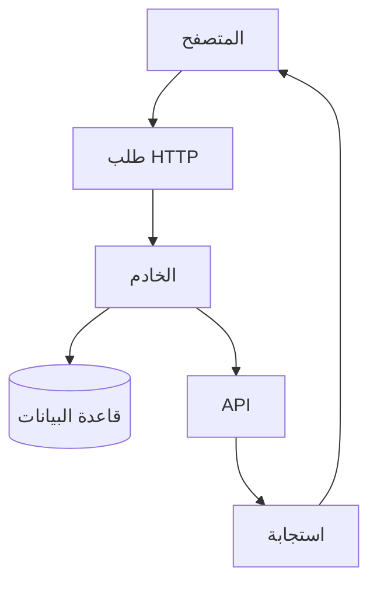
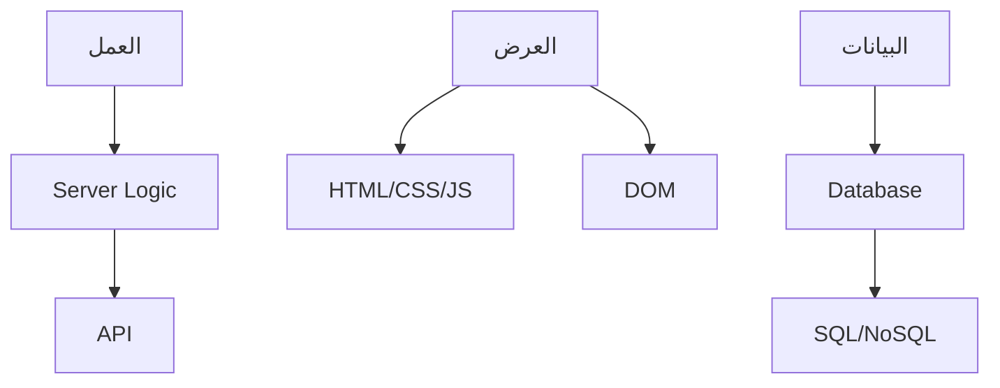
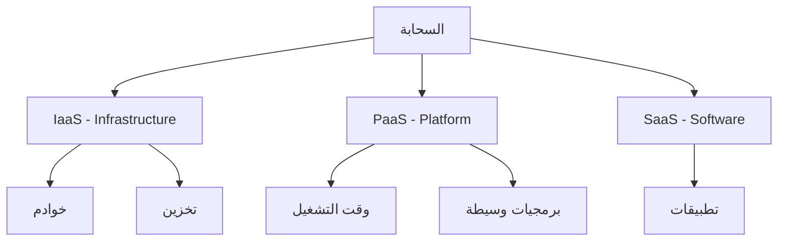
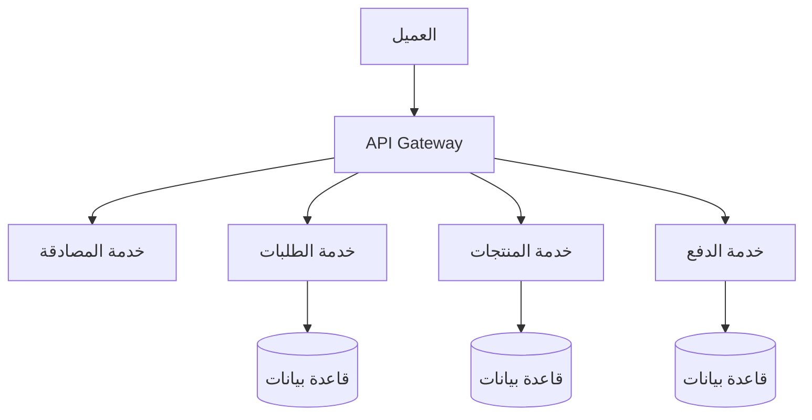
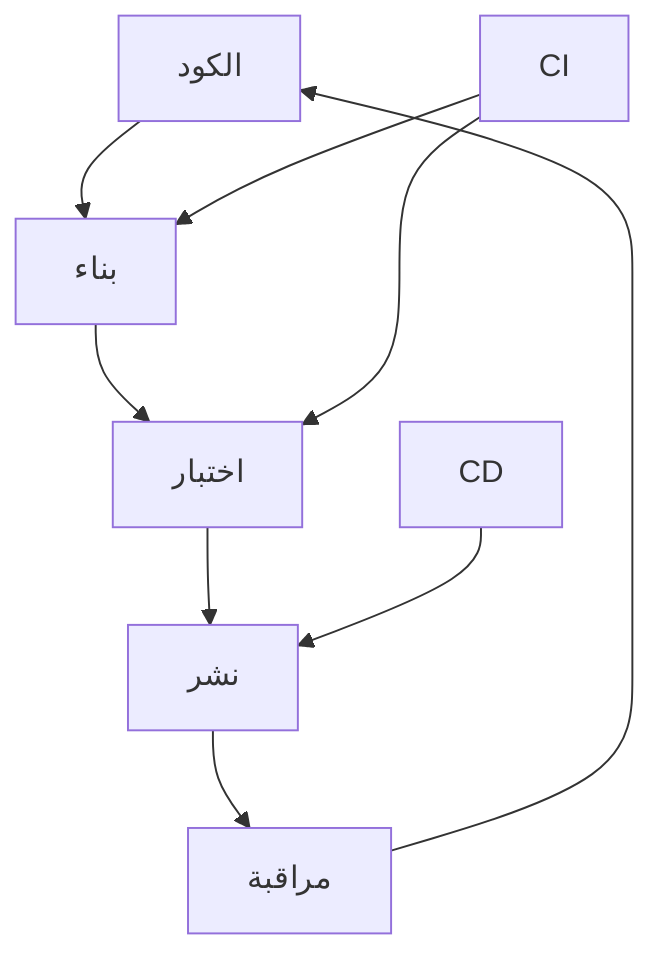

# تطبيقات الإنترنت · Internet Applications (Year 4 - Semester 2)

## 🌐 مقدمة في تطبيقات الإنترنت · Introduction to Internet Applications

### مفهوم تطبيقات الويب

- **تطبيق الويب** (Web Application): برنامج يعمل على خادم ويب ويصل إليه المستخدم عبر المتصفح.
- **تطبيقات الإنترنت** (Internet Applications): خدمات وأنظمة تعمل على شبكة الإنترنت.



### تطور تطبيقات الويب

| الجيل | الوصف | التقنيات |
|-------|-------|----------|
| **Web 1.0** | ثابت، للقراءة | HTML, CSS |
| **Web 2.0** | تفاعلي | JavaScript, AJAX |
| **Web 3.0** | ذكي، شخصي | AI, Semantic Web |
| **Web 4.0** | connected | IoT, AI agents |

---

## 🏗️ تطوير الويب · Web Development

### طبقات التطبيق · Application Layers



### بنية Frontend

```html
<!DOCTYPE html>
<html lang="ar" dir="rtl">
<head>
    <meta charset="UTF-8">
    <title>تطبيق ويب</title>
    <style>
        body { font-family: Arial; }
    </style>
</head>
<body>
    <header>
        <h1>تطبيق الويب</h1>
    </header>
    <main>
        <div id="app"></div>
    </main>
    <script>
        // JavaScript
    </script>
</body>
</html>
```

### أنماط التصميم · Design Patterns

| النمط | الوصف |
|-------|-------|
| **MVC** | Model-View-Controller |
| **MVVM** | Model-View-ViewModel |
| **Flux** | Unidirectional Data Flow |
| **Clean Architecture** | طبقات منفصلة |

---

## 🔌 واجهات برمجة التطبيقات REST API

### مفهوم REST

- **REST**: Representational State Transfer.
- **مبدأ**: موارد محددة بـ URLs، HTTP methods للعمليات.

```mermaid
graph TD
    Client[العميل] --> GET[/users]
    Client --> POST[/users]
    Client --> PUT[/users/1]
    Client --> DELETE[/users/1]
    
    GET --> R1[قراءة]
    POST --> R2[إنشاء]
    PUT --> R3[تعديل]
    DELETE --> R4[حذف]
```

###.methods HTTP

| Method | الوصف | idempotent |
|--------|-------|------------|
| **GET** | قراءة مورد | نعم |
| **POST** | إنشاء مورد جديد | لا |
| **PUT** | استبدال المورد | نعم |
| **PATCH** | تحديث جزئي | لا |
| **DELETE** | حذف المورد | نعم |

### أكواد الاستجابة · Response Codes

| الكود | المعنى | الوصف |
|-------|--------|-------|
| **200** | OK | نجاح |
| **201** | Created | تم الإنشاء |
| **204** | No Content | نجاح بلا محتوى |
| **400** | Bad Request | طلب خاطئ |
| **401** | Unauthorized | غير مصرح |
| **404** | Not Found | غير موجود |
| **500** | Server Error | خطأ الخادم |

### تصميم REST API

```javascript
// Node.js/Express
const express = require('express');
const app = express();

// GET - قراءة كل المستخدمين
app.get('/api/users', async (req, res) => {
    const users = await User.find();
    res.json(users);
});

// GET - قراءة مستخدم واحد
app.get('/api/users/:id', async (req, res) => {
    const user = await User.findById(req.params.id);
    if (!user) return res.status(404).json({ error: 'Not found' });
    res.json(user);
});

// POST - إنشاء مستخدم
app.post('/api/users', async (req, res) => {
    const user = new User(req.body);
    await user.save();
    res.status(201).json(user);
});

// PUT - تحديث مستخدم
app.put('/api/users/:id', async (req, res) => {
    const user = await User.findByIdAndUpdate(req.params.id, req.body, { new: true });
    res.json(user);
});

// DELETE - حذف مستخدم
app.delete('/api/users/:id', async (req, res) => {
    await User.findByIdAndDelete(req.params.id);
    res.status(204).send();
});
```

### GraphQL

```javascript
// استعلام GraphQL
const query = `
  query GetUser($id: ID!) {
    user(id: $id) {
      name
      email
      posts {
        title
      }
    }
  }
`;

// نوع التعريف
const typeDefs = `
  type User {
    id: ID!
    name: String!
    email: String!
    posts: [Post]
  }
  
  type Post {
    title: String!
    content: String
  }
  
  type Query {
    user(id: ID!): User
    users: [User]
  }
  
  type Mutation {
    createUser(name: String!, email: String!): User
  }
`;
```

---

## ☁️ الحوسبة السحابية · Cloud Computing

### مفهوم الحوسبة السحابية

- **الحوسبة السحابية**: تقديم خدمات الحوسبة عبر الإنترنت.



### نماذج الخدمات

| النموذج | الوصف | أمثلة |
|---------|-------|-------|
| **IaaS** | بنية تحتية ظاهرية | AWS EC2, Azure VM |
| **PaaS** | منصة تطوير | Heroku, Azure App Service |
| **SaaS** | برنامج كخدمة | Gmail, Office 365 |

### خدمات AWS الرئيسية

| الخدمة | الوصف |
|--------|-------|
| **EC2** | خوادم ظاهرية |
| **S3** | تخزين объекات |
| **Lambda** | دوال بدون خادم |
| **RDS** | قواعد بيانات |
| **CloudFront** | CDN |

### Kubernetes (K8s)

```yaml
#deployment.yaml
apiVersion: apps/v1
kind: Deployment
metadata:
  name: my-app
spec:
  replicas: 3
  selector:
    matchLabels:
      app: my-app
  template:
    metadata:
      labels:
        app: my-app
    spec:
      containers:
      - name: my-app
        image: my-image:latest
        ports:
        - containerPort: 80
---
apiVersion: v1
kind: Service
metadata:
  name: my-app-service
spec:
  selector:
    app: my-app
  ports:
  - port: 80
    targetPort: 80
  type: LoadBalancer
```

---

## 🧩 الخدمات المصغرة · Microservices

### مفهوم الخدمات المصغرة

- **الخدمات المصغرة**: نمط معماري يقسم التطبيق إلى خدمات مستقلة صغيرة.



### مزايا وعيوب

| المزايا | العيوب |
|---------|--------|
| تطوير مستقل | تعقيد التشغيل |
| توسع سهل | إدارة البيانات |
| تقنيات متنوعة | التحديات الشبكية |
| مرونة عالية | التتبع صعب |

### أنماط الاتصال · Communication Patterns

#### 1. HTTP/REST

```javascript
// طلب HTTP
const response = await fetch('http://product-service/products');
const products = await response.json();
```

#### 2. Message Queue

```javascript
// RabbitMQ
const channel = await connection.createChannel();
await channel.assertQueue('orders');
channel.sendToQueue('orders', Buffer.from(JSON.stringify(order)));
```

#### 3. gRPC

```protobuf
//.proto
syntax = "proto3";

service ProductService {
  rpc GetProduct(ProductRequest) returns (Product);
  rpc ListProducts(Empty) returns (ProductList);
}

message Product {
  string id = 1;
  string name = 2;
  float price = 3;
}
```

---

## 🔄 CI/CD - التطوير المستمر

### مفهوم CI/CD



### أدوات CI/CD

| الأداة | الوصف |
|--------|-------|
| **Jenkins** | CI/CD مفتوح المصدر |
| **GitLab CI** | CI/CD مدمج في GitLab |
| **GitHub Actions** | CI/CD مدمج في GitHub |
| **CircleCI** | CI/CD سحابي |

### pipeline Jenkins

```groovy
pipeline {
    agent any
    stages {
        stage('Build') {
            steps {
                sh 'npm install'
                sh 'npm run build'
            }
        }
        stage('Test') {
            steps {
                sh 'npm test'
            }
            post {
                always {
                    junit 'test-results.xml'
                }
            }
        }
        stage('Deploy') {
            when {
                branch 'main'
            }
            steps {
                sh 'docker build -t myapp:latest .'
                sh 'docker push myapp:latest'
            }
        }
    }
}
```

---

## 📊 جدول مرجعي شامل · Master Reference Table

### HTTP Methods vs CRUD

| Method | CRUD | الوصف |
|--------|------|-------|
| GET | Read | قراءة |
| POST | Create | إنشاء |
| PUT | Update (Full) | تحديث كامل |
| PATCH | Update (Partial) | تحديث جزئي |
| DELETE | Delete | حذف |

### REST vs GraphQL

| الميزة | REST | GraphQL |
|--------|------|---------|
| **عدد الطلبات** | متعدد | واحد |
| **البيانات** | ثابتة | حسب الطلب |
| **التخزين المؤقت** | سهل | صعب |
| **الأداء** | جيد | excellent |

### نماذج السحابة

| النموذج | التحكم | المرونة | التعقيد |
|---------|--------|---------|----------|
| **On-Premise** | كامل | منخفض | عالي |
| **IaaS** | متوسط | متوسط | متوسط |
| **PaaS** | منخفض | عالي | منخفض |
| **SaaS** | أقل | محدود | الأقل |

---

## ⚠️ أخطاء شائعة وملاحظات · Common Pitfalls & Notes

### ❌ أخطاء شائعة

1. **أمن الويب**:
   - XSS, SQL Injection
   - 💡 Use sanitization, parameterized queries

2. **الأداء**:
   - طلبات كثيرة جداً
   - 💡 Batch, cache

3. **التوسع**:
   - تطبيقات monolit h
   - 💡 Microservices

4. **الأمان**:
   - بيانات غير مشفرة
   - 💡 HTTPS, encryption

### 💡 نصائح مهمة

- **REST**: Resources + HTTP Methods
- **Microservices**: قسّم حسب المجال (Domain)
- **Cloud**: ابدأ صغير، scale حسب الحاجة
- **CI/CD**: أتمتة كل شيء

### 📌 ملاحظات نهائية

- **API Design**: nouns, not verbs
- **Idempotency**: PUT/DELETE متكررة آمنة
- **Stateless**: كل طلب مستقل
- **Microservices**: كل خدمة قاعدة بيانات خاصة

---

## 📝 أمثلة محلولة · Worked Examples

### مثال 1: REST API كامل (Node.js + Express)

```javascript
const express = require('express');
const app = express();
app.use(express.json());

// قائمة المستخدمين (in-memory)
let users = [
    { id: 1, name: 'أحمد', email: 'ahmed@example.com' },
    { id: 2, name: 'محمد', email: 'mohamed@example.com' }
];

// GET all
app.get('/api/users', (req, res) => {
    res.json(users);
});

// GET one
app.get('/api/users/:id', (req, res) => {
    const user = users.find(u => u.id === parseInt(req.params.id));
    if (!user) return res.status(404).json({ error: 'User not found' });
    res.json(user);
});

// POST
app.post('/api/users', (req, res) => {
    const newUser = {
        id: users.length + 1,
        name: req.body.name,
        email: req.body.email
    };
    users.push(newUser);
    res.status(201).json(newUser);
});

// PUT
app.put('/api/users/:id', (req, res) => {
    const user = users.find(u => u.id === parseInt(req.params.id));
    if (!user) return res.status(404).json({ error: 'User not found' });
    user.name = req.body.name || user.name;
    user.email = req.body.email || user.email;
    res.json(user);
});

// DELETE
app.delete('/api/users/:id', (req, res) => {
    users = users.filter(u => u.id !== parseInt(req.params.id));
    res.status(204).send();
});

app.listen(3000, () => console.log('Server running on port 3000'));
```

### مثال 2: Docker Compose للخدمات المصغرة

```yaml
version: '3'
services:
  api-gateway:
    image: nginx:alpine
    ports:
      - "80:80"
    volumes:
      - ./nginx.conf:/etc/nginx/nginx.conf

  auth-service:
    build: ./auth
    environment:
      - DB_HOST=db

  product-service:
    build: ./products
    environment:
      - DB_HOST=db

  db:
    image: postgres:alpine
    environment:
      - POSTGRES_PASSWORD=secret
```

### مثال 3: Function Lambda (AWS)

```javascript
// AWS Lambda function
exports.handler = async (event) => {
    // Parse request
    const { action, a, b } = JSON.parse(event.body);
    
    let result;
    switch (action) {
        case 'add':
            result = a + b;
            break;
        case 'subtract':
            result = a - b;
            break;
        case 'multiply':
            result = a * b;
            break;
        default:
            return { statusCode: 400, body: 'Invalid action' };
    }
    
    return {
        statusCode: 200,
        body: JSON.stringify({ result })
    };
};
```

---

(End of file)