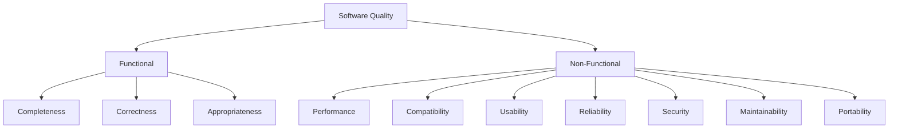
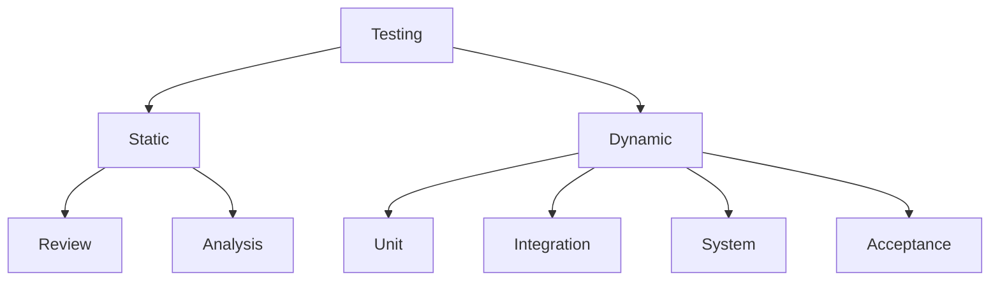
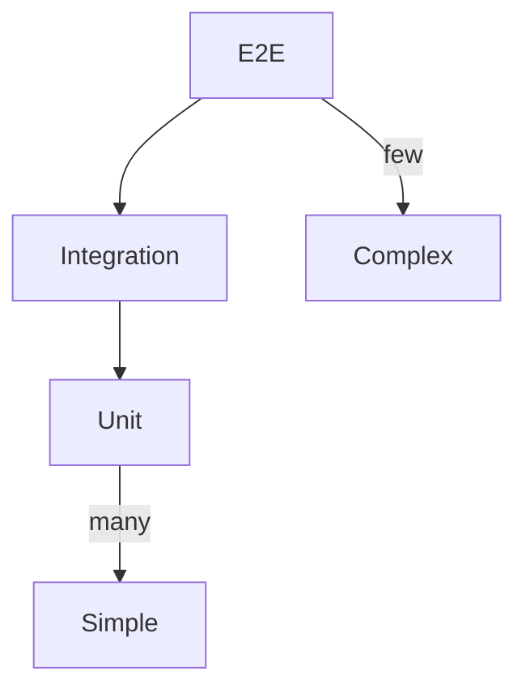
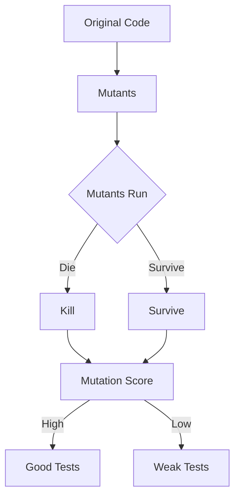
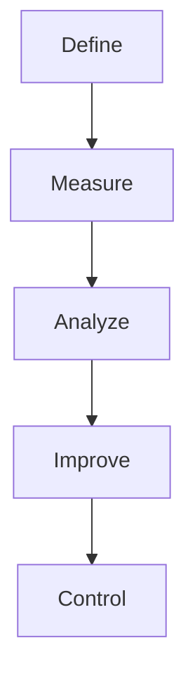
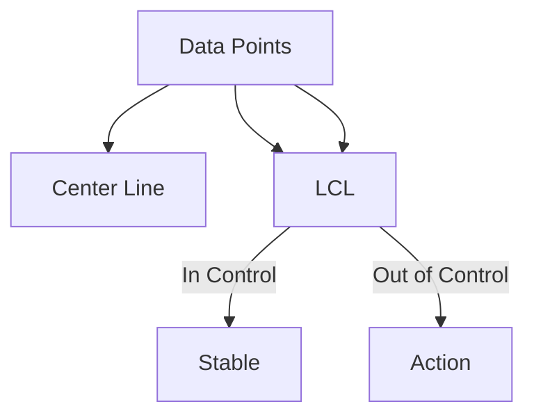
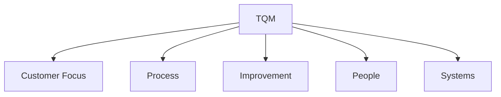
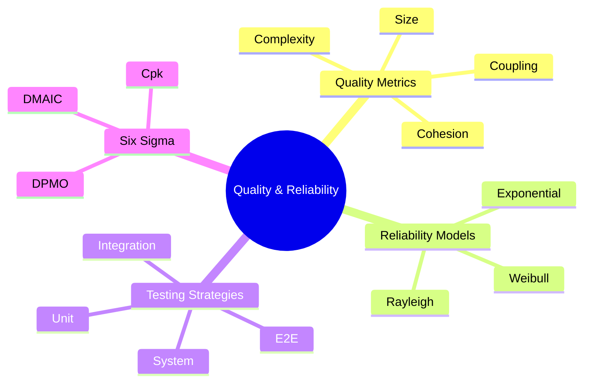

# جودة البرمجيات والوثوقية (Software Quality & Reliability)

## نظرة عامة (Overview)

```
┌─────────────────────────────────────────────────────────────┐
│        Software Quality & Reliability             │
├─────────────────────────────────────────────────────┤
│  Quality Metrics → Reliability Models → Testing → Six Sigma   │
└─────────────────────────────────────────────────────┘
```

---

## 1. مقاييس الجودة (Quality Metrics)

### ISO/IEC 25010



### مقاييس McCall

|الفئة | المقياس | الوصف |
|--------|----------|---------|
| Correctness | Accuracy | دقة المخرجات |
| Reliability | MTTF | متوسط الوقت للفشل |
| Efficiency | Resource | استخدام الموارد |
| Integrity | Security | الأمان |
| Usability | Operability | سهولة التشغيل |
| Maintainability | Reparability | سهولة الإصلاح |
| Flexibility | Modifiability | قابلية التعديل |
| Testability | Diagnosability | قابلية التشخيص |

### Software Quality Factors

| العامل | الصيغة |
|--------|---------|
| Size | SLOC, FP |
| Complexity | Cyclomatic, Halstead |
| Coupling | Afferent, Efferent |
| Cohesion | LCOM |
| Documentation | Doc % |

---

## 2. قياس الجودة (Quality Measurement)

### LOC & Function Points

```python
# Calculate Lines of Code
def count_loc(file_path):
    with open(file_path, 'r', encoding='utf-8') as f:
        lines = f.readlines()
    
    total = len(lines)
    blank = sum(1 for line in lines if line.strip() == '')
    comment = sum(1 for line in lines if line.strip().startswith('#'))
    code = total - blank - comment
    
    return {'total': total, 'blank': blank, 'comment': comment, 'code': code}

# Function Points
def function_points(ui, uo, ql, cf):
    # UFP = sum of components
    ufp = ui['simple']*3 + ui['average']*4 + ui['complex']*6 + \
          uo['simple']*4 + uo['average']*5 + uo['complex']*7 + \
          ql['simple']*3 + ql['average']*4 + ql['complex']*6 + \
          cf['simple']*5 + cf['average']*7 + cf['complex']*10
    
    # CAF = 0.65 + 0.01 * sum(14 adjustment factors)
    caf = 0.65 + 0.01 * sum(cf.values())
    
    fp = ufp * caf
    return fp
```

### Cyclomatic Complexity

$$M = E - N + 2P$$

أين:
- $E$ = عدد الحواف
- $N$ = عدد العقد
- $P$ = عدد المكونات المنفصلة

```python
# Calculate cyclomatic complexity
def cyclomatic_complexity(nodes, edges):
    # M = E - N + 2P
    return edges - nodes + 2

# Using networkx
import networkx as nx

def cc_with_networkx(graph):
    return nx.algorithms.cyclomatic_complexity(graph)
```

### Cohesion (LCOM)

| LCOM | الوصف |
|------|-------|
| < 2 | جيد |
| 2-4 | مقبول |
| > 4 | ضعيف |

```python
# LCOM calculation
def lcom(class_methods, method_attributes):
    # For each method pair, count shared attributes
    shared = 0
    total = 0
    
    for i in range(len(class_methods)):
        for j in range(i+1, len(class_methods)):
            common = len(set(method_attributes[i]) & set(method_attributes[j]))
            total += 1
            if common == 0:
                shared += 1
    
    return shared if total == 0 else shared/total
```

---

## 3. نماذج الوثوقية (Reliability Models)

### Exponential Model

$$R(t) = e^{-\lambda t}$$

أين:
- $R(t)$ = الوثوقية عند الوقت t
- $\lambda$ = معدل الفشل
- $t$ = الوقت

```python
# Exponential reliability
import numpy as np

def reliability_exp(t, lambda_param):
    return np.exp(-lambda_param * t)

def failure_rate(data):
    n_failures = len(data)
    total_time = sum(data)
    return n_failures / total_time
```

### Weibull Model

$$R(t) = e^{-(\frac{t}{\lambda})^k}$$

```python
# Weibull reliability
from scipy import stats

def weibull_reliability(t, lambda_, k):
    return np.exp(-(t / lambda_) ** k)

# Fit Weibull to data
def fit_weibull(failure_times):
    params = stats.weibull_min.fit(failure_times, floc=0)
    return {'shape': params[0], 'scale': params[2]}
```

### Rayleigh Model

```python
# Rayleigh reliability
def rayleigh_reliability(t, sigma):
    return np.exp(-t**2 / (2 * sigma**2))

def rayleigh_failure_rate(t, sigma):
    return t / sigma**2
```

### Model Comparison

| النموذج | التوزيع | الاستخدام |
|----------|----------|-------------|
| Exponential | الثابت | المكونات الإلكترونية |
| Weibull | متغير | الأجهزة الميكانيكية |
| Normal | متمركز | فشل النظام |
| Log-Normal | منحى | فشل البرمجيات |

---

## 4. الاختبار (Testing Strategies)

### أنواع الاختبار



### Testing Pyramid



### Unit Testing

```python
import unittest

class TestMathOperations(unittest.TestCase):
    
    def test_addition(self):
        self.assertEqual(2 + 2, 4)
    
    def test_subtraction(self):
        self.assertEqual(5 - 3, 2)
    
    def test_division(self):
        with self.assertRaises(ZeroDivisionError):
            1 / 0
    
    def test_multiply(self):
        self.assertEqual(3 * 4, 12)

if __name__ == '__main__':
    unittest.main()
```

### Integration Testing

```python
# Integration test
def test_api_integration():
    response = client.get('/api/users')
    assert response.status_code == 200
    assert 'users' in response.json()

def test_database_integration():
    user = User.create(name='Test User')
    result = User.get(user.id)
    assert result.name == 'Test User'
```

### Mutation Testing



---

## 5. Six Sigma

### DMAIC



### Six Sigma Metrics

| المقياس | الصيغة |
|-----------|---------|
| DPMO | $\frac{Defects}{Opportunities} \times 10^6$ |
| Sigma Level | $Z = \Phi^{-1}(1 - DPO)$ |
| Yield | $1 - DPO$ |
| Cpk | $\min\left(\frac{USL-\mu}{3\sigma}, \frac{\mu-LSL}{3\sigma}\right)$ |

```python
# Calculate Six Sigma metrics
from scipy import stats

def dpmo(defects, opportunities):
    return (defects / opportunities) * 1_000_000

def sigma_level(dpm):
    dpo = dpm / 1_000_000
    # Z-score for cumulative probability
    return stats.norm.ppf(1 - dpo)

def cpk(usl, lsl, mu, sigma):
    cpu = (usl - mu) / (3 * sigma)
    cpl = (mu - lsl) / (3 * sigma)
    return min(cpu, cpl)
```

###.Control Charts



### Pareto Analysis

```python
# Pareto analysis
import matplotlib.pyplot as plt
from collections import Counter

def pareto_analysis(defect_data):
    counts = Counter(defect_data)
    sorted_defects = sorted(counts.items(), key=lambda x: x[1], reverse=True)
    
    total = sum(counts.values())
    cumulative = 0
    pareto_data = []
    
    for defect, count in sorted_defects:
        cumulative += count
        pareto_data.append({
            'defect': defect,
            'count': count,
            'cumulative_pct': (cumulative / total) * 100
        })
    
    return pareto_data
```

---

## 6. إدارة الجودة (Quality Management)

### TQM Principles



### Kaizen

| المبدأ | الوصف |
|--------|-------|
| Standardize | توحيد |
| Measure | قياس |
| Compare | مقارنة |
| Improve | تحسين |

### Continuous Improvement

```python
# PDCA cycle
def pdca_cycle(plan, do, check, act):
    """
    Plan: Define improvement goal
    Do: Implement on small scale
    Check: Measure results
    Act: Standardize if successful
    """
    results = execute(plan)
    compare = evaluate(results, check)
    
    if compare.success:
        standardize(plan)
        new_goal = next_improvement()
        return new_goal
    else:
        analyze_failure()
        return adjust_plan()
```

---

## 7. جدول المقارنات (Comparison Tables)

### Quality Models

| النموذalm | الوصف | الاستخدام |
|-----------|-------|-----------|
| ISO 9001 | إدارة الجودة | العامة |
| CMMI | Capability Maturity | البرمجيات |
| ISO/IEC 25010 | جودة البرمجيات | البرمجيات |
| TQM | إدارة شاملة | صناعة |

### Testing Types

| النوع | المستوى | الأداة |
|--------|----------|---------|
| Unit | منخفض | JUnit, pytest |
| Integration | متوسط | TestNG |
| System | عالي | Selenium |
| Performance | Stress | JMeter |

### Reliability Metrics

| المقياس | الرمز | الوصف |
|----------|-------|-------|
| MTBF | $1/\lambda$ | متوسط الوقت بين الفشل |
| MTTF | - | متوسط الوقت حتى الفشل |
| MTTR | - | متوسط الوقت للإصلاح |
| Availability | $MTBF / (MTBF + MTTR)$ | التوافر |

---

## 8. الاختبارات المتقدمة (Advanced Testing)

###，性能 Testing

```python
# Load testing
import time
import threading

def load_test(url, requests, threads):
    results = []
    
    def make_request():
        start = time.time()
        response = requests.get(url)
        duration = time.time() - start
        results.append(duration)
    
    # Run concurrent requests
    with threading.ThreadPoolExecutor(max_workers=threads) as executor:
        for _ in range(requests):
            executor.submit(make_request)
    
    return {
        'avg': sum(results) / len(results),
        'min': min(results),
        'max': max(results),
        'p95': sorted(results)[int(len(results) * 0.95)]
    }
```

### Security Testing

```python
# Security testing
sql_injection_tests = [
    "' OR '1'='1",
    "' OR '1'='1' --",
    "' OR '1'='1' ({",
    "'; DROP TABLE users--"
]

xss_tests = [
    "<script>alert('XSS')</script>",
    "",
    "<svg onload=alert('XSS')>"
]

def test_injection(input_value):
    for payload in sql_injection_tests:
        if payload in test_sql_query(input_value):
            return True
    return False
```

---

## 9. المشاكل الشائعة (Common Pitfalls)

### ⚠️ Problems

```warning
❌ عدم كفاية اختبار حالات الحافة
❌ تجاهل قابلية الاختبار
❌ فقدان التحكم في الجودة
❌ افتراض أن "العمل" يعني "جيد"
❌ إهمال الوثائق
❌ عدم قياس مستمر
```

### ✅ Solutions

```python
# ✅ Boundary testing
def boundary_test(func, min_val, max_val):
    return [func(min_val - 1), func(min_val), 
            func(min_val + 1), func(max_val - 1),
            func(max_val), func(max_val + 1)]

# ✅ Error guessing
error_guesses = [
    (None, "None input"),
    ("", "Empty string"),
    (0, "Zero"),
    (-1, "Negative"),
    (float('inf'), "Infinity"),
    (float('nan'), "NaN")
]
```

---

## 10. أدوات الجودة (Quality Tools)

### Static Analysis Tools

```python
# Pylint configuration
# .pylintrc
[MESSAGES CONTROL]
disable=C0111,C0103,R0913,W0212

[FORMAT]
max-line-length=120

[DESIGN]
max-parents=10
max-args=8

# Run pylint
# pylint source.py
```

### Code Coverage

```bash
# pytest-cov
pytest --cov=myapp --cov-report=html tests/

# Coverage threshold
[coverage:report]
precision = 2
show_missing = True
skip_covered = False

[coverage:run]
source = myapp
branch = True
```

---

## 11. الأوامر السريعة (Quick Commands)

```bash
# Testing
pytest tests/ -v --tb=short
pytest --cov=myapp tests/

# Static analysis
pylint source.py
flake8 source.py
mypy source.py

# Performance
locust -f locustfile.py --host=http://localhost
ab -n 1000 -c 10 http://localhost/

# Security
bandit -r myapp/
safety check
```

---

## 12. ملخص (Summary)



**Key Points:**
- 📊 **Metrics**: مقاييس الجودة
- 📈 **Reliability**: نماذج الوثوقية
- 🧪 **Testing**: استراتيجيات الاختبار
- 🎯 **Six Sigma**: منهجية Six Sigma
- 🔄 **TQM**: إدارة الجودة الشاملة