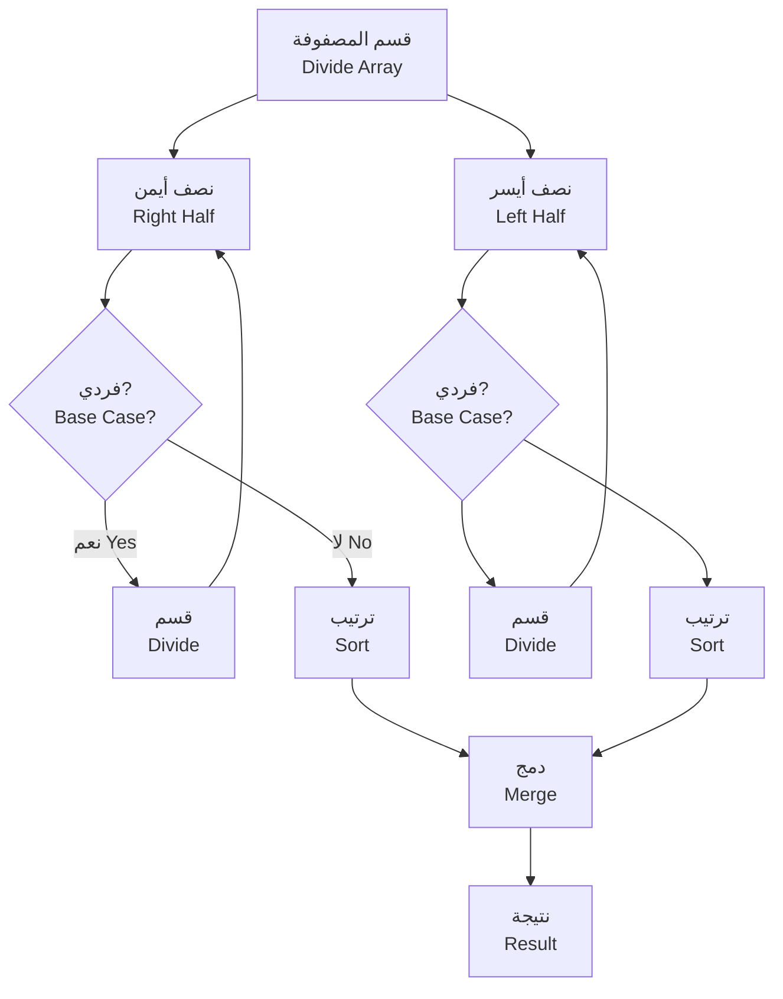
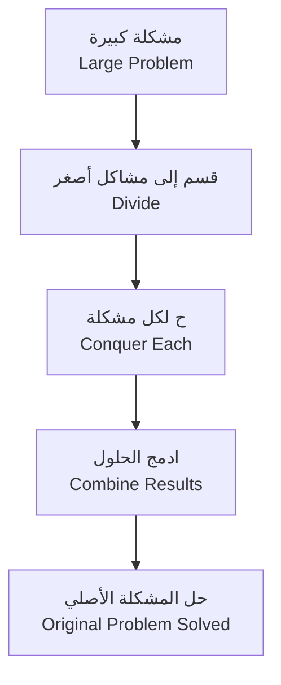
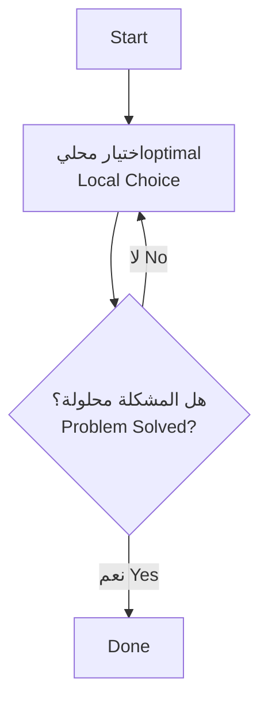
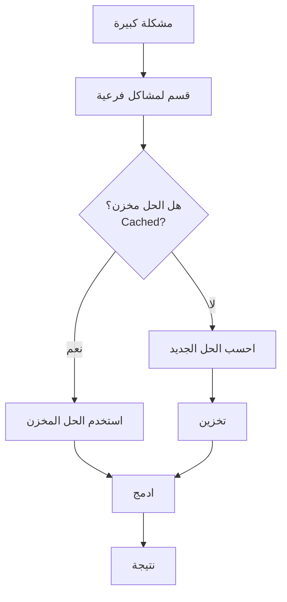

# خوارزميات 1 · Algorithms I (Year 2 - Semester 2)

## 📐 التعاريف الأساسية · Core Definitions

- **الخوارزمية** (Algorithm): سلسلة محددة من الخطوات لحل مشكلة معينة في زمن محدد.
- **التعقيد الزمني** (Time Complexity): قياس الزمن الذي تستغرقه الخوارزمية بدلالة حجم المدخلات $n$.
- **التعقيد المكاني** (Space Complexity): مقدار الذاكرة الإضافية التي تحتاجها الخوارزمية.
- **ترتيب asympotic** (Asymptotic Notation): طريقة للتعبير عن سلوك الخوارزمية عندما يقترب $n$ من اللانهائية.

### ترميزات أساسية · Basic Notations

$$O(g(n)) = \{ f(n) : \exists c, n_0 > 0 \text{ such that } 0 \leq f(n) \leq c \cdot g(n) \text{ for all } n \geq n_0 \}$$

$$\Omega(g(n)) = \{ f(n) : \exists c, n_0 > 0 \text{ such that } 0 \leq c \cdot g(n) \leq f(n) \text{ for all } n \geq n_0 \}$$

$$\Theta(g(n)) = O(g(n)) \cap \Omega(g(n))$$

---

## 🧮 تحليل الخوارزميات · Algorithm Analysis

### تحليل Big-O · Big-O Analysis

$$T(n) = O(f(n))$$

where $T(n)$ is the running time and $f(n)$ is the complexity function.

### ترتيب التعقيد التصاعدي · Ascending Complexity Order

$$O(1) < O(\log n) < O(n) < O(n \log n) < O(n^2) < O(2^n) < O(n!)$$

### قواعد التحليل · Analysis Rules

- **قاعدة الجمع** (Sum Rule):
  $$T_1(n) + T_2(n) = O(\max(f(n), g(n)))$$

- **قاعدة الضرب** (Product Rule):
  $$T_1(n) \cdot T_2(n) = O(f(n) \cdot g(n))$$

- **اللوغاريتمات** (Logarithms):
  $$\log_b(n) = \frac{\log_2(n)}{\log_2(b)}$$

---

## 🔁 خوارزميات الترتيب · Sorting Algorithms

### 1. Bubble Sort (الترتيب الفقاعي)

```mermaid
graph TD
    A[Start] --> B[i = 0]
    B --> C[j = 0]
    C --> D{مقارنة A[j] > A[j+1]?}
    D -->|نعم Yes| E[متبادلة Swap]
    D -->|لا No| F[j++]
    E --> F
    F --> G{j < n-i-1?}
    G -->|نعم Yes| C
    G -->|لا No| H{i++}
    H --> I{i < n?}
    I -->|نعم Yes| B
    I -->|لا No| J[Done]
```

```python
def bubble_sort(arr):
    n = len(arr)
    for i in range(n):
        for j in range(0, n-i-1):
            if arr[j] > arr[j+1]:
                arr[j], arr[j+1] = arr[j+1], arr[j]
    return arr
```

**التعقيد الزمني:** $O(n^2)$ في الأسوأ، $O(n)$ في الأفضل.

### 2. Merge Sort (الترتيب بالدمج)



```python
def merge_sort(arr):
    if len(arr) <= 1:
        return arr
    mid = len(arr) // 2
    left = merge_sort(arr[:mid])
    right = merge_sort(arr[mid:])
    return merge(left, right)

def merge(left, right):
    result = []
    i = j = 0
    while i < len(left) and j < len(right):
        if left[i] <= right[j]:
            result.append(left[i])
            i += 1
        else:
            result.append(right[j])
            j += 1
    result.extend(left[i:])
    result.extend(right[j:])
    return result
```

**التعقيد الزمني:** $O(n \log n)$ في جميع الحالات.
**التعقيد المكاني:** $O(n)$

### 3. Quick Sort (الترتيب السريع)

```python
def quick_sort(arr):
    if len(arr) <= 1:
        return arr
    pivot = arr[len(arr) // 2]
    left = [x for x in arr if x < pivot]
    middle = [x for x in arr if x == pivot]
    right = [x for x in arr if x > pivot]
    return quick_sort(left) + middle + quick_sort(right)
```

**التعقيد الزمني:** $O(n \log n)$ في المتوسط، $O(n^2)$ في الأسوأ.
**التعقيد المكاني:** $O(\log n)$ (recursion stack)

---

## 🔍 خوارزميات البحث · Search Algorithms

### 1. Linear Search (البحث الخطي)

```python
def linear_search(arr, target):
    for i in range(len(arr)):
        if arr[i] == target:
            return i
    return -1
```

**التعقيد:** $O(n)$

### 2. Binary Search (البحث الثنائي)

```python
def binary_search(arr, target):
    left, right = 0, len(arr) - 1
    while left <= right:
        mid = (left + right) // 2
        if arr[mid] == target:
            return mid
        elif arr[mid] < target:
            left = mid + 1
        else:
            right = mid - 1
    return -1
```

**التعقيد:** $O(\log n)$ (المصفوفة يجب أن تكون مرتبة).

---

## ✂️ قسمة وسيطرة · Divide and Conquer

### المفهوم · Concept



### الخطوات · Steps

1. **القسمة** (Divide): قسّم المشكلة إلى مشاكل أصغر
2. **السيطرة** (Conquer): حل المشاكل الأصغر بشكل منفصل
3. **الدمج** (Combine): ادمج الحلول

### أمثلة · Examples

- **Merge Sort**: $O(n \log n)$
- **Binary Search**: $O(\log n)$
- **Strassen's Matrix Multiplication**: $O(n^{2.807})$

### Master Theorem

$$T(n) = aT(n/b) + f(n)$$

where $a \geq 1, b > 1$:

- If $f(n) = O(n^{\log_b a - \epsilon})$: $T(n) = \Theta(n^{\log_b a})$
- If $f(n) = \Theta(n^{\log_b a})$: $T(n) = \Theta(n^{\log_b a} \log n)$
- If $f(n) = \Omega(n^{\log_b a + \epsilon})$: $T(n) = \Theta(f(n))$

---

## 🐯 الخوارزميات الجشعة · Greedy Algorithms

### المفهوم · Concept

اختيار أفضل خيار محلي في كل خطوة، معأمل أن يؤدي إلى الحل الأمثل عالمياً.



### الخصائص · Properties

- **Optimum Substructure**: الحل الأمثل يحتوي على حلول فرعية مثلى
- **Greedy Choice Property**: اختيار محلي optimal يؤدي للحل الأمثل

### أمثلة · Examples

#### 1. Activity Selection (اختيار الأنشطة)

```python
def activity_selection(activities):
    activities.sort(key=lambda x: x[1])  # ترتيب حسب وقت الانتهاء
    selected = [activities[0]]
    last_end = activities[0][1]
    for start, end in activities[1:]:
        if start >= last_end:
            selected.append((start, end))
            last_end = end
    return selected
```

**التعقيد:** $O(n \log n)$

#### 2. Huffman Coding (ترميز هوفمان)

```python
import heapq

def huffman_encode(freq):
    heap = [[weight, [symbol, '']] for symbol, weight in freq]
    heapq.heapify(heap)
    while len(heap) > 1:
        lo = heapq.heappop(heap)
        hi = heapq.heappop(heap)
        for pair in lo[1:]:
            pair[1] = '0' + pair[1]
        for pair in hi[1:]:
            pair[1] = '1' + pair[1]
        heapq.heappush(heap, [lo[0] + hi[0]] + lo[1:] + hi[1:])
    return dict(heap[0][1:])
```

**التعقيد:** $O(n \log n)$

---

## 💾 البرمجة الديناميكية · Dynamic Programming

### المفهوم · Concept

حل مشاكل كبيرة بتقسيمها لمشاكل فرعية متداخلة، وتخزين الحلول لتجنب الحساب المتكرر.



### الفرق بين DP و Greedy

| المميز | Greedy | Dynamic Programming |
|--------|--------|---------------------|
| الاختيار | مرة واحدة | عدة محاولات |
| التكرار | لا يوجد | نعم |
| الحل | محلي optimal | عالمي optimal |

### أمثلة · Examples

#### 1. Fibonacci (فيبوناتشي)

```python
# الطريقة السيئة - تعقيد أسيوي
def fib_bad(n):
    if n <= 1:
        return n
    return fib_bad(n-1) + fib_bad(n-2)

# البرمجة الديناميكية - تعقيد خطي
def fib_dp(n):
    if n <= 1:
        return n
    dp = [0] * (n + 1)
    dp[1] = 1
    for i in range(2, n + 1):
        dp[i] = dp[i-1] + dp[i-2]
    return dp[n]
```

**التعقيد:** $O(n)$ بدلاً من $O(2^n)$

#### 2. Longest Common Subsequence (أطول تسلسل مشترك)

```python
def lcs(s1, s2):
    m, n = len(s1), len(s2)
    dp = [[0] * (n + 1) for _ in range(m + 1)]
    for i in range(1, m + 1):
        for j in range(1, n + 1):
            if s1[i-1] == s2[j-1]:
                dp[i][j] = dp[i-1][j-1] + 1
            else:
                dp[i][j] = max(dp[i-1][j], dp[i][j-1])
    return dp[m][n]
```

**التعقيد:** $O(m \times n)$

#### 3. 0/1 Knapsack (مشكلة الكيس)

```python
def knapsack(weights, values, capacity):
    n = len(weights)
    dp = [[0] * (capacity + 1) for _ in range(n + 1)]
    for i in range(1, n + 1):
        for w in range(capacity + 1):
            if weights[i-1] <= w:
                dp[i][w] = max(values[i-1] + dp[i-1][w-weights[i-1]], dp[i-1][w])
            else:
                dp[i][w] = dp[i-1][w]
    return dp[n][capacity]
```

**التعقيد:** $O(n \times W)$

---

## 📊 جدول مرجعي شامل · Master Reference Table

### جدول التعقيد الزمني · Time Complexity Table

| الخوارزمية | أفضل | متوسط | أسوأ | مكاني | مستقر؟ |
| ---------- | ---- | ------ | ---- | ------ | ------ |
| **Bubble Sort** | $O(n)$ | $O(n^2)$ | $O(n^2)$ | $O(1)$ | نعم |
| **Selection Sort** | $O(n^2)$ | $O(n^2)$ | $O(n^2)$ | $O(1)$ | لا |
| **Insertion Sort** | $O(n)$ | $O(n^2)$ | $O(n^2)$ | $O(1)$ | نعم |
| **Merge Sort** | $O(n \log n)$ | $O(n \log n)$ | $O(n \log n)$ | $O(n)$ | نعم |
| **Quick Sort** | $O(n \log n)$ | $O(n \log n)$ | $O(n^2)$ | $O(\log n)$ | لا |
| **Heap Sort** | $O(n \log n)$ | $O(n \log n)$ | $O(n \log n)$ | $O(1)$ | لا |
| **Linear Search** | $O(1)$ | $O(n)$ | $O(n)$ | $O(1)$ | — |
| **Binary Search** | $O(1)$ | $O(\log n)$ | $O(\log n)$ | $O(1)$ | — |

### جدول المقارنات · Comparison Table

| الطريقة | مناسب لـ | غير مناسب لـ |
| -------- | -------- | ------------ |
| **Bubble Sort** | مصفوفات صغيرة، شبه مرتبة | مصفوفات كبيرة |
| **Merge Sort** | ترتيب خارجي، استقرار مهم | ذاكرة محدودة |
| **Quick Sort** | مصفوفات عشوائية | مصفوفات مرتبة |
| **Heap Sort** | أفضل حالة عامة | — |
| **Insertion Sort** | مصفوفات صغيرة، شبه مرتبة | مصفوفات كبيرة |

### جدول الخوارزميات المتقدمة · Advanced Algorithm Table

| التقنية | التعقيد | الاستخدام |
| -------- | -------- | ---------- |
| **Activity Selection** | $O(n \log n)$ | جدولة الموارد |
| **Huffman Coding** | $O(n \log n)$ | ضغط البيانات |
| **Fibonacci DP** | $O(n)$ | Sequential dependencies |
| **LCS** | $O(mn)$ | bioinformatics |
| **Knapsack** | $O(nW)$ | تحسين الموارد |

---

## ⚠️ أخطاء شائعة وملاحظات · Common Pitfalls & Notes

### ❌ أخطاء شائعة

1. **الخلط بين O و Ω**: 
   - $O$ تعني "لا يتجاوز" (أعلى حد)
   - $Ω$ تعني "لا يقل عن" (حد أدنى)
   - 💡 **ملاحظة**: $O(n^2)$ يشمل أيضًا $O(n)$!

2. **نسيان أن البحث الثنائي يتطلب مصفوفة مرتبة**:
   - Binary Search لا يعمل على مصفوفات غير مرتبة

3. **الخلط بين التعقيد المكاني والزمني**:
   - Merge Sort: $O(n \log n)$ زمنيًا لكن $O(n)$ ذاكرة
   - Quick Sort: $O(n \log n)$ زمنيًا في المتوسط، لكن $O(\log n)$ ذاكرة

4. **عدم مراعاة الثوابت**:
   - $O(100n)$ هو $O(n)$
   - $O(n^2/2)$ هو $O(n^2)$

5. **البحث عن "ترتيب مثالي"**:
   - لا يوجد ترتيب مثالي لجميع الحالات
   - Quick Sort: الأفضل للمصفوفات العشوائية
   - Merge Sort: الأفضل للترتيب الخارجي

6. **الخلط بين Greedy و DP**:
   - Greedy: اختيار واحد ولا يرجع
   - DP: يجرب كل الخيارات

### ❌ مفاهيم خاطئة شائعة

- **"O(n) أسرع من O(n²)"**: فقط عندما يكون n كبيراً
- **"الخوارزمية الثابتة هي O(1)"**: الثابت لا يعني بالضرورة سريع
- **"الترتيب المقلوب أفضل من Quick Sort"**: ليس دائماً، يعتمد على البيانات

### 💡 نصائح مهمة

- **Master Theorem** للعلاقات التكرارية:
  $$T(n) = aT(n/b) + f(n)$$

- **قاعدة التكرار**:
  إذا كان $f(n) = O(n^{\log_b a - \epsilon})$:
  $$T(n) = \Theta(n^{\log_b a})$$

- **التحقق من الاستقرار** مهم عند الترتيب حسب مفتاحين أو أكثر

### 📌 ملاحظات نهائية

- **Big-O** تستخدم لوصف الحد الأعلى (أسوأ حالة)
- **Big-Omega** تستخدم لوصف الحد الأدنى (أفضل حالة)
- **Big-Theta** تستخدم لوصف الحد الدقيق
- في التطبيقات العملية، نادرًا ما يستخدمون Ω و Θ، التركيز على O

---

## 📝 أمثلة محلولة · Worked Examples

### مثال 1: تحليل تعقيد حلقة متداخلة

```python
for i in range(n):
    for j in range(i, n):
        print(i, j)
```

**الحل:**
- التكرار الأول: $n$ مرة
- التكرار الثاني: $n-1$ مرة
- ...
- المجموع: $1 + 2 + ... + n = n(n+1)/2 = \Theta(n^2)$

### مثال 2: البحث الثنائي

**المعطيات:** مصفوفة مرتبة $[2, 5, 8, 12, 16]$، نبحث عن $12$.

**الحل:**
- left = 0, right = 4, mid = 2, arr[2] = 8 < 12 → left = 3
- left = 3, right = 4, mid = 3, arr[3] = 12 → تم العثور!

**عدد المقارنات:** $\lceil \log_2 5 \rceil = 3$

### مثال 3: مقارنة الترتبات

**مصفوفة مرتبة:** $[1, 2, 3, 4, 5]$
- Bubble Sort: $O(n)$
- Quick Sort: $O(n^2)$ (الأسوأ)

**مصفوفة عشوائية:**
- Bubble Sort: $O(n^2)$
- Quick Sort: $O(n \log n)$

---

(End of file)