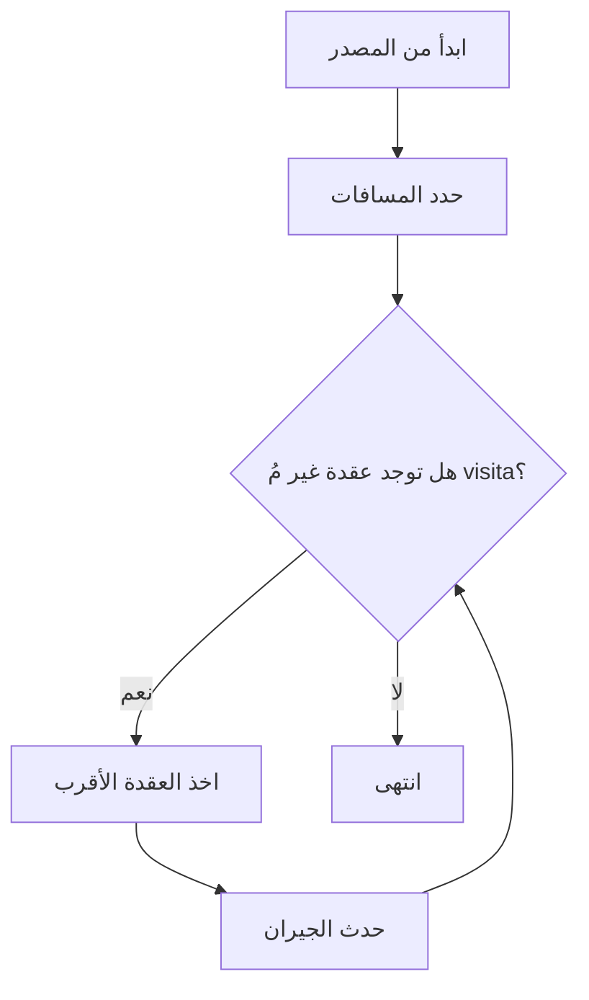
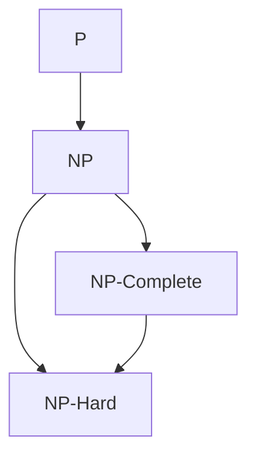

# خوارزميات 2 · Algorithms II

## 📐 التعاريف الأساسية · Core Definitions

- **الخوارزمية Gretic** (Greedy Algorithm): تختار الخيار الأفضل محليًا في كل خطوة.
- **خوارزمية التقسيم والتغلب** (Divide and Conquer): تقسم المشكلة لمشاكل أصغر.
- **البرمجة الديناميكية** (Dynamic Programming): تحتفظ بالحلول الفرعية لتجنب إعادة الحساب.
- **تعقيد الزمن Polynomial** (P): فئة المشاكل التي تحل في زمن polynomial.
- **NP-Complete**: مشاكل لا يمكن حلها polynomial确定 معروفة.

---

## 🌲 خوارزميات الجراف · Graph Algorithms

### خوارزمية ديكسترا · Dijkstra's Algorithm



```python
import heapq

def dijkstra(graph, start):
    dist = {node: float('inf') for node in graph}
    dist[start] = 0
    pq = [(0, start)]
    
    while pq:
        d, u = heapq.heappop(pq)
        if d > dist[u]:
            continue
        for v, weight in graph[u]:
            if dist[u] + weight < dist[v]:
                dist[v] = dist[u] + weight
                heapq.heappush(pq, (dist[v], v))
    
    return dist
```

**التعقيد:** $O((V + E) \log V)$ مع min-heap

**الشرط:** يجب أن تكون الأوزان موجبة!

### خوارزمية فلويد-وارشال · Floyd-Warshall Algorithm

```python
def floyd_warshall(n, dist):
    # تهيئة
    for k in range(n):
        for i in range(n):
            for j in range(n):
                if dist[i][k] + dist[k][j] < dist[i][j]:
                    dist[i][j] = dist[i][k] + dist[k][j]
    return dist
```

**التعقيد:** $O(V^3)$

**الاستخدام:** إيجاد أقصر مسار بين جميع الأزواج

### خوارزمية بيلمان-فورد · Bellman-Ford Algorithm

```python
def bellman_ford(V, edges, source):
    dist = [float('inf')] * V
    dist[source] = 0
    
    # V-1 تكرار
    for _ in range(V - 1):
        for u, v, w in edges:
            if dist[u] != float('inf') and dist[u] + w < dist[v]:
                dist[v] = dist[u] + w
    
    # فحص للدورات السالبة
    for u, v, w in edges:
        if dist[u] != float('inf') and dist[u] + w < dist[v]:
            return None  # هناك دورة سالبة
    
    return dist
```

**الميزة:** تكتشف الدورات السالبة (negative cycles)

---

## 🔄 خوارزمية جرين · Greedy Algorithms

### خاصية الاختيار الجرين · Greedy Choice Property

$$S_{optimal} = S_{greedy} + S_{optimal\_subproblem}$$

### خوارزمية كروسكال · Kruskal's Algorithm

```python
def kruskal(V, edges):
    # ترتيب الحواف حسب الوزن
    edges.sort(key=lambda x: x[2])
    
    parent = list(range(V))
    
    def find(x):
        if parent[x] != x:
            parent[x] = find(parent[x])
        return parent[x]
    
    def union(x, y):
        px, py = find(x), find(y)
        if px == py:
            return False
        parent[px] = py
        return True
    
    mst = []
    for u, v, w in edges:
        if union(u, v):
            mst.append((u, v, w))
            if len(mst) == V - 1:
                break
    
    return mst
```

**التعقيد:** $O(E \log E)$

### خوارزمية بري姆 · Prim's Algorithm

```python
def prim(V, graph, start):
    visited = [False] * V
    min_edge = [float('inf')] * V
    min_edge[start] = 0
    pq = [(0, start)]
    
    while pq:
        w, u = heapq.heappop(pq)
        if visited[u]:
            continue
        visited[u] = True
        
        for v, weight in graph[u]:
            if not visited[v] and weight < min_edge[v]:
                min_edge[v] = weight
                heapq.heappush(pq, (weight, v))
    
    return sum(min_edge)
```

### جدول المقارنة · Comparison Table

| الخوارزمية | التعقيد | الاستخدام |
| ---------- | -------- | ---------- |
| Kruskal | $O(E \log E)$ | Sparse graphs |
| Prim | $O(E + V \log V)$ | Dense graphs |
| Dijkstra | $O(E \log V)$ | Single source |
| Floyd | $O(V^3)$ | All pairs |

---

## 📊 البرمجة الديناميكية · Dynamic Programming

### معادلة بل · Bellman Equation

$$V^*(s) = \max_a \left[ R(s,a) + \gamma \sum_{s'} P(s'|s,a) V^*(s') \right]$$

### LCS (أطول سلسلة مشتركة) · Longest Common Subsequence

```python
def lcs(s1, s2):
    m, n = len(s1), len(s2)
    dp = [[0] * (n + 1) for _ in range(m + 1)]
    
    for i in range(1, m + 1):
        for j in range(1, n + 1):
            if s1[i-1] == s2[j-1]:
                dp[i][j] = dp[i-1][j-1] + 1
            else:
                dp[i][j] = max(dp[i-1][j], dp[i][j-1])
    
    return dp[m][n]
```

**التعقيد:** $O(m \cdot n)$

### حقيبة الظهر (0/1) · Knapsack Problem

```python
def knapsack(W, weights, values, n):
    dp = [[0] * (W + 1) for _ in range(n + 1)]
    
    for i in range(1, n + 1):
        for w in range(W + 1):
            if weights[i-1] <= w:
                dp[i][w] = max(
                    values[i-1] + dp[i-1][w - weights[i-1]],
                    dp[i-1][w]
                )
            else:
                dp[i][w] = dp[i-1][w]
    
    return dp[n][W]
```

**التعقيد:** $O(n \cdot W)$

---

## 🔬 تعقيد NP · NP-Completeness

### فئات التعقيد · Complexity Classes



### مشاكل NP-Complete الرئيسية

| المشكلة | الوصف |
| ------- | ----- |
| **SAT** | هل هناك تعيين يُحقق الصيغة؟ |
| **3-SAT** | SAT مع 3 literals لكل بند |
| **Clique** | هل يوجد clique بالحجم k؟ |
| **Vertex Cover** | تغطية جميع الحواف بـ k عقد |
| **Hamiltonian Path** | مسار يمر بجميع العقد |
| **Traveling Salesman** | أقصر مسار يمر بجميع المدن |
| **Knapsack** | حقيبة الظهر بأقصى قيمة |

### الاختزال · Reduction

$$A \leq_p B$$

إذا كان يمكننا حل $B$ في زمن polynomial، allora يمكننا حل $A$.

---

## 🎯 الخوارزميات التقريبية · Approximation Algorithms

### نسبة التقريب · Approximation Ratio

$$\rho(n) = \frac{ALG(n)}{OPT(n)}$$

### خوارزمية التقريب لـ Vertex Cover

```python
def approx_vertex_cover(V, edges):
    result = set()
    edge_set = set(edges)
    
    while edge_set:
        u, v = edge_set.pop()
        result.add(u)
        result.add(v)
        # حذف جميع الحواف المتصلة بـ u أو v
        edge_set = {(x, y) for x, y in edge_set 
                    if x != u and x != v and y != u and y != v}
    
    return result
```

**نسبة التقريب:** 2-approximation

### خوارزمية التقريب لـ TSP (Metric)

```python
def approx_tsp(G):
    # 1. MST
    mst = prim(G)
    
    # 2. walker traversal
    walk = []
    for edge in mst:
        walk.extend([edge[0], edge[1]])
    
    # 3. حذف التكرارات
    tour = [walk[0]]
    for node in walk[1:]:
        if node != tour[-1]:
            tour.append(node)
    tour.append(tour[0])
    
    return tour
```

**نسبة التقريب:** 2-approximation

### جدول الخوارزميات التقريبية · Approximation Algorithms Table

| المشكلة | نسبة التقريب | الخوارزمية |
| ------- | ------------ | ---------- |
| Vertex Cover | 2 | Greedy |
| Set Cover | $O(\log n)$ | Greedy |
| Max-Cut | 0.5 | Random |
| Knapsack | $1 - \epsilon$ | DP |
| TSP (metric) | 2 | MST |

---

## 🔁 الخوارزميات Gretic الإضافية · Additional Greedy Algorithms

### خوارزمية活动时间 الجدولة · Activity Selection

```python
def activity_selection(activities):
    # ترتيب حسب وقت النهاية
    activities.sort(key=lambda x: x[1])
    
    selected = [activities[0]]
    last_end = activities[0][1]
    
    for start, end in activities[1:]:
        if start >= last_end:
            selected.append((start, end))
            last_end = end
    
    return selected
```

**التعقيد:** $O(n \log n)$

### الترميز الهوفمان · Huffman Coding

```python
import heapq

def huffman(freq):
    heap = [(f, sym) for sym, f in freq.items()]
    heapq.heapify(heap)
    
    while len(heap) > 1:
        f1, left = heapq.heappop(heap)
        f2, right = heapq.heappop(heap)
        heapq.heappush(heap, (f1 + f2, (left, right)))
    
    return build_codes(heap[0])
```

**التعقيد:** $O(n \log n)$

---

## 📝 أمثلة محلولة · Worked Examples

### مثال 1: Dijkstra

**المعطيات:** جراف بـ 4 عقد، أوزان:
- A→B: 4, A→C: 2
- B→C: 1, B→D: 5
- C→D: 8, C→B: 1
- D→C: 8

**الحل:**
- Step 1: A→C = 2 (الأقرب)
- Step 2: من C، A→B = 2+1 = 3
- Step 3: من B، A→D = 3+5 = 8
- **النتيجة:** {A: 0, B: 3, C: 2, D: 8}

### مثال 2: Knapsack

**المعطيات:** سعة = 10، عناصر:
- (وزن=6, قيمة=19)
- (وزن=5, قيمة=12)
- (وزن=4, قيمة=11)
- (وزن=3, قيمة=9)

**الحل (DP):**
- i=1, w=10: max(19+0, 0) = 19
- i=2: max(19, 12) = 19
- i=3: max(19, 11) = 19
- i=4: max(19, 9) = 19

**النتيجة:** 19 (عنصر 1 فقط)

### مثال 3: NP-Complete Reduction

**المعطيات:** أثبت أن 3-SAT ≤p Clique

**الحل:**
- بني بند لكل vertex فيClique
- إذا كان هناك clique بالحجم k، allora هناك حل لـ 3-SAT
- **الإثبات:** كل literal فيClause يختار vertex

---

## 📊 جدول مرجعي شامل · Master Reference Table

### تعقيد الخوارزميات · Algorithm Complexities

| الخوارزمية | أفضل | متوسط | أسوأ | المكان |
| ---------- | ---- | ------ | ---- | ------ |
| Dijkstra | $O(E+V\log V)$ | $O(E\log V)$ | $O(E\log V)$ | $O(V)$ |
| Floyd | $O(V^3)$ | $O(V^3)$ | $O(V^3)$ | $O(V^2)$ |
| Bellman-Ford | $O(VE)$ | $O(VE)$ | $O(VE)$ | $O(V)$ |
| Kruskal | $O(E\log E)$ | $O(E\log E)$ | $O(E\log E)$ | $O(V)$ |
| Prim | $O(E+V\log V)$ | $O(E\log V)$ | $O(V^2)$ | $O(V)$ |
| LCS | $O(mn)$ | $O(mn)$ | $O(mn)$ | $O(mn)$ |
| Knapsack | $O(nW)$ | $O(nW)$ | $O(nW)$ | $O(nW)$ |

### فئات التعقيد · Complexity Classes

| الفئة | المعنى | مثال |
| ----- | ------ | ---- |
| **P** | polynomial time | Sorting, Search |
| **NP** | verifiable in poly | CLIQUE, SAT |
| **NP-Complete** | hardest in NP | 3-SAT, TSP |
| **NP-Hard** | as hard as NP-C | Halting Problem |

---

## ⚠️ أخطاء شائعة وملاحظات · Common Pitfalls & Notes

### ❌ أخطاء شائعة

1. **تطبيق Dijkstra على أوزان سالبة:**
   - Dijkstra لا يعمل مع الأوزان السالبة!
   - 💡 **الحل**: استخدم Bellman-Ford

2. **الخلط بين Kruskal و Prim:**
   - Kruskal: edges، ترتيب حسب الوزن
   - Prim: vertices، ابدأ من عقدة

3. **نسيان فحص الدورات السالبة:**
   - Bellman-Ford يكتشفها، Dijkstra لا

4. **البرمجة الديناميكية vs Greedy:**
   - Greedy: اختيار محلي optimum
   - DP: حل كل المشاكل الفرعية

### 💡 نصائح مهمة

- **Master Theorem** للـ divide and conquer:
  $$T(n) = aT(n/b) + f(n)$$

- **NP-Complete** تعني أنه لا توجد خوارزمية polynomial معروفة

- **التقريب** حل عندما يكون الـ optimum صعبًا

### 📌 ملاحظات نهائية

- **Greedy ليس دائمًا optimal**: مثال: Coin Change (US coins)
- **DP تتطلب**: subproblem optimal structure
- **نسبة التقريب**: كلما كانت أصغر، كان أفضل
