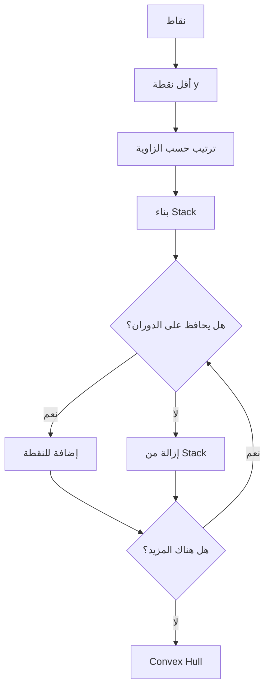

# خوارزميات 3 · Algorithms III (Year 3 - Semester 2)

---

## 🔤 خوارزميات النصوص · String Algorithms

### 1. خوارزمية KMP (Knuth-Morris-Pratt)

#### الفكرة الأساسية · Basic Idea

البحث عن نمط في نص بدون تراجع، باستخدام جدول_failure المُحسوب مسبقاً.

```python
def compute_failure(pattern):
    m = len(pattern)
    failure = [0] * m
    j = 0
    
    for i in range(1, m):
        while j > 0 and pattern[i] != pattern[j]:
            j = failure[j-1]
        if pattern[i] == pattern[j]:
            j += 1
        failure[i] = j
    
    return failure

def kmp_search(text, pattern):
    n, m = len(text), len(pattern)
    failure = compute_failure(pattern)
    j = 0
    
    for i in range(n):
        while j > 0 and text[i] != pattern[j]:
            j = failure[j-1]
        if text[i] == pattern[j]:
            j += 1
        if j == m:
            return i - m + 1  # Found!
            j = failure[j-1]
    
    return -1  # Not found
```

**التعقيد:** $O(n + m)$

### 2. خوارزمية Boyer-Moore

#### استراتيجية Last Occurrence

```python
def boyer_moore(text, pattern):
    n, m = len(text), len(pattern)
    
    # بناء جدول last occurrence
    last = {}
    for i, char in enumerate(pattern):
        last[char] = i
    
    skip = 0
    i = 0
    
    while i <= n - m:
        skip = 0
        j = m - 1
        
        # مقارنة من اليمين لليسار
        while j >= 0 and pattern[j] == text[i + j]:
            j -= 1
        
        if j < 0:
            return i  # Found!
            i += (m - last.get(text[i + m], -1)) if i + m < n else 1
        else:
            # حساب skip
            last_occ = last.get(text[i + j], -1)
            skip = max(1, j - last_occ)
            i += skip
    
    return -1
```

**التعقيد:** $O(n + m)$ في المتوسط، $O(nm)$ في الأسوأ

### 3. خوارزمية Rabin-Karp (Hashing)

```python
def rabin_karp(text, pattern, base=256, mod=101):
    n, m = len(text), len(pattern)
    
    # حساب hash للنمط
    pattern_hash = 0
    text_hash = 0
    base_m = base ** (m - 1) % mod
    
    for i in range(m):
        pattern_hash = (base * pattern_hash + ord(pattern[i])) % mod
        text_hash = (base * text_hash + ord(text[i])) % mod
    
    for i in range(n - m + 1):
        if text_hash == pattern_hash:
            if text[i:i+m] == pattern:
                return i  # Found!
        
        if i < n - m:
            text_hash = (base * (text_hash - ord(text[i]) * base_m) + ord(text[i+m])) % mod
            if text_hash < 0:
                text_hash += mod
    
    return -1
```

**التعقيد:** $O(n + m)$

### 4. Trie (شجرة النصوص)

```python
class TrieNode:
    def __init__(self):
        self.children = {}
        self.is_end = False

class Trie:
    def __init__(self):
        self.root = TrieNode()
    
    def insert(self, word):
        node = self.root
        for char in word:
            if char not in node.children:
                node.children[char] = TrieNode()
            node = node.children[char]
        node.is_end = True
    
    def search(self, word):
        node = self.root
        for char in word:
            if char not in node.children:
                return False
            node = node.children[char]
        return node.is_end
    
    def starts_with(self, prefix):
        node = self.root
        for char in prefix:
            if char not in node.children:
                return False
            node = node.children[char]
        return True
```

**التعقيد:**
- الإدراج والبحث: $O(m)$ حيث m = طول الكلمة
- المساحة: $O(Σm)$ حيث Σ = حجم الأبجدية

---

## 📐 هندسة الحساب · Computational Geometry

### 1. المسافة بين نقطتين

$$d(P_1, P_2) = \sqrt{(x_2 - x_1)^2 + (y_2 - y_1)^2}$$

```python
import math

def distance(p1, p2):
    return math.sqrt((p2[0] - p1[0])**2 + (p2[1] - p1[1])**2)
```

### 2. تحديد موقع نقطة بالنسبة لخط

```python
def orientation(p, q, r):
    """
    تحديد نوع الدوران
    0: خط مستقيم (collinear)
    1: دوران يميني (clockwise)
    2: دوران يساري (counter-clockwise)
    """
    val = (q[1] - p[1]) * (r[0] - q[0]) - (q[0] - p[0]) * (r[1] - q[1])
    
    if val == 0:
        return 0
    elif val > 0:
        return 1
    else:
        return 2
```

### 3. التحقق من التقاطع بين خطين

```python
def on_segment(p, q, r):
    """هل r على قطعة pq؟"""
    return (q[0] <= max(p[0], r[0]) and q[0] >= min(p[0], r[0]) and
            q[1] <= max(p[1], r[1]) and q[1] >= min(p[1], r[1]))

def segments_intersect(p1, q1, p2, q2):
    o1 = orientation(p1, q1, p2)
    o2 = orientation(p1, q1, q2)
    o3 = orientation(p2, q2, p1)
    o4 = orientation(p2, q2, q1)
    
    # الحالة العامة
    if o1 != o2 and o3 != o4:
        return True
    
    # الحالات الخاصة
    return False
```

### 4. حساب Convex Hull (خوارزمية Graham Scan)



```python
def graham_scan(points):
    # إيجاد أقل نقطة y
    lowest = min(points, key=lambda p: (p[1], p[0]))
    
    # ترتيب النقاط حسب الزاوية
    points_sorted = sorted(points, key=lambda p: (
        math.atan2(p[1] - lowest[1], p[0] - lowest[0]), 
        p
    ))
    
    # بناء Hull
    hull = []
    for p in points_sorted:
        while len(hull) >= 2 and orientation(hull[-2], hull[-1], p) != 2:
            hull.pop()
        hull.append(p)
    
    return hull
```

**التعقيد:** $O(n \log n)$

### 5. أقرب زوج من النقاط

```python
def closest_pair(points):
    points_x = sorted(points, key=lambda p: p[0])
    points_y = sorted(points, key=lambda p: p[1])
    
    def closest_pair_rec(points_x, points_y):
        n = len(points_x)
        
        if n <= 3:
            return brute_force(points_x)
        
        mid = n // 2
        mid_point = points_x[mid]
        
        left_x = points_x[:mid]
        right_x = points_x[mid:]
        
        left_y = [p for p in points_y if p[0] < mid_point[0]]
        right_y = [p for p in points_y if p[0] >= mid_point[0]]
        
        dl = closest_pair_rec(left_x, left_y)
        dr = closest_pair_rec(right_x, right_y)
        
        d = min(dl, dr)
        
        strip = [p for p in points_y if abs(p[0] - mid_point[0]) < d]
        
        for i in range(len(strip)):
            for j in range(i+1, min(i+7, len(strip))):
                d = min(d, distance(strip[i], strip[j]))
        
        return d
    
    return closest_pair_rec(points_x, points_y)
```

**التعقيد:** $O(n \log n)$

---

## 📉 خوارزميات التقريب · Approximation Algorithms

### 1. مشكلة التغطية الكلية (Vertex Cover)

#### خوارزمية التقريب

```python
def approx_vertex_cover(graph):
    """
    خوارزمية تقريبية 2-approx
    """
    cover = set()
    edges = set((u, v) for u in graph for v in graph[u])
    
    while edges:
        u, v = edges.pop()
        cover.add(u)
        cover.add(v)
        
        # إزالة جميع الحواف المرتبطة بـ u و v
        edges = {(x, y) for x, y in edges if x not in (u, v) and y not in (u, v)}
    
    return cover
```

**نسبة التقريب:** 2

### 2. مشكلة البائع المتجول (TSP)

#### خوارزمية التقريب (Metric TSP)

```python
def approx_tsp(graph, start):
    """
    خوارزمية التقريب باستخدام MST
    """
    # 1. بناء MST
    mst = prim_mst(graph, start)
    
    # 2. DFS traversal
    tour = []
    visited = set()
    
    def dfs(node):
        visited.add(node)
        tour.append(node)
        for neighbor in mst[node]:
            if neighbor not in visited:
                dfs(neighbor)
    
    dfs(start)
    tour.append(start)
    
    return tour
```

**نسبة التقريب:** 2 (لـ Metric TSP)

### 3. مشكلة تعيين القطع (Set Cover)

```python
def greedy_set_cover(universals, subsets):
    """
    خوارزمية جشعة لتقريب Set Cover
    """
    covered = set()
    cover = []
    
    while covered != universals:
        best_subset = max(subsets, key=lambda s: len(s - covered))
        covered |= best_subset
        cover.append(best_subset)
    
    return cover
```

**نسبة التقريب:** $O(\log n)$

### 4. مقارنة الخوارزميات التقريبية

| المشكلة | الخوارزمية | نسبة التقريب |
|---------|-----------|--------------|
| **Vertex Cover** | 2-approx | 2 |
| **Set Cover** | Greedy | $\ln(n)$ |
| **TSP** | MST-based | 2 |
| **Bin Packing** | First-Fit | 11/9 |

---

## 🎲 الخوارزميات العشوائية · Randomized Algorithms

### 1. خوارزمية Randomized QuickSort

```python
import random

def randomized_quicksort(arr):
    if len(arr) <= 1:
        return arr
    
    # اختيار pivot عشوائي
    pivot_idx = random.randint(0, len(arr) - 1)
    pivot = arr[pivot_idx]
    
    left = [x for x in arr if x < pivot]
    middle = [x for x in arr if x == pivot]
    right = [x for x in arr if x > pivot]
    
    return randomized_quicksort(left) + middle + randomized_quicksort(right)
```

**التعقيد المتوقع:** $O(n \log n)$

### 2. خوارزمية لاختبار الأولية (Miller-Rabin)

```python
def miller_rabin(n, k=5):
    if n <= 3:
        return n > 1
    
    # كتابة n-1 كـ 2^r * d
    r, d = 0, n - 1
    while d % 2 == 0:
        r += 1
        d //= 2
    
    for _ in range(k):
        a = random.randint(2, n - 2)
        x = pow(a, d, n)
        
        if x == 1 or x == n - 1:
            continue
        
        for _ in range(r - 1):
            x = pow(x, 2, n)
            if x == n - 1:
                break
        else:
            return False
    
    return True
```

**التعقيد:** $O(k \log^3 n)$

### 3. خوارزمية لحساب الوسيط

```python
import random

def randomized_median(arr):
    while True:
        # اختيار عينة عشوائية
        sample = random.sample(arr, min(len(arr), int(math.log(len(arr))**2)))
        sample.sort()
        
        # الوسيط في العينة
        median_candidate = sample[len(sample) // 2]
        
        # التحقق
        smaller = sum(1 for x in arr if x < median_candidate)
        larger = sum(1 for x in arr if x > median_candidate)
        
        if smaller <= len(arr) // 2 <= larger:
            return median_candidate
```

### 4. التعدين العشوائي (Randomized Min-Cut)

```python
import random

def random_min_cut(graph):
    """
    خوارزمية Karger للتعدين العشوائي
    """
    n = len(graph)
    
    # تهيئة المكونات
    parent = list(range(n))
    
    def find(x):
        if parent[x] != x:
            parent[x] = find(parent[x])
        return parent[x]
    
    def union(x, y):
        px, py = find(x), find(y)
        if px != py:
            parent[px] = py
    
    while n > 2:
        # اختيار حافة عشوائية
        u = random.randint(0, len(graph) - 1)
        v = random.choice(graph[u])
        
        # دمج العقد
        union(u, v)
        n -= 1
    
    # حساب عدد الحواف المتقاطعة
    cut_edges = 0
    for u in range(len(graph)):
        for v in graph[u]:
            if find(u) != find(v):
                cut_edges += 1
    
    return cut_edges // 2
```

**نجاح:** $\Omega(1/n^2)$

---

## 📊 جدول مرجعي شامل · Master Reference Table

### خوارزميات النصوص · String Algorithms

| الخوارزمية | التعقيد | الحالة |
|------------|---------|--------|
| **Naive Search** | $O(nm)$ | — |
| **KMP** | $O(n+m)$ | قابل للتحسين |
| **Boyer-Moore** | $O(n+m)$ avg | ممتاز |
| **Rabin-Karp** | $O(n+m)$ | تجميع |
| **Trie** | $O(m)$ | البحث |

### هندسة الحساب · Computational Geometry

| المشكلة | التعقيد | الخوارزمية |
|---------|---------|-----------|
| **المسافة** | $O(1)$ | الصيغة المباشرة |
| **التقاطع** | $O(1)$ | التوجيه |
| **Convex Hull** | $O(n \log n)$ | Graham Scan |
| **أقرب زوج** | $O(n \log n)$ | التقسيم |

### الخوارزميات التقريبية

| المشكلة | النسبة | النوع |
|---------|--------|-------|
| **Vertex Cover** | 2 | Fixed |
| **Set Cover** | $\ln(n)$ | Asymptotic |
| **TSP** | 2 | Metric |
| **Bin Packing** | 11/9 | Asymptotic |

### الخوارزميات العشوائية

| الخوارزمية | التعقيد المتوقع | الاستخدام |
|------------|-----------------|-----------|
| **QuickSort** | $O(n \log n)$ | ترتيب |
| **Miller-Rabin** | $O(\log^3 n)$ | أولية |
| **Median** | $O(n)$ | إحصاء |
| **Min-Cut** | $O(n^2)$ | جراف |

---

## ⚠️ أخطاء شائعة وملاحظات · Common Pitfalls & Notes

### ❌ أخطاء شائعة

1. **KMP: خطأ في حساب جدول Failure:**
   - Failure[i] = longest proper prefix that is also suffix
   - لا تشمل طول 0 في الحساب

2. **Boyer-Moore: البدء من اليسار:**
   - Boyer-Moore يقارن من اليمين لليسار
   - هذا هو السبب في سرعته

3. **Convex Hull: ترتيب النقاط:**
   - Graham Scan يحتاج ترتيب حسب الزاوية
   - يجب استبعاد النقط المتشابهة

4. **التقريب: افتراض العالمية:**
   - خوارزمية التقريب تعمل لمشكلة محددة فقط
   - TSP التقريبي يتطلبMetric TSP (مثلي الثلاثي)

5. **العشوائي: التكرار:**
   - الخوارزميات العشوائية تحتاج多次يات run
   - Miller-Rabin k runs for accuracy

### ❌ مفاهيم خاطئة شائعة

- **"التقريب أسوأ من الأمثل":** التقريب ضروري NP-hard
- **"عشوائي = غير حتمي":** النتائج قابلة للتكرار مع نفس الـ seed
- **"أسرع = أفضل":** التعقيد النظري ليس دائمًا عملي

### 💡 نصائح مهمة

- **لاختيار خوارزمية نص:**
  - نص كبير + نمط صغير → KMP
  - نص كبير + نمط كبير → Boyer-Moore
  - بحث متعدد الأنماط → Trie

- **لهندسة الحساب:**
  - Convex Hull: Graham Scan for sorted, Jarvis for O(nh)
  -closest pair: التقسيم أفضل من brute force

---

## 📝 أمثلة محلولة · Worked Examples

### مثال 1: KMP

**النص:** "ABABDABACDABABCABAB"
**النمط:** "ABABCABAB"

**جدول Failure:** [0, 0, 1, 2, 0, 1, 2, 3, 4]

### مثال 2: Convex Hull

**النقاط:** [(0,0), (1,1), (2,2), (0,2), (2,0)]

**الحل:**
- أقل نقطة y: (0,0)
- الترتيب: [(0,0), (0,2), (1,1), (2,0), (2,2)]
- Hull: [(0,0), (0,2), (2,2), (2,0)]

### مثال 3: Vertex Cover التقريبي

**Graph:** A-B, B-C, C-D

**الحل:**
1. اختر حافة عشوائية: A-B
2. أضف A, B للـ cover
3. أزل الحافات المرتبطة: A-B, A?, B-C
4. اختر C-D، أضف C, D
5. **Cover:** {A, B, C, D}

**الأمثل:** {B, C}

---

(End of file)
