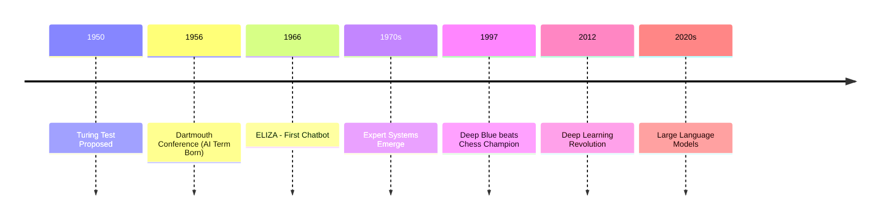
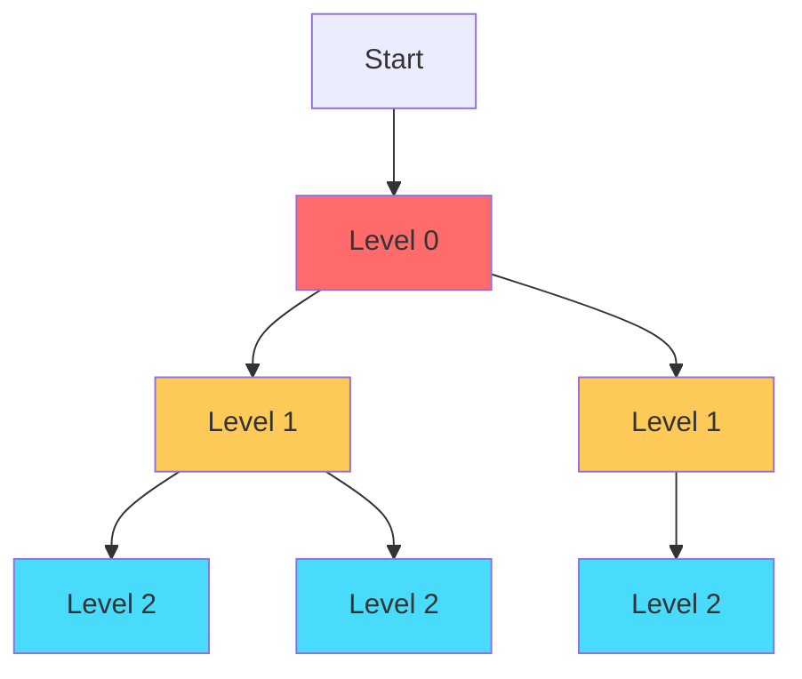
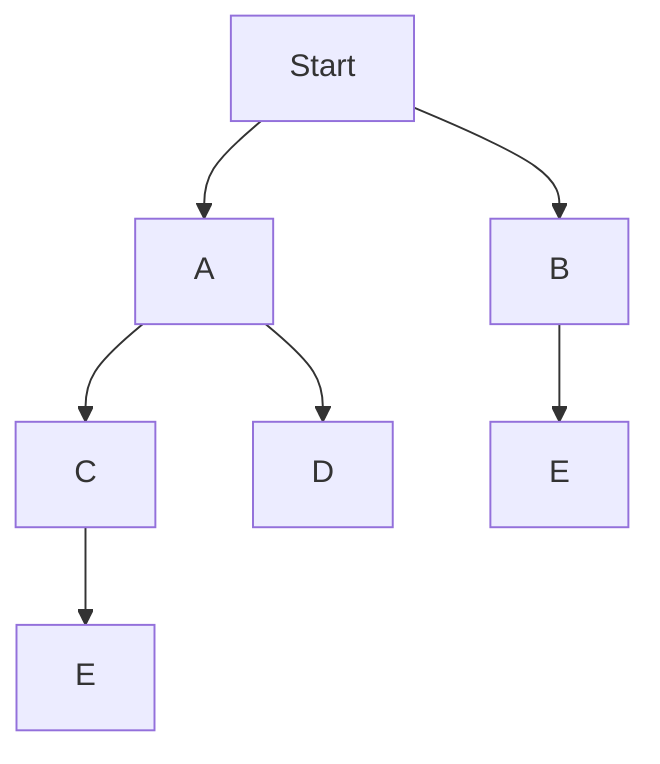
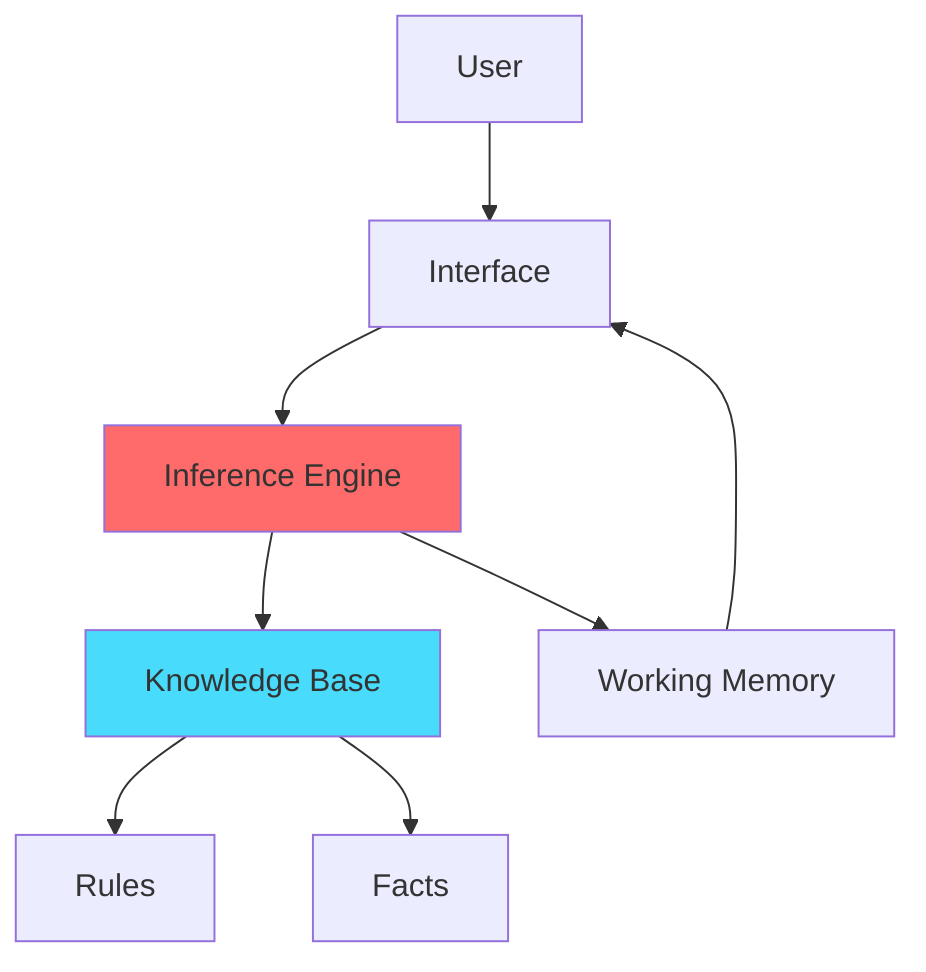
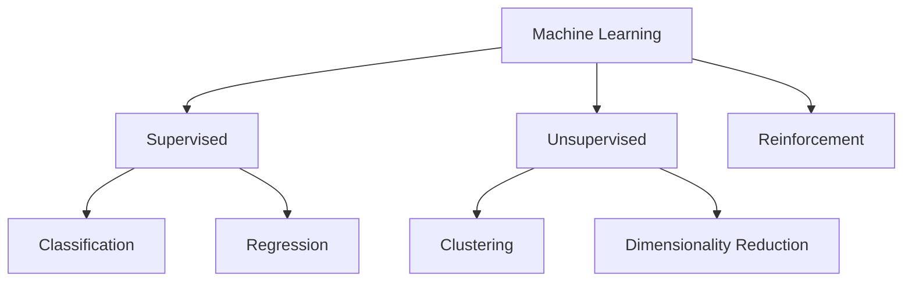
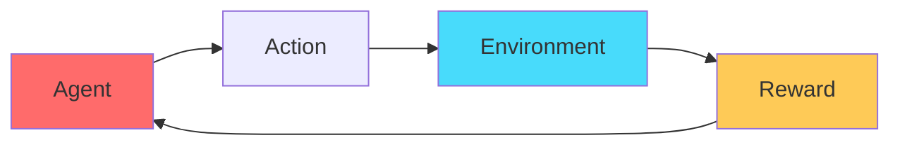

# ذكاء اصطناعي: المبادئ · Artificial Intelligence: Principles (Year 3 - Semester 2)

---

## 📜 تاريخ الذكاء الاصطناعي · AI History



### المراحل الرئيسية · Key Milestones

| الفترة |里程碑 | الإنجازات |
|--------|--------|-----------|
| 1950s-1960s | **Pioneering** | Turing Test, Logic Theorist, Samuel's Checkers |
| 1970s-1980s | **Expert Systems** | MYCIN, DENDRAL, XCON |
| 1990s-2000s | **Machine Learning** | Neural Networks, SVM, Decision Trees |
| 2010s-Present | **Deep Learning** | CNN, RNN, Transformers, LLMs |

### تعريف الذكاء الاصطناعي · AI Definition

> **الذكاء الاصطناعي** (Artificial Intelligence): قدرة الأنظمة الحاسوبية على أداء مهام تتطلب ذكاءً بشريًا كالتفكير والتعلم واتخاذ القرارات.

---

## 🔍 خوارزميات البحث · Search Algorithms

### 1. البحث بالعرض أولاً (BFS)



```python
from collections import deque

def bfs(graph, start):
    visited = set()
    queue = deque([start])
    visited.add(start)
    
    while queue:
        node = queue.popleft()
        print(node, end=' ')
        
        for neighbor in graph[node]:
            if neighbor not in visited:
                visited.add(neighbor)
                queue.append(neighbor)
```

**الخصائص:**
- **التعقيد الزمني:** $O(V + E)$
- **التعقيد المكاني:** $O(V)$
- **ضامن للمسار الأقصر** (في غراف غير مُوزون)

### 2. البحث بالعمق أولاً (DFS)



```python
def dfs(graph, start, visited=None):
    if visited is None:
        visited = set()
    
    visited.add(start)
    print(start, end=' ')
    
    for neighbor in graph[start]:
        if neighbor not in visited:
            dfs(graph, neighbor, visited)
```

**الخصائص:**
- **التعقيد الزمني:** $O(V + E)$
- **التعقيد المكاني:** $O(V)$ (recursion stack)
- **مناسب لـ:** اكتشاف المسارات، التحقق من الدورات

### 3. خوارزمية A* (A-Star)

$$f(n) = g(n) + h(n)$$

حيث:
- $g(n)$: التكلفة من البداية للعقدة $n$
- $h(n)$: التكلفة المُقدّرة من $n$ للهدف (heuristic)
- $f(n)$: التكلفة الإجمالية المُقدّرة

```python
import heapq

def astar(graph, start, goal, heuristic):
    # f(n) = g(n) + h(n)
    open_set = [(heuristic[start], 0, start)]
    came_from = {}
    g_score = {start: 0}
    
    while open_set:
        _, current_g, current = heapq.heappop(open_set)
        
        if current == goal:
            return reconstruct_path(came_from, current)
        
        for neighbor, cost in graph[current]:
            tentative_g = current_g + cost
            
            if neighbor not in g_score or tentative_g < g_score[neighbor]:
                came_from[neighbor] = current
                g_score[neighbor] = tentative_g
                f_score = tentative_g + heuristic[neighbor]
                heapq.heappush(open_set, (f_score, tentative_g, neighbor))
    
    return None
```

**شروط التفوق:**
- **Admissible:** $h(n)$ لا تُبالغ التكلفة الحقيقية
- **Consistent:** $h(n) \leq cost(n \to n') + h(n')$

### مقارنة الخوارزميات · Algorithm Comparison

| الخوارزمية | BFS | DFS | A* |
|------------|-----|-----|-----|
| **التعقيد** | $O(V+E)$ | $O(V+E)$ | $O(E)$ |
| **الذاكرة** | $O(V)$ | $O(V)$ | $O(V)$ |
| **المسار** | أقصر | أي مسار | أمثل |
| **الاستخدام** | أقصر مسار | استكشاف | ألعاب، ملاحة |

---

## 🎮 نظرية الألعاب · Game Theory

### المصفوفة الدفعية · Payoff Matrix

```mermaid
graph LR
    subgraph اللاعب 2(Player 2)
        A1[Strategize A]
        B1[Strategize B]
    end
    
    subgraph اللاعب 1(Player 1)
        A[Strategize A]
        B[Strategize B]
    end
    
    A --> A1
    A --> B1
    B --> A1
    B --> B1
```

### مثال: معضلة السجينين

| | **يعترف** | **ينكر** |
|---|-----------|-----------|
| **يعترف** | -5, -5 | 0, -10 |
| **ينكر** | -10, 0 | -1, -1 |

### مفاهيم أساسية · Core Concepts

- ** Nash Equilibrium:** لا يستطيع أي لاعب تحسين موقفه بتغيير استراتيجيته منفردًا
- ** Dominated Strategy:** استراتيجية أسوأ من أخرى بغض النظر عن أفعال الخصم
- ** Minimax:** تعظيم أقل الخسائر الممكنة
- ** Alpha-Beta Pruning:** تقليم شجرة الألعاب

### خوارزمية Minimax

```python
def minimax(board, depth, is_maximizing):
    if game_over(board) or depth == 0:
        return evaluate(board)
    
    if is_maximizing:
        max_eval = float('-inf')
        for move in get_moves(board):
            eval = minimax(board, depth-1, False)
            max_eval = max(max_eval, eval)
        return max_eval
    else:
        min_eval = float('inf')
        for move in get_moves(board):
            eval = minimax(board, depth-1, True)
            min_eval = min(min_eval, eval)
        return min_eval
```

### تقليم Alpha-Beta

```python
def alphabeta(board, depth, alpha, beta, is_maximizing):
    if game_over(board) or depth == 0:
        return evaluate(board)
    
    if is_maximizing:
        max_eval = float('-inf')
        for move in get_moves(board):
            eval = alphabeta(board, depth-1, alpha, beta, False)
            max_eval = max(max_eval, eval)
            alpha = max(alpha, eval)
            if beta <= alpha:
                break  # Beta cut-off
        return max_eval
    else:
        min_eval = float('inf')
        for move in get_moves(board):
            eval = alphabeta(board, depth-1, alpha, beta, True)
            min_eval = min(min_eval, eval)
            beta = min(beta, eval)
            if beta <= alpha:
                break  # Alpha cut-off
        return min_eval
```

---

## 🧠 الأنظمة الخبيرة · Expert Systems

### البنية · Architecture



### المكونات · Components

| المكون | Component | الوصف |
|--------|-----------|-------|
| **قاعدة المعرفة** | Knowledge Base | القواعد والحقائق |
| **محرك الاستنتاج** | Inference Engine | منطق الاستنتاج |
| **الذاكرة العاملة** | Working Memory | الحالة الحالية |
| **واجهة المستخدم** | User Interface | التفاعل مع النظام |

### أنواع الاستنتاج · Inference Types

#### 1. الاستنتاج الأمامي (Forward Chaining)

```python
def forward_chaining(facts, rules):
    new_facts = set(facts)
    
    while True:
        added = False
        for rule in rules:
            if rule.premise.issubset(new_facts) and rule.conclusion not in new_facts:
                new_facts.add(rule.conclusion)
                added = True
        
        if not added:
            break
    
    return new_facts
```

- **الملاءمة:** استنتاج من البيانات للحقائق
- **المثال:** تشخيص طبي

#### 2. الاستنتاج الخلفي (Backward Chaining)

```python
def backward_chaining(goal, rules, facts):
    if goal in facts:
        return True
    
    for rule in rules:
        if rule.conclusion == goal:
            if all(backward_chaining(premise, rules, facts) for premise in rule.premise):
                return True
    
    return False
```

- **الملاءمة:** التحقق من فرضية معينة
- **المثال:** حل المشكلات

---

## 🤖 مقدمة في التعلم الآلي · Machine Learning Introduction

### أنواع التعلم · Learning Types



### 1. التعلم تحت الإشراف (Supervised Learning)

#### التصنيف (Classification)

```python
# مثال: خوارزمية K-Nearest Neighbors
from sklearn.neighbors import KNeighborsClassifier

model = KNeighborsClassifier(n_neighbors=5)
model.fit(X_train, y_train)
predictions = model.predict(X_test)
```

#### الانحدار (Regression)

```python
from sklearn.linear_model import LinearRegression

model = LinearRegression()
model.fit(X_train, y_train)
predictions = model.predict(X_test)
```

### 2. التعلم بدون إشراف (Unsupervised Learning)

#### التجميع (Clustering)

```python
from sklearn.cluster import KMeans

model = KMeans(n_clusters=3)
model.fit(X)
labels = model.labels_
```

### 3. التعلم المعزز (Reinforcement Learning)



### مقاييس الأداء · Evaluation Metrics

| المقياس | Metric | الصيغة |
|---------|--------|--------|
| **الدقة** | Accuracy | $\frac{TP + TN}{TP + TN + FP + FN}$ |
| **الدقة** | Precision | $\frac{TP}{TP + FP}$ |
| **الاستدعاء** | Recall | $\frac{TP}{TP + FN}$ |
| **F1-Score** | F1 | $2 \cdot \frac{Precision \cdot Recall}{Precision + Recall}$ |

---

## 📊 جدول مرجعي شامل · Master Reference Table

### خوارزميات البحث · Search Algorithms

| الخوارزمية | التعقيد الزمني | التعقيد المكاني | الاستخدام |
|------------|----------------|-----------------|-----------|
| **BFS** | $O(V + E)$ | $O(V)$ | أقصر مسار، غير موزون |
| **DFS** | $O(V + E)$ | $O(V)$ | استكشاف، دورات |
| **A\*** | $O(E)$ | $O(V)$ | ألعاب، ملاحة |
| **Dijkstra** | $O(E + V \log V)$ | $O(V)$ | أقصر مسار موزون |

### نظرية الألعاب · Game Theory

| المفهوم | Definition |
|---------|------------|
| **Nash Equilibrium** | نقطة حيث لا يمكن لأي لاعب تحسين موقفه منفردًا |
| **Minimax** | تعظيم أقل ربح ممكن للخصم |
| **Alpha-Beta** | تقليم شجرة البحث |

### التعلم الآلي · Machine Learning

| النوع | Type | الأمثلة |
|------|------|---------|
| **تحت الإشراف** | Supervised | SVM, Neural Networks, Decision Trees |
| **بدون إشراف** | Unsupervised | K-Means, PCA, DBSCAN |
| **معزز** | Reinforcement | Q-Learning, Deep Q-Network |

---

## ⚠️ أخطاء شائعة وملاحظات · Common Pitfalls & Notes

### ❌ أخطاء شائعة

1. **الخلط بين BFS و DFS:**
   - BFS: يستخدم Queue، يضمن أقصر مسار
   - DFS: يستخدم Stack أو Rekursion، لا يضمن أقصر مسار

2. **خوارزمية A*: اختيار دالة heuristic غير ملائمة:**
   - يجب أن تكون Admissible (لا تُبالغ)
   - غير قابلة للاستخدام إذا كانت تُبالغ التكلفة

3. **نظرية الألعاب: افتراض أن الجميع يتعاونون:**
   - في اللعبة التنافسية، كل لاعب يُعظّم ربحه
   - Nash Equilibrium لا يعني بالضرورة أفضل نتيجة للجميع

4. **التعلم الآلي: البيانات غير المتوازنة:**
   - إذا كانت الأصناف غير متوازنة، Accuracy ليس مقياسًا جيدًا
   - استخدم F1-Score أو AUC

5. **التعلم الآلي: الإفراط في التدريب (Overfitting):**
   - النموذج يحفظ البيانات التدريبية بدلاً من التعميم
   - الحل: التحقق المتقاطع (Cross-Validation)

### ❌ مفاهيم خاطئة شائعة

- **"AI = Machine Learning"**: ML جزء من AI وليس العكس
- **"الذكاء الاصطناعي سيحل محل البشر"**: AI يُساعد وليس يُحل محل
- **"المزيد من البيانات أفضل"**: Quality أهم من Quantity
- **"A* دائمًا أفضل من BFS"**: A* يحتاج heuristic، BFS أبسط

### 💡 نصائح مهمة

- **لاختيار خوارزمية البحث:**
  - غير موزون + أقصر مسار → BFS
  - استكشاف سريع + لا نحتاج أقصر → DFS
  - موزون + هدف محدد → A*

- **لاختيار ML:**
  - بيانات مُسمّاة → Supervised
  - بيانات غير مُسمّاة → Unsupervised
  - تعلم من خلال التجربة → Reinforcement

---

## 📝 أمثلة محلولة · Worked Examples

### مثال 1: BFS لمسار أقصر

**المعطيات:** graph: A → B, A → C, B → D, C → D

**الحل:**
```
المستوى 0: A
المستوى 1: B, C
المستوى 2: D
المسار: A → B → D (أو A → C → D)
```

### مثال 2: A* مع heuristic

**المعطيات:** 
- بدء: A، هدف: Z
- التكاليف الحقيقية: A→B=3, B→Z=4
- Heuristic: h(A)=6, h(B)=2

**الحل:**
- f(A) = g(A) + h(A) = 0 + 6 = 6
- f(B) = g(B) + h(B) = 3 + 2 = 5 ← نختار B أولاً

### مثال 3: معضلة السجينين

**السيناريو:** سجينان معًا، إذا اعترف ambos -> -5، إذا اعترف uno فقط -> 0, -10

**Nash Equilibrium:** ambos يعترفان (استقرار لأن أحدهما يختلف سيخسر أكثر)

---

(End of file)
