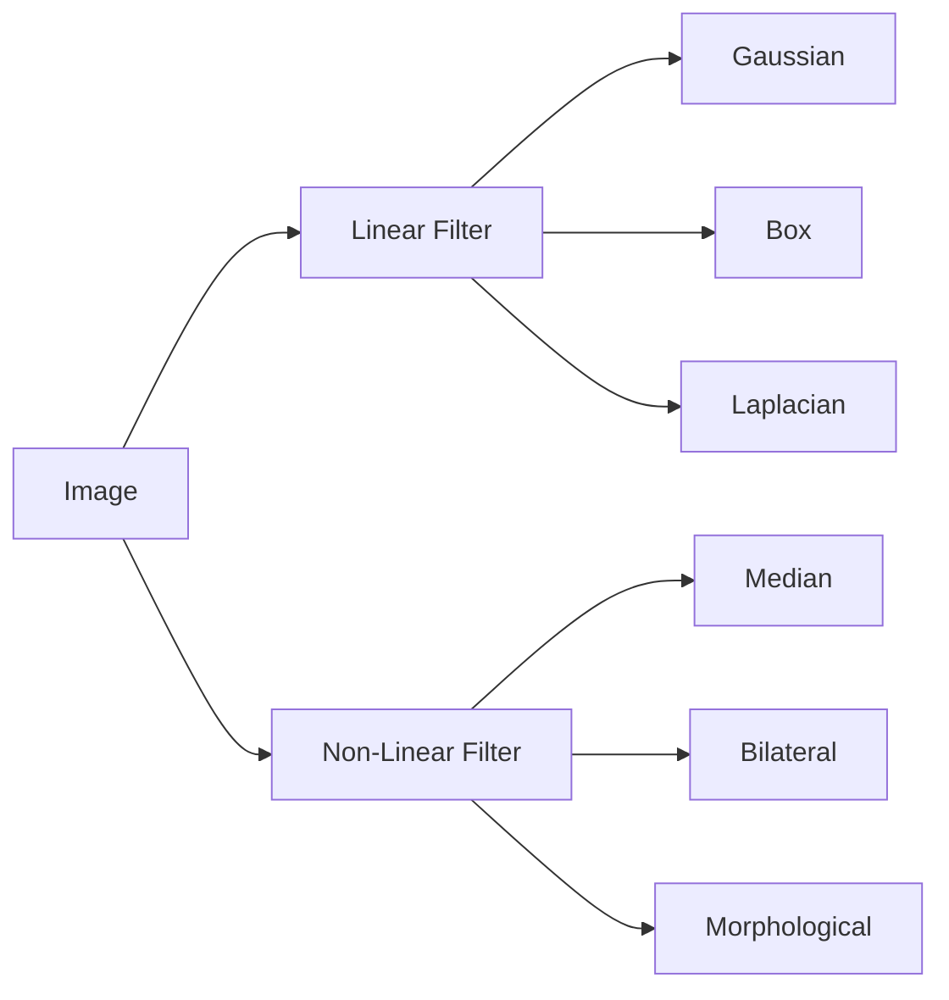
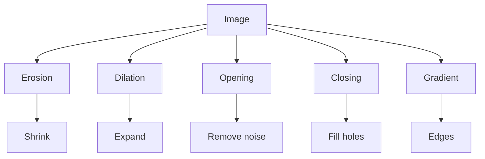
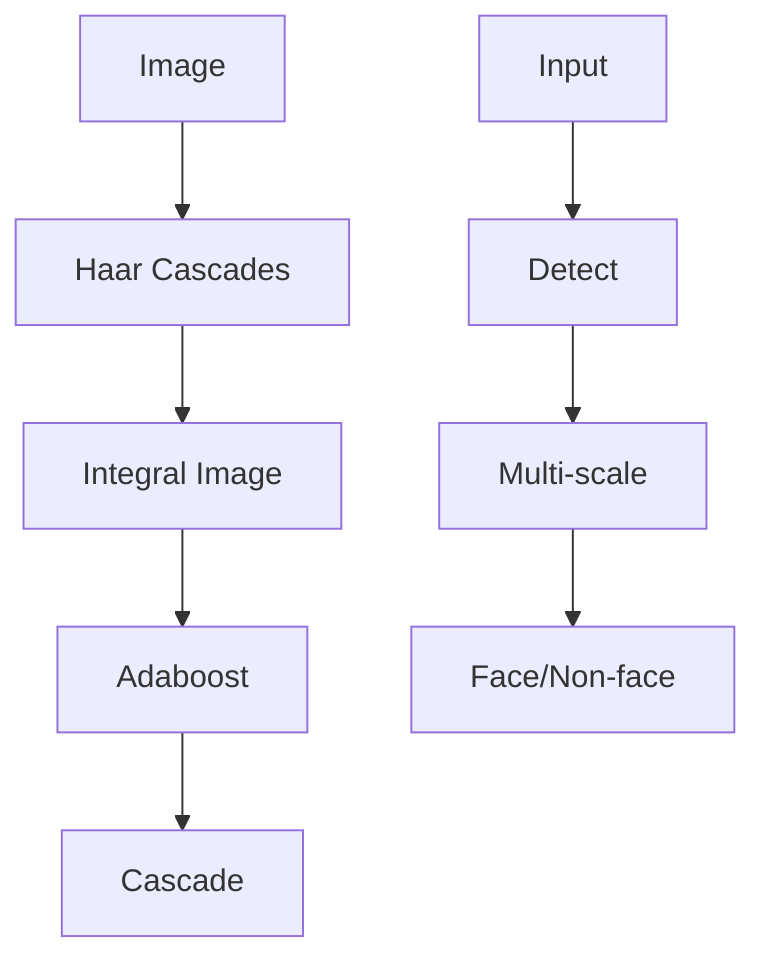
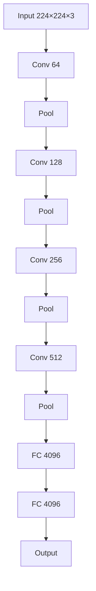
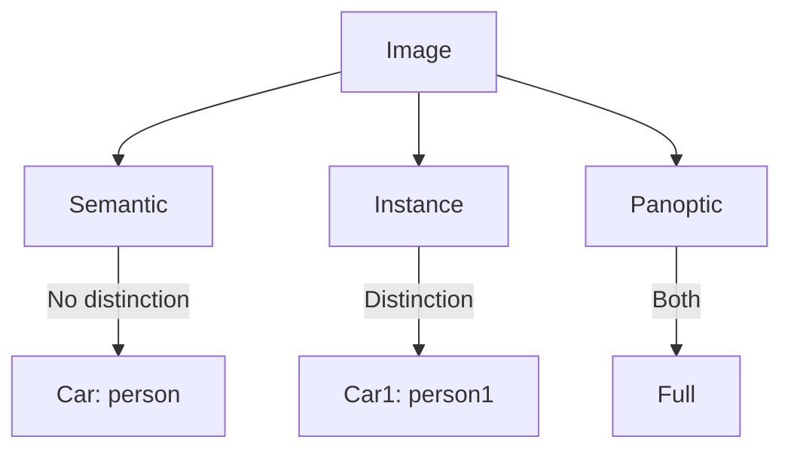
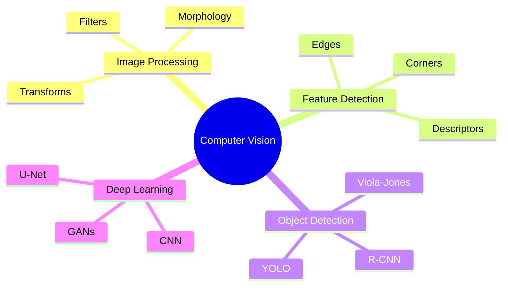

# رؤية حاسوبية (Computer Vision)

## نظرة عامة (Overview)

```
┌─────────────────────────────────────────────────────────────┐
│               Computer Vision                     │
├─────────────────────────────────────────────────────┤
│  Image Processing → Features → Object Detection → CNN   │
└─────────────────────────────────────────────────────┘
```

---

## 1. معالجة الصور (Image Processing)

### نماذج الصور (Image Models)

```mermaid
graph TD
    A[Image f(x,y)] --> B[Spatial Domain]
    A --> C[Frequency Domain]
    
    B --> D[Point Operations]
    B --> E[Neighborhood Operations]
    B --> F[Geometric Operations]
    
    C --> G[Filters]
    C --> H[Transforms]
```

### Color Spaces

| الفضاء |_channels | الاستخدام |
|---------|----------|------------|
| RGB | R, G, B | شاشات |
| HSV | Hue, Saturation, Value | معالجة لونية |
| LAB | L, A, B | رؤية بشرية |
| YUV | Y, U, V | ضغط الفيديو |
| Grayscale | I | تحليل |

```python
import cv2
import numpy as np

# RGB to Grayscale
gray = cv2.cvtColor(image, cv2.COLOR_BGR2GRAY)

# RGB to HSV
hsv = cv2.cvtColor(image, cv2.COLOR_BGR2HSV)

# RGB to LAB
lab = cv2.cvtColor(image, cv2.COLOR_BGR2LAB)
```

### Point Operations

```python
# Brightness adjustment
bright = cv2.add(image, np.array([50]))

# Contrast adjustment
factor = 1.5
contrast = cv2.multiply(image, np.array([factor]))

# Gamma correction
gamma = 2.0
table = np.array([((i / 255.0) ** gamma) * 255 
                  for i in range(256)]).astype("uint8")
gamma_corrected = cv2.LUT(image, table)

# Thresholding
_, binary = cv2.threshold(gray, 127, 255, cv2.THRESH_BINARY)

# Adaptive thresholding
adaptive = cv2.adaptiveThreshold(
    gray, 255, cv2.ADAPTIVE_THRESH_GAUSSIAN_C,
    cv2.THRESH_BINARY, 11, 2
)
```

---

## 2. Convolution & Filters

### Convolution

$$g(x,y) = f * h = \sum_{u=-k}^{k} \sum_{v=-k}^{k} f(u,v) \cdot h(x-u, y-v)$$

```python
# 2D Convolution
kernel = np.array([[1, 1, 1],
                  [1, 1, 1], 
                  [1, 1, 1]]) / 9.0

blurred = cv2.filter2D(image, -1, kernel)
```

### Filters



### Gaussian Filter

$$G(x,y) = \frac{1}{2\pi\sigma^2} e^{-\frac{x^2+y^2}{2\sigma^2}}$$

```python
# Gaussian blur
blur = cv2.GaussianBlur(image, (5, 5), 1.5)

# Separable Gaussian
blur = cv2.sepFilter2D(image, -1, kx, ky)
```

### Edge Detection Filters

```python
# Sobel
sobelx = cv2.Sobel(gray, cv2.CV_64F, 1, 0, ksize=3)
sobely = cv2.Sobel(gray, cv2.CV_64F, 0, 1, ksize=3)
sobel = cv2.sqrt(sobelx**2 + sobely**2)

# Laplacian
laplacian = cv2.Laplacian(gray, cv2.CV_64F, ksize=3)

# Canny
edges = cv2.Canny(gray, 50, 150)
```

---

## 3. Morphological Operations



### العمليات

| العملية | الوصف | الصيغة |
|----------|--------|--------|
| Erosion | تقليص | $\ominus$ |
| Dilation | توسيع | $\oplus$ |
| Opening | فتح | $(X \ominus B) \oplus B$ |
| Closing | إغلاق | $(X \oplus B) \ominus B$ |
| Gradient | حدود | $(X \oplus B) \ominus (X \ominus B)$ |

```python
# Morphological operations
kernel = cv2.getStructuringElement(cv2.MORPH_RECT, (5, 5))

# Erosion
eroded = cv2.erode(image, kernel, iterations=1)

# Dilation
dilated = cv2.dilate(image, kernel, iterations=1)

# Opening (erosion then dilation)
opened = cv2.morphologyEx(image, cv2.MORPH_OPEN, kernel)

# Closing (dilation then erosion)
closed = cv2.morphologyEx(image, cv2.MORPH_CLOSE, kernel)

# Morphological gradient
gradient = cv2.morphologyEx(image, cv2.MORPH_GRADIENT, kernel)
```

---

## 4. Feature Detection

### Corner Detection

```python
# Harris Corner Detection
corners = cv2.cornerHarris(gray, blockSize=2, ksize=3, k=0.04)

# Shi-Tomasi
corners = cv2.goodFeaturesToTrack(gray, maxCorners=100, 
                                 qualityLevel=0.01, 
                                 minDistance=10)
```

### Edge Detection

```
┌─────────────────────────────────────────┐
│        Edge Detection Pipeline          │
├─────────────────────────────────────────┤
│                                         │
│  1. Noise Reduction (Gaussian)          │
│  2. Gradient Calculation (Sobel)        │
│  3. Non-Maximum Suppression              │
│  4. Double Threshold                   │
│  5. Edge Tracking by Hysteresis       │
│                                         │
└─────────────────────────────────────────┘
```

### Hough Transform

```python
# Hough Lines
lines = cv2.HoughLines(edges, rho, theta, threshold)

# Probabilistic Hough
lines = cv2.HoughLinesP(edges, rho, theta, threshold, 
                        minLineLength=50, maxLineGap=10)

# Hough Circles
circles = cv2.HoughCircles(gray, cv2.HOUGH_GRADIENT, 
                          dp=1, minDist=20, 
                          param1=50, param2=30)
```

---

## 5. Feature Descriptors

### SIFT (Scale-Invariant Feature Transform)

```python
# SIFT detector
sift = cv2.SIFT_create()
keypoints, descriptors = sift.detectAndCompute(gray, None)

# Draw keypoints
output = cv2.drawKeypoints(image, keypoints, None, 
                        flags=cv2.DRAW_MATCHES_FLAGS_DRAW_RICH_KEYPOINTS)
```

### SURF & ORB

```python
# SURF (faster than SIFT)
surf = cv2.SURF_create(hessianThreshold=400)
keypoints, descriptors = surf.detectAndCompute(gray, None)

# ORB (fast, rotation invariant)
orb = cv2.ORB_create(nfeatures=1000)
keypoints, descriptors = orb.detectAndCompute(gray, None)
```

### descriptors المقارنة

|.Descriptor | Rotation | Scale | Speed | Accuracy |
|------------|----------|-------|-------|----------|
| SIFT | ✅ | ✅ | بطيء | عالي |
| SURF | ✅ | ✅ | متوسط | عالي |
| ORB | ✅ | ✅ | سريع | متوسط |
| BRIEF | ❌ | ❌ | سريع | منخفض |
| AKAZE | ✅ | ✅ | متوسط | عالي |

---

## 6. Object Detection

### Viola-Jones Face Detection



### Haar Cascades

```python
# Load cascade classifier
face_cascade = cv2.CascadeClassifier(
    'haarcascade_frontalface_default.xml')

# Detect faces
faces = face_cascade.detectMultiScale(gray, scaleFactor=1.1, 
                                  minNeighbors=5, 
                                  minSize=(30, 30))

# Draw rectangles
for (x, y, w, h) in faces:
    cv2.rectangle(image, (x, y), (x+w, y+h), (255, 0, 0), 2)
```

### Template Matching

```python
# Template matching
result = cv2.matchTemplate(image, template, cv2.TM_CCOEFF_NORMED)

# Find best match
min_val, max_val, min_loc, max_loc = cv2.minMaxLoc(result)

# Multi-scale template matching
for scale in scales:
    resized = cv2.resize(image, None, fx=scale, fy=scale)
    result = cv2.matchTemplate(resized, template, cv2.TM_CCOEFF_NORMED)
    # Check threshold...
```

---

## 7. Deep Learning for Vision

### CNN Architecture



### LeNet Architecture

```
┌─────────────────────────────────────────┐
│           LeNet-5 Architecture         │
├─────────────────────────────────────────┤
│                                         │
│  Input: 32×32×1                          │
│    ↓ Conv (6) → 28×28×6                 │
│    ↓ Pool → 14×14×6                       │
│    ↓ Conv (16) → 10×10×16               │
│    ↓ Pool → 5×5×16                      │
│    ↓ Flatten → 400                       │
│    ↓ FC (120)                            │
│    ↓ FC (84)                             │
│    ↓ Output (10)                         │
│                                         │
└─────────────────────────────────────────┘
```

### PyTorch CNN

```python
import torch
import torch.nn as nn

class CNN(nn.Module):
    def __init__(self):
        super(CNN, self).__init__()
        
        self.conv1 = nn.Sequential(
            nn.Conv2d(1, 16, 3, padding=1),
            nn.ReLU(),
            nn.MaxPool2d(2))
        
        self.conv2 = nn.Sequential(
            nn.Conv2d(16, 32, 3, padding=1),
            nn.ReLU(),
            nn.MaxPool2d(2))
        
        self.fc = nn.Sequential(
            nn.Linear(32*7*7, 128),
            nn.ReLU(),
            nn.Linear(128, 10))
    
    def forward(self, x):
        x = self.conv1(x)
        x = self.conv2(x)
        x = x.view(x.size(0), -1)
        x = self.fc(x)
        return x
```

### Keras CNN

```python
from tensorflow.keras import layers, models

model = models.Sequential([
    # Conv block 1
    layers.Conv2D(32, (3, 3), activation='relu', input_shape=(28, 28, 1)),
    layers.MaxPooling2D((2, 2)),
    
    # Conv block 2
    layers.Conv2D(64, (3, 3), activation='relu'),
    layers.MaxPooling2D((2, 2)),
    
    # Dense layers
    layers.Flatten(),
    layers.Dense(64, activation='relu'),
    layers.Dense(10, activation='softmax')
])

model.compile(optimizer='adam',
             loss='categorical_crossentropy',
             metrics=['accuracy'])
```

---

## 8. Object Detection Models

### YOLO

```python
# YOLO detection
import yolov5

model = yolov5.load('yolov5s.pt')
results = model(image)

# Results
for *box, conf, cls in results.xyxy[0]:
    label = model.names[int(cls)]
    confidence = float(conf)
```

### Faster R-CNN

```python
# Faster R-CNN
import torchvision
from torchvision.models.detection import fasterrcnn_resnet50_fpn

model = fasterrcnn_resnet50_fpn(pretrained=True)
model.eval()

# Detection
predictions = model([image])
boxes = predictions[0]['boxes']
labels = predictions[0]['labels']
scores = predictions[0]['scores']
```

### Model Comparison

| Model | mAP | Speed (FPS) | Use Case |
|-------|-----|-------------|----------|
| YOLOv5 | 55.4 | 140 | Real-time |
| YOLOv8 | 53.9 | 150 | Real-time |
| Faster R-CNN | 39.8 | 7 | Accuracy |
| SSD | 31.2 | 46 | Balanced |
| RetinaNet | 39.1 | 14 | Balanced |

---

## 9. Image Segmentation

### Types



### U-Net

```python
# U-Net architecture
def unet_model():
    inputs = layers.Input(shape=(256, 256, 3))
    
    # Encoder
    c1 = conv_block(inputs, 64)
    p1 = layers.MaxPooling2D()(c1)
    
    c2 = conv_block(p1, 128)
    p2 = layers.MaxPooling2D()(c2)
    
    # Bottleneck
    cb = conv_block(p2, 256)
    
    # Decoder
    d1 = conv_transpose(cb, c2, 128)
    d2 = conv_transpose(d1, c1, 64)
    
    outputs = layers.Conv2D(1, 1, activation='sigmoid')(d2)
    
    return models.Model(inputs, outputs)
```

---

## 10. جدول المقارنات (Comparison Tables)

### Image Processing

| Technique | Function | Kernel |
|-----------|----------|--------|
| Gaussian Blur | Smoothing | $e^{-x^2}$ |
| Median | Remove noise | None |
| Laplacian | Edges | $\nabla^2$ |
| Sobel | Gradients | $[-1,0,1]$ |

### Deep Learning Models

| Model | Year | Layers | Params | Use |
|-------|------|--------|--------|-----|
| LeNet | 1998 | 7 | 60K | MNIST |
| AlexNet | 2012 | 8 | 61M | Classification |
| VGG | 2014 | 16-19 | 138M | Features |
| ResNet | 2015 | 152 | 60M | Deep |

---

## 11. المشاكل الشائعة (Common Pitfalls)

### ⚠️ Problems

```warning
❌ عدم توازن البيانات (Class Imbalance)
❌ الإفراط في التدريب (Overfitting)
❌ صور ذات جودة منخفضة
❌ الإضاءة غير المتسقة
❌ عدم معالجة البيانات
❌ اختيار خاطئ للمقياس
```

### ✅ Solutions

```python
# ✅ Data augmentation
from tensorflow.keras.preprocessing.image import ImageDataGenerator

datagen = ImageDataGenerator(
    rotation_range=20,
    width_shift_range=0.2,
    height_shift_range=0.2,
    horizontal_flip=True,
    zoom_range=0.2)

# ✅ Class weights
from sklearn.utils import class_weight
weights = class_weight.compute_class_weight('balanced', np.unique(y), y)

# ✅ Early stopping
early_stop = tf.keras.callbacks.EarlyStopping(
    monitor='val_loss', patience=5)
```

---

## 12. الأوامر السريعة (Quick Commands)

```bash
# OpenCV
cv2.imread('image.jpg')
cv2.imwrite('output.jpg', result)
cv2.resize(image, (w, h))
cv2.cvtColor(image, cv2.COLOR_BGR2GRAY)

# NumPy
np.fft.fft2(image)
np.fft.fftshift(freq)

# PyTorch
torch.tensor(image).unsqueeze(0)
model.eval()
torch.no_grad()
```

---

## 13. ملخص (Summary)



**Key Points:**
- 🖼️ **Image Processing**: المعالجة الأساسية
- 🔍 **Feature Detection**:كشف الخصائص
- 🎯 **Object Detection**: كشف الأجسام
- 🧠 **Deep Learning**: الشبكات العصبية
- 📸 **Segmentation**: تجزيء الصور