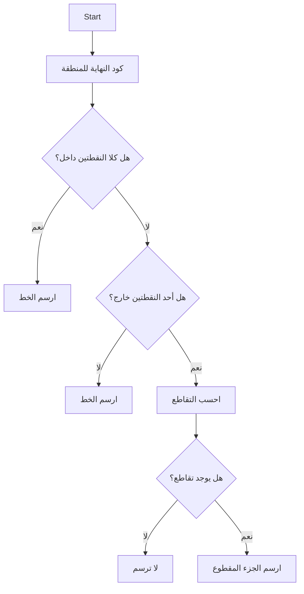
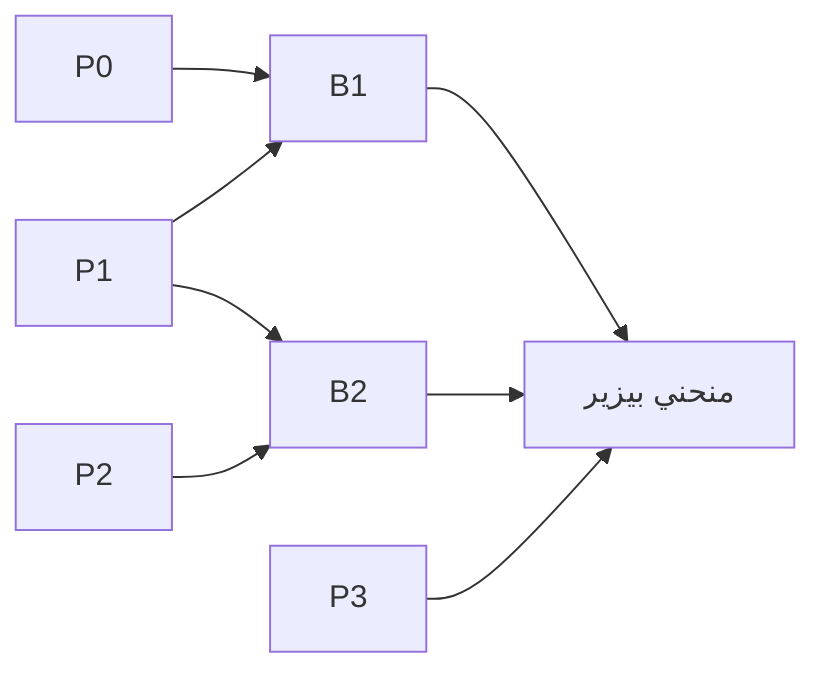
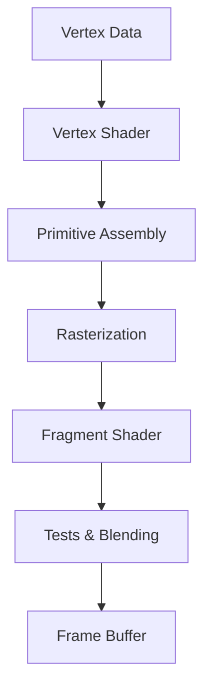

# رسومات حاسوبية · Computer Graphics

## 📐 التعاريف الأساسية · Core Definitions

- **الرسومات الحاسوبية** (Computer Graphics): إنشاء ومعالجة الصور باستخدام الحاسوب.
- **البكسل** (Pixel): أصغر وحدة في الصورة الرقمية، يمثل نقطة ملونة.
- **الإطار Buffer** (Frame Buffer): ذاكرة تخزن قيم الألوان لكل بكسل.
- **المشهد** (Scene): مجموعة الكائنات ثلاثية الأبعاد المراد.renderها.
- **المحولات** (Transformations): عمليات رياضية لتحويل الكائنات في الفضاء.

---

## 🧮 التحويلات ثنائية وثلاثية الأبعاد · 2D & 3D Transformations

### مصفوفات التحويل · Transformation Matrices

#### التحويل الثنائي الأبعاد (2D)

$$M_{2D} = \begin{bmatrix} a & b & t_x \\ c & d & t_y \\ 0 & 0 & 1 \end{bmatrix}$$

حيث $(t_x, t_y)$ هي متجه.translation

#### التحويل ثلاثي الأبعاد (3D)

$$M_{3D} = \begin{bmatrix} r_{11} & r_{12} & r_{13} & t_x \\ r_{21} & r_{22} & r_{23} & t_y \\ r_{31} & r_{32} & r_{33} & t_z \\ 0 & 0 & 0 & 1 \end{bmatrix}$$

### التحويلات الأساسية · Basic Transformations

| التحويل | المصفوفة | الوصف |
| ------- | -------- | ----- |
| **الإزاحة** (Translation) | $\begin{bmatrix} 1 & 0 & t_x \\ 0 & 1 & t_y \\ 0 & 0 & 1 \end{bmatrix}$ | تحريك النقطة |
| **التدوير** (Rotation) | $\begin{bmatrix} \cos\theta & -\sin\theta \\ \sin\theta & \cos\theta \end{bmatrix}$ | دوران حولOrigin |
| **التوسيع** (Scaling) | $\begin{bmatrix} s_x & 0 \\ 0 & s_y \end{bmatrix}$ | تكبير/تصغير |
| **القص** (Shearing) | $\begin{bmatrix} 1 & sh_x \\ sh_y & 1 \end{bmatrix}$ | تشويه الشكل |

### تدوير ثلاثي الأبعاد · 3D Rotation

$$\text{Rot}_x(\theta) = \begin{bmatrix} 1 & 0 & 0 \\ 0 & \cos\theta & -\sin\theta \\ 0 & \sin\theta & \cos\theta \end{bmatrix}$$

$$\text{Rot}_y(\theta) = \begin{bmatrix} \cos\theta & 0 & \sin\theta \\ 0 & 1 & 0 \\ -\sin\theta & 0 & \cos\theta \end{bmatrix}$$

$$\text{Rot}_z(\theta) = \begin{bmatrix} \cos\theta & -\sin\theta & 0 \\ \sin\theta & \cos\theta & 0 \\ 0 & 0 & 1 \end{bmatrix}$$

---

## ✂️ القص · Clipping

### خوارزمية كوهين-ساذرلاند · Cohen-Sutherland Algorithm



### أكواد المناطق · Region Codes

| المنطقة | الكود | الموقع |
| ------- | ----- | -------- |
| Above | 1000 | أعلى النافذة |
| Below | 0100 | أسفل النافذة |
| Right | 0010 | يمين النافذة |
| Left | 0001 | يسار النافذة |

**القاعدة:** إذا كان `code1 | code2 = 0` → Line is visible

### خوارزمية لياسون-ريد · Liang-Barsky Algorithm

تستخدم معادلةPARAM:

$$P + tD = 0 \leq t \leq 1$$

حيث:
- $P$ = نقطة البداية
- $D$ = متجه الاتجاه
- $t$ = معامل PARAM

$$t_{enter} = \max(0, t_i) \quad t_{exit} = \min(1, t_i)$$

**الشرط:** $t_{enter} < t_{exit}$ → Line is visible

---

## 🎨 النمذجة Rendering

### أنماط الرendering · Rendering Pipeline


### أنماط الرendering · Rendering Types

| النوع | الوصف | الاستخدام |
| ----- | ----- | ---------- |
| **Wireframe** | خطوط فقط | التصميم |
| **Flat Shading** | سطح موحد | الأداء |
| **Gouraud Shading** | تدرج الألوان | الأسطح المنحنية |
| **Phong Shading** | نورPer-vertex | realism عالي |

### معادلات الإضاءة · Lighting Equations

#### الانعكاس المنتشر (Diffuse)

$$I_d = K_d \cdot I_l \cdot \max(0, N \cdot L)$$

#### الانعكاس_specular

$$I_s = K_s \cdot I_l \cdot \max(0, (N \cdot H)^n)$$

حيث:
- $K_d$ = معامل الانتشار
- $K_s$ = معامل الانعكاس_specular
- $N$ = المتجه العمودي
- $L$ = متجه الضوء
- $H$ = متجه half-vector
- $n$ = معامل اللمعان

---

## 🔷 منحنيات وسطوح · Curves & Surfaces

### منحنيات بيزير · Bezier Curves

$$B(t) = (1-t)^3 P_0 + 3(1-t)^2 t P_1 + 3(1-t) t^2 P_2 + t^3 P_3$$

لـ $0 \leq t \leq 1$



### منحنيات B-Spline

$$C(t) = \sum_{i=0}^{n} N_{i,p}(t) \cdot P_i$$

حيث $N_{i,p}$ هي دوال الأساس الأساسية (Basis Functions)

### خصائص B-Spline

- **غير عاملي** (Non-global): تغيير نقطة تحكم يؤثر محليًا
- **استقرار رقمي** (Numerically stable)
- **مرونة عالية** (Flexible)

### السطوح · Surfaces

#### سطح بيزير الثنائي

$$S(u,v) = \sum_{i=0}^{n} \sum_{j=0}^{m} B_i(u) B_j(v) P_{i,j}$$

---

## 📊 خوارزميات الرسم · Drawing Algorithms

### خوارزمية Bresenham للخطوط

```python
def bresenham_line(x0, y0, x1, y1):
    dx = abs(x1 - x0)
    dy = abs(y1 - y0)
    sx = 1 if x0 < x1 else -1
    sy = 1 if y0 < y1 else -1
    err = dx - dy
    
    while True:
        plot(x0, y0)
        if x0 == x1 and y0 == y1:
            break
        e2 = 2 * err
        if e2 > -dy:
            err -= dy
            x0 += sx
        if e2 < dx:
            err += dx
            y0 += sy
```

### خوارزمية دوائر Bresenham

```python
def bresenham_circle(cx, cy, r):
    x = r
    y = 0
    err = 0
    
    while x >= y:
        plot(cx + x, cy + y)
        plot(cx + y, cy + x)
        plot(cx - y, cy + x)
        plot(cx - x, cy + y)
        plot(cx - x, cy - y)
        plot(cx - y, cy - x)
        plot(cx + y, cy - x)
        plot(cx + x, cy - y)
        
        y += 1
        err += 1 + 2*y
        if 2*(err - x) + 1 > 0:
            x -= 1
            err += 1 - 2*x
```

---

## 🌐 أساسيات OpenGL · OpenGL Basics

###Pipeline الأساسي



### دوال الرسم الأساسية

```c
// بدء الرسم
glBegin(GL_TRIANGLES);
    glVertex3f(0.0f, 1.0f, 0.0f);
    glVertex3f(-1.0f, -1.0f, 0.0f);
    glVertex3f(1.0f, -1.0f, 0.0f);
glEnd();

// الألوان
glColor3f(1.0f, 0.0f, 0.0f); // أحمر

// المصفوفات
glMatrixMode(GL_PROJECTION);
glLoadIdentity();
gluPerspective(45.0, aspect, 0.1, 100.0);
```

### مصفوفة العرض · View Matrix

```c
gluLookAt(eye_x, eye_y, eye_z,    // موقع الكاميرا
          center_x, center_y, center_z,  // النقطة المحورية
          up_x, up_y, up_z);     // متجه الأعلى
```

---

## 📝 أمثلة محلولة · Worked Examples

### مثال 1: تدوير نقطة حولOrigin

**المعطيات:** نقطة $(1, 0)$، دوران $90^\circ$

**الحل:**

$$x' = x\cos\theta - y\sin\theta = 1(0) - 0(1) = 0$$

$$y' = x\sin\theta + y\cos\theta = 1(1) + 0(0) = 1$$

**النتيجة:** $(0, 1)$

### مثال 2: قص خط بواسطة Cohen-Sutherland

**المعطيات:** خط من $(10, 20)$ إلى $(-5, 30)$، نافذة من $(0, 0)$ إلى $(100, 100)$

**التحليل:**
- النقطة الأولى: خارج (يسار)
- النقطة الثانية: خارج (يسار)

**النتيجة:** لا يُرسم (الخط خارج بالكامل)

### مثال 3: حساب نقطة على منحني بيزير

**المعطيات:** نقاط التحكم $(0,0), (1,2), (2,2), (3,0)$، عند $t = 0.5$

**الحل:**

$$B(0.5) = (1-0.5)^3(0,0) + 3(1-0.5)^2(0.5)(1,2)$$

$$+ 3(0.5)^2(1-0.5)(2,2) + (0.5)^3(3,0)$$

$$= 0.125(0,0) + 0.375(1,2) + 0.375(2,2) + 0.125(3,0)$$

$$= (0,0) + (0.375, 0.75) + (0.75, 0.75) + (0.375, 0)$$

$$= (1.5, 1.5)$$

---

## 📊 جدول مرجعي شامل · Master Reference Table

### مصفوفات التحويل · Transformation Matrices

| التحويل | 2D | 3D |
| -------- | -- | -- |
| Translation | $\begin{bmatrix} 1 & 0 & t_x \\ 0 & 1 & t_y \\ 0 & 0 & 1 \end{bmatrix}$ | $\begin{bmatrix} 1 & 0 & 0 & t_x \\ 0 & 1 & 0 & t_y \\ 0 & 0 & 1 & t_z \\ 0 & 0 & 0 & 1 \end{bmatrix}$ |
| Rotation-z | $\begin{bmatrix} \cos & -\sin \\ \sin & \cos \end{bmatrix}$ | $\begin{bmatrix} \cos & -\sin & 0 \\ \sin & \cos & 0 \\ 0 & 0 & 1 \end{bmatrix}$ |
| Scaling | $\begin{bmatrix} s_x & 0 \\ 0 & s_y \end{bmatrix}$ | $\begin{bmatrix} s_x & 0 & 0 \\ 0 & s_y & 0 \\ 0 & 0 & s_z \end{bmatrix}$ |

### خوارزميات الرسم · Drawing Algorithms

| الخوارزمية | الاستخدام | التعقيد |
| ---------- | --------- | -------- |
| DDA | خطوط | $O(n)$ |
| Bresenham | خطوط/دوائر | $O(n)$ |
| Midpoint | دوائر | $O(r)$ |

---

## ⚠️ أخطاء شائعة وملاحظات · Common Pitfalls & Notes

### ❌ أخطاء شائعة

1. **الخلط بين الترتيب COLUMN-MAJOR و ROW-MAJOR:**
   - OpenGL: Column-Major
   - DirectX: Row-Major
   - 💡 **ملاحظة**: تحقق من ترتيب المصفوفة قبل الاستخدام!

2. **نسيان تحويل الإحداثيات:**
   - إحداثيات العالم ≠ إحداثيات الشاشة
   - تحتاج مصفوفة viewport transform

3. **القص في الفضاء الخطأ:**
   - Cohen-Sutherland للـ 2D فقط
   - في 3D استخدم frustum clipping

4. **ترتيب عمليات التحويل:**
   - الترتيب مهم! $T \times R \times S \neq S \times R \times T$
   - Apply from right to left في المصفوفات

### 💡 نصائح مهمة

- **Z-Buffer** مهم لإخفاء الأسطح المخفية
- **Back-face culling** لحذف الوجوه الخلفية
- **Frustum culling** لحذف الكائنات خارج نطاق الرؤية

### 📌 ملاحظات نهائية

- **Homogeneous coordinates**: $(x, y, z, w)$ تستخدم للسماح بالإزاحة
- **نقطة في اللانهائية**: $(x, y, z, 0)$
- **مصفوفة الهوية**: elements قطريين = 1، الباقي = 0
