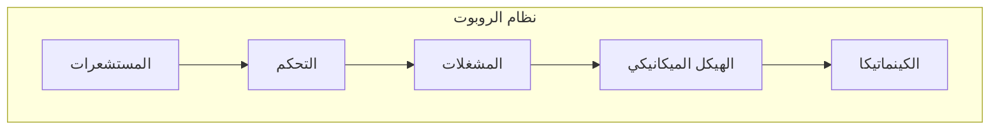
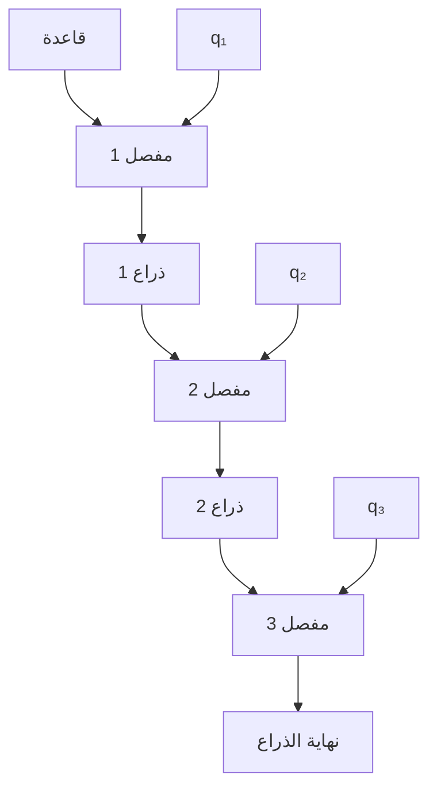
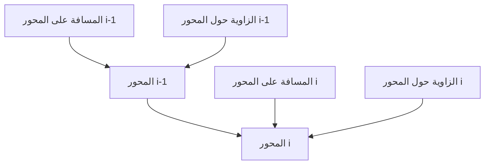
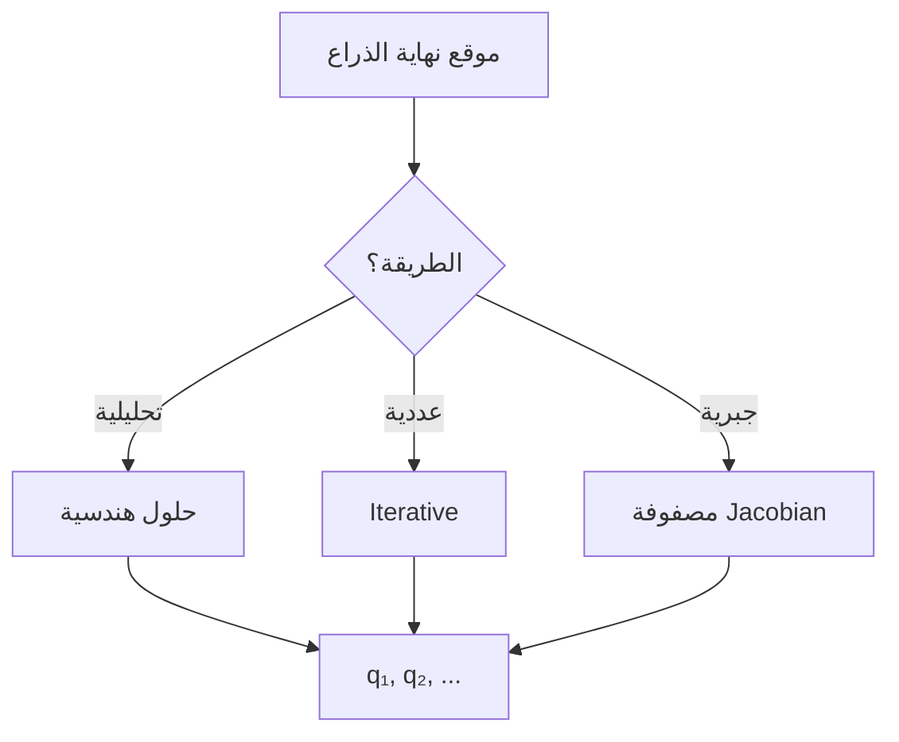
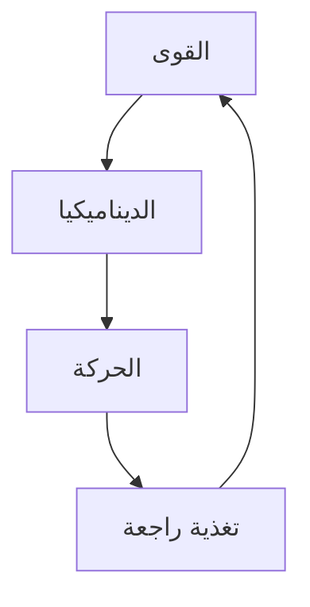
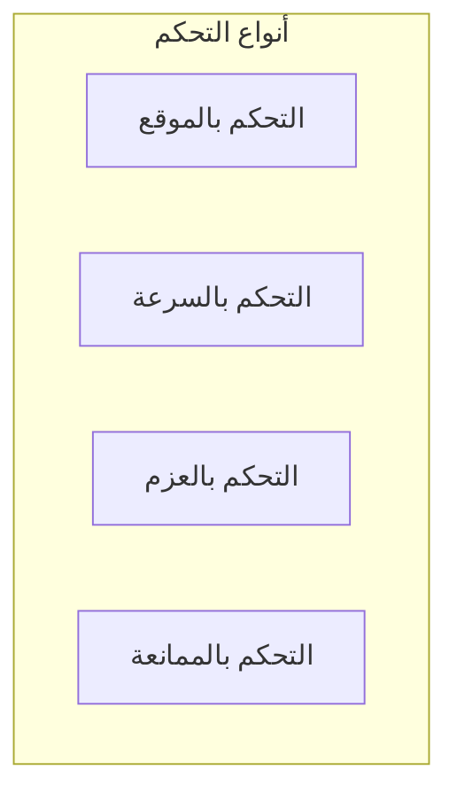
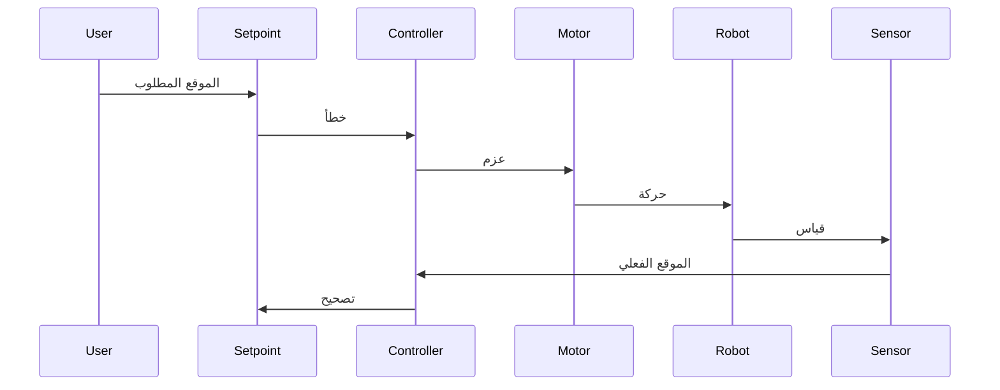
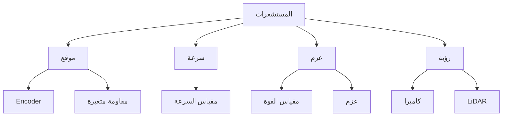
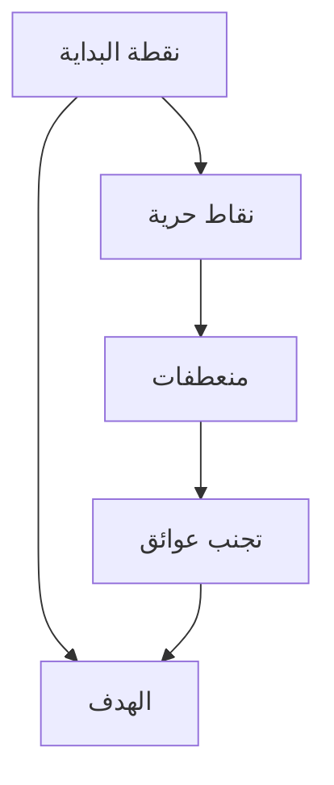
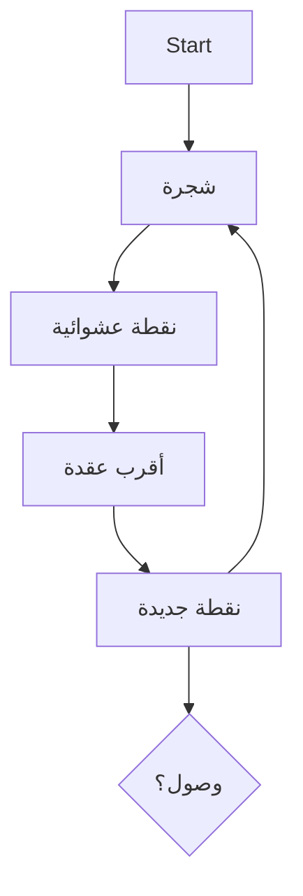

# روبوتيكا · Robotics (Year 4 - Semester 2)

## 🤖 مقدمة في الروبوتات · Introduction to Robotics

### تعريف الروبوت · Robot Definition

- **الروبوت** (Robot): آلة قادرة على تنفيذ مهام بشكل مستقل أو شبه مستقل.
- **نظام الروبوت** (Robotic System): مجموعة متكاملة من المكونات الميكانيكية والإلكترونية والبرمجية.

### تصنيف الروبوتات · Robot Classification

| النوع | الوصف | التطبيقات |
|-------|-------|-----------|
| **مفصلية** (Articulated) | أذرع متعددة المفاصل | صناعية |
| **كروية** (Spherical) | قاعدة كروية | خدمات |
| **ديلتا** (Delta) | ذراع متوازي | تعبئة |
| **كارتيزي** (Cartesian) | محاور خطية | CNC |

---

## 📐 الكينماتيكا · Kinematics

### مفاهيم أساسية · Basic Concepts

- **الكينماتيكا** (Kinematics): دراسة الحركة بدون النظر للقوى.
- **الموقع** (Position): نقطة في الفضاء ($x, y, z$).
- **التوجه** (Orientation): زاوية_orientation ($θ, φ, ψ$).
- **الموقع الكامل** (Pose): الموقع + التوجه.

### إحداثيات المفاصل · Joint Coordinates

$$q = [q_1, q_2, ..., q_n]^T$$

where $q_i$ هو الإحداثي المشترك.

### مصفوفة التحويل · Transformation Matrix

$$T = \begin{pmatrix} R & d \\ 0 & 1 \end{pmatrix}$$

where:
- $R$: مصفوفة التدوير (3×3)
- $d$: متجه الإزاحة (3×1)

#### مصفوفات التحويل الأساسية

- **الدوران حول المحور X**:
$$R_x(θ) = \begin{pmatrix} 1 & 0 & 0 \\ 0 & \cosθ & -\sinθ \\ 0 & \sinθ & \cosθ \end{pmatrix}$$

- **الدوران حول المحور Y**:
$$R_y(θ) = \begin{pmatrix} \cosθ & 0 & \sinθ \\ 0 & 1 & 0 \\ -\sinθ & 0 & \cosθ \end{pmatrix}$$

- **الدوران حول المحور Z**:
$$R_z(θ) = \begin{pmatrix} \cosθ & -\sinθ & 0 \\ \sinθ & \cosθ & 0 \\ 0 & 0 & 1 \end{pmatrix}$$

---

## 🔄 الكينماتيك الأمامي · Forward Kinematics

### التعريف · Definition

تحويل إحداثيات المفاصل إلى موقع نهاية الذراع.

$$P = f(q)$$

### طريقة DH · Denavit-Hartenberg Method

### جدول DH · DH Table

| المفصل | θ | d | a | α |
|--------|---|---|---|---|
| 1 | q₁ | d₁ | 0 | 90° |
| 2 | q₂ | 0 | a₂ | 0° |
| 3 | q₃ | 0 | a₃ | 0° |

### مصفوفة التحويل المتسلسلة

$$T = T_1^0 \cdot T_2^1 \cdot T_3^2 \cdot ...$$

where:
$$T_i^{i-1} = \begin{pmatrix} \cosθ_i & -\sinθ_i \cosα_i & \sinθ_i \sinα_i & a_i \cosθ_i \\ \sinθ_i & \cosθ_i \cosα_i & -\cosθ_i \sinα_i & a_i \sinθ_i \\ 0 & \sinα_i & \cosα_i & d_i \\ 0 & 0 & 0 & 1 \end{pmatrix}$$

---

## 🔙 الكينماتيك العكسي · Inverse Kinematics

### التعريف · Definition

تحويل موقع نهاية الذراع إلى إحداثيات المفاصل.

$$q = f^{-1}(P)$$

### الطرق · Methods

#### طريقة التحليل

لـ 2-Link planar:

$$x = l_1 \cosθ_1 + l_2 \cos(θ_1 + θ_2)$$

$$y = l_1 \sinθ_1 + l_2 \sin(θ_1 + θ_2)$$

$$θ_2 = \arccos\left(\frac{x^2 + y^2 - l_1^2 - l_2^2}{2 l_1 l_2}\right)$$

#### طريقة Jacobian

$$J \cdot \dot{q} = \dot{p}$$

$$\dot{q} = J^{-1} \cdot \dot{p}$$

where $J$ is the Jacobian matrix:

$$J = \frac{\partial p}{\partial q}$$

---

## ⚙️ الديناميكيا · Dynamics

### مفهوم الديناميكيا · Dynamics Concept

دراسة العلاقة بين القوى والحركات.

### معادلات الحركة · Equations of Motion

#### صيغة Euler-Lagrange

$$L = K - P$$

$$\frac{d}{dt}\left(\frac{\partial L}{\partial \dot{q}_i\right) - \frac{\partial L}{\partial q_i = τ_i$$

where:
- $K$: الطاقة الحركية (Kinetic Energy)
- $P$: الطاقة الكامنة (Potential Energy)
- $τ$: العزم (Torque)

#### الطاقة الحركية

$$K = \frac{1}{2} \dot{q}^T M(q) \dot{q}$$

where $M(q)$ is the mass/inertia matrix.

### معادلة Euler الديناميكية

$$\tau = M(q)\ddot{q} + C(q, \dot{q})\dot{q} + G(q)$$

where:
- $M(q)$: مصفوفة العطالة
- $C(q, \dot{q})$: مصفوفة Coriolis/Centrifugal
- $G(q)$: متجه الجاذبية

---

## 🎮 التحكم في الروبوتات · Robot Control

### أنواع التحكم · Control Types

### التحكم PD

$$τ = K_p (q_d - q) - K_d \dot{q}$$

where:
- $K_p$: معامل التناسب
- $K_d$: معامل التفاضل
- $q_d$: الموقع المطلوب

### التحكم PID

$$τ = K_p e + K_i \int e \, dt + K_d \frac{de}{dt}$$

### حلقة التحكم · Control Loop

---

## 👁️ المستشعرات · Sensors

### أنواع المستشعرات · Sensor Types

| النوع | الوصف | التطبيقات |
|-------|-------|-----------|
| **داخلية** (Proprioceptive) | قياس حالة الروبوت | مفاصل، سرعة |
| **خارجية** (Exteroceptive) | قياس البيئة | رؤية، لمس |

### المستشعرات الشائعة

### مستشعرات الموقع

| المستشعر | المبدأ | الدقة |
|----------|--------|-------|
| **Encoder** |数字化 | عالية |
| **Resolver** | كهرومغناطيسي | عالية |
| **Potentiometer** | مقاومة | منخفضة |

### مستشعرات المسافة

| المستشعر | النطاق | الدقة |
|----------|--------|-------|
| **Ultrasonic** | 0-10m | ±1cm |
| **Infrared** | 0-5m | ±1mm |
| **LiDAR** | 0-100m | ±2cm |
| **Stereo Vision** | 0-10m | متغيرة |

---

## 🛤️ تخطيط المسار · Path Planning

### مفهوم التخطيط · Planning Concept

إيجاد مسار من نقطة إلى أخرى دون اصطدام.

### أنواع التخطيط · Planning Types

| النوع | الوصف | التعقيد |
|-------|-------|-----------|
| **عالمي** (Global) | معرفة الخريطة كاملة | منخفض |
| **محلي** (Local) | تجنب عوائق فوري | عالي |
| **هجين** (Hybrid) | الجمع بينهما | متوسط |

### خوارزميات التخطيط · Planning Algorithms

#### 1. خوارزمية A* (A-Star)

$$f(n) = g(n) + h(n)$$

where:
- $g(n)$: التكلفة من البداية
- $h(n)$: التكلفة المتوقعة للهدف (heuristic)

#### 2. خوارزمية Dijkstra

حالة خاصة من A* حيث $h(n) = 0$.

#### 3. Rapidly-exploring Random Trees (RRT)

### تخطيط المسار المتصل · Trajectory Planning

#### المسار متعدد الحدود

$$q(t) = a_0 + a_1 t + a_2 t^2 + a_3 t^3 + a_4 t^4 + a_5 t^5$$

#### المسار الخطي

$$q(t) = q_{start} + \frac{t}{T}(q_{end} - q_{start})$$

---

## 📊 جدول مرجعي شامل · Master Reference Table

### أنواع المفاصل · Joint Types

| النوع | DOF | المزايا | العيوب |
|-------|-----|---------|--------|
| **دوري** (Revolute) | 1 | مرن | معقد |
| **خطي** (Prismatic) | 1 | بسيط | محدود |
| **كروي** (Spherical) | 3 | مرن جداً | معقد |

### معاملات DH · DH Parameters

| المعلمة | الوصف |
|--------|-------|
| θ | زاوية الدوران حول المحور z |
| d | الإزاحة على المحور z |
| a | الإزاحة على المحور x |
| α | زاوية الدوران حول المحور x |

### متطلبات التحكم · Control Requirements

| الخاصية | القيمة النموذجية |
|---------|-----------------|
| دقة الموقع | ±0.1mm |
| سرعة الاستجابة | <10ms |
| تكرار المهمة | >99% |

---

## ⚠️ أخطاء شائعة وملاحظات · Common Pitfalls & Notes

### ❌ أخطاء شائعة

1. **الكينماتيك**:
   - خطأ في ترتيب مصفوفات التحويل
   - الخلط بين زوايا Euler

2. **الديناميكيا**:
   - إهمال قوى الاحتكاك
   - خطأ في حساب الكتلة

3. **التحكم**:
   - معاملات غير مناسبة
   - عدم معالجة التشبع

4. **المستشعرات**:
   - عدم معايرة المستشعرات
   - ضوضاء في القياسات

### 💡 نصائح مهمة

- **Jacobian**: مهم للتحكم والقوى
- **Singularities**: تجنب بالقرب من الحالات الشاذة
- **Workspace**: تحقق من نطاق العمل
- **Safety**: دائماً اعمل في وضع يدوي أولاً

### 📌 ملاحظات نهائية

- **Workspace**: مجموعة كل المواقع الممكنة
- ** dexterity**: قدرة المناورة في directions المختلفة
- **Redundancy**: مفاصل أكثر من اللازم (مزيد من المرونة)

---

## 📝 أمثلة محلولة · Worked Examples

### مثال 1: كينماتيك أمامي بسيط

**روبوتذراعين:**
- l₁ = 10cm, l₂ = 8cm
- θ₁ = 45°, θ₂ = 30°

**الحل:**

$$x = 10\cos45 + 8\cos75 = 7.07 + 2.07 = 9.14cm$$

$$y = 10\sin45 + 8\sin75 = 7.07 + 7.73 = 14.8cm$$

### مثال 2: تحكم PD

**المعطيات:**
- خطأ الموقع: e = 0.1 rad
- السرعة: ė = 0.05 rad/s
- Kp = 10, Kd = 5

**الحل:**

$$τ = 10(0.1) - 5(0.05) = 1 - 0.25 = 0.75Nm$$

### مثال 3: خوارزمية A* (مفهوم)

**نقاط الشبكة:**
- Start: (0,0), Goal: (3,3)
- عائق عند (1,1), (2,1)

**المسار:**
- (0,0) → (0,1) → (0,2) → (1,2) → (2,2) → (3,2) → (3,3)

---

(End of file)