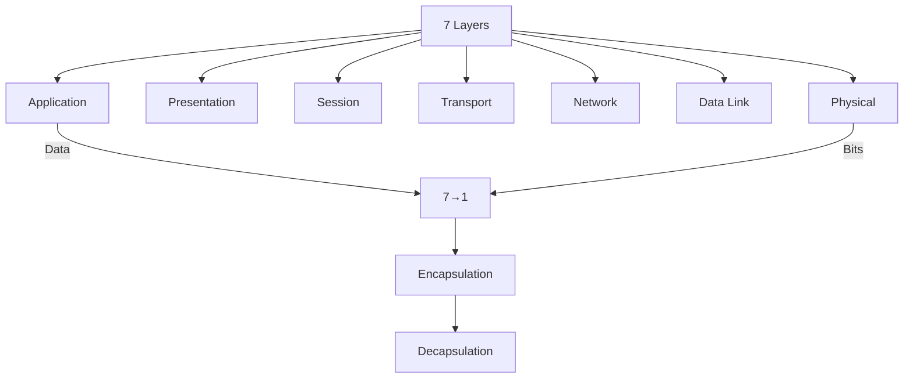
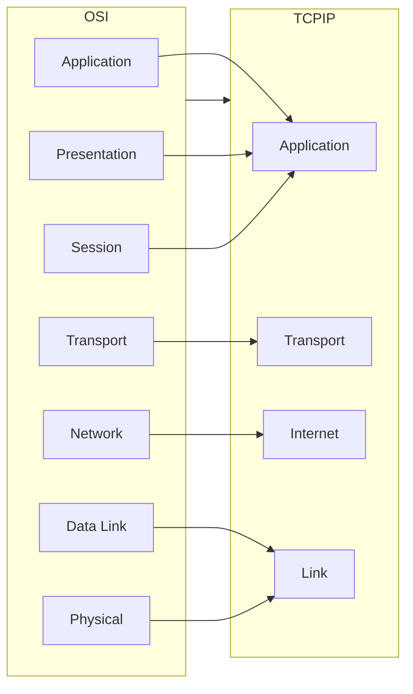
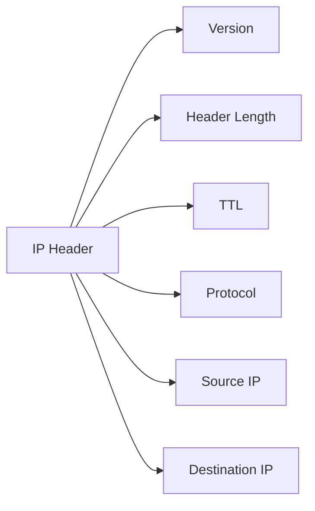
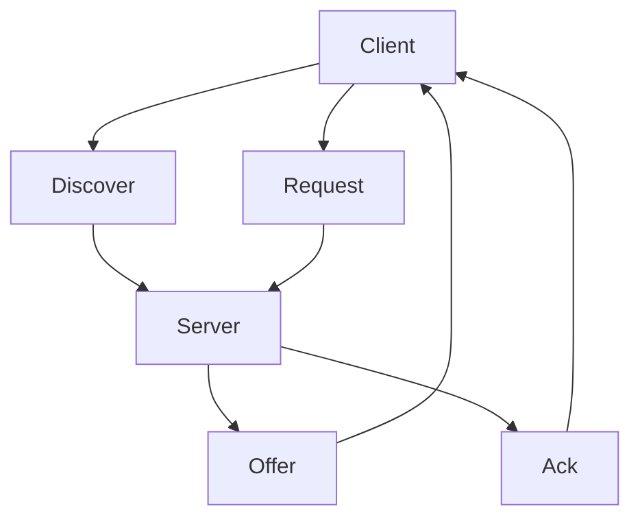
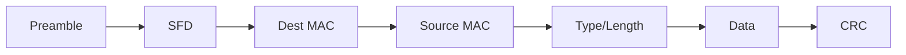

# شبكات حاسوبية · Computer Networks (Year 3 - Semester 2)

---

## 🌐 نموذج OSI · OSI Model

### الطبقات السبع · Seven Layers



### تفصيل الطبقات · Layer Details

| الطبقة | Layer | Protocol | الوظيفة |
|--------|-------|----------|---------|
| **7** | Application | HTTP, DNS, FTP | واجهة المستخدم |
| **6** | Presentation | JPEG, TLS | تنسيق البيانات |
| **5** | Session | RPC, NetBIOS | إدارة الجلسة |
| **4** | Transport | TCP, UDP | نقل موثوق |
| **3** | Network | IP, ICMP | التوجيه |
| **2** | Data Link | Ethernet, PPP | نقل الإطار |
| **1** | Physical | RJ45, Fiber | البتات |

---

## 🔗 نموذج TCP/IP · TCP/IP Model

### مقارنة النماذج · Model Comparison



---

## 🌊 بروتوكولات الشبكات · Network Protocols

### 1. TCP (Transmission Control Protocol)

#### الخصائص · Properties

- **موجه نحو الاتصال:** Connection-oriented
- **موثوق:** Reliable
- **تدفق البيانات:** Stream-oriented
- **التحكم في الازدحام:** Congestion control

```python
import socket

def tcp_client():
    """مثال: عميل TCP"""
    client = socket.socket(socket.AF_INET, socket.SOCK_STREAM)
    client.connect(('server', 8080))
    client.send(b'Hello')
    response = client.recv(1024)
    client.close()
    return response

def tcp_server():
    """مثال: خادم TCP"""
    server = socket.socket(socket.AF_INET, socket.SOCK_STREAM)
    server.bind(('0.0.0.0', 8080))
    server.listen(5)
    
    while True:
        client, addr = server.accept()
        data = client.recv(1024)
        client.send(b'ACK')
        client.close()
```

### 2. UDP (User Datagram Protocol)

#### الخصائص

- **بدون اتصال:** Connectionless
- **غير موثوق:** Unreliable
- **رسائل:** Datagram-oriented
- **سريع:** Fast, low overhead

```python
def udp_client():
    """مثال: عميل UDP"""
    client = socket.socket(socket.AF_INET, socket.SOCK_DGRAM)
    client.sendto(b'Hello', ('server', 8080))
    response, addr = client.recvfrom(1024)
    client.close()

def udp_server():
    """مثال: خادم UDP"""
    server = socket.socket(socket.AF_INET, socket.SOCK_DGRAM)
    server.bind(('0.0.0.0', 8080))
    
    while True:
        data, addr = server.recvfrom(1024)
        server.sendto(b'ACK', addr)
```

### 3. HTTP (HyperText Transfer Protocol)

```python
from http.client import HTTPConnection

def http_get():
    """مثال: طلب HTTP GET"""
    conn = HTTPConnection('example.com')
    conn.request('GET', '/')
    response = conn.getresponse()
    print(response.status, response.read())
    conn.close()
```

### مقارنة TCP vs UDP

| الميزة | TCP | UDP |
|--------|-----|-----|
| **الموثوقية** | موثوق | غير موثوق |
| **السرعة** | أبطأ | أسرع |
| **التjaman** | عالي | منخفض |
| **الاتصال** | يتطلب | لا يتطلب |
| **الحالة** | Stateful | Stateless |

---

## 🛣️ التوجيه · Routing

### 1. خوارزميات التوجيه · Routing Algorithms

#### Distance Vector

```python
class DistanceVector:
    def __init__(self, nodes):
        self.distances = {node: {n: float('inf') for n in nodes} for node in nodes}
        for node in nodes:
            self.distances[node][node] = 0
    
    def update(self, node, neighbor, cost):
        """تحديث جدول التوجيه"""
        if self.distances[node][neighbor] + cost < self.distances[node]['dest']:
            # Bellman-Ford update
            pass
```

#### Link State (Dijkstra)

```python
import heapq

def dijkstra(graph, start):
    """خوارزمية Dijkstra"""
    distances = {node: float('inf') for node in graph}
    distances[start] = 0
    pq = [(0, start)]
    
    while pq:
        dist, node = heapq.heappop(pq)
        
        if dist > distances[node]:
            continue
        
        for neighbor, cost in graph[node]:
            if distances[node] + cost < distances[neighbor]:
                distances[neighbor] = distances[node] + cost
                heapq.heappush(pq, (distances[neighbor], neighbor))
    
    return distances
```

### 2. بروتوكولات التوجيه · Routing Protocols

| البروتوكول | Type | Algorithm | الاستخدام |
|------------|------|-----------|-----------|
| **RIP** | IGP | Distance Vector | شبكات صغيرة |
| **OSPF** | IGP | Link State | شبكات متوسطة |
| **BGP** | EGP | Path Vector | الإنترنت |

### 3. جدول التوجيه · Routing Table

| Destination | Next Hop | Interface | Metric |
|-------------|----------|-----------|--------|
| 192.168.1.0/24 | Direct | eth0 | 0 |
| 10.0.0.0/8 | 192.168.1.1 | eth1 | 1 |
| 0.0.0.0/0 | 192.168.1.254 | eth1 | Default |

---

## 🔌 بروتوكولات الشبكات · Network Protocols

### 1. IP (Internet Protocol)



#### عنونة IP · IP Addressing

| الفئة | Range | CIDR | الاستخدام |
|-------|-------|------|-----------|
| **A** | 1-126 | /8 | شبكات كبيرة |
| **B** | 128-191 | /16 | شبكات متوسطة |
| **C** | 192-223 | /24 | شبكات صغيرة |
| **D** | 224-239 | - | Multicast |
| **E** | 240-255 | - | Experimental |

```python
def ip_class(ip):
    """تحديد فئة IP"""
    first = int(ip.split('.')[0])
    
    if 1 <= first <= 126:
        return 'A'
    elif 128 <= first <= 191:
        return 'B'
    elif 192 <= first <= 223:
        return 'C'
    elif 224 <= first <= 239:
        return 'D'
    else:
        return 'E'
```

#### CIDR (Classless Inter-Domain Routing)

```python
def cidr_to_subnet(cidr):
    """CIDR إلى subnet mask"""
    mask = (0xFFFFFFFF << (32 - cidr)) & 0xFFFFFFFF
    return '.'.join(str((mask >> i) & 0xFF) for i in [24, 16, 8, 0])

# مثال: /24 → 255.255.255.0
```

### 2. ARP (Address Resolution Protocol)

```python
def arp_request(ip):
    """طلب ARP"""
    # Broadcast: من ي IPs هذا؟
    # Reply: أنا عند عنوان MAC كذا
    pass

def arp_cache():
    """ARP Cache"""
    # IP → MAC mapping
    cache = {
        '192.168.1.1': '00:11:22:33:44:55'
    }
    return cache
```

### 3. DNS (Domain Name System)

```python
import socket

def dns_lookup(domain):
    """DNS lookup"""
    return socket.gethostbyname(domain)

def reverse_dns(ip):
    """DNS عكسي"""
    return socket.gethostbyaddr(ip)
```

### 4. DHCP (Dynamic Host Configuration Protocol)



---

## 🏢 الشبكات المحلية · LAN (Local Area Network)

### 1. Ethernet



#### هيكل إطار Ethernet

| الحقل | Size | الوصف |
|-------|------|-------|
| **Preamble** | 7 bytes | تزامن |
| **SFD** | 1 byte | Start Frame Delimiter |
| **Destination** | 6 bytes | عنوان المستقبل |
| **Source** | 6 bytes | عنوان المرسل |
| **Type** | 2 bytes | نوع البروتوكول |
| **Data** | 46-1500 bytes | البيانات |
| **CRC** | 4 bytes | فحص الخطأ |

### 2. VLAN (Virtual LAN)

```python
# مثال: VLAN Configuration
vlan_config = {
    'vlan_id': 100,
    'name': 'Engineering',
    'subnet': '192.168.100.0/24',
    'ports': [1, 2, 3, 4]
}
```

### 3..switching

#### Store and Forward

```python
def store_and_forward(frame, switch_table):
    """تبديل Store and Forward"""
    # انتظر حتى الإطار كامل
    # افحص CRC
    # وجه للإطار
    pass
```

#### Cut-through

```python
def cut_through(frame, switch_table):
    """تبديل Cut-through"""
    # وجه بمجرد قراءة العنوان
    pass
```

---

## 🌍 الشبكات الواسعة · WAN (Wide Area Network)

### 1. تقنيات WAN

| التقنية | السرعة | المسافة | الاستخدام |
|---------|--------|---------|-----------|
| **DSL** | 1-100 Mbps | Local loop | منزلي |
| **Cable** | 10-100 Mbps | Regional | منزلي |
| **T1** | 1.54 Mbps | Wide | أعمال |
| **Fiber** | 1-100 Gbps | Global |运营商 |
| **Satellite** | 1-25 Mbps | Global | نائي |

### 2. NAT (Network Address Translation)

```python
def nat_forward(packet, nat_table):
    """توجيه NAT"""
    # Source: 192.168.1.100:8080 → Public: 203.0.113.1:8000
    # جدول الترجمة
    pass
```

### 3. Firewall

```python
def firewall_check(packet, rules):
    """فحص جدار الحماية"""
    for rule in rules:
        if matches(packet, rule):
            return rule.action  # ALLOW or DENY
    return DENY
```

---

## 📊 جدول مرجعي شامل · Master Reference Table

### منافذ الشبكات · Well-Known Ports

| المنفذ | Protocol | الخدمة |
|--------|----------|--------|
| **20** | TCP | FTP Data |
| **21** | TCP | FTP Control |
| **22** | TCP | SSH |
| **23** | TCP | Telnet |
| **25** | TCP | SMTP |
| **53** | TCP/UDP | DNS |
| **80** | TCP | HTTP |
| **110** | TCP | POP3 |
| **443** | TCP | HTTPS |

### TCP Flags

| العلم | Name | الوظيفة |
|------|------|---------|
| **SYN** | Synchronize | بداية الاتصال |
| **ACK** | Acknowledgment | تأكيد |
| **FIN** | Finish | نهاية الاتصال |
| **RST** | Reset | إعادة تعيين |
| **PSH** | Push | إرسال فوري |
| **URG** | Urgent | عاجل |

### نموذج OSI ↔ TCP/IP

| OSI | TCP/IP | PDU |
|-----|--------|-----|
| Application | Application | Data |
| Presentation | Application | Data |
| Session | Application | Data |
| Transport | Transport | Segment |
| Network | Internet | Packet |
| Data Link | Link | Frame |
| Physical | Link | Bits |

---

## ⚠️ أخطاء شائعة وملاحظات · Common Pitfalls & Notes

### ❌ أخطاء شائعة

1. **الخلط بين IP و MAC:**
   - IP: عنوان منطقي (Layer 3)
   - MAC: عنوان فيزيائي (Layer 2)

2. **الخلط بين TCP و UDP:**
   - TCP: موثوق، بطيء
   - UDP: غير موثوق، سريع

3. **Subnet mask خاطئ:**
   - /24 = 255.255.255.0
   - /16 = 255.255.0.0
   - /8 = 255.0.0.0

4. **Broadcast vs Unicast:**
   - Broadcast: الجميع يستلم
   - Unicast: مستقبل واحد

5. **DHCPLease time:**
   -Lease time 影响 IP 地址的重用周期

### ❌ مفاهيم خاطئة شائعة

- **"IP ثابت = أكثر أماناً":** ليس بالضرورة
- **"UDP أفضل لأنه أسرع":** ليس دائماً، يعتمد على التطبيق
- **"المسافة الطويلة = WAN":** WAN هو النطاق الجغرافي

### 💡 نصائح مهمة

- **لاختيار_protocol:**
  - Transfer file → TCP
  - Video streaming → UDP
  - Web browsing → TCP/HTTP

- **للأمان:**
  - Firewall
  - NAT
  - VPN
  - Encryption

---

## 📝 أمثلة محلولة · Worked Examples

### مثال 1: TCP 3-Way Handshake

```
Client → Server: SYN (seq=100)
Server → Client: SYN, ACK (seq=300, ack=101)
Client → Server: ACK (seq=101, ack=301)
```

### م.example 2: Subnetting

**الشبكة:** 192.168.1.0/24

**الطلب:** 4 subnetworks

**الحل:**
- /26: 192.168.1.0/26
- /26: 192.168.1.64/26
- /26: 192.168.1.128/26
- /26: 192.168.1.192/26

### مثال 3: Routing Table

**المعطيات:**
- Dest: 10.0.0.0/8
- Next: 192.168.1.1
- Metric: 1

**الحل:**
- أي عنوان يبدأ بـ 10.x.x.x يذهب لـ 192.168.1.1

---

(End of file)
