# شبكات عصبونية ومنطق الترجيح · Neural Networks & Fuzzy Logic (Year 4 - Semester 2)

## 🧠 الشبكات العصبونية · Neural Networks

### مفهوم الشبكة العصبونية · Neural Network Concept

- **الشبكة العصبونية** (Neural Network): نظام حوسبة مستوحى من الدماغ البشري، يتكون من عقد (neurons) متصلة.
- **العصبون** (Neuron): الوحدة الأساسية للشبكة التي تستقبل مدخلات وتنتج مخرج.

### بنية الشبكة · Network Architecture

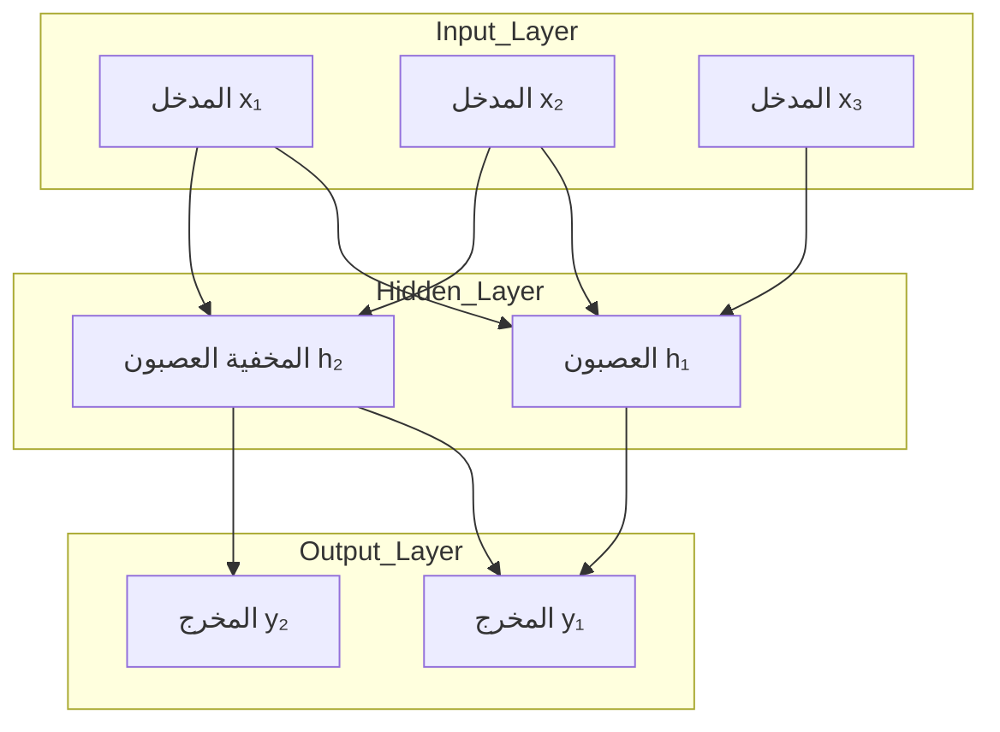

### أنواع الطبقات · Layer Types

| الطبقة | الوصف | الوظيفة |
|--------|-------|---------|
| **طبقة الإدخال** | تستقبل البيانات الأولية | إدخالFeatures |
| **الطبقات المخفية** | معالجة البيانات | استخراج الأنماط |
| **طبقة الإخراج** | إنتاج النتيجة | التصنيف/التنبؤ |

---

## 🔢 نموذج العصبون · Neuron Model

### الصيغة الرياضية · Mathematical Model

$$y = f(\sum_{i=1}^{n} w_i x_i + b)$$

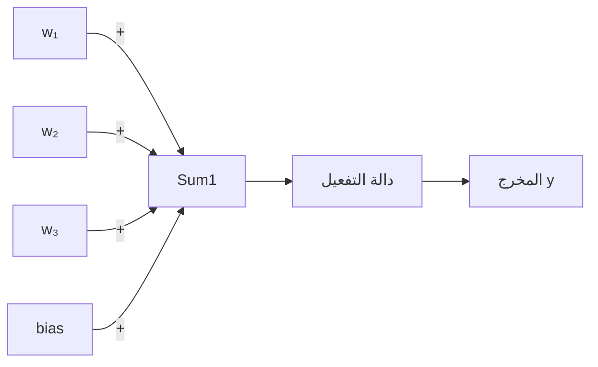

### دوال التفعيل · Activation Functions

| الدالة | الصيغة | المخطط |
|--------|--------|--------|
| **Sigmoid** | $\sigma(x) = \frac{1}{1 + e^{-x}}$ | S-curve |
| **Tanh** | $\tanh(x) = \frac{e^x - e^{-x}}{e^x + e^{-x}}$ | -1 to 1 |
| **ReLU** | $f(x) = \max(0, x)$ | خطي |
| **Softmax** | $\sigma(x)_i = \frac{e^{x_i}}{\sum e^{x_j}}$ | متعددة المخرجات |

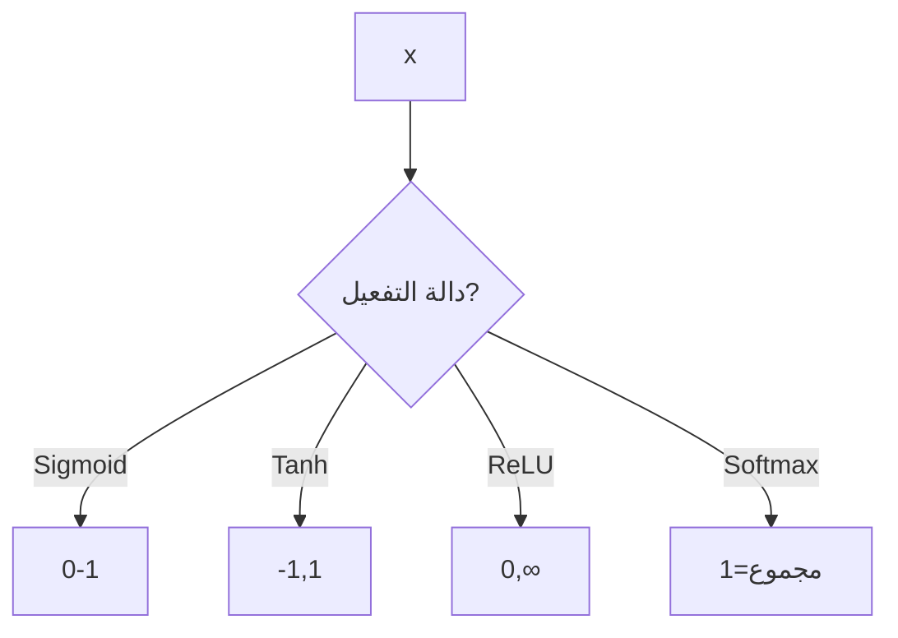

---

## 🔄 الانتشار العكسي · Backpropagation

### المفهوم · Concept

الانتشار العكسي هي طريقة لتدريب الشبكات العصبونية عبر حساب التدرجات وتحديث الأوزان.

### الخوارزمية · Algorithm

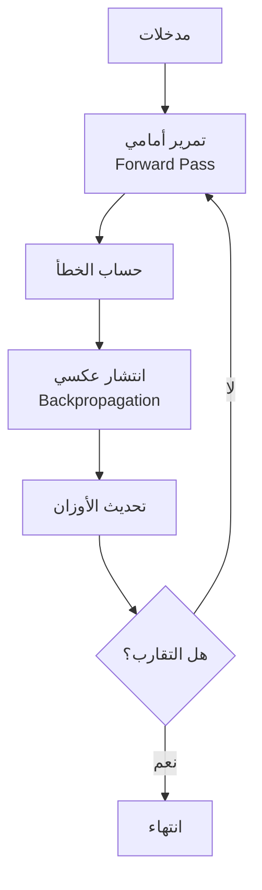

### الصيغ الرياضية · Mathematical Formulas

#### تحديث الوزن

$$w_{new} = w_{old} - \alpha \cdot \frac{\partial E}{\partial w}$$

حيث:
- $\alpha$: معدل التعلم (Learning Rate)
- $E$: الخطأ (Error)

#### قاعدة السلسلة

$$\frac{\partial E}{\partial w_{ij}} = \frac{\partial E}{\partial y_j} \cdot \frac{\partial y_j}{\partial net_j} \cdot \frac{\partial net_j}{\partial w_{ij}}$$

#### خطأ الشبكة

$$E = \frac{1}{2} \sum_{k}(y_k - \hat{y}_k)^2$$

---

## 🧮 أنواع الشبكات · Network Types

### 1. الشبكة ذات التغذية الأمامية (FFNN)

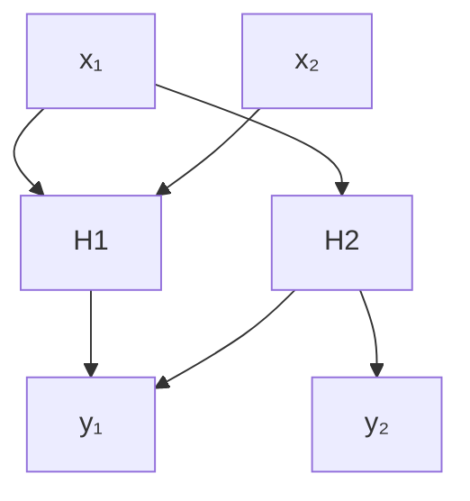

- **التدفق**: اتجاه واحد فقط
- **الاستخدام**: التصنيف، التنبؤ

### 2. الشبكة المتكررة (RNN)

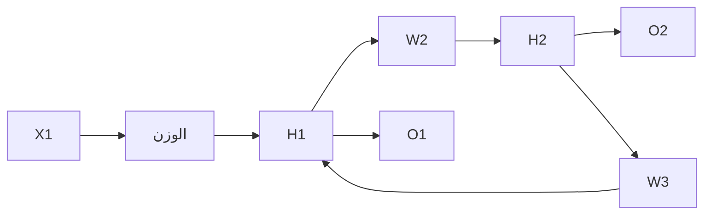

- **التدفق**: دوري (ذاكرة)
- **الاستخدام**: تسلسل البيانات

### 3. الشبكة الالتفافية (CNN)

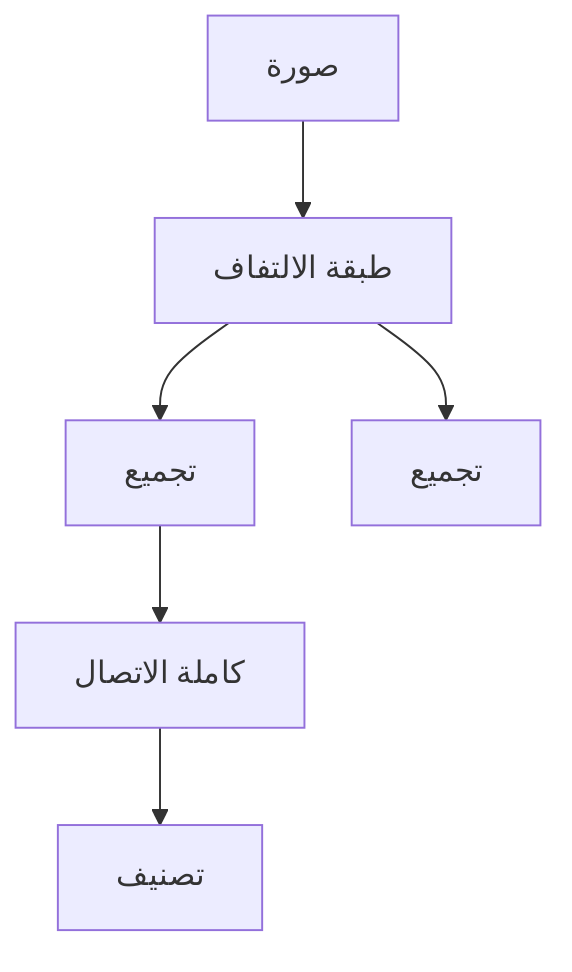

- **الاستخدام**: معالجة الصور

---

## 🎯 تدريب الشبكة · Network Training

### مراحل التدريب · Training Phases

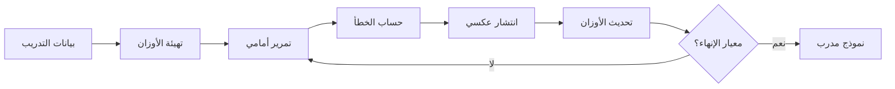

### معايير الإنهاء · Termination Criteria

| المعيار | الوصف |
|---------|-------|
| **خطأ كافٍ** | الخطأ أقل من حد معين |
| **دورات كافية** | عدد دورات محدد |
| **التحقق** | خطأ التحقق لا يتحسن |
| **زمن محدود** | وقت أقصى |

### مشاكل التدريب · Training Issues

| المشكلة | الوصف | الحل |
|---------|-------|-----|
| **Overfitting** | حفظ البيانات بدلاً من التعلم | تنظيم، تجميع |
| **Underfitting** | عدم التعلم الكافي | تعقيد أكثر |
| **Vanishing Gradient** | تدرجات صغيرة جداً | ReLU، تهيئة |
| **Exploding Gradient** | تدرجات كبيرة جداً | تقليم التدرجات |

---

## 🌫️ أنظمة منطق الترجيح · Fuzzy Logic Systems

### مفهوم المنطق الضبابي · Fuzzy Logic Concept

- **المنطق الضبابي** (Fuzzy Logic): نظام يفكر_like humans، يستخدم قيم مستمرة بدلاً من ثنائية.
- **المجموعة الضبابية** (Fuzzy Set): مجموعة حيث الانتماء ليس ثنائياً (0 أو 1) بل متدرج.

### الفرق بين الكلاسيكي والضبابي

| الكلاسيكي | الضبابي |
|-----------|---------|
| membership ∈ {0, 1} | membership ∈ [0, 1] |
| حدود حادة | حدود غامضة |
| منطق ثنائي | منطق متعدد القيم |

### دوال الانتماء · Membership Functions

$$μ_A(x): X \rightarrow [0, 1]$$

| النوع | الصيغة | الشكل |
|-------|--------|-------|
| **مثلثية** | $\text{triangle}(x; a, b, c)$ | مثلث |
| **شبه منحرف** | $\text{trapezoid}(x; a, b, c, d)$ | شبه منحرف |
| ** Gaussian** | $e^{-\frac{(x-c)^2}{2\sigma^2}}$ | جرس |
| ** sigmoidal** | $\frac{1}{1 + e^{-a(x-c)}}$ | S-curve |

---

## 🔧 أنظمة Mamdani · Mamdani Systems

### البنية · Architecture

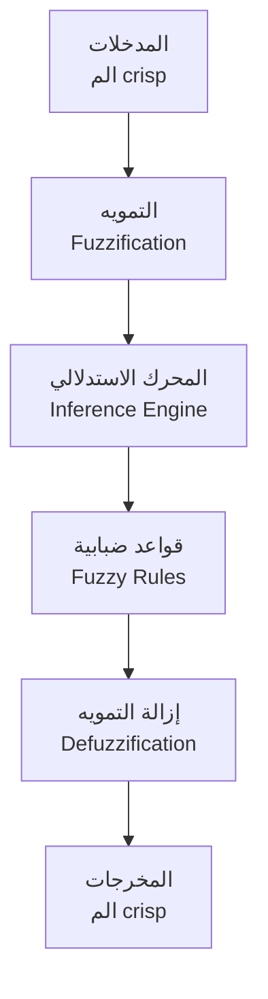

### خطوات النظام · System Steps

#### 1. التمويه (Fuzzification)

تحويل المدخلات crisp إلى مجموعات ضبابية.

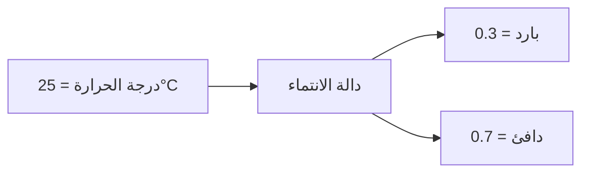

#### 2. المحرك الاستدلالي (Inference)

تطبيق القواعد الضبابية.

| القاعدة | المدخل | المخرج |
|---------|--------|--------|
| 1 | if temp is cold then heat is high | - |
| 2 | if temp is warm then heat is medium | - |
| 3 | if temp is hot then heat is low | - |

#### 3. دمج المخرجات (Aggregation)

دمج جميع المخرجات الضبابية.

$$μ_{combined}(y) = \max(μ_1(y), μ_2(y), ...)$$

#### 4. إزالة التمويه (Defuzzification)

تحويل المخرجات الضبابية إلى crisp.

##### طريقة مركز الثقل (Centroid)

$$y^* = \frac{\int μ(y) \cdot y \, dy}{\int μ(y) \, dy}$$

##### طريقة القيمة القصوى (Max)

$$y^* = \arg\max(μ(y))$$

---

## 📊 أنظمة Sugeno · Sugeno Systems

### الفرق بين Mamdani و Sugeno

| المميز | Mamdani | Sugeno |
|--------|---------|--------|
| المخرج | مجموعة ضبابية | دالة خطية/ثابتة |
| التعقيد | عالي | منخفض |
| الحساب | بطيء | سريع |
| الدقة | عالية | متوسطة |

### نموذج Sugeno

$$IF \ x \ is \ A \ THEN \ y = f(x)$$

حيث $f(x)$ يمكن أن تكون:
- **ثابتة**: $y = k$
- **خطية**: $y = a_0 + a_1 x_1 + a_2 x_2$

### مثال · Example

```
IF speed is low THEN brake_force = 0
IF speed is medium THEN brake_force = 2 * speed - 10
IF speed is high THEN brake_force = 5 * speed - 40
```

---

## 🛠️ تصميم النظام الضبابي · Fuzzy System Design

### خطوات التصميم · Design Steps

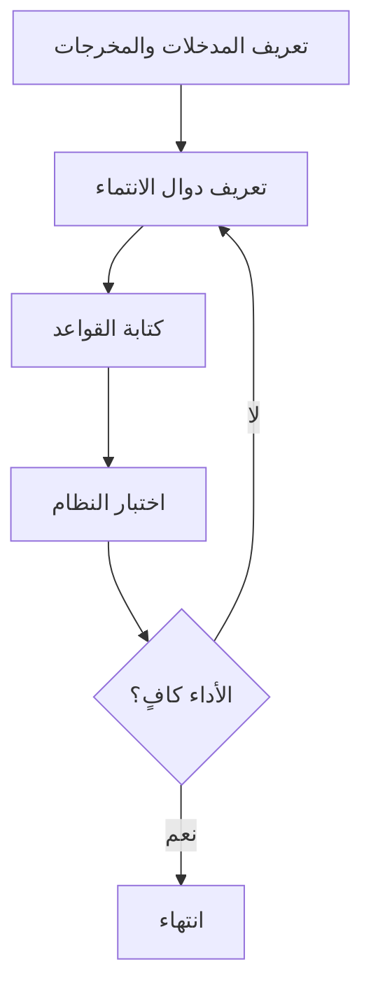

### معايير اختيار دوال الانتماء

| المعيار |要考虑 |
|---------|-------|
| **التداخل** | تداخل كافٍ بين المجموعات |
| **العدد** | 2-7 مجموعات لكل متغير |
| **التناظر** | توزيع متناظر إن أمكن |
| **التغطية** | تغطية كاملة للمجال |

---

## 📈 جدول مرجعي شامل · Master Reference Table

### مقارنة الأنواع · Comparison Table

| المميز | FFNN | RNN | CNN |
|--------|------|-----|-----|
| **الاتجاه** | أمامي | دوري | أمامي |
| **الذاكرة** | لا | نعم | جزئية |
| **التطبيق** | التصنيف | التسلسل | الصور |
| **التعقيد** | منخفض | متوسط | عالي |

### دوال التفعيل · Activation Functions Summary

| الدالة | النطاق | الاشتقاق | الاستخدام |
|--------|--------|----------|----------|
| Sigmoid | (0,1) | σ(x)(1-σ(x)) | مخرجات |
| Tanh | (-1,1) | 1-tanh² | مخفية |
| ReLU | [0,∞) | 1 if x>0 else 0 | عميقة |
| Softmax | (0,1) | δij - yjyi | تصنيف |

### معايير الأداء · Performance Metrics

| المقياس | الصيغة |
|---------|--------|
| **الدقة** | Accuracy = TP + TN / Total |
| **الاستدعاء** | Recall = TP / (TP + FN) |
| **الprecision** | Precision = TP / (TP + FP) |
| **F1-score** | 2 × Precision × Recall / (P + R) |

---

## ⚠️ أخطاء شائعة وملاحظات · Common Pitfalls & Notes

### ❌ أخطاء شائعة في الشبكات العصبونية

1. **تطبيع البيانات**:
   - ❌ عدم تطبيع المدخلات → بطء التقارب
   - ✅ تطبيع إلى [0,1] أو [-1,1]

2. **معدل التعلم**:
   - ❌ كبير جداً → تذبذب
   - ❌ صغير جداً → بطء جداً

3. **عدد الطبقات**:
   - ❌ طبقات كثيرة → overfitting
   - ❌ طبقات قليلة → underfitting

4. **بيانات التدريب**:
   - ❌ بيانات غير متوازنة → تحيز
   - ❌ بيانات قليلة → overfitting

### ❌ أخطاء شائعة في المنطق الضبابي

1. **دوال الانتماء**:
   - ❌ تداخل قليل → عدم استمرارية
   - ❌ تداخل كثير → غموض زائد

2. **عدد القواعد**:
   - ❌ قواعد كثيرة → تعقيد
   - ❌ قواعد قليلة → دقة منخفضة

3. **إزالة التمويه**:
   - ❌ اختيار طريقة خاطئة للتطبيق

### 💡 نصائح مهمة

- **Batch Gradient Descent**: تحديث بعد كل دورة
- **Mini-batch**: تحديث بعد كل مجموعة (أفضل الممارسة)
- **Adam**: معدل تعلم متكيف
- **Cross-validation**: تجنب overfitting

### 📌 ملاحظات نهائية

- **Kolmogorov Theorem**: أي دالة مستمرة يمكن تمثيلها بشبكة طبقة واحدة مع عدد كافٍ من العقد
- **Universal Approximation**: الشبكات العميقة أفضل للتعلم الهرمي
- **Fuzzy + Neural**: يمكن الجمع بينهما (neuro-fuzzy)

---

## 📝 أمثلة محلولة · Worked Examples

### مثال 1: حساب مخرج العصبون

**المعطيات:**
- المدخلات: x₁ = 1, x₂ = 0.5, x₃ = -1
- الأوزان: w₁ = 0.2, w₂ = -0.5, w₃ = 0.8
- bias = 0.1
- دالة التفعيل: Sigmoid

**الحل:**

$$net = \sum w_i x_i + b = (1)(0.2) + (0.5)(-0.5) + (-1)(0.8) + 0.1 = 0.2 - 0.25 - 0.8 + 0.1 = -0.75$$

$$y = \sigma(-0.75) = \frac{1}{1 + e^{0.75}} = \frac{1}{1 + 2.117} = 0.321$$

### مثال 2: نظام Mamdani بسيط

**المدخل:** درجة الحرارة = 28°C

**دوال الانتماء:**
- بارد: مثلثي [10, 20, 30]
- دافئ: مثلثي [20, 30, 40]
- ساخن: مثلثي [30, 40, 50]

**القواعد:**
1. if temp is cold then heating is high
2. if temp is warm then heating is medium
3. if temp is hot then heating is low

**الحل:**
- μ_cold(28) = 0 (خارج النطاق)
- μ_warm(28) = (30-28)/(30-20) = 0.2
- μ_hot(28) = (28-30)/(40-30) = -0.2 → 0

المخرج الضبابي: heating = medium بنسبة 0.2

---

(End of file)