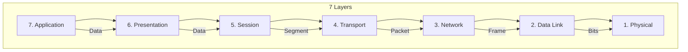
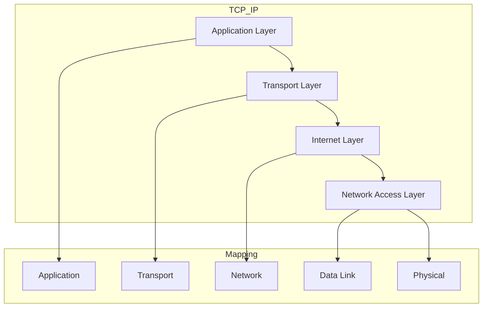
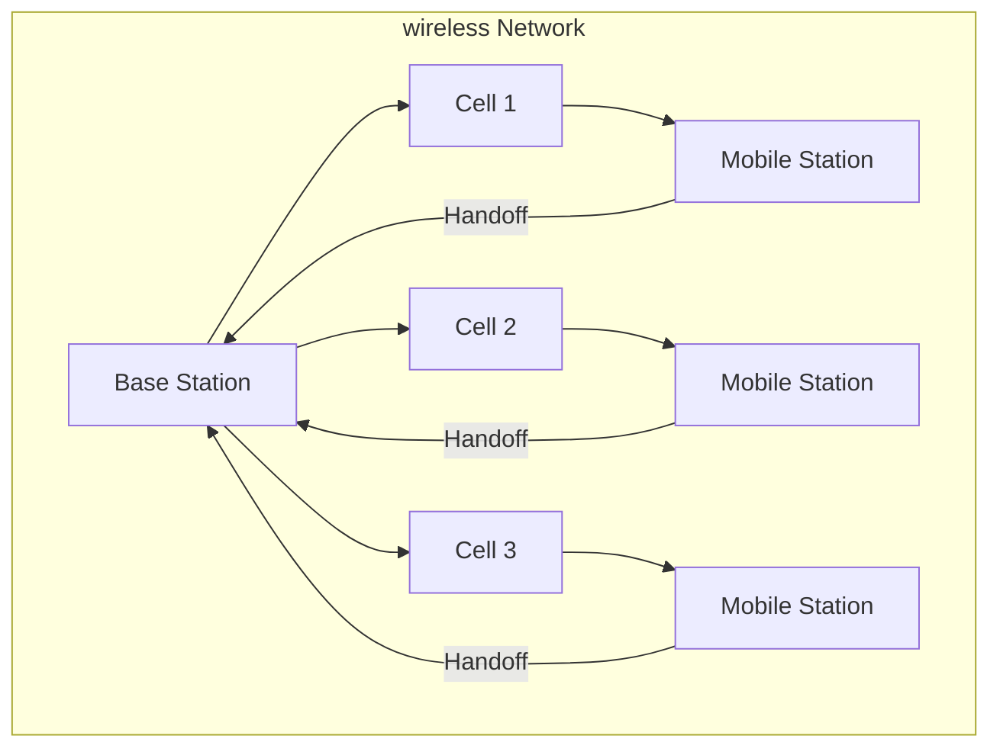
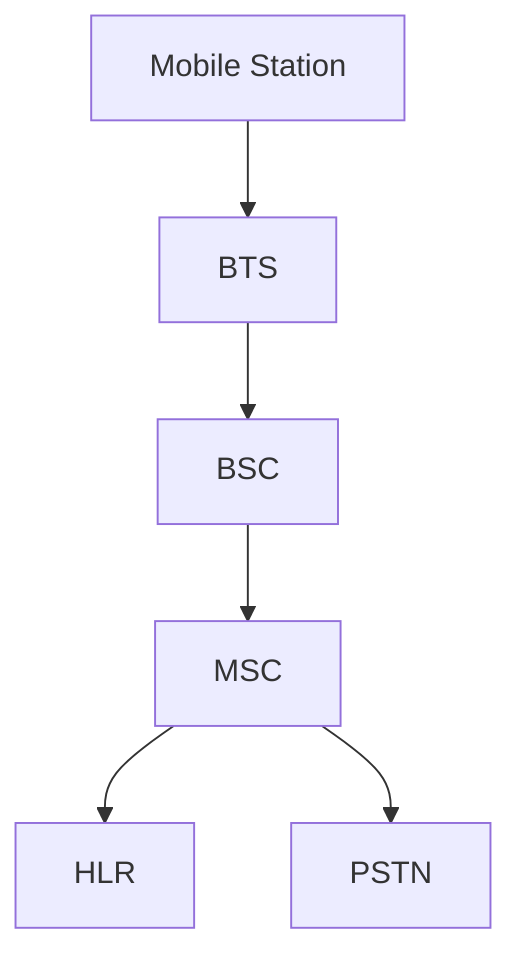

# شبكات متقدمة · Advanced Networks

## 📐 التعاريف الأساسية · Core Definitions

- **الشبكة اللاسلكية** (Wireless Network): شبكة بدون أسلاك.
- **الشبكة النقالة** (Mobile Network): شبكة للأجهزة المتحركة.
- **أمن الشبكة** (Network Security): حماية البيانات والشبكة.
- **جودة الخدمة** (QoS): ضمان مستوى الخدمة.
- **الشبكة المعرفة برمجياً** (SDN): التحكم المركزي بالشبكة.
- **الشبكة الافتراضية الخاصة** (VPN): اتصال آمن عبر الإنترنت.

---

## 🔁 نموذج الشبكة · Network Model

### نموذج OSI · OSI Model

###TCP/IP Model

---

## 🧮 النظريات والصيغ · Theorems & Formulas

### 1. معادلات الحركة · Queueing Theory

#### M/M/1 Queue

$$\rho = \frac{\lambda}{\mu}$$

where:
- $\lambda$: arrival rate
- $\mu$: service rate

#### Average Waiting Time

$$W_q = frac{\rho}{\mu(1 - \rho)}$$

#### Average Queue Length

$$L_q = frac{\rho^2}{1 - \rho}$$

### 2. زمن الاستجابة · Response Time

#### Latency

$$T_{latency} = T_{propagation} + T_{transmission} + T_{processing}$$

#### Throughput

$$Throughput = frac{\text{Bits}}{\text{Time}}$$

#### Bandwidth-Delay Product

$$BDP = text{Bandwidth} times RTT$$

### 3.的安全 · Security Formulas

#### Shannon's Entropy

$$H(X) = -sum p(x) log_2 p(x)$$

#### AES Encryption

$$C = E_K(P) = SubBytes(ShiftRows(MixColumns(AddRoundKey(P, K_0))))$$

#### RSA Key Generation

$$n = p times q$$
$$phi(n) = (p-1)(q-1)$$
$$e$$ such that $gcd(e, phi(n)) = 1$$
$$d = e^{-1} mod phi(n)$$

---

## 📊 جدول مرجعي · Reference Tables

### جدول معايير Wi-Fi · Wi-Fi Standards

| المعيار | التردد | السرعة | النطاق |
| ---------- | ----- | ------ | -------- |
| **802.11b** | 2.4 GHz | 11 Mbps | 140 m |
| **802.11g** | 2.4 GHz | 54 Mbps | 140 m |
| **802.11a** | 5 GHz | 54 Mbps | 35 m |
| **802.11n** | 2.4/5 GHz | 600 Mbps | 70 m |
| **802.11ac** | 5 GHz | 3.4 Gbps | 35 m |
| **802.11ax** | 2.4/5 GHz | 9.6 Gbps | 35 m |

### جدولprotocols الأمان · Security Protocols

| البروتوكول | الوصف | Layer | الميزة |
| ---------- | ----- | ----- | ----- |
| **WEP** | Wired Equivalent Privacy | Data Link | ضعيف |
| **WPA** | Wi-Fi Protected Access | Data Link | أفضل |
| **WPA2** | WPA version 2 | Data Link | آمن |
| **WPA3** | WPA version 3 | Data Link | أحدث |
| **TLS** | Transport Layer Security | Transport | شامل |
| **IPSec** | IP Security | Network | tunnel |

### جدول تقنيات QoS · QoS Techniques

| التقنية | الوصف | التطبيق |
| ---------- | ----- | ----- |
| **Priority Queuing** | أولوية حسب الـ packet | voice/video |
| **Weighted Fair Queuing** | توزيع عادل | mixed traffic |
| **Traffic Shaping** | تحديد معدل output | limit burst |
| **Policing** | تحديد معدل input | drop or mark |
| **RED** | Random Early Detection | congestion avoidance |

---

## ⚙️ الشبكات اللاسلكية · Wireless Networks

### بنية Cell · Cell Structure

### بنية GSM · GSM Architecture

---

## 📝 أمثلة محلولة · Worked Examples

### مثال 1: حساب سعة قناة Wi-Fi

**المعطيات:**
- Bandwidth = 20 MHz
- Modulation = 64-QAM
- Coding rate = 5/6
- Spatial streams = 2

**الحل:**
$$text{Rate} = 20 times 6 times 5/6 times 2$$
$$= 20 times 5 times 2 = 200 text{ Mbps}$$

### مثال 2: RSA Encryption

**المعطيات:**
- p = 3, q = 11

**الحل:**
$$n = 3 times 11 = 33$$
$$phi(n) = (3-1)(11-1) = 2 times 10 = 20$$
$$e = 3 text{ (coprime to 20)}$$
$$d = 3^{-1} mod 20 = 7 text{ (since } 3 times 7 = 21 = 1 mod 20)$$

**Public Key**: (n=33, e=3)
**Private Key**: (n=33, d=7)

### مثال 3: latency TCP vs UDP

**المعطيات:**
- RTT = 100 ms
- File size = 1 MB
- MSS = 1460 bytes

**الحل:**
- **UDP**: $T = RTT = 100$ ms
- **TCP**: $T = RTT times (1 + log_2 N) = 100 times (1 + log_2 715)$
  $= 100 times (1 + 10) = 1100$ ms

---

## ⚠️ أخطاء شائعة وملاحظات · Common Pitfalls & Notes

### ❌ أخطاء شائعة

1. **الخلط بين 802.11 و 802.15:**
   - 802.11: Wi-Fi
   - 802.15: Bluetooth/ZigBee
   - 💡 **ملاحظة**: Different frequencies!

2. **الخلط بين WPA2 و WPA3:**
   - WPA2: PSK أو Enterprise
   - WPA3: SAE (بديل password)
   - WPA3 more secure but newer!

3. **نسيان الفرق بين TCP و UDP:**
   - TCP: reliable, ordered
   - UDP: fast, unreliable
   - Application determines need!

4. **عدم فهم SDN:**
   - Control plane: منفصل from data plane
   - OpenFlow: protocol
   - Centralized controller

### 💡 نصائح مهمة

- **تحسين الشبكات اللاسلكية:**
  - Channel selection: avoid interference
  - Power adjustment: reduce interference
  - Antenna diversity: better reception

- **QoS Implementation:**
  - Mark packets (DSCP)
  - Queue management
  - Scheduling algorithms

- **Security Best Practices:**
  - Use WPA3 or WPA2-Enterprise
  - Enable firewall
  -VPN for remote access

### 📌 ملاحظات نهائية

- **Mobile Networks:**
  - 1G: analog
  - 2G: digital, voice
  - 3G: data
  - 4G: IP-based
  - 5G: everything

- **SDN Architecture:**
  - Data plane: switches
  - Control plane: controller
  - Application plane: apps

- **Fireworks Detection:**
  - IDS: detection
  - IPS: prevention
  - SIEM: management