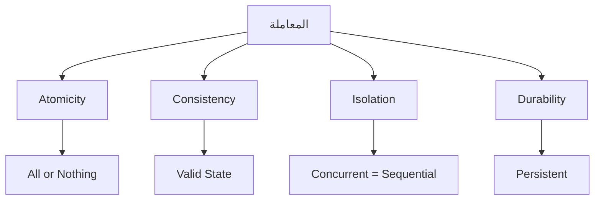
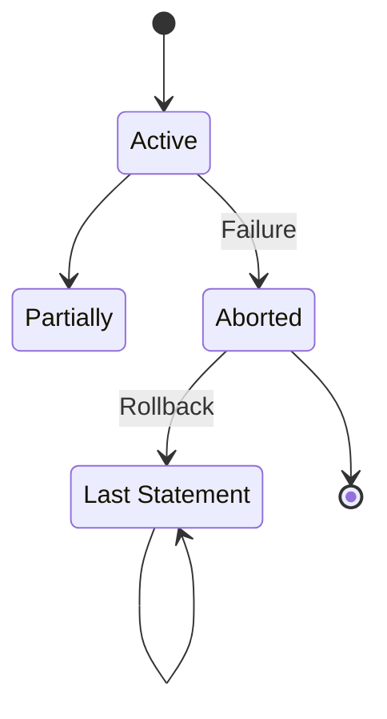
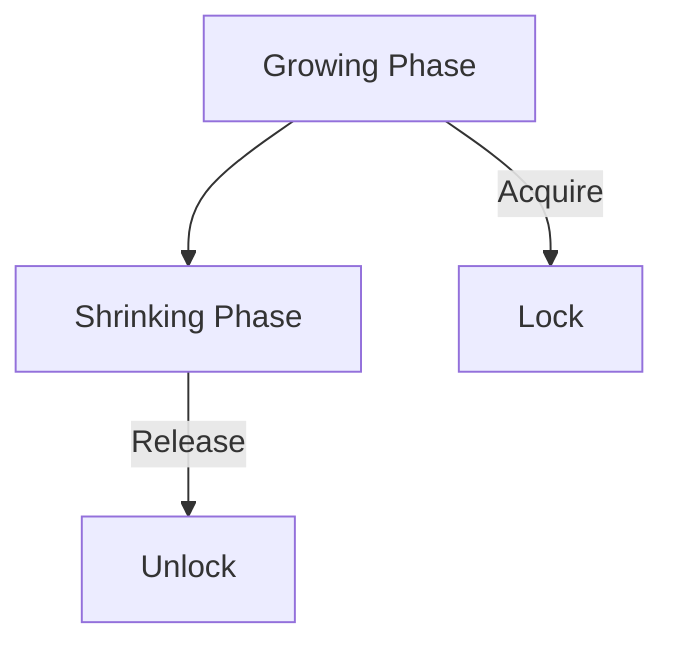
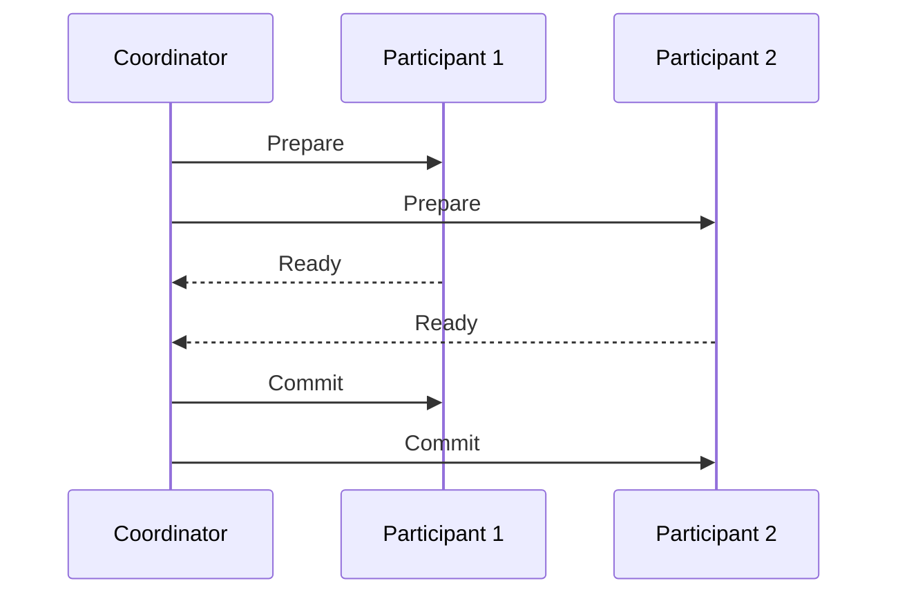

# قواعد المعطيات 2 · Databases II

## 📐 التعاريف الأساسية · Core Definitions

- **المعاملة** (Transaction): مجموعة من العمليات كوحدة واحدة.
- **التحكم في التزامن** (Concurrency Control): إدارة الوصول المتزامن للبيانات.
- **الاستعادة** (Recovery): استعادة قاعدة البيانات بعد الفشل.
- **القاعدة الموزعة** (Distributed Database): بيانات موزعة على مواقع متعددة.
- **تحسين الاستعلام** (Query Optimization): تحسين أداء الاستعلامات.
- **الفهرسة** (Indexing): هيكل بيانات لتسريع الوصول.

---

## 🔁 نموذج المعاملات · Transaction Model

### خصائص ACID · ACID Properties



### حالات المعاملة · Transaction States



---

## 🧮 النظريات والصيغ · Theorems & Formulas

### 1. التحكم في التزامن · Concurrency Control

#### الجدولة المتسلسلة · Serial Schedule

$$\text{Schedule } S = \text{ serial } \iff \text{ every operation } T_i \text{ before every } T_j$$

#### التعارض · Conflict

$$op_i \conflict op_j \iff:$$
1. نفس السجل
2. واحدة كتابة والأخرى قراءة/كتابة

$$C = C_{read-write} \cup C_{write-read} \cup C_{write-write}$$

#### قابلية التسلسل · Serializability

$$S \serially equivalent S' \iff:$$
$$\forall \text{ conflicting operations } o_i, o_j: o_i \text{ before } o_j \implies o_i' \text{ before } o_j'$$

#### نظرية التسلسل

$$S \serially \iff \text{ no cycles in precedence graph}$$

```mermaid
graph LR
    T1[T1: R(X)] --> T2[T2: W(X)]
    T2 --> T1
```

### 2. بروتوكولات القفل · Locking Protocols

#### قفل ثنائي · Two-Phase Locking (2PL)



#### القواعد:
1. لا قفل بعد liberate أي lock (growing → shrinking)
2. جميع Locks قبل commit

#### درجات القفل · Lock Granularity

| المستوى | الوصف | التكلفة |
| ---------- | ----- | ------ |
| **Database** | قاعدة كاملة | الأقل |
| **Table** | جدول | بسيطة |
| **Page** |صفحة | متوسطة |
| **Row** |صف | كبيرة |
| **Field** |حقل | الأكبر |

### 3. أنظمة الالتزام · Commit Protocols

#### 2PC · Two-Phase Commit



#### ف|s Stages:
1. **Prepare Phase**: coordinator يطلب votes
2. **Commit Phase**: if all ready → commit

### 4. الاستعادة · Recovery

#### سجلoperations · Log Records

$$\text{Log } L = \langle T_i, \text{action}, \text{before}, \text{after} \rangle$$

#### تقنيات الاستعادة:

| التقنية | الوصف | الاستخدام |
| ---------- | ----- | ---- |
| **Rollback** | التراجع عن المعاملة | فاشل |
| **Rollforward** | إعادة التنفيذ | crash بعد commit |
| **Checkpoint** | حفظ الحالة | تقصير زمن الاستعادة |

---

## 📊 جدول مرجعي · Reference Tables

### جدول مستويات العزل · Isolation Levels

| المستوى | Dirty Read | Non-Repeatable | Phantom |
| ---------- | ---------- | -------------- | -------- |
| **READ UNCOMMITTED** | ✓ | ✓ | ✓ |
| **READ COMMITTED** | ✗ | ✓ | ✓ |
| **REPEATABLE READ** | ✗ | ✗ | ✓ |
| **SERIALIZABLE** | ✗ | ✗ | ✗ |

### جدول الاختناقات · Deadlock Handling

| الاستراتيجية | الوصف | الميزة | العيب |
| ---------- | ----- | ------ | ----- |
| **Timeout** | انتهاء المدة | بسيط | قد يقتل سليماً |
| **Wait-Die** | انتظار الشباب | fair | starvation |
| **Wound-Wait** | قتل الشباب | no starvation | قد يقتل سليماً |
| **Detection** | كشف cycle | أفضل | overhead |

### جدول الفهرسة · Indexing Types

| النوع | O(log n) | الـم | العيوب |
| ---------- | ----- | ------ | ----- |
| **B+Tree** | نعم | $O(\log n)$ |写入 overhea |
| **Hash** | نعم | $O(1)$ | range queries |
| **Bitmap** | نعم | small cardinality | updates |
| **Clustered** | لا | physical order | واحد لكل table |

---

## 📝 أمثلة محلولة · Worked Examples

### مثال 1: التحقق من التعارض

**المعطيات:**
- T1: R(X), W(X)
- T2: R(X), R(Y)

**الحل:**
- T1.R(X) & T1.W(X): نفس العملية (لا تعارض)
- T1.W(X) & T2.R(X): ✓ تعارض write-read
- T1.R(X) & T2.R(Y): ✗ لا تعارض (سجلات مختلفة)
- Result: Cycle → not serializable ✗

### مثال 2: deadlock detection

**المعطيات:**
- T1 holds X, wants Y
- T2 holds Y, wants X

**الحل:**
```
Wait-for Graph:
T1 → T2 (T1 wants Y)
T2 → T1 (T2 wants X)
```

**Cycle exists!**
- Kill one transaction
- Rollback to last checkpoint

### مثال 3: Query Optimization

**المعطيات:**
```sql
SELECT * FROM Orders O, Customers C
WHERE O.cust_id = C.id AND C.city = 'Riyadh'
```

**الحل:**
1. **Original**: $n^2$ joins
2. **Optimized**:
   - Apply city filter first: $\sigma_{\text{city='Riyadh'}}(C)$
   - Join with index: $O \join C.id$
3. **Cost**: $O(n \log n)$ instead of $O(n^2)$

---

## ⚠️ أخطاء شائعة وملاحظات · Common Pitfalls & Notes

### ❌ أخطاء شائعة

1. **الخلط بين isolation levels:**
   - READ COMMITTED: لا dirty reads
   - REPEATABLE READ: لا unrepeatable reads
   - 💡 **ملاحظة**: Phantom rows ممكن!

2. **الخلط بين 2PL و Serializable:**
   - 2PL: بروتوكول قفل
   - Serializable: property
   - 2PL + strict → serializable but not always!

3. **نسيان write-ahead log:**
   - اكتب to log قبل data!
   - WAL: Write Ahead Log
   - otherwise → لا استعادة!

4. **عدم فهم degree of consistency:**
   - Strong consistency: always consistent
   - eventual consistency: eventually consistent
   - CAP: can't have all three!

### 💡 نصائح مهمة

- **قاعدة ACID:**
  - Atomicity: all or nothing
  - Consistency: valid state
  - Isolation: concurrent = serial
  - Durability: committed = persistent

- **Query Optimization:**
  -.selection أولاً: $\sigma$ قبل $\join$
  - استخدام الفهارس
  - avoiding nested loops

- **Distributed Transactions:**
  - 2PC: all-or-nothing
  - 3PC: non-blocking
  - Consensus: Raft, Paxos

### 📌 ملاحظات نهائية

- **Timestamp vs Locking:**
  - Timestamping: optimistic
  - Locking: pessimistic
  - اختيار based on contention

- **CAP Theorem:**
  - Consistency, Availability, Partition tolerance
  - choose 2 out of 3!
  - NoSQL: AP or CP

- **Sharding:**
  - Horizontal partition
  - based on key
  - cross-shard joins!