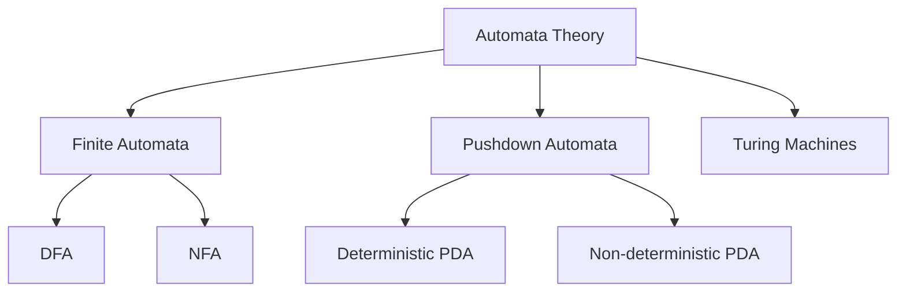
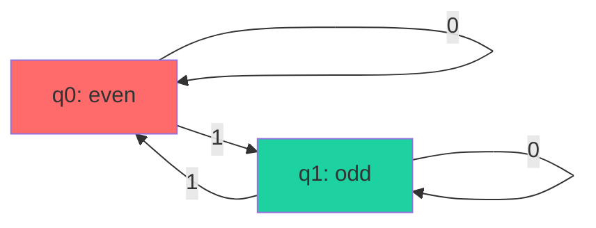
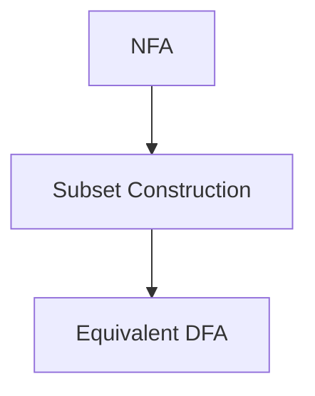
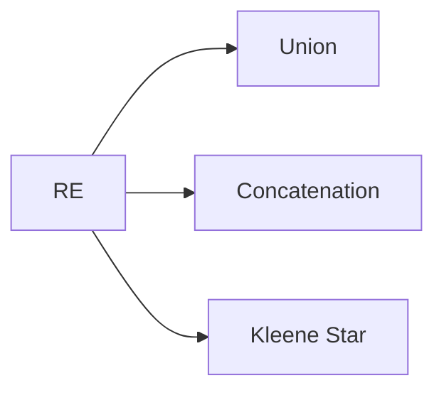
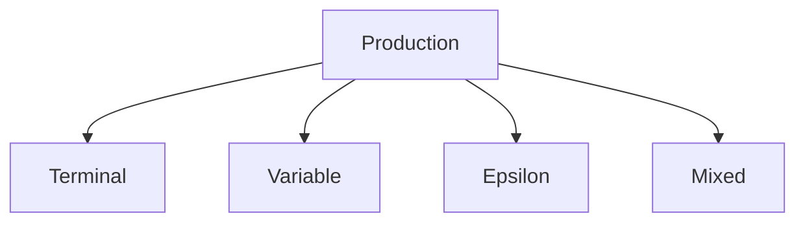
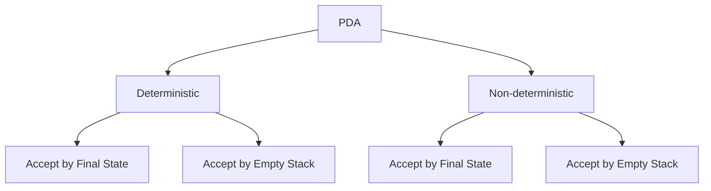
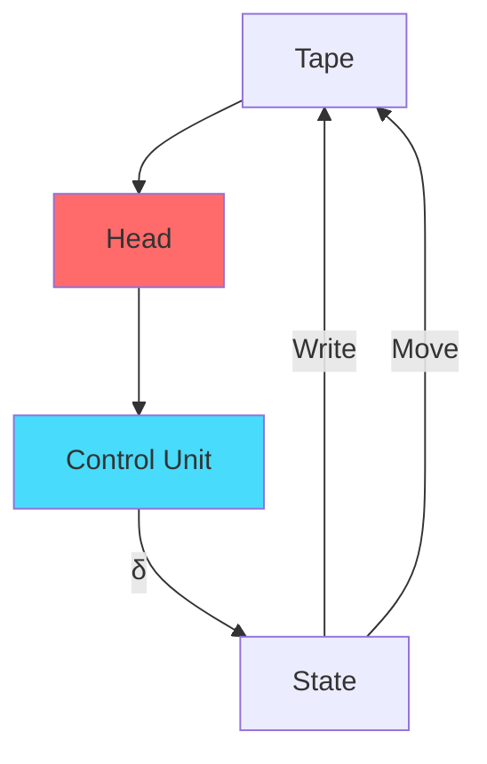
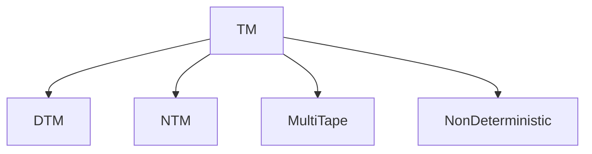
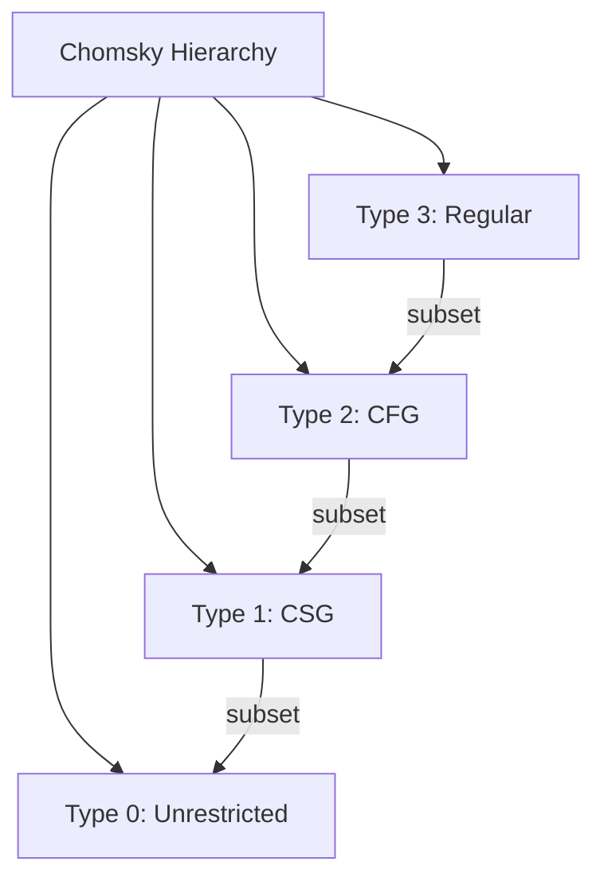

# لغات صورية · Formal Languages (Year 3 - Semester 2)

---

## 🤖 نظرية الأتمتة · Automata Theory

### مقدمة · Introduction



### التعريفات الأساسية · Basic Definitions

| المصطلح | Term | التعريف |
|---------|------|---------|
| **ألفابت** | Alphabet | مجموعة محدودة من الرموز $\Sigma$ |
| **كلمة** | Word | تسلسل محدود من الرموز |
| **لغة** | Language | مجموعة من الكلمات |
| **أوتوماتا** | Automata | آلة معالجة المعلومات |

---

## 🔄 نظ automata المحدودة · Finite Automata

### 1. DFA (Deterministic Finite Automaton)

#### التعريف الرسمي

$$M = (Q, \Sigma, \delta, q_0, F)$$

حيث:
- $Q$: مجموعة الحالات
- $\Sigma$: الألفابت
- $\delta$: دالة الانتقال $Q \times \Sigma \to Q$
- $q_0$: الحالة الابتدائية
- $F$: مجموعة الحالات المقبولة

```python
class DFA:
    def __init__(self, states, alphabet, transition, start, accept):
        self.states = states
        self.alphabet = alphabet
        self.transition = transition
        self.start = start
        self.accept = accept
    
    def accepts(self, input_string):
        current = self.start
        for symbol in input_string:
            current = self.transition.get((current, symbol))
            if current is None:
                return False
        return current in self.accept
```

#### مثال: التحقق من الأرقام الفردية



### 2. NFA (Non-deterministic Finite Automaton)

#### التعريف الرسمي

$$M = (Q, \Sigma, \delta, q_0, F)$$

حيث:
- $\delta$: دالة الانتقال $Q \times \Sigma \to \mathcal{P}(Q)$

```python
class NFA:
    def __init__(self, states, alphabet, transition, start, accept):
        self.states = states
        self.alphabet = alphabet
        self.transition = transition
        self.start = start
        self.accept = accept
    
    def accepts(self, input_string):
        # epsilon closure
        def epsilon_closure(states):
            closure = set(states)
            stack = list(states)
            while stack:
                state = stack.pop()
                for next_state in self.transition.get((state, ''), []):
                    if next_state not in closure:
                        closure.add(next_state)
                        stack.append(next_state)
            return closure
        
        current_states = epsilon_closure({self.start})
        
        for symbol in input_string:
            next_states = set()
            for state in current_states:
                next_states.update(self.transition.get((state, symbol), []))
            current_states = epsilon_closure(next_states)
        
        return bool(current_states & self.accept)
```

### 3. تحويل NFA إلى DFA



```python
def nfa_to_dfa(nfa):
    """تحويل NFA إلى DFA باستخدام Subset Construction"""
    from itertools import product
    
    def epsilon_closure(states):
        closure = set(states)
        stack = list(states)
        while stack:
            s = stack.pop()
            for next_s in nfa.transition.get((s, ''), []):
                if next_s not in closure:
                    closure.add(next_s)
                    stack.append(next_s)
        return frozenset(closure)
    
    # إنشاء حالات DFA
    dfa_states = {epsilon_closure({nfa.start})}
    dfa_transition = {}
    
    # BFS لتوليد جميع الحالات
    worklist = [epsilon_closure({nfa.start})]
    while worklist:
        current = worklist.pop()
        
        for symbol in nfa.alphabet:
            next_set = set()
            for state in current:
                next_set.update(nfa.transition.get((state, symbol), []))
            
            next_closure = epsilon_closure(next_set) if next_set else frozenset()
            
            if next_closure not in dfa_states:
                dfa_states.add(next_closure)
                worklist.append(next_closure)
            
            dfa_transition[(current, symbol)] = next_closure
    
    # تحديد حالات القبول
    accept_states = [s for s in dfa_states if s & nfa.accept]
    
    return DFA(dfa_states, nfa.alphabet, dfa_transition, 
               epsilon_closure({nfa.start}), accept_states)
```

---

## 📝 التعابير النمطية · Regular Expressions

### 1. التعريف · Definition



### 2. العمليات · Operations

| العملية | Symbol | الوصف | مثال |
|---------|--------|-------|------|
| **الاتحاد** | $|$ | أو | $a|b$ |
| **التسلسل** | concatenation | تلاحق | $ab$ |
| **نجمة كليين** | $*$ | صفر أو أكثر | $a*$ |
| **زائد** | $+$ | واحد أو أكثر | $a+$ |
| **الاختيار** | $()$ | تجميع | $(ab)*$ |

### 3. بناء التعبيرات · Building REs

```python
import re

def regex_examples():
    # أرقام صحيحة
    pattern1 = r'-?\d+'
    
    # أرقام عشرية
    pattern2 = r'-?\d+\.\d+'
    
    # بريد إلكتروني
    pattern3 = r'[\w.-]+@[\w.-]+\.\w+'
    
    # رقم هاتف
    pattern4 = r'\+?[\d\s-]{10,}'
    
    return [pattern1, pattern2, pattern3, pattern4]
```

### 4. خواص التعبيرات النمطية · RE Properties

#### Closure Properties

- **الاتحاد:** إذا كان $R_1, R_2$ منتظمان، فإن $R_1 | R_2$ منتظم
- **التسلسل:** $R_1 R_2$ منتظم
- **النجمة:** $R^*$ منتظم
- **التكميل:** $\overline{L}$ منتظم (للتعويضات المحدودة)

---

## 📐 القواعد الخالية من السياق · Context-Free Grammars

### 1. التعريف · Definition

$$G = (V, \Sigma, R, S)$$

حيث:
- $V$: متغيرات (غير طرفية)
- $\Sigma$: طرفي (الرموز)
- $R$: الإنتاجات
- $S$: البداية

```python
class CFG:
    def __init__(self, variables, terminals, productions, start):
        self.V = variables
        self.Σ = terminals
        self.R = productions
        self.S = start
    
    def derives(self, string):
        """هل يمكن اشتقاق string؟"""
        # CYK Algorithm
        pass
```

### 2. أشكال الإنتاج · Production Forms



| النوع | الصيغة | مثال |
|-------|--------|------|
| **طرفي** | $A \to a$ | $S \to a$ |
| **خالٍ** | $A \to \epsilon$ | $S \to \epsilon$ |
| **خالي** | $A \to \alpha$ | $S \to aAb$ |

### 3. تطبيع القواعد · Grammar Normalization

#### إزالة $\epsilon$-productions

```python
def remove_epsilon(cfg):
    """إزالة الإنتاجات الفارغة"""
    # 1. إيجاد القابلة للإلغاء
    nullable = set()
    changed = True
    while changed:
        changed = False
        for var, prods in cfg.R.items():
            for prod in prods:
                if prod == '' or all(s in nullable for s in prod):
                    if var not in nullable:
                        nullable.add(var)
                        changed = True
    
    # 2. توليد إنتاجات جديدة
    # ...
```

#### إزالة التكرار اليساري

```python
def remove_left_recursion(cfg):
    """إزالة التكرار اليساري"""
    new_productions = {}
    
    for A, prods in cfg.R.items():
        left_recursive = [p for p in prods if p.startswith(A)]
        non_left_recursive = [p for p in prods if not p.startswith(A)]
        
        if left_recursive:
            # A → Aα | β
            # becomes
            # A → βA'
            # A' → αA' | ε
            A_prime = A + "'"
            new_productions[A] = [p + A_prime for p in non_left_recursive]
            new_productions[A_prime] = [p[1:] + A_prime for p in left_recursive]
            new_productions[A_prime].append('')
    
    return CFG(cfg.V, cfg.Σ, new_productions, cfg.S)
```

---

## 🔄 آلات الدفع · Pushdown Automata (PDA)

### 1. التعريف · Definition

$$M = (Q, \Sigma, \Gamma, \delta, q_0, Z_0, F)$$

حيث:
- $Q$: الحالات
- $\Sigma$: الألفابت المدخلة
- $\Gamma$: رموز الـ Stack
- $\delta$: دالة الانتقال
- $q_0$: البداية
- $Z_0$: رمز البداية في الـ Stack
- $F$: الحالات المقبولة

### 2. أنواع PDA



### 3. بناء PDA

#### مثال: أرقام ثنائية

```python
class PDA:
    def __init__(self, transitions, start, stack_start, accept_states):
        self.transitions = transitions
        self.start = start
        self.stack_start = stack_start
        self.accept_states = accept_states
    
    def accepts(self, input_string):
        config = [(self.start, input_string, [self.stack_start])]
        
        while config:
            state, remaining, stack = config.pop()
            
            if not remaining and state in self.accept_states:
                return True
            
            # Transitions
            for (s, symbol, top), (next_state, push) in self.transitions.items():
                if s == state:
                    if symbol == remaining[0] or symbol == '':
                        if not stack or top == stack[-1]:
                            new_stack = stack[:-1] + list(push) if push else stack[:-1]
                            config.append((next_state, remaining[1:] if remaining else '', new_stack))
        
        return False
```

---

## 🧠 آلات تورنغ · Turing Machines

### 1. التعريف · Definition

$$M = (Q, \Sigma, \Gamma, \delta, q_0, B, F)$$

حيث:
- $Q$: الحالات
- $\Sigma$: رموز الإدخال
- $\Gamma$: رموز الشريط (حالة $\Sigma \cup \{B\}$)
- $\delta$: دالة الانتقال
- $q_0$: البداية
- $B$: الفراغ
- $F$: الحالات المقبولة

### 2. نموذج Turing Machine



### 3. أنواع Turing Machines



### 4. التشفير · Encoding

```python
def encode_tm(tm):
    """ترميز Turing Machine"""
    # M = (Q, Σ, Γ, δ, q0, B, F)
    encoding = ''
    # ترميز كل عنصر
    return encoding
```

---

## 📊 جدول مرجعي شامل · Master Reference Table

### هرم Chomsky



| النوع | Grammar | Automaton |_closed |
|-------|---------|------------|---------|
| **Type 3** | Regular | DFA/NFA | Regular |
| **Type 2** | CF | PDA | CFL |
| **Type 1** | CSG | LBA | CSL |
| **Type 0** | Phrase | TM | RE |

### خوارزميات Decisions

| الخاصية | Type 3 | Type 2 | Type 1 | Type 0 |
|---------|--------|--------|--------|--------|
| **Empty** | نعم | نعم | لا | لا |
| **Full** | نعم | لا | لا | لا |
| **Membership** | نعم | نعم | لا | لا |
| **Equality** | نعم | لا | لا | لا |

### خواص الإقفال · Closure Properties

| العملية | Regular | CFL | CSL | RE |
|---------|---------|-----|-----|-----|
| **Union** | نعم | نعم | نعم | نعم |
| **Intersection** | نعم | لا | نعم | نعم |
| **Complement** | نعم | لا | نعم | نعم |
| **Concatenation** | نعم | نعم | نعم | نعم |
| **Kleene Star** | نعم | نعم | نعم | نعم |

---

## ⚠️ أخطاء شائعة وملاحظات · Common Pitfalls & Notes

### ❌ أخطاء شائعة

1. **الخلط بين DFA و NFA:**
   - DFA: حالة واحدة لكل رمز
   - NFA: عدة حالات ممكنة

2. **التكرار اليساري:**
   - $A \to A\alpha$ مشكلة
   - الحل: التحويل لـ $A \to \beta A'$

3. **خوارزمية CYK:**
   - تتطلب Chomsky Normal Form
   - $O(n^3 |G|)$

4. **كفاءة Turing Machine:**
   - Decidable ≠ Efficient
   - NP-complete قد يتخذ وقت أسي

5. **PDA vs NPDA:**
   - NPDA أكثر قوة
   - Deterministic CFL ⊂ CFL

### ❌ مفاهيم خاطئة شائعة

- **"RE = Regular":** RE للتعبيرات، Regular للـ languages
- **" CFL = Regular":** CFL أوسع من Regular
- **" PDA = NPDA":** NPDA أقوى

### 💡 نصائح مهمة

- **لاختبار الانتظام:**
  - pumping lemma (خلفية)
  - Myhill-Nerode (مقدمة)

- **لاختبار CFL:**
  - pumping lemma لـ CFL
  - Ogden's lemma

- **للقرارات:**
  - Type 3: كل شيء قابل للقرار
  - Type 2: Membership قابل، Equality ليس

---

## 📝 أمثلة محلولة · Worked Examples

### مثال 1: DFA لـ الأرقام الفردية

**المطلوب:** تقبل أي سلسلة تنتهي بـ 1

**الحل:**
- $Q = \{q_0, q_1\}$
- $q_0$: حتى الآن زوجي
- $q_1$: حتى الآن فردي
- $F = \{q_1\}$

### مثال 2: Regex للـ Email

**الحل:**
```regex
^[\w.-]+@[\w.-]+\.[a-zA-Z]{2,}$
```

### مثال 3: CFG لـ $a^n b^n$

**الحل:**
```
S → aSb | ε
```

### مثال 4: PDA لـ $a^n b^n$

**الحل:**
- Push 'a' لكل 'a'
- Pop ومطابقة لكل 'b'
- Accept if stack empty

### مثال 5: Turing Machine لـ Palindrome

**الحل:**
1. اقرا الحرف، ضع علامة
2. تحرك لليمين، ابحث عن مطابق
3. امسح العلامات
4. Accept if found match

---

(End of file)
