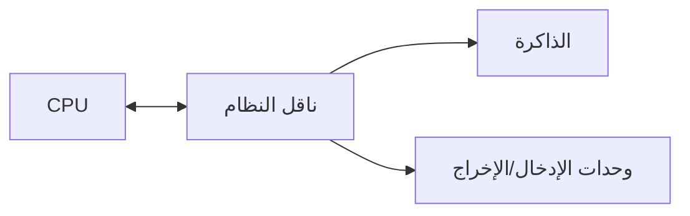
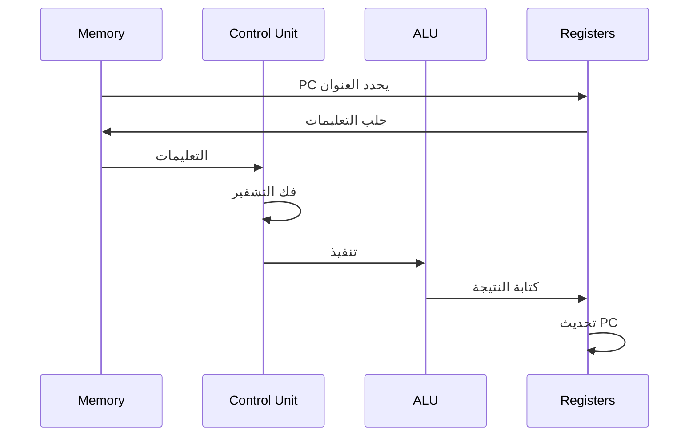
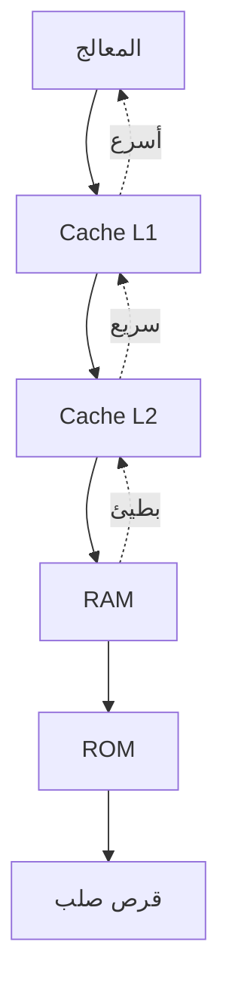
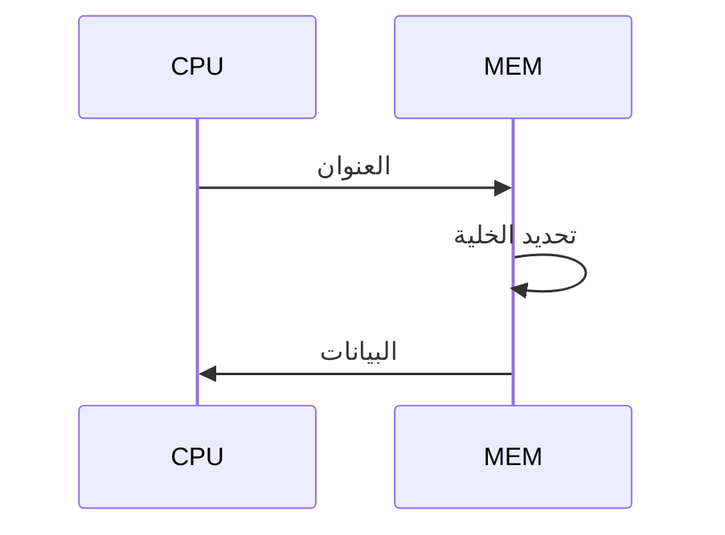
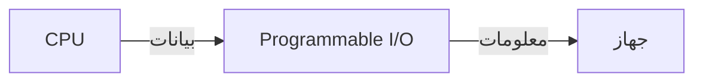
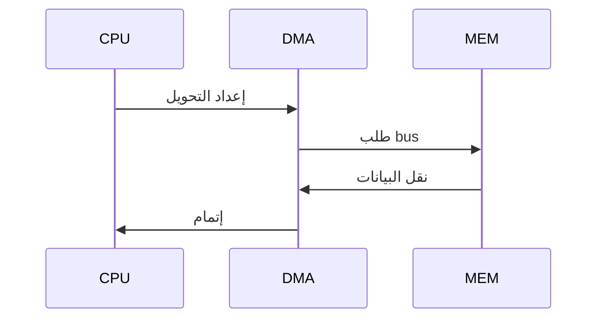
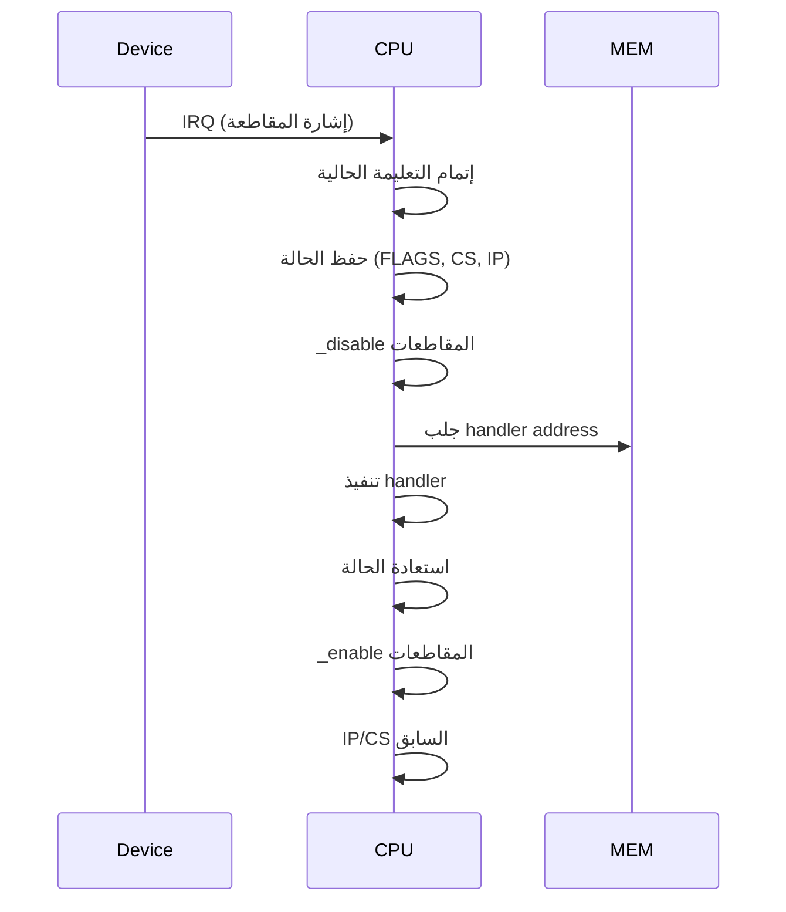
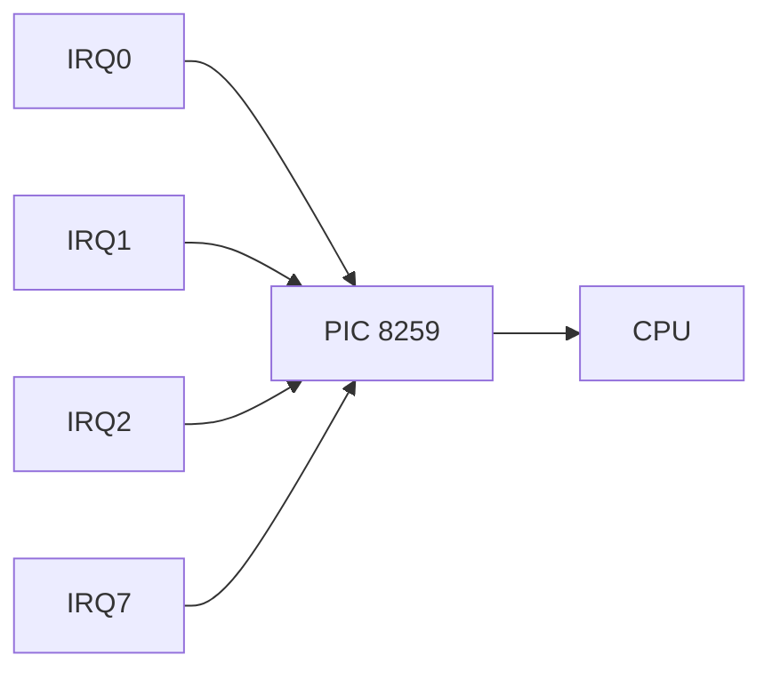
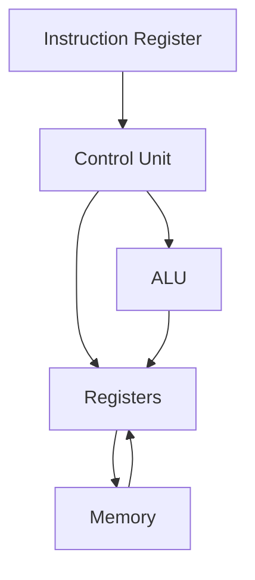

# معالج مصغر · Microprocessors

## 📐 التعاريف الأساسية · Core Definitions

- **المعالج المصغر** (Microprocessor): دائرة متكاملة تحوي وحدة المعالجة المركزية CPU.
- **وحدة المعالجة المركزية** (CPU): تنفذ التعليمات وتتحكم في النظام.
- **مسجل** (Register): ذاكرة سريعة داخل المعالج.
- **ناقل** (Bus): مسار لنقل البيانات بين المكونات.
- **التعليمات** (Instruction): أمر يفهمه المعالج.

### بنية فون نيومان · Von Neumann Architecture



---

## ⚙️ بنية المعالج · CPU Architecture

### الوحدات الوظيفية · Functional Units

| الوحدة | الوظيفة |
| ------ | -------- |
| **CU** | وحدة التحكم - تفكیر التعليمات |
| **ALU** | وحدة الحس والمنطق - العمليات الحسابية |
| **REG** | المسجلات - تخزين مؤقت |
| **CU** | ذاكرة التخزين المؤقت -Cache |

### دورة جلب-تنفيذ · Fetch-Execute Cycle



### أنواع المسجلات · Register Types

| النوع | مثال | الوظيفة |
| ----- | ---- | -------- |
| **عام** | AX, BX, CX, DX | بيانات عامة |
| **مؤشر** | SP, BP, SI, DI | عناوين الذاكرة |
| **مؤشر التعليمة** | IP/PC | عنوان التعليمة التالية |
| **حالة** | FLAGS | أعلام الحالة |
| **قطاع** | CS, DS, SS, ES | تحديد الشرائح |

---

## 🧮 لغة التجميع · Assembly Language

### أنواع التعليمات · Instruction Types

| النوع | الصيغة | مثال |
| ----- | ------ | ---- |
| **نقل** | MOV dest, src | MOV AX, 5 |
| **حسابي** | ADD, SUB, MUL, DIV | ADD AX, BX |
| **منطقي** | AND, OR, XOR, NOT | AND AX, 0F |
| **تحكم** | JMP, CALL, RET | JMP label |
| **_compare** | CMP, TEST | CMP AX, BX |

### أوضاع العنونة · Addressing Modes

| الوضع | الصيغة | الوصف |
| ----- | ------ | ----- |
| **فوري** | MOV AX, 5 | قيمة مباشرة |
| **مسجل** | MOV AX, BX | من مسجل |
| **مباشر** | MOV AX, [1000h] | عنوان ثابت |
| **غير مباشر** | MOV AX, [BX] | عنوان في مسجل |
| **مفهرس** | MOV AX, [BX+SI] | جمع الفهارس |

### تعليمات X86 الأساسية

```asm
; نقل البيانات
MOV AX, 5          ; تحميل قيمة
MOV BX, AX         ; من مسجل لمسجل
MOV [DI], AX       ; إلى الذاكرة

; الحساب
ADD AX, BX         ; جمع
SUB AX, BX         ; طرح
INC AX             ; زيادة 1
DEC AX             ; نقصان 1
MUL BL             ; ضرب AX * BL
DIV BL             ; قسمة AX / BL

; القفز
JMP label          ; قفز غير مشروط
JE label           ; قفز إذا تساوي
JL label           ; قفز إذا أقل
JG label           ; قفز إذا أكبر

; المؤشرات
CALL proc          ; استدعاء إجراء
RET                ; عودة
PUSH AX            ; إدخال للمكدس
POP AX             ; إخراج من المكدس
```

### أعلام الحالة · Status Flags

| العلم | الاختصار | الوصف |
| ----- | -------- | ----- |
| **Carry** | CF |Overflow حسابي |
| **Zero** | ZF | النتيجة صفر |
| **Sign** | SF | النتيجة سالبة |
| **Overflow** | OF | تجاوز النطاق |
| **Parity** | PF | عدد صحيح من البتات |
| **Auxiliary** | AF | BCD الحساب |

---

## 💾 الذاكرة والواجهة · Memory & Interfacing

### التسلسل الهرمي للذاكرة · Memory Hierarchy



### خريطة الذاكرة · Memory Map

```
00000h - 003FFh  : IVT (متجه المقاطعات)
00400h - 004FFh  : BDA (بيانات BIOS)
00500h - 9FFFFh  : RAM
A0000h - AFFFFh  : ذاكرة الفيديو
B0000h - B7FFFh  : ذاكرة العرض النصي
B8000h - BFFFFh  : ذاكرة العرض الرسومي
C0000h - CFFFFh  : BIOS
F0000h - FFFFFh  : BIOS
```

### واجهة الذاكرة · Memory Interfacing

#### قراءة الذاكرة



#### إشارات التحكم

| الإشارة | الوظيفة |
| ------- | -------- |
| **RD** | قراءة (Read) |
| **WR** | كتابة (Write) |
| **CS** | اختيار الشريحة (Chip Select) |
| **ALE** | قفل العنوان (Address Latch) |

### التوصيل المتوازي · Parallel Interfacing



---

## 🔌 الإدخال والإخراج · Input/Output

### طرق الإدخال/الإخراج · I/O Methods

| الطريقة | الوصف | المميزات |
| -------- | ----- | ---------- |
| **PMIO** | Port-mapped I/O | عنوان منفصل |
| **MMIO** | Memory-mapped I/O | عنوان في الذاكرة |
| **DMA** | Direct Memory Access | نقل بدون CPU |
| **PIO** | Programmed I/O | CPU يقرأ/يكتب |

### المدخلات/المخرجات المبرمجة · Programmed I/O

```c
// قراءة من المنفذ
unsigned char inb(unsigned short port) {
    unsigned char result;
    __asm__ __volatile__ (
        "inb %1, %0" : "=a"(result) : "Nd"(port)
    );
    return result;
}

// كتابة إلى المنفذ
void outb(unsigned short port, unsigned char value) {
    __asm__ __volatile__ (
        "outb %0, %1" : : "a"(value), "Nd"(port)
    );
}
```

### الوصول المباشر للذاكرة · DMA



**أوضاع DMA:**
- **Single**: نقل وحید
- **Block**: نقل كتلة
- **Cascade**: تحكم بالجهاز

---

## ⚡ المقاطعات · Interrupts

### أنواع المقاطعات · Interrupt Types

| النوع | المصدر | الأولوية |
| ----- | ------ | -------- |
| **Maskable** | hardware | قابلة للتعطيل |
| **Non-Maskable** | خطأ خطير | highest |
| **Software** | INT instruction | قابلة للتعطيل |
| **Exception** | أخطاء CPU | highest |

### جدول متجه المقاطعات · Interrupt Vector Table

```
IVT[0*n]  : Divide Error
IVT[1*n]  : Single Step
IVT[2*n]  : NMI
IVT[3*n]  : Breakpoint
...
IVT[8*n]  : Timer
IVT[9*n]  : Keyboard
...
```

### دورة المقاطعة · Interrupt Processing



### programmable Interrupt Controller (PIC)



**وظائف PIC:**
- قبول IRQ
- تحديد الأولوية
- إرسال INTA إلى CPU

---

## 📊 بنية المعالج التفصيلية · Detailed CPU Structure

### مسار البيانات · Data Path



### خطوط التحكم · Control Lines

| الخط | الوظيفة |
| ----- | -------- |
| **RD** | تفعيل قراءة |
| **WR** | تفعيل كتابة |
| **M/IO** | ذاكرة/إدخال-إخراج |
| **D/C** | بيانات/تحكم |
| **LOCK** | قفل الناقل |
| **INT** | طلب مقاطعة |

---

## 📝 أمثلة محلولة · Worked Examples

### مثال 1: برنامج تجميعي بسيط

**المطلوب:** جمع رقمين وتخزين النتيجة

```asm
MOV AX, 5      ; تحميل الرقم الأول
MOV BX, 3      ; تحميل الرقم الثاني
ADD AX,BX      ; جمع
MOV [1000h],AX ; تخزين النتيجة
```

### مثال 2: حلقة في التجميع

**المطلوب:** عد من 1 إلى 5

```asm
MOV CX, 5      ; عداد
MOV AX, 0      ; ابدأ من صفر
MOV BX, 1      ; قيمة初始ية
ADD_LOOP:
ADD AX, BX     ; جمع
LOOP ADD_LOOP  ; CX--, if CX>0 goto ADD_LOOP
; النتيجة في AX = 15
```

### مثال 3: معالج المقاطعة

**المطلوب:** التعامل مع مقاطعة لوحة المفاتيح

```asm
KEYBOARD_HANDLER:
PUSH AX        ; حفظ المسجلات
PUSH BX
IN AL, 60h     ; قراءة الكود
MOV BX, AX     ; معالجة
POP BX
POP AX
IRET           ;عودة
```

---

## 📊 جدول مرجعي شامل · Master Reference Table

### مسجلات X86 · X86 Registers

| المسجل | الحجم | الوظيفة |
| ------ | ------ | -------- |
| **AX** | 16-bit | المُرجع، الأغراض العامة |
| **BX** | 16-bit | المؤشر الأساسي |
| **CX** | 16-bit | العداد |
| **DX** | 16-bit | البيانات |
| **SP** | 16-bit | مؤشر المكدس |
| **BP** | 16-bit | مؤشر الإطار |
| **SI** | 16-bit | المؤشر المصدري |
| **DI** | 16-bit | المؤشر المقصد |
| **IP** | 16-bit | مؤشر التعليمة |

### أعلام X86 · X86 Flags

| العلم | الاسم | الوظيفة |
| ----- | ---- | -------- |
| **CF** | Carry |carry/borrow |
| **PF** | Parity | parity (LSB) |
| **AF** | Auxiliary | BCD carry |
| **ZF** | Zero | صفر |
| **SF** | Sign | سالب |
| **OF** | Overflow | تجاوز |

### المقاطعات الرئيسية · Major Interrupts

| IRQ | المتجه | الجهاز |
| --- | ------ | ----- |
| IRQ0 | 08h | المؤقت |
| IRQ1 | 09h | لوحة المفاتيح |
| IRQ2 | 0Ah | Cascade |
| IRQ6 | 0Eh | القرص المرن |
| IRQ7 | 0Fh | الطابعة |
| IRQ12 | 14h | Mouse |
| IRQ14 | 16h | القرص الصلب |

---

## ⚠️ أخطاء شائعة وملاحظات · Common Pitfalls & Notes

### ❌ أخطاء شائعة

1. **نسيان حفظ المسجلات في المقاطعة:**
   - المقاطعة تؤثر على المسجلات
   - 💡 **الحل**: PUSH في البداية، POP في النهاية

2. **الخلط بين المؤشرات:**
   - SP: مؤشر المكدسcurrent
   - BP: مؤشر الإطار (للدوال)
   -SI/DI: للنسخ

3. **عدم تعطيل المقاطعات أثناء المقاطعة:**
   - قد تتكرر المقاطعة بشكل لا نهائي
   - استخدم CLI/STI

4. **العمليات في ترتيب خاطئ:**
   - PUSH يخفض SP
   - POP يرفع SP

### 💡 نصائح مهمة

- **Endianness**: x86 Little-Endian (البايت الأقل أهمية أولاً)
- **Stack grows down**: من العناوين الأعلى للأدنى
- **المكدس** يستخدم لل arguments و local variables

### 📌 ملاحظات نهائية

- **الذاكرة الظاهرية**: تربط العناوين الفعلية بالمنطقية
- **Cache**: تقليل الوصول للذاكرة الرئيسية
- **Pipeline**: تنفيذ تعليمة أثناء جلب التالية
