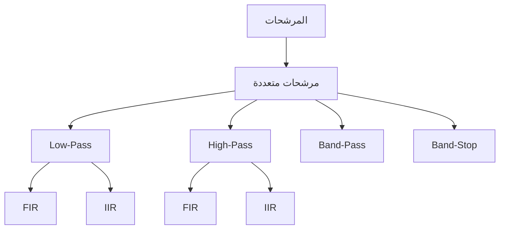

# معالجة الإشارة · Signal Processing

## 📐 التعاريف الأساسية · Core Definitions

- **الإشارة** (Signal): دالة تحمل معلومات عن ظاهرة أو حالة.
- **النظام** (System): كيان يعالج الإشارات ويُنتج إشارات output.
- **التLaplace تحويل** (Laplace Transform): تحويل مستمر لمجال الوقت إلى مجال التردد.
- **تحويل فورييه** (Fourier Transform): تحليل الإشارة إلى ترددات составляющихها.
- **الترشيح** (Filtering): إزالة أو تعزيز أجزاء معينة من طيف الإشارة.

---

## 🔄 التحويلات · Transforms

### تحويل فورييه المستمر · Continuous Fourier Transform

#### تحويل فورييه (CFT)

$$X(\omega) = \int_{-\infty}^{\infty} x(t) e^{-j\omega t} \, dt$$

#### عكس تحويل فورييه

$$x(t) = \frac{1}{2\pi} \int_{-\infty}^{\infty} X(\omega) e^{j\omega t} \, d\omega$$

### تحويل لابلاس · Laplace Transform

$$X(s) = \int_{0}^{\infty} x(t) e^{-st} \, dt$$

where $s = \sigma + j\omega$ is the complex frequency variable.

#### خصائص التحويل

| الخاصية | الزمن | مجال s |
| ------- | ----- | -------- |
| **الخطية** | $ax(t) + by(t)$ | $aX(s) + bY(s)$ |
| **الإزاحة الزمنية** | $x(t - t_0)$ | $e^{-st_0} X(s)$ |
| **الإزاحة الترددية** | $e^{-at}x(t)$ | $X(s + a)$ |
| **التفاضل** | $\frac{dx}{dt}$ | $sX(s) - x(0^-)$ |
| **التكامل** | $\int_0^t x(\tau) d\tau$ | $\frac{1}{s} X(s)$ |

### تحويل فورييه المنفصل (DFT) · Discrete Fourier Transform

$$X[k] = \sum_{n=0}^{N-1} x[n] \cdot e^{-j\frac{2\pi}{N} kn}$$

#### عكس DFT

$$x[n] = \frac{1}{N} \sum_{k=0}^{N-1} X[k] \cdot e^{j\frac{2\pi}{N} kn}$$

### تحويل فورييه السريع (FFT) · Fast Fourier Transform

```python
def fft(x):
    N = len(x)
    if N <= 1:
        return x
    
    even = fft(x[0::2])
    odd = fft(x[1::2])
    
    combined = [0] * N
    for k in range(N//2):
        t = odd[k] * exp(-2j * pi * k / N)
        combined[k] = even[k] + t
        combined[k + N//2] = even[k] - t
    
    return combined
```

**التعقيد:** $O(N \log N)$ بدلاً من $O(N^2)$

---

## 🎯 الطيغة · Convolution

### تعريف الطيغة · Convolution Definition

$$y(t) = x(t) * h(t) = \int_{-\infty}^{\infty} x(\tau) h(t - \tau) \, d\tau$$

### خصائص الطيغة

$$(x * h)(t) = (h * x)(t)$$

$$x * (h_1 * h_2) = (x * h_1) * h_2$$

### الطيغة في مجال التردد

$$Y(\omega) = X(\omega) \cdot H(\omega)$$

```mermaid
flowchart LR
    X[X(w)] --> Y[Y(w) = X(w)H(w)]
    H[H(w)] --> Y
```

### الطيغة المتقطعة · Discrete Convolution

$$y[n] = x[n] * h[n] = \sum_{k=-\infty}^{\infty} x[k] \cdot h[n - k]$$

---

## 🔘 النمذجة الترددية · Frequency Response

### دالة النقل · Transfer Function

$$H(s) = \frac{Y(s)}{X(s)} = \frac{b_m s^m + \ldots + b_0}{a_n s^n + \ldots + a_0}$$

### الاستجابة الترددية · Frequency Response

$$H(\omega) = |H(\omega)| e^{j\phi(\omega)}$$

where:
- $|H(\omega)|$ = magnitude response
- $\phi(\omega)$ = phase response

### نطاق التردد · Frequency Bands

| النطاق | التردد | التطبيقات |
| ------ | ------ | ---------- |
| **ELF** | 3-30 Hz | الاتصالات |
| **VF** | 30-300 Hz | صوت |
| **RF** | 30 kHz-300 GHz | إذاعة |

---

## 🔌 المرشحات · Filters

### أنواع المرشحات · Filter Types



### مرشح تردد منخفض · Low-Pass Filter

$$H_{LP}(s) = \frac{\omega_c}{s + \omega_c}$$

where $\omega_c$ is the cutoff frequency.

### مرشح تردد عالي · High-Pass Filter

$$H_{HP}(s) = \frac{s}{s + \omega_c}$$

### مرشح النطاق · Band-Pass Filter

$$H_{BP}(s) = \frac{s\omega_c}{(s + s_1)(s + s_2)}$$

### جدول المرشحات · Filter Comparison

| النوع |_response | الاستخدام |
| ----- | --------- | ---------- |
| **Butterworth** | maximally flat | audio |
| **Chebyshev** | ripple in passband | sharp cutoff |
| **Elliptic** | ripple both bands | narrow transition |
| **Bessel** | linear phase | pulse shaping |

### تصميم مرشح FIR

```python
def fir_lowpass(cutoff, num_taps):
    # نافذة Hamming
    n = np.arange(num_taps)
    h = np.sin(cutoff * (n - (num_taps-1)/2)) / (n - (num_taps-1)/2)
    h *= np.hamming(num_taps)
    h /= np.sum(h)
    return h
```

---

## 📊 أخذ العينات · Sampling

### نظرية أخذ العينات · Sampling Theorem

$$f_s > 2f_{max}$$

where:
- $f_s$ = sampling frequency
- $f_{max}$ = maximum signal frequency

### التكميم · Quantization

$$x_q[n] = \Delta \cdot \text{round}\left(\frac{x[n]}{\Delta}\right)$$

where $\Delta$ is the quantization step.

### خطأ التكميم · Quantization Error

$$e[n] = x[n] - x_q[n]$$

$$-\frac{\Delta}{2} \leq e[n] \leq \frac{\Delta}{2}$$

### SNR التكميم

$$\text{SNR}_{dB} = 6.02 \cdot B + 1.76$$

where $B$ is the number of bits.

### إعادة البناء · Reconstruction

$$x(t) = \sum_{n=-\infty}^{\infty} x[n] \cdot \text{sinc}\left(\frac{t - nT_s}{T_s}\right)$$

where $\text{sinc}(x) = \frac{\sin(\pi x)}{\pi x}$.

---

## 🔄 التحويلات z · Z-Transform

### تعريف التحويل z

$$X(z) = \sum_{n=-\infty}^{\infty} x[n] z^{-n}$$

### المنطقة التقارب · Region of Convergence

$$r_1 < |z| < r_2$$

### علاقة التحويل z بالـ DTFT

$$X(e^{j\omega}) = X(z) \big|_{z = e^{j\omega}}$$

### خصائص التحويل z

| الخاصية | الزمن | z |
| ------- | ----- | -- |
| **الخطية** | $ax[n] + by[n]$ | $aX(z) + bY(z)$ |
| **الإزاحة الزمنية** | $x[n - n_0]$ | $z^{-n_0} X(z)$ |
| **التضريب** | $a^n x[n]$ | $X(z/a)$ |

---

## 📝 أمثلة محلولة · Worked Examples

### مثال 1: تحويل فورييه لإشارة جيبية

**المعطيات:** $x(t) = \sin(\omega_0 t)$

**الحل:**

$$X(\omega) = \pi \delta(\omega - \omega_0) - \pi \delta(\omega + \omega_0)$$

**التفسير:** ذروة عند $+\omega_0$ وأخرى عند $-\omega_0$

### مثال 2: مرشح تردد منخفض من الدرجة الأولى

**المعطيات:** $H(s) = \frac{1}{s + 1}$

**الحل:**
- عند $\omega = 0$: $|H(0)| = 1$
- عند $\omega = 1$: $|H(1)| = \frac{1}{\sqrt{2}} \approx 0.707$
- عند $\omega \to \infty$: $|H(\infty)| \to 0$

**التردد cutoff:** $\omega_c = 1$ rad/s

### مثال 3: الطيغة لنظام بسيط

**المعطيات:** $x(t) = e^{-t}u(t)$، $h(t) = e^{-2t}u(t)$

**الحل:**

$$y(t) = \int_0^t e^{-\tau} e^{-2(t-\tau)} d\tau$$

$$= e^{-2t} \int_0^t e^{\tau} d\tau$$

$$= e^{-2t} (e^t - 1)$$

$$= e^{-t} - e^{-2t}$$

---

## 📊 جدول مرجعي شامل · Master Reference Table

### تحويلات مهمة · Important Transforms

| الإشارة | تحويل لابلاس | تحويل فورييه |
| ------- | ------------ | ------------- |
| $\delta(t)$ | 1 | 1 |
| $u(t)$ | $1/s$ | $\pi\delta(\omega) + 1/j\omega$ |
| $e^{-at}u(t)$ | $1/(s+a)$ | $1/(a + j\omega)$ |
| $\sin(\omega_0 t)u(t)$ | $\omega_0/(s^2 + \omega_0^2)$ | $\pi[\delta(\omega-\omega_0) - \delta(\omega+\omega_0)]$ |
| $\cos(\omega_0 t)u(t)$ | $s/(s^2 + \omega_0^2)$ | $\pi[\delta(\omega-\omega_0) + \delta(\omega+\omega_0)]$ |

### خصائص الإشارات · Signal Properties

| الخاصية | الزمن | التردد |
| ------- | ----- | -------- |
| **الخطية** | $ax(t) + by(t)$ | $aX(\omega) + bY(\omega)$ |
| **الإزاحة الزمنية** | $x(t - t_0)$ | $X(\omega)e^{-j\omega t_0}$ |
| **التعديل** | $x(t)e^{j\omega_0 t}$ | $X(\omega - \omega_0)$ |
| **التفاضل** | $dx/dt$ | $j\omega X(\omega)$ |
| **التكامل** | $\int x(\tau)d\tau$ | $X(\omega)/j\omega$ |

### مرشحات متقطعة · Discrete Filters

| النوع | المعادلة الفرقية |
| ----- | ----------------- |
| **FIR** | $y[n] = \sum_{k=0}^{M} b_k x[n-k]$ |
| **IIR** | $y[n] = \sum_{k=0}^{M} b_k x[n-k] - \sum_{k=1}^{N} a_k y[n-k]$ |

---

## ⚠️ أخطاء شائعة وملاحظات · Common Pitfalls & Notes

### ❌ أخطاء شائعة

1. **الخلط بين CTFT و DTFT:**
   - CTFT: مستمر في الزمن والتردد
   - DTFT: متقطع في الزمن، مستمر في التردد
   - 💡 **ملاحظة**: DFT متقطعة في كليهما!

2. **نسيان شرط Nyquist:**
   - $f_s$ يجب أن تكون > $2f_{max}$
   - وإلا سيحدث_aliasing

3. **التماثل في DFT:**
   - للإشارات الحقيقية: $X[N-k] = X^*[k]$
   - استخدام هذا للتحقق من النتائج

4. **الطابع الزمني للإشارة:**
   - causality مهم للنظم الحقيقية
   - $h(t) = 0$ لـ $t < 0$

### 💡 نصائح مهمة

- **Parseval's Theorem**:
  $$\sum |x[n]|^2 = \frac{1}{N} \sum |X[k]|^2$$

- **مرشحات IIR** يمكن أن تكون غير مستقرة
- **مرشحات FIR**always مستقرة

### 📌 ملاحظات نهائية

- ** Gibbs Phenomenon**: oscillations عند التقطيع
- **Windowing**: تقليل aliasing في DFT
- **_phase الخطية**: مرشحات Bessel
