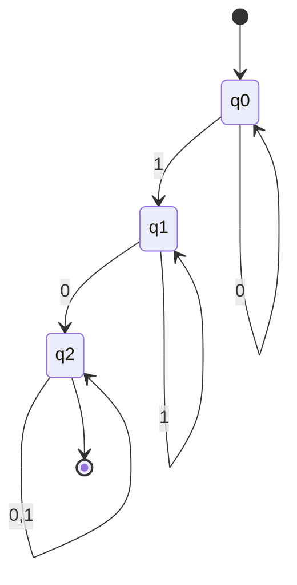
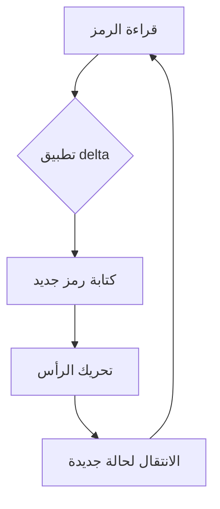
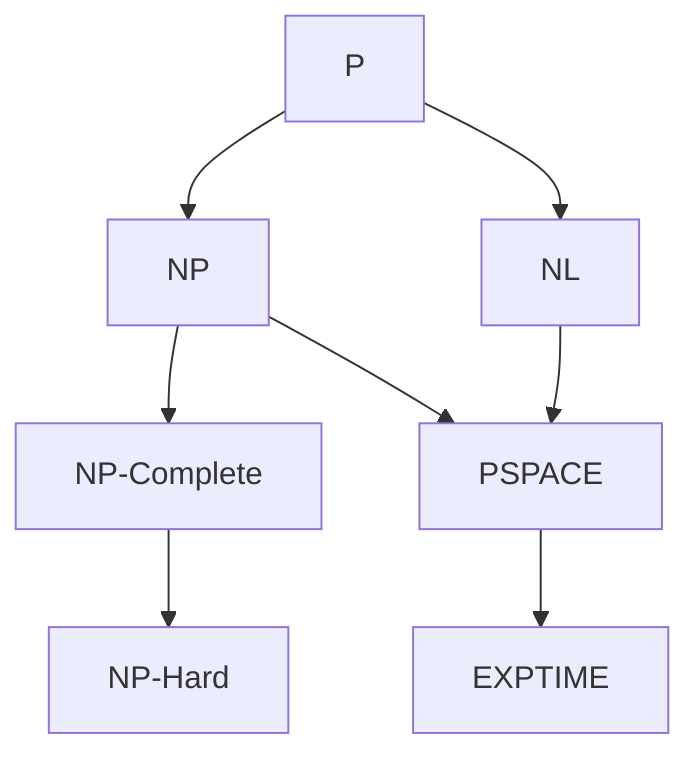

# نظرية الآرتال · Theory of Computation

## 📐 التعاريف الأساسية · Core Definitions

- **الأوتومات有限)** (Finite Automaton): آلة ذات عدد محدود من الحالات.
- **آلة تورنغ** (Turing Machine): نموذج حسابي universal يستطيع محاكاة أي حاسوب.
- **القابلية للحساب** (Computability): هل يمكن حل المشكلة بخوارزمية.
- **القرار** (Decidability): وجود خوارزمية تنتهي دائمًا给出 إجابة صحيحة.
- **التعقيد الزمني** (Time Complexity): الزمن اللازم لحل المشكلة.

### هرمية تشومسكي · Chomsky Hierarchy

```
مستوى 3: اللغات المنتظمة (Regular)
    ↓
مستوى 2: اللغات الخالية من السياق (Context-Free)
    ↓
مستوى 1: اللغات الحساسة للسياق (Context-Sensitive)
    ↓
مستوى 0: اللغات المرجعيةursively enumerable)
```

---

## 🔁 النماذج الحسابية · Computational Models

### 1. الأوتومات有限 المحدود · DFA/NFA

$$M = (Q, \Sigma, \delta, q_0, F)$$

حيث:
- $Q$: مجموعة الحالات المحدودة
- $\Sigma$: الأبجدية
- $\delta: Q \times \Sigma \rightarrow Q$ دالة الانتقال
- $q_0$: الحالة الابتدائية
- $F$: حالات القبول



### 2. آلة تورنغ · Turing Machine

$$M = (Q, \Sigma, \Gamma, \delta, q_0, B, F)$$

حيث:
- $\Gamma$: رموز الشريط (شاملًا $B$ للفراغ)
- $\delta$: دالة الانتقال



---

## 🧮 النظريات والصيغ · Theorems & Formulas

### مبرهنات·阿 Cook-Levin

**NP-اكتمال**: مشكلة ما هي NP-مكتملة إذا:
1. تنتمي لـ NP
2. يمكن اختزال أي مشكلة في NP إليها متعددة الحدود

$$SAT \leq_p \text{Problem}$$

### علاقات التعقيد · Complexity Relations



$$P \subseteq NP \subseteq PSPACE \subseteq EXPTIME$$

### نظ·阿church-Turing

> أي	function يمكن حسابها by أي آلة فيزيائية يمكن أيضًا by آلة تورنغ.

---

## 📊 فئات التعقيد · Complexity Classes

### جدول الفئات الرئيسية · Class Summary Table

| الفئة | التعريف | مثال |
| ------ | -------- | ---- |
| **P** | قرار في زمن متعدد الحدود | الترتيب، أقصر مسار |
| **NP** | يمكن التحقق في زمن متعدد الحدود | SAT، مسار هاميلتون |
| **NP-Complete** | أصعب مشاكل NP | 3-SAT, Travelling Salesman |
| **NP-Hard** | على الأقل أصعب NP | halting problem |
| **-coNP** | مكمل NP | التكرار |
| **L** | ذاكرة لوغاريتمية | connectivity |
| **NL** | غيرdeterministic-L | reachability |
| **PSPACE** | ذاكرة متعدد الحدود | ألعابChess |

### مبرهنات·阿 Rice

> أي property غير تافه للّغات هو غير قابل للقرار.

$$\text_language(\text{M}) = \{ w \mid M \text{ يقبل } w \}$$

---

## 📝 أمثلة محلولة · Worked Examples

### مثال 1: إثبات أن SAT ليست قابلة للقرار

**المعطيات:** هل يمكن لآلة تورنغ أن تقرر إذا كانت صيغة ما satifiable?

**الحل:**
1. نفترض أن هناك آلة $H$ تقرر SAT
2. نبني آلة $D$ تُدخلها نفسها:
   - إذا قبلت $H$ رفضها، 否则 تقبلها
3. تُدخل $D$ وصفها الخاص:
   - إذا قبلت $D$ نفسها → ترفض (تناقض!)
   - إذا رفضت $D$ نفسها → تقبل (تناقض!)
4. إذن لا يمكن أن تقرر SAT ← ✓

### مثال 2: تقليل 3-SAT إلى Clique

**الخطوات:**
1. لكل متغير $x_i$، أنشئ زوجًا من الرؤوس
2. لكل فئة، اربط الرؤوس المتوافقة
3. ابحث عن clique بحجم $k$

$$\text{3-SAT} \leq_p \text{Clique}$$

---

## ⚠️ أخطاء شائعة وملاحظات · Common Pitfalls & Notes

### ❌ أخطاء شائعة

1. **الخلط بين P و NP:**
   - P: يمكن حلها fast
   - NP: يمكن التحقق fast
   - 💡 **ملاحظة**: لا نعرف إذا P = NP!

2. **الخلط بين NP و NP-Complete:**
   - NP: قابلة للتحقق polynomial
   - NP-Complete: أصعب NP
   - أي NP يمكن اختزالها لـ NP-Complete

3. **الخلط بين قابلية القرار والتعقيد:**
   - Halting Problem: قابلة للتعريف but غير قابلة للقرار
   - SAT: قابلة للقرار (ب searching) but قد تأخذ زمن أُسّي

4. **تحويل NP-Complete إلى NP:**
   - التحويل بعكس الاتجاه WRONG!
   - يجب أن يكون من أي NP إلى المشكلة

### 💡 نصائح مهمة

- **قاعدة الاختزال:**
  $$A \leq_p B \text{ و } B \in P \implies A \in P$$

- **نظرية كوك-ليفن:**
  $$SAT \in P \implies P = NP$$

- **فئات القرار:**
  - قابل للقرار: $\exists$ خوارزمية تنتهي
  - غير قابل للقرار: لا exists خوارزمية

### 📌 ملاحظات نهائية

- $P \subseteq NP$ ولكن لا نعرف العكس
- $\text{NP-Complete} \subseteq \text{NP-Hard}$
- أي مشكلة NP-Hard ليس necesariamente في NP